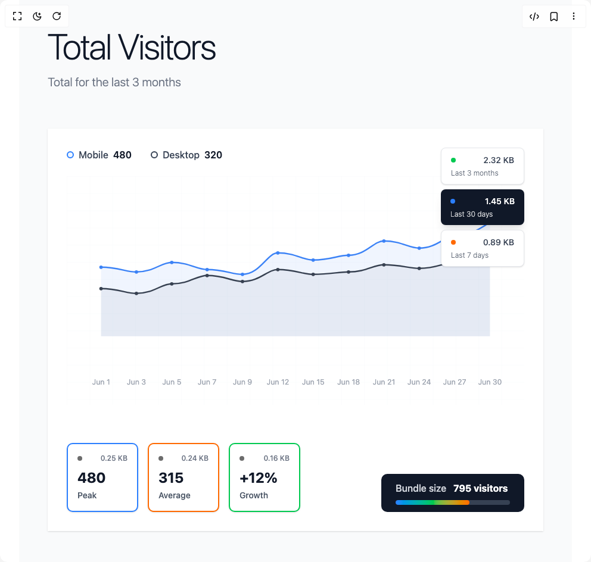

# Build Line Graph Statistics in BuilderStudio

> Build this component in our Agentic IDE: [BuilderStudio](https://builderstudio.dev).
>
> Join the BuilderStudio community on [Discord](https://discord.gg/QdWeSGCqfe) and [Reddit](https://reddit.com/r/builderstudio).



## Component

- Author group: `ravikatiyar`
- Component: `line-graph-statistics`
- Variant: `default`
- Rendered HTML snapshot: [`rendered.html`](rendered.html)

## BuilderStudio prompt

You are implementing a React component based on a component reference.

## Component identity

- Author: ravikatiyar
- Component slug: line-graph-statistics
- Demo slug: default
- Title: line-graph-statistics
- Description: 

## Goal

Recreate this component in a React + TypeScript + Tailwind CSS project. Preserve the visual layout, spacing, colors, border radius, shadows, interaction behavior, animation behavior, responsive behavior, and dark mode behavior shown in the rendered demo.

## Implementation requirements

- Use React and TypeScript.
- Use Tailwind CSS classes whenever possible.
- Keep the component self-contained unless the source files require helper components.
- If the source uses CSS variables, custom CSS, animations, or keyframes, include them.
- If the source uses external packages, list and use the required packages.
- Preserve accessibility attributes, button semantics, links, keyboard behavior, and ARIA attributes when visible in the source.
- Do not replace the component with a simplified placeholder.
- Return complete production-ready code.

## Dependencies

No reference metadata available.

## Rendered DOM snapshot

This is the rendered demo HTML extracted from the live preview. Use it to verify structure, class names, visible content, and layout.

```html
<div id="root"><div class="w-screen min-h-screen flex justify-center items-center"><div class="w-screen min-h-screen flex justify-center items-center"><div class="min-h-screen bg-gray-50 font-light"><div class="max-w-7xl mx-auto p-12"><div class="mb-16"><h1 class="text-6xl font-extralight text-gray-900 mb-4 tracking-tight transition-all duration-1000 opacity-100 translate-y-0">Total Visitors</h1><p class="text-xl text-gray-500 font-light transition-all duration-1000 delay-200 opacity-100 translate-y-0">Total for the last 3 months</p></div><div class="relative bg-white rounded-none shadow-sm border-0"><div class="absolute top-8 left-8 z-10 flex gap-8"><div class="flex items-center gap-2 transition-all duration-800 delay-300 opacity-100 translate-x-0"><div class="w-3 h-3 rounded-full border-2 border-blue-500 bg-blue-50"></div><span class="text-gray-700 font-medium">Mobile</span><span class="text-gray-900 font-semibold">480</span></div><div class="flex items-center gap-2 transition-all duration-800 delay-400 opacity-100 translate-x-0"><div class="w-3 h-3 rounded-full border-2 border-gray-700 bg-gray-50"></div><span class="text-gray-700 font-medium">Desktop</span><span class="text-gray-900 font-semibold">320</span></div></div><div class="absolute top-8 right-8 z-10 flex flex-col gap-2"><div class="
                  cursor-pointer transition-all duration-700 hover:scale-105 hover:shadow-lg
                  bg-white text-gray-700 hover:bg-gray-50 shadow-sm border border-gray-200
                  opacity-100 translate-x-0
                " style="transition-delay: 500ms; border-radius: 8px; padding: 10px 16px; min-width: 140px;"><div class="flex items-center justify-between mb-1"><div class="w-2 h-2 rounded-full bg-green-500"></div><span class="text-sm font-medium">2.32 KB</span></div><div class="text-xs opacity-80">Last 3 months</div></div><div class="
                  cursor-pointer transition-all duration-700 hover:scale-105 hover:shadow-lg
                  bg-gray-900 text-white shadow-lg
                  opacity-100 translate-x-0
                " style="transition-delay: 650ms; border-radius: 8px; padding: 10px 16px; min-width: 140px;"><div class="flex items-center justify-between mb-1"><div class="w-2 h-2 rounded-full bg-blue-500"></div><span class="text-sm font-medium">1.45 KB</span></div><div class="text-xs opacity-80">Last 30 days</div></div><div class="
                  cursor-pointer transition-all duration-700 hover:scale-105 hover:shadow-lg
                  bg-white text-gray-700 hover:bg-gray-50 shadow-sm border border-gray-200
                  opacity-100 translate-x-0
                " style="transition-delay: 800ms; border-radius: 8px; padding: 10px 16px; min-width: 140px;"><div class="flex items-center justify-between mb-1"><div class="w-2 h-2 rounded-full bg-orange-500"></div><span class="text-sm font-medium">0.89 KB</span></div><div class="text-xs opacity-80">Last 7 days</div></div></div><div class="p-8 pt-20 pb-16"><div class="h-96 relative"><svg class="w-full h-full" viewBox="0 0 800 400"><defs><pattern id="grid" width="40" height="30" patternUnits="userSpaceOnUse"><path d="M 40 0 L 0 0 0 30" fill="none" stroke="#f8fafc" stroke-width="1"></path></pattern></defs><rect width="800" height="400" fill="url(#grid)"></rect><path d="M 60,196.66666666666666 C 90.9090909090909,196.66666666666666 103.27272727272727,205.00000000000003 121.81818181818181,205.00000000000003 C 152.72727272727272,205.00000000000003 165.0909090909091,188.33333333333331 183.63636363636363,188.33333333333331 C 214.54545454545453,188.33333333333331 226.9090909090909,173.75 245.45454545454544,173.75 C 276.3636363636364,173.75 288.7272727272727,184.16666666666669 307.27272727272725,184.16666666666669 C 338.18181818181813,184.16666666666669 350.5454545454545,163.33333333333334 369.09090909090907,163.33333333333334 C 400,163.33333333333334 412.3636363636363,171.66666666666669 430.9090909090909,171.66666666666669 C 461.8181818181818,171.66666666666669 474.18181818181824,167.5 492.72727272727275,167.5 C 523.6363636363636,167.5 536,155 554.5454545454545,155 C 585.4545454545455,155 597.8181818181819,161.25 616.3636363636364,161.25 C 647.2727272727273,161.25 659.6363636363635,150.83333333333331 678.1818181818181,150.83333333333331 C 709.090909090909,150.83333333333331 740,146.66666666666666 740,146.66666666666666 L 740,280 L 60,280 Z" fill="rgba(107, 114, 128, 0.08)" class="transition-all duration-2000 opacity-100" style="transform: scale(1); transform-origin: center bottom;"></path><path d="M 60,159.16666666666669 C 90.9090909090909,159.16666666666669 103.27272727272727,167.5 121.81818181818181,167.5 C 152.72727272727272,167.5 165.0909090909091,150.83333333333331 183.63636363636363,150.83333333333331 C 214.54545454545453,150.83333333333331 226.9090909090909,163.33333333333334 245.45454545454544,163.33333333333334 C 276.3636363636364,163.33333333333334 288.7272727272727,171.66666666666669 307.27272727272725,171.66666666666669 C 338.18181818181813,171.66666666666669 350.5454545454545,134.16666666666669 369.09090909090907,134.16666666666669 C 400,134.16666666666669 412.3636363636363,146.66666666666666 430.9090909090909,146.66666666666666 C 461.8181818181818,146.66666666666666 474.18181818181824,138.33333333333334 492.72727272727275,138.33333333333334 C 523.6363636363636,138.33333333333334 536,113.33333333333334 554.5454545454545,113.33333333333334 C 585.4545454545455,113.33333333333334 597.8181818181819,125.83333333333333 616.3636363636364,125.83333333333333 C 647.2727272727273,125.83333333333333 659.6363636363635,105 678.1818181818181,105 C 709.090909090909,105 740,80 740,80 L 740,280 L 60,280 Z" fill="rgba(59, 130, 246, 0.08)" class="transition-all duration-2000 opacity-100" style="transform: scale(1); transform-origin: center bottom; transition-delay: 300ms;"></path><path d="M 60,196.66666666666666 C 90.9090909090909,196.66666666666666 103.27272727272727,205.00000000000003 121.81818181818181,205.00000000000003 C 152.72727272727272,205.00000000000003 165.0909090909091,188.33333333333331 183.63636363636363,188.33333333333331 C 214.54545454545453,188.33333333333331 226.9090909090909,173.75 245.45454545454544,173.75 C 276.3636363636364,173.75 288.7272727272727,184.16666666666669 307.27272727272725,184.16666666666669 C 338.18181818181813,184.16666666666669 350.5454545454545,163.33333333333334 369.09090909090907,163.33333333333334 C 400,163.33333333333334 412.3636363636363,171.66666666666669 430.9090909090909,171.66666666666669 C 461.8181818181818,171.66666666666669 474.18181818181824,167.5 492.72727272727275,167.5 C 523.6363636363636,167.5 536,155 554.5454545454545,155 C 585.4545454545455,155 597.8181818181819,161.25 616.3636363636364,161.25 C 647.2727272727273,161.25 659.6363636363635,150.83333333333331 678.1818181818181,150.83333333333331 C 709.090909090909,150.83333333333331 740,146.66666666666666 740,146.66666666666666" fill="none" stroke="#374151" stroke-width="2.5" stroke-linecap="round" class="transition-all duration-2000 opacity-100" style="stroke-dasharray: none; stroke-dashoffset: 0; transition-delay: 600ms;"></path><path d="M 60,159.16666666666669 C 90.9090909090909,159.16666666666669 103.27272727272727,167.5 121.81818181818181,167.5 C 152.72727272727272,167.5 165.0909090909091,150.83333333333331 183.63636363636363,150.83333333333331 C 214.54545454545453,150.83333333333331 226.9090909090909,163.33333333333334 245.45454545454544,163.33333333333334 C 276.3636363636364,163.33333333333334 288.7272727272727,171.66666666666669 307.27272727272725,171.66666666666669 C 338.18181818181813,171.66666666666669 350.5454545454545,134.16666666666669 369.09090909090907,134.16666666666669 C 400,134.16666666666669 412.3636363636363,146.66666666666666 430.9090909090909,146.66666666666666 C 461.8181818181818,146.66666666666666 474.18181818181824,138.33333333333334 492.72727272727275,138.33333333333334 C 523.6363636363636,138.33333333333334 536,113.33333333333334 554.5454545454545,113.33333333333334 C 585.4545454545455,113.33333333333334 597.8181818181819,125.83333333333333 616.3636363636364,125.83333333333333 C 647.2727272727273,125.83333333333333 659.6363636363635,105 678.1818181818181,105 C 709.090909090909,105 740,80 740,80" fill="none" stroke="#3b82f6" stroke-width="2.5" stroke-linecap="round" class="transition-all duration-2000 opacity-100" style="stroke-dasharray: none; stroke-dashoffset: 0; transition-delay: 900ms;"></path><g><circle cx="60" cy="196.66666666666666" r="3" fill="#374151" class="transition-all duration-500 cursor-pointer opacity-100 scale-100" style="transition-delay: 1200ms;"></circle><circle cx="60" cy="159.16666666666669" r="3" fill="#3b82f6" class="transition-all duration-500 cursor-pointer opacity-100 scale-100" style="transition-delay: 1300ms;"></circle></g><g><circle cx="121.81818181818181" cy="205.00000000000003" r="3" fill="#374151" class="transition-all duration-500 cursor-pointer opacity-100 scale-100" style="transition-delay: 1300ms;"></circle><circle cx="121.81818181818181" cy="167.5" r="3" fill="#3b82f6" class="transition-all duration-500 cursor-pointer opacity-100 scale-100" style="transition-delay: 1400ms;"></circle></g><g><circle cx="183.63636363636363" cy="188.33333333333331" r="3" fill="#374151" class="transition-all duration-500 cursor-pointer opacity-100 scale-100" style="transition-delay: 1400ms;"></circle><circle cx="183.63636363636363" cy="150.83333333333331" r="3" fill="#3b82f6" class="transition-all duration-500 cursor-pointer opacity-100 scale-100" style="transition-delay: 1500ms;"></circle></g><g><circle cx="245.45454545454544" cy="173.75" r="3" fill="#374151" class="transition-all duration-500 cursor-pointer opacity-100 scale-100" style="transition-delay: 1500ms;"></circle><circle cx="245.45454545454544" cy="163.33333333333334" r="3" fill="#3b82f6" class="transition-all duration-500 cursor-pointer opacity-100 scale-100" style="transition-delay: 1600ms;"></circle></g><g><circle cx="307.27272727272725" cy="184.16666666666669" r="3" fill="#374151" class="transition-all duration-500 cursor-pointer opacity-100 scale-100" style="transition-delay: 1600ms;"></circle><circle cx="307.27272727272725" cy="171.66666666666669" r="3" fill="#3b82f6" class="transition-all duration-500 cursor-pointer opacity-100 scale-100" style="transition-delay: 1700ms;"></circle></g><g><circle cx="369.09090909090907" cy="163.33333333333334" r="3" fill="#374151" class="transition-all duration-500 cursor-pointer opacity-100 scale-100" style="transition-delay: 1700ms;"></circle><circle cx="369.09090909090907" cy="134.16666666666669" r="3" fill="#3b82f6" class="transition-all duration-500 cursor-pointer opacity-100 scale-100" style="transition-delay: 1800ms;"></circle></g><g><circle cx="430.9090909090909" cy="171.66666666666669" r="3" fill="#374151" class="transition-all duration-500 cursor-pointer opacity-100 scale-100" style="transition-delay: 1800ms;"></circle><circle cx="430.9090909090909" cy="146.66666666666666" r="3" fill="#3b82f6" class="transition-all duration-500 cursor-pointer opacity-100 scale-100" style="transition-delay: 1900ms;"></circle></g><g><circle cx="492.72727272727275" cy="167.5" r="3" fill="#374151" class="transition-all duration-500 cursor-pointer opacity-100 scale-100" style="transition-delay: 1900ms;"></circle><circle cx="492.72727272727275" cy="138.33333333333334" r="3" fill="#3b82f6" class="transition-all duration-500 cursor-pointer opacity-100 scale-100" style="transition-delay: 2000ms;"></circle></g><g><circle cx="554.5454545454545" cy="155" r="3" fill="#374151" class="transition-all duration-500 cursor-pointer opacity-100 scale-100" style="transition-delay: 2000ms;"></circle><circle cx="554.5454545454545" cy="113.33333333333334" r="3" fill="#3b82f6" class="transition-all duration-500 cursor-pointer opacity-100 scale-100" style="transition-delay: 2100ms;"></circle></g><g><circle cx="616.3636363636364" cy="161.25" r="3" fill="#374151" class="transition-all duration-500 cursor-pointer opacity-100 scale-100" style="transition-delay: 2100ms;"></circle><circle cx="616.3636363636364" cy="125.83333333333333" r="3" fill="#3b82f6" class="transition-all duration-500 cursor-pointer opacity-100 scale-100" style="transition-delay: 2200ms;"></circle></g><g><circle cx="678.1818181818181" cy="150.83333333333331" r="3" fill="#374151" class="transition-all duration-500 cursor-pointer opacity-100 scale-100" style="transition-delay: 2200ms;"></circle><circle cx="678.1818181818181" cy="105" r="3" fill="#3b82f6" class="transition-all duration-500 cursor-pointer opacity-100 scale-100" style="transition-delay: 2300ms;"></circle></g><g><circle cx="740" cy="146.66666666666666" r="3" fill="#374151" class="transition-all duration-500 cursor-pointer opacity-100 scale-100" style="transition-delay: 2300ms;"></circle><circle cx="740" cy="80" r="3" fill="#3b82f6" class="transition-all duration-500 cursor-pointer opacity-100 scale-100" style="transition-delay: 2400ms;"></circle></g><text x="60" y="365" text-anchor="middle" fill="#9ca3af" font-size="13" font-weight="400" class="transition-all duration-500 opacity-100" style="transition-delay: 1500ms;">Jun 1</text><text x="121.81818181818181" y="365" text-anchor="middle" fill="#9ca3af" font-size="13" font-weight="400" class="transition-all duration-500 opacity-100" style="transition-delay: 1550ms;">Jun 3</text><text x="183.63636363636363" y="365" text-anchor="middle" fill="#9ca3af" font-size="13" font-weight="400" class="transition-all duration-500 opacity-100" style="transition-delay: 1600ms;">Jun 5</text><text x="245.45454545454544" y="365" text-anchor="middle" fill="#9ca3af" font-size="13" font-weight="400" class="transition-all duration-500 opacity-100" style="transition-delay: 1650ms;">Jun 7</text><text x="307.27272727272725" y="365" text-anchor="middle" fill="#9ca3af" font-size="13" font-weight="400" class="transition-all duration-500 opacity-100" style="transition-delay: 1700ms;">Jun 9</text><text x="369.09090909090907" y="365" text-anchor="middle" fill="#9ca3af" font-size="13" font-weight="400" class="transition-all duration-500 opacity-100" style="transition-delay: 1750ms;">Jun 12</text><text x="430.9090909090909" y="365" text-anchor="middle" fill="#9ca3af" font-size="13" font-weight="400" class="transition-all duration-500 opacity-100" style="transition-delay: 1800ms;">Jun 15</text><text x="492.72727272727275" y="365" text-anchor="middle" fill="#9ca3af" font-size="13" font-weight="400" class="transition-all duration-500 opacity-100" style="transition-delay: 1850ms;">Jun 18</text><text x="554.5454545454545" y="365" text-anchor="middle" fill="#9ca3af" font-size="13" font-weight="400" class="transition-all duration-500 opacity-100" style="transition-delay: 1900ms;">Jun 21</text><text x="616.3636363636364" y="365" text-anchor="middle" fill="#9ca3af" font-size="13" font-weight="400" class="transition-all duration-500 opacity-100" style="transition-delay: 1950ms;">Jun 24</text><text x="678.1818181818181" y="365" text-anchor="middle" fill="#9ca3af" font-size="13" font-weight="400" class="transition-all duration-500 opacity-100" style="transition-delay: 2000ms;">Jun 27</text><text x="740" y="365" text-anchor="middle" fill="#9ca3af" font-size="13" font-weight="400" class="transition-all duration-500 opacity-100" style="transition-delay: 2050ms;">Jun 30</text></svg></div></div><div class="px-8 pb-8 flex justify-between items-end"><div class="flex gap-4"><div class="
                    bg-white rounded-lg shadow-sm border-2 border-blue-500 p-4 min-w-[120px]
                    transition-all duration-800 hover:scale-105 hover:shadow-md
                    opacity-100 translate-y-0
                  " style="transition-delay: 1800ms;"><div class="flex items-center justify-between mb-2"><div class="w-2 h-2 rounded-full bg-current opacity-60"></div><span class="text-xs text-gray-500 font-medium">0.25 KB</span></div><div class="text-2xl font-bold text-gray-900 mb-1">480</div><div class="text-sm text-gray-600 font-medium">Peak</div></div><div class="
                    bg-white rounded-lg shadow-sm border-2 border-orange-500 p-4 min-w-[120px]
                    transition-all duration-800 hover:scale-105 hover:shadow-md
                    opacity-100 translate-y-0
                  " style="transition-delay: 2000ms;"><div class="flex items-center justify-between mb-2"><div class="w-2 h-2 rounded-full bg-current opacity-60"></div><span class="text-xs text-gray-500 font-medium">0.24 KB</span></div><div class="text-2xl font-bold text-gray-900 mb-1">315</div><div class="text-sm text-gray-600 font-medium">Average</div></div><div class="
                    bg-white rounded-lg shadow-sm border-2 border-green-500 p-4 min-w-[120px]
                    transition-all duration-800 hover:scale-105 hover:shadow-md
                    opacity-100 translate-y-0
                  " style="transition-delay: 2200ms;"><div class="flex items-center justify-between mb-2"><div class="w-2 h-2 rounded-full bg-current opacity-60"></div><span class="text-xs text-gray-500 font-medium">0.16 KB</span></div><div class="text-2xl font-bold text-gray-900 mb-1">+12%</div><div class="text-sm text-gray-600 font-medium">Growth</div></div></div><div class="bg-gray-900 text-white px-6 py-3 rounded-lg transition-all duration-800 opacity-100 translate-y-0" style="transition-delay: 2400ms;"><div class="flex items-center gap-3"><span class="text-gray-300 font-medium">Bundle size</span><span class="font-bold">795 visitors</span></div><div class="w-48 h-2 bg-gray-700 rounded-full mt-2 overflow-hidden"><div class="h-full bg-gradient-to-r from-blue-500 via-green-500 to-orange-500 rounded-full transition-all duration-2000 w-full" style="transition-delay: 2800ms;"></div></div></div></div></div></div></div></div></div></div>
```

## Reference source files

No reference source files were available.
