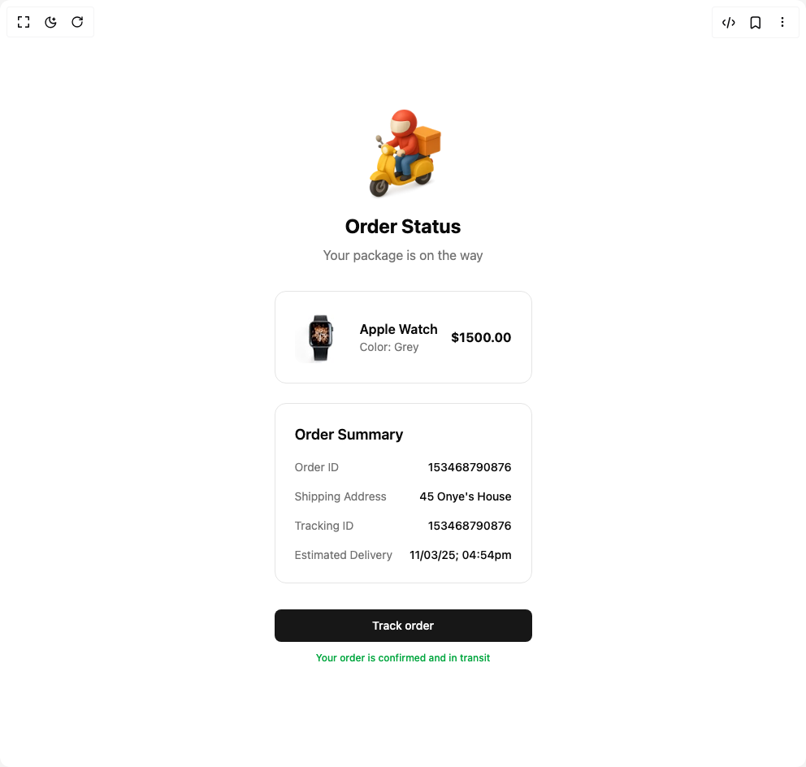

# Build Order Status Tracker in BuilderStudio

> Build this component in our Agentic IDE: [BuilderStudio](https://builderstudio.dev).
>
> Join the BuilderStudio community on [Discord](https://discord.gg/QdWeSGCqfe) and [Reddit](https://reddit.com/r/builderstudio).



## Component

- Author group: `ravikatiyar`
- Component: `order-status-tracker`
- Variant: `default`
- Rendered HTML snapshot: [`rendered.html`](rendered.html)

## BuilderStudio prompt

You are implementing a React component based on a component reference.

## Component identity

- Author: ravikatiyar
- Component slug: order-status-tracker
- Demo slug: default
- Title: order-status-tracker
- Description: 

## Goal

Recreate this component in a React + TypeScript + Tailwind CSS project. Preserve the visual layout, spacing, colors, border radius, shadows, interaction behavior, animation behavior, responsive behavior, and dark mode behavior shown in the rendered demo.

## Implementation requirements

- Use React and TypeScript.
- Use Tailwind CSS classes whenever possible.
- Keep the component self-contained unless the source files require helper components.
- If the source uses CSS variables, custom CSS, animations, or keyframes, include them.
- If the source uses external packages, list and use the required packages.
- Preserve accessibility attributes, button semantics, links, keyboard behavior, and ARIA attributes when visible in the source.
- Do not replace the component with a simplified placeholder.
- Return complete production-ready code.

## Dependencies

No reference metadata available.

## Rendered DOM snapshot

This is the rendered demo HTML extracted from the live preview. Use it to verify structure, class names, visible content, and layout.

```html
<div id="root"><div class="w-screen min-h-screen flex justify-center items-center"><div class="w-screen min-h-screen flex justify-center items-center"><div class="flex items-center justify-center h-full bg-background p-4"><div class="max-w-md w-full mx-auto p-4 font-sans" style="opacity: 1;"><div class="text-center space-y-2 mb-8" style="opacity: 1; transform: none;"><h1 class="text-2xl font-bold text-foreground">Order Status</h1><p class="text-muted-foreground">Your package is on the way</p></div><div class="mb-6" style="opacity: 1; transform: none;"><div class="rounded-xl border bg-card text-card-foreground p-6"><div class="flex items-center space-x-4"><div class="flex-1"><p class="font-semibold text-foreground">Apple Watch</p><p class="text-sm text-muted-foreground">Color: Grey</p></div><p class="font-bold text-foreground">$1500.00</p></div></div></div><div class="mb-8" style="opacity: 1; transform: none;"><div class="rounded-xl border bg-card text-card-foreground p-6 space-y-4"><h2 class="font-semibold text-lg text-foreground">Order Summary</h2><div class="flex justify-between items-center text-sm"><p class="text-muted-foreground">Order ID</p><p class="text-foreground font-medium text-right">153468790876</p></div><div class="flex justify-between items-center text-sm"><p class="text-muted-foreground">Shipping Address</p><p class="text-foreground font-medium text-right">45 Onye's House</p></div><div class="flex justify-between items-center text-sm"><p class="text-muted-foreground">Tracking ID</p><p class="text-foreground font-medium text-right">153468790876</p></div><div class="flex justify-between items-center text-sm"><p class="text-muted-foreground">Estimated Delivery</p><p class="text-foreground font-medium text-right">11/03/25; 04:54pm</p></div></div></div><div class="text-center space-y-3" style="opacity: 1; transform: none;"><button class="inline-flex items-center justify-center whitespace-nowrap rounded-md text-sm font-medium ring-offset-background transition-colors focus-visible:outline-none focus-visible:ring-2 focus-visible:ring-ring focus-visible:ring-offset-2 disabled:pointer-events-none disabled:opacity-50 bg-primary text-primary-foreground hover:bg-primary/90 h-10 px-4 py-2 w-full">Track order</button><p class="text-xs text-green-600 dark:text-green-500 font-medium">Your order is confirmed and in transit</p></div></div></div></div></div></div>
```

## Reference source files

No reference source files were available.
