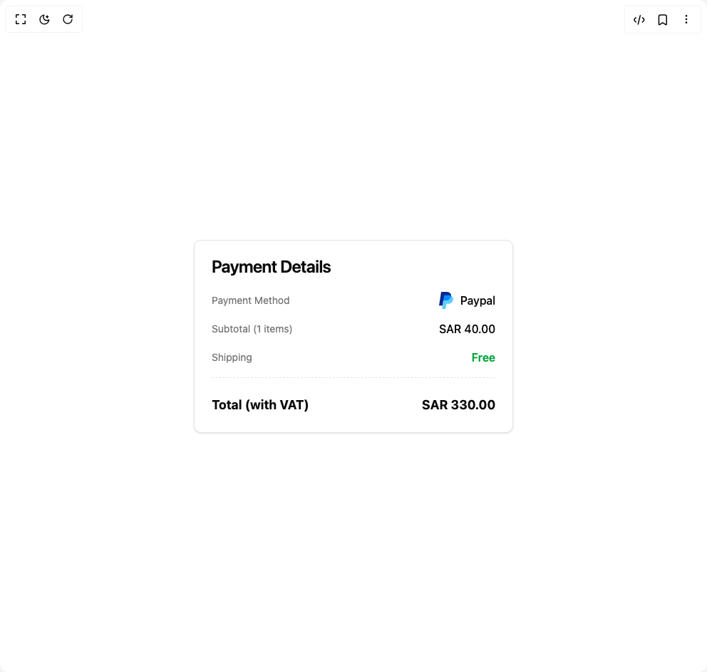

# Build Payment in BuilderStudio

> Build this component in our Agentic IDE: [BuilderStudio](https://builderstudio.dev).
>
> Join the BuilderStudio community on [Discord](https://discord.gg/QdWeSGCqfe) and [Reddit](https://reddit.com/r/builderstudio).



## Component

- Author group: `ravikatiyar`
- Component: `payment`
- Variant: `default`
- Rendered HTML snapshot: [`rendered.html`](rendered.html)

## BuilderStudio prompt

You are implementing a React component based on a component reference.

## Component identity

- Author: ravikatiyar
- Component slug: payment
- Demo slug: default
- Title: payment
- Description: 

## Goal

Recreate this component in a React + TypeScript + Tailwind CSS project. Preserve the visual layout, spacing, colors, border radius, shadows, interaction behavior, animation behavior, responsive behavior, and dark mode behavior shown in the rendered demo.

## Implementation requirements

- Use React and TypeScript.
- Use Tailwind CSS classes whenever possible.
- Keep the component self-contained unless the source files require helper components.
- If the source uses CSS variables, custom CSS, animations, or keyframes, include them.
- If the source uses external packages, list and use the required packages.
- Preserve accessibility attributes, button semantics, links, keyboard behavior, and ARIA attributes when visible in the source.
- Do not replace the component with a simplified placeholder.
- Return complete production-ready code.

## Dependencies

No reference metadata available.

## Rendered DOM snapshot

This is the rendered demo HTML extracted from the live preview. Use it to verify structure, class names, visible content, and layout.

```html
<div id="root"><div class="w-screen min-h-screen flex justify-center items-center"><div class="w-screen min-h-screen flex justify-center items-center"><div class="flex min-h-[450px] w-full items-center justify-center bg-background p-4"><div class="w-full max-w-md rounded-lg border bg-card text-card-foreground shadow-sm "><div class="flex flex-col space-y-1.5 p-6"><h3 class="text-2xl font-semibold leading-none tracking-tight">Payment Details</h3></div><div class="p-6 pt-0"><div class="space-y-4" style="opacity: 1;"><div class="flex items-center justify-between" style="opacity: 1; transform: none;"><span class="text-sm text-muted-foreground">Payment Method</span><div class="flex items-center gap-2"><svg role="img" viewBox="0 0 24 24" xmlns="http://www.w3.org/2000/svg" class="h-6 w-6 fill-current text-[#00457C]"><title>PayPal</title><svg xmlns="http://www.w3.org/2000/svg" viewBox="7.056000232696533 3 37.35095977783203 45"><g xmlns="http://www.w3.org/2000/svg" clip-path="url(#paypal__a)"><path fill="#002991" d="M38.914 13.35c0 5.574-5.144 12.15-12.927 12.15H18.49l-.368 2.322L16.373 39H7.056l5.605-36h15.095c5.083 0 9.082 2.833 10.555 6.77a9.687 9.687 0 0 1 .603 3.58z"></path><path fill="#60CDFF" d="M44.284 23.7A12.894 12.894 0 0 1 31.53 34.5h-5.206L24.157 48H14.89l1.483-9 1.75-11.178.367-2.322h7.497c7.773 0 12.927-6.576 12.927-12.15 3.825 1.974 6.055 5.963 5.37 10.35z"></path><path fill="#008CFF" d="M38.914 13.35C37.31 12.511 35.365 12 33.248 12h-12.64L18.49 25.5h7.497c7.773 0 12.927-6.576 12.927-12.15z"></path></g></svg></svg><span class="font-medium">Paypal</span></div></div><div class="flex items-center justify-between" style="opacity: 1; transform: none;"><span class="text-sm text-muted-foreground">Subtotal (1 items)</span><span class="font-medium ">SAR 40.00</span></div><div class="flex items-center justify-between" style="opacity: 1; transform: none;"><span class="text-sm text-muted-foreground">Shipping</span><span class="font-medium text-green-600 dark:text-green-500 font-semibold">Free</span></div><div style="opacity: 1; transform: none;"><div class="border-t border-dashed border-border"></div></div><div class="flex items-center justify-between pt-2" style="opacity: 1; transform: none;"><span class="text-lg font-bold">Total (with VAT)</span><span class="text-lg font-bold">SAR 330.00</span></div></div></div></div></div></div></div></div>
```

## Reference source files

No reference source files were available.
