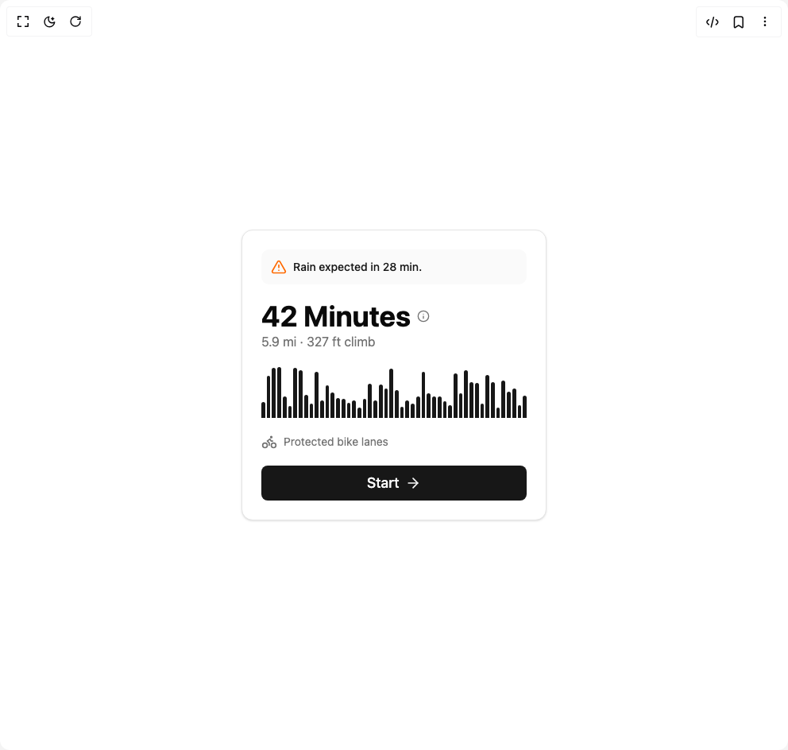

# Build Planner Card in BuilderStudio

> Build this component in our Agentic IDE: [BuilderStudio](https://builderstudio.dev).
>
> Join the BuilderStudio community on [Discord](https://discord.gg/QdWeSGCqfe) and [Reddit](https://reddit.com/r/builderstudio).



## Component

- Author group: `ravikatiyar`
- Component: `planner-card`
- Variant: `default`
- Rendered HTML snapshot: [`rendered.html`](rendered.html)

## BuilderStudio prompt

You are implementing a React component based on a component reference.

## Component identity

- Author: ravikatiyar
- Component slug: planner-card
- Demo slug: default
- Title: planner-card
- Description: 

## Goal

Recreate this component in a React + TypeScript + Tailwind CSS project. Preserve the visual layout, spacing, colors, border radius, shadows, interaction behavior, animation behavior, responsive behavior, and dark mode behavior shown in the rendered demo.

## Implementation requirements

- Use React and TypeScript.
- Use Tailwind CSS classes whenever possible.
- Keep the component self-contained unless the source files require helper components.
- If the source uses CSS variables, custom CSS, animations, or keyframes, include them.
- If the source uses external packages, list and use the required packages.
- Preserve accessibility attributes, button semantics, links, keyboard behavior, and ARIA attributes when visible in the source.
- Do not replace the component with a simplified placeholder.
- Return complete production-ready code.

## Dependencies

No reference metadata available.

## Rendered DOM snapshot

This is the rendered demo HTML extracted from the live preview. Use it to verify structure, class names, visible content, and layout.

```html
<div id="root"><div class="w-screen min-h-screen flex justify-center items-center"><div class="w-screen min-h-screen flex justify-center items-center"><div class="flex h-full w-full items-center justify-center bg-background p-4"><div class="w-full max-w-sm rounded-xl border bg-card text-card-foreground shadow-sm p-6 flex flex-col gap-5" aria-labelledby="route-planner-title"><div class="flex items-center gap-2 rounded-lg bg-secondary/50 p-3 text-sm font-medium text-secondary-foreground" style="opacity: 1; height: auto; transform: none;"><svg xmlns="http://www.w3.org/2000/svg" width="24" height="24" viewBox="0 0 24 24" fill="none" stroke="currentColor" stroke-width="2" stroke-linecap="round" stroke-linejoin="round" class="lucide lucide-triangle-alert h-5 w-5 text-orange-500" aria-hidden="true"><path d="m21.73 18-8-14a2 2 0 0 0-3.48 0l-8 14A2 2 0 0 0 4 21h16a2 2 0 0 0 1.73-3"></path><path d="M12 9v4"></path><path d="M12 17h.01"></path></svg><span>Rain expected in 28 min.</span></div><div class="flex flex-col"><div class="flex items-center gap-2"><h2 id="route-planner-title" class="text-4xl font-bold">42 Minutes</h2><svg xmlns="http://www.w3.org/2000/svg" width="24" height="24" viewBox="0 0 24 24" fill="none" stroke="currentColor" stroke-width="2" stroke-linecap="round" stroke-linejoin="round" class="lucide lucide-info h-4 w-4 text-muted-foreground" aria-hidden="true"><circle cx="12" cy="12" r="10"></circle><path d="M12 16v-4"></path><path d="M12 8h.01"></path></svg></div><p class="text-muted-foreground">5.9 mi · 327 ft climb</p></div><div class="w-full" aria-label="Route elevation profile"><div class="flex h-16 w-full items-end gap-[2px]" style="opacity: 1;"><div class="flex-1 rounded-t-full bg-primary" aria-hidden="true" style="height: 32.014%; opacity: 1; transform: none;"></div><div class="flex-1 rounded-t-full bg-primary" aria-hidden="true" style="height: 82.1206%; opacity: 1; transform: none;"></div><div class="flex-1 rounded-t-full bg-primary" aria-hidden="true" style="height: 99.0086%; opacity: 1; transform: none;"></div><div class="flex-1 rounded-t-full bg-primary" aria-hidden="true" style="height: 100%; opacity: 1; transform: none;"></div><div class="flex-1 rounded-t-full bg-primary" aria-hidden="true" style="height: 42.2344%; opacity: 1; transform: none;"></div><div class="flex-1 rounded-t-full bg-primary" aria-hidden="true" style="height: 23.9418%; opacity: 1; transform: none;"></div><div class="flex-1 rounded-t-full bg-primary" aria-hidden="true" style="height: 99.2226%; opacity: 1; transform: none;"></div><div class="flex-1 rounded-t-full bg-primary" aria-hidden="true" style="height: 94.0294%; opacity: 1; transform: none;"></div><div class="flex-1 rounded-t-full bg-primary" aria-hidden="true" style="height: 44.569%; opacity: 1; transform: none;"></div><div class="flex-1 rounded-t-full bg-primary" aria-hidden="true" style="height: 28.3363%; opacity: 1; transform: none;"></div><div class="flex-1 rounded-t-full bg-primary" aria-hidden="true" style="height: 90.2736%; opacity: 1; transform: none;"></div><div class="flex-1 rounded-t-full bg-primary" aria-hidden="true" style="height: 34.5805%; opacity: 1; transform: none;"></div><div class="flex-1 rounded-t-full bg-primary" aria-hidden="true" style="height: 64.2235%; opacity: 1; transform: none;"></div><div class="flex-1 rounded-t-full bg-primary" aria-hidden="true" style="height: 49.7027%; opacity: 1; transform: none;"></div><div class="flex-1 rounded-t-full bg-primary" aria-hidden="true" style="height: 38.7689%; opacity: 1; transform: none;"></div><div class="flex-1 rounded-t-full bg-primary" aria-hidden="true" style="height: 36.7985%; opacity: 1; transform: none;"></div><div class="flex-1 rounded-t-full bg-primary" aria-hidden="true" style="height: 30.0291%; opacity: 1; transform: none;"></div><div class="flex-1 rounded-t-full bg-primary" aria-hidden="true" style="height: 34.1405%; opacity: 1; transform: none;"></div><div class="flex-1 rounded-t-full bg-primary" aria-hidden="true" style="height: 20.2842%; opacity: 1; transform: none;"></div><div class="flex-1 rounded-t-full bg-primary" aria-hidden="true" style="height: 37.0413%; opacity: 1; transform: none;"></div><div class="flex-1 rounded-t-full bg-primary" aria-hidden="true" style="height: 66.6477%; opacity: 1; transform: none;"></div><div class="flex-1 rounded-t-full bg-primary" aria-hidden="true" style="height: 34.614%; opacity: 1; transform: none;"></div><div class="flex-1 rounded-t-full bg-primary" aria-hidden="true" style="height: 65.2801%; opacity: 1; transform: none;"></div><div class="flex-1 rounded-t-full bg-primary" aria-hidden="true" style="height: 57.6074%; opacity: 1; transform: none;"></div><div class="flex-1 rounded-t-full bg-primary" aria-hidden="true" style="height: 97.04%; opacity: 1; transform: none;"></div><div class="flex-1 rounded-t-full bg-primary" aria-hidden="true" style="height: 54.4801%; opacity: 1; transform: none;"></div><div class="flex-1 rounded-t-full bg-primary" aria-hidden="true" style="height: 21.2888%; opacity: 1; transform: none;"></div><div class="flex-1 rounded-t-full bg-primary" aria-hidden="true" style="height: 33.9738%; opacity: 1; transform: none;"></div><div class="flex-1 rounded-t-full bg-primary" aria-hidden="true" style="height: 27.4664%; opacity: 1; transform: none;"></div><div class="flex-1 rounded-t-full bg-primary" aria-hidden="true" style="height: 42.9353%; opacity: 1; transform: none;"></div><div class="flex-1 rounded-t-full bg-primary" aria-hidden="true" style="height: 91.0854%; opacity: 1; transform: none;"></div><div class="flex-1 rounded-t-full bg-primary" aria-hidden="true" style="height: 47.6966%; opacity: 1; transform: none;"></div><div class="flex-1 rounded-t-full bg-primary" aria-hidden="true" style="height: 42.2092%; opacity: 1; transform: none;"></div><div class="flex-1 rounded-t-full bg-primary" aria-hidden="true" style="height: 42.6569%; opacity: 1; transform: none;"></div><div class="flex-1 rounded-t-full bg-primary" aria-hidden="true" style="height: 32.4653%; opacity: 1; transform: none;"></div><div class="flex-1 rounded-t-full bg-primary" aria-hidden="true" style="height: 25.8044%; opacity: 1; transform: none;"></div><div class="flex-1 rounded-t-full bg-primary" aria-hidden="true" style="height: 87.4567%; opacity: 1; transform: none;"></div><div class="flex-1 rounded-t-full bg-primary" aria-hidden="true" style="height: 48.6078%; opacity: 1; transform: none;"></div><div class="flex-1 rounded-t-full bg-primary" aria-hidden="true" style="height: 93.32%; opacity: 1; transform: none;"></div><div class="flex-1 rounded-t-full bg-primary" aria-hidden="true" style="height: 70.9265%; opacity: 1; transform: none;"></div><div class="flex-1 rounded-t-full bg-primary" aria-hidden="true" style="height: 68.0806%; opacity: 1; transform: none;"></div><div class="flex-1 rounded-t-full bg-primary" aria-hidden="true" style="height: 28.8343%; opacity: 1; transform: none;"></div><div class="flex-1 rounded-t-full bg-primary" aria-hidden="true" style="height: 85.1747%; opacity: 1; transform: none;"></div><div class="flex-1 rounded-t-full bg-primary" aria-hidden="true" style="height: 70.569%; opacity: 1; transform: none;"></div><div class="flex-1 rounded-t-full bg-primary" aria-hidden="true" style="height: 20.6155%; opacity: 1; transform: none;"></div><div class="flex-1 rounded-t-full bg-primary" aria-hidden="true" style="height: 73.0219%; opacity: 1; transform: none;"></div><div class="flex-1 rounded-t-full bg-primary" aria-hidden="true" style="height: 51.2386%; opacity: 1; transform: none;"></div><div class="flex-1 rounded-t-full bg-primary" aria-hidden="true" style="height: 57.9027%; opacity: 1; transform: none;"></div><div class="flex-1 rounded-t-full bg-primary" aria-hidden="true" style="height: 24.9356%; opacity: 1; transform: none;"></div><div class="flex-1 rounded-t-full bg-primary" aria-hidden="true" style="height: 44.3223%; opacity: 1; transform: none;"></div></div></div><div class="flex items-center gap-2 text-sm text-muted-foreground"><svg xmlns="http://www.w3.org/2000/svg" width="24" height="24" viewBox="0 0 24 24" fill="none" stroke="currentColor" stroke-width="2" stroke-linecap="round" stroke-linejoin="round" class="lucide lucide-bike h-5 w-5" aria-hidden="true"><circle cx="18.5" cy="17.5" r="3.5"></circle><circle cx="5.5" cy="17.5" r="3.5"></circle><circle cx="15" cy="5" r="1"></circle><path d="M12 17.5V14l-3-3 4-3 2 3h2"></path></svg><span>Protected bike lanes</span></div><button class="inline-flex items-center justify-center whitespace-nowrap font-medium ring-offset-background transition-colors focus-visible:outline-none focus-visible:ring-2 focus-visible:ring-ring focus-visible:ring-offset-2 disabled:pointer-events-none disabled:opacity-50 bg-primary text-primary-foreground hover:bg-primary/90 h-11 rounded-md px-8 w-full text-lg">Start <svg xmlns="http://www.w3.org/2000/svg" width="24" height="24" viewBox="0 0 24 24" fill="none" stroke="currentColor" stroke-width="2" stroke-linecap="round" stroke-linejoin="round" class="lucide lucide-arrow-right ml-2 h-5 w-5" aria-hidden="true"><path d="M5 12h14"></path><path d="m12 5 7 7-7 7"></path></svg></button></div></div></div></div></div>
```

## Reference source files

No reference source files were available.
