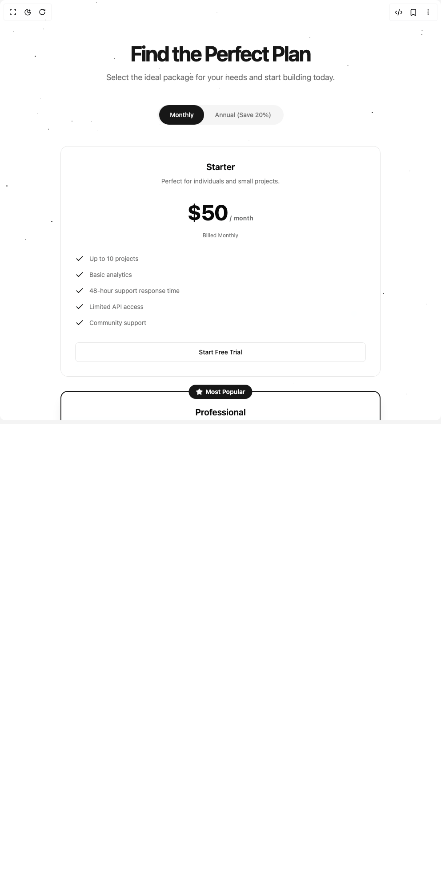

# Build Pricing in BuilderStudio

> Build this component in our Agentic IDE: [BuilderStudio](https://builderstudio.dev).
>
> Join the BuilderStudio community on [Discord](https://discord.gg/QdWeSGCqfe) and [Reddit](https://reddit.com/r/builderstudio).



## Component

- Author group: `ravikatiyar`
- Component: `pricing`
- Variant: `default`
- Rendered HTML snapshot: [`rendered.html`](rendered.html)

## BuilderStudio prompt

You are implementing a React component based on a component reference.

## Component identity

- Author: ravikatiyar
- Component slug: pricing
- Demo slug: default
- Title: pricing
- Description: 

## Goal

Recreate this component in a React + TypeScript + Tailwind CSS project. Preserve the visual layout, spacing, colors, border radius, shadows, interaction behavior, animation behavior, responsive behavior, and dark mode behavior shown in the rendered demo.

## Implementation requirements

- Use React and TypeScript.
- Use Tailwind CSS classes whenever possible.
- Keep the component self-contained unless the source files require helper components.
- If the source uses CSS variables, custom CSS, animations, or keyframes, include them.
- If the source uses external packages, list and use the required packages.
- Preserve accessibility attributes, button semantics, links, keyboard behavior, and ARIA attributes when visible in the source.
- Do not replace the component with a simplified placeholder.
- Return complete production-ready code.

## Dependencies

No reference metadata available.

## Rendered DOM snapshot

This is the rendered demo HTML extracted from the live preview. Use it to verify structure, class names, visible content, and layout.

```html
<div id="root"><div class="w-screen min-h-screen flex justify-center items-center"><div class="w-screen min-h-screen flex justify-center items-center"><div class="relative w-full bg-background dark:bg-neutral-950 py-20 sm:py-24"><div class="absolute inset-0 w-full h-full overflow-hidden pointer-events-none"><div class="absolute bg-foreground rounded-full" style="top: 98.5379%; left: 91.7712%; width: 1.7999px; height: 2.5043px; opacity: 0; transform: none;"></div><div class="absolute bg-foreground rounded-full" style="top: 91.9718%; left: 52.0963%; width: 2.67184px; height: 1.62699px; opacity: 0; transform: none;"></div><div class="absolute bg-foreground rounded-full" style="top: 11.8909%; left: 58.3313%; width: 1.97067px; height: 2.29461px; opacity: 0; transform: none;"></div><div class="absolute bg-foreground rounded-full" style="top: 13.7802%; left: 44.8256%; width: 1.09004px; height: 2.68629px; opacity: 0; transform: none;"></div><div class="absolute bg-foreground rounded-full" style="top: 46.254%; left: 68.9273%; width: 1.96014px; height: 1.1779px; opacity: 0; transform: none;"></div><div class="absolute bg-foreground rounded-full" style="top: 71.9046%; left: 43.2674%; width: 2.36208px; height: 1.05374px; opacity: 0; transform: none;"></div><div class="absolute bg-foreground rounded-full" style="top: 89.3127%; left: 75.5317%; width: 1.65625px; height: 2.25194px; opacity: 0; transform: none;"></div><div class="absolute bg-foreground rounded-full" style="top: 99.8245%; left: 41.4063%; width: 2.73164px; height: 2.03352px; opacity: 0; transform: none;"></div><div class="absolute bg-foreground rounded-full" style="top: 68.3107%; left: 58.8954%; width: 1.59232px; height: 2.02855px; opacity: 0; transform: none;"></div><div class="absolute bg-foreground rounded-full" style="top: 24.7529%; left: 11.5904%; width: 2.97776px; height: 1.83517px; opacity: 0; transform: none;"></div><div class="absolute bg-foreground rounded-full" style="top: 55.972%; left: 12.0847%; width: 1.39113px; height: 1.81752px; opacity: 0; transform: none;"></div><div class="absolute bg-foreground rounded-full" style="top: 80.3833%; left: 21.4029%; width: 1.05912px; height: 1.9696px; opacity: 0; transform: none;"></div><div class="absolute bg-foreground rounded-full" style="top: 31.9764%; left: 73.4792%; width: 2.00139px; height: 2.09219px; opacity: 0; transform: none;"></div><div class="absolute bg-foreground rounded-full" style="top: 50.4938%; left: 44.9794%; width: 2.83279px; height: 1.28591px; opacity: 0; transform: none;"></div><div class="absolute bg-foreground rounded-full" style="top: 86.7098%; left: 98.176%; width: 2.07072px; height: 1.42675px; opacity: 0; transform: none;"></div><div class="absolute bg-foreground rounded-full" style="top: 82.498%; left: 62.2536%; width: 1.90888px; height: 1.13188px; opacity: 0; transform: none;"></div><div class="absolute bg-foreground rounded-full" style="top: 17.9169%; left: 83.8055%; width: 2.13298px; height: 2.7068px; opacity: 0; transform: none;"></div><div class="absolute bg-foreground rounded-full" style="top: 66.9954%; left: 48.7503%; width: 1.57596px; height: 2.54733px; opacity: 0; transform: none;"></div><div class="absolute bg-foreground rounded-full" style="top: 85.2481%; left: 52.5284%; width: 1.33298px; height: 2.50855px; opacity: 0; transform: none;"></div><div class="absolute bg-foreground rounded-full" style="top: 86.4791%; left: 74.9305%; width: 2.53942px; height: 2.90729px; opacity: 0; transform: none;"></div><div class="absolute bg-foreground rounded-full" style="top: 80.5427%; left: 41.4607%; width: 1.25611px; height: 1.34312px; opacity: 0; transform: none;"></div><div class="absolute bg-foreground rounded-full" style="top: 52.119%; left: 68.7366%; width: 1.9659px; height: 2.04216px; opacity: 0; transform: none;"></div><div class="absolute bg-foreground rounded-full" style="top: 1.38545%; left: 49.1241%; width: 2.01269px; height: 1.40308px; opacity: 0; transform: none;"></div><div class="absolute bg-foreground rounded-full" style="top: 93.6091%; left: 87.1641%; width: 1.91091px; height: 1.6103px; opacity: 0; transform: none;"></div><div class="absolute bg-foreground rounded-full" style="top: 47.8699%; left: 1.60296%; width: 2.52136px; height: 2.87962px; opacity: 0; transform: none;"></div><div class="absolute bg-foreground rounded-full" style="top: 84.7103%; left: 7.16316%; width: 1.72941px; height: 1.14983px; opacity: 0; transform: none;"></div><div class="absolute bg-foreground rounded-full" style="top: 68.129%; left: 60.7426%; width: 2.90767px; height: 1.716px; opacity: 0; transform: none;"></div><div class="absolute bg-foreground rounded-full" style="top: 86.7891%; left: 93.2108%; width: 1.22274px; height: 2.66777px; opacity: 0; transform: none;"></div><div class="absolute bg-foreground rounded-full" style="top: 61.4842%; left: 49.3055%; width: 1.7347px; height: 2.62885px; opacity: 0; transform: none;"></div><div class="absolute bg-foreground rounded-full" style="top: 79.5884%; left: 25.8154%; width: 1.93441px; height: 2.79212px; opacity: 0; transform: none;"></div><div class="absolute bg-foreground rounded-full" style="top: 8.16187%; left: 43.1204%; width: 1.42675px; height: 2.208px; opacity: 0; transform: none;"></div><div class="absolute bg-foreground rounded-full" style="top: 30.9722%; left: 63.849%; width: 1.44379px; height: 2.44125px; opacity: 0; transform: none;"></div><div class="absolute bg-foreground rounded-full" style="top: 65.7218%; left: 51.209%; width: 1.47938px; height: 2.47918px; opacity: 0; transform: none;"></div><div class="absolute bg-foreground rounded-full" style="top: 48.0957%; left: 34.0144%; width: 2.38961px; height: 1.06295px; opacity: 0; transform: none;"></div><div class="absolute bg-foreground rounded-full" style="top: 89.4839%; left: 39.656%; width: 2.25668px; height: 2.03003px; opacity: 0; transform: none;"></div><div class="absolute bg-foreground rounded-full" style="top: 95.3086%; left: 0.347215%; width: 2.4975px; height: 1.22923px; opacity: 0; transform: none;"></div><div class="absolute bg-foreground rounded-full" style="top: 68.3858%; left: 39.5179%; width: 1.31864px; height: 1.78598px; opacity: 0; transform: none;"></div><div class="absolute bg-foreground rounded-full" style="top: 80.6361%; left: 70.2528%; width: 1.03367px; height: 1.60248px; opacity: 0; transform: none;"></div><div class="absolute bg-foreground rounded-full" style="top: 56.0768%; left: 92.0379%; width: 1.60783px; height: 1.62915px; opacity: 0; transform: none;"></div><div class="absolute bg-foreground rounded-full" style="top: 51.3864%; left: 99.4231%; width: 2.23705px; height: 1.86944px; opacity: 0; transform: none;"></div><div class="absolute bg-foreground rounded-full" style="top: 30.3106%; left: 30.7045%; width: 1.69519px; height: 1.26257px; opacity: 0; transform: none;"></div><div class="absolute bg-foreground rounded-full" style="top: 41.8528%; left: 80.3098%; width: 1.82665px; height: 2.32554px; opacity: 0; transform: none;"></div><div class="absolute bg-foreground rounded-full" style="top: 60.4961%; left: 93.526%; width: 1.2309px; height: 2.83849px; opacity: 0; transform: none;"></div><div class="absolute bg-foreground rounded-full" style="top: 31.6761%; left: 73.3896%; width: 2.2482px; height: 2.18791px; opacity: 0; transform: none;"></div><div class="absolute bg-foreground rounded-full" style="top: 83.5563%; left: 61.9009%; width: 2.25029px; height: 1.26057px; opacity: 0; transform: none;"></div><div class="absolute bg-foreground rounded-full" style="top: 87.1677%; left: 51.9541%; width: 1.5822px; height: 1.59674px; opacity: 0; transform: none;"></div><div class="absolute bg-foreground rounded-full" style="top: 85.1876%; left: 11.8031%; width: 2.08892px; height: 1.55353px; opacity: 0; transform: none;"></div><div class="absolute bg-foreground rounded-full" style="top: 66.6834%; left: 26.6345%; width: 2.82989px; height: 2.22784px; opacity: 0; transform: none;"></div><div class="absolute bg-foreground rounded-full" style="top: 17.3616%; left: 60.6706%; width: 2.54134px; height: 2.08715px; opacity: 0; transform: none;"></div><div class="absolute bg-foreground rounded-full" style="top: 90.5204%; left: 64.2559%; width: 1.35831px; height: 2.0518px; opacity: 0; transform: none;"></div><div class="absolute bg-foreground rounded-full" style="top: 90.8084%; left: 49.8075%; width: 2.9128px; height: 2.60598px; opacity: 0; transform: none;"></div><div class="absolute bg-foreground rounded-full" style="top: 55.9007%; left: 53.1652%; width: 2.02976px; height: 1.75408px; opacity: 0; transform: none;"></div><div class="absolute bg-foreground rounded-full" style="top: 65.1378%; left: 48.2913%; width: 2.88023px; height: 2.04301px; opacity: 0; transform: none;"></div><div class="absolute bg-foreground rounded-full" style="top: 13.9015%; left: 36.1678%; width: 2.18625px; height: 1.16826px; opacity: 0; transform: none;"></div><div class="absolute bg-foreground rounded-full" style="top: 32.492%; left: 31.752%; width: 1.45926px; height: 1.34137px; opacity: 0; transform: none;"></div><div class="absolute bg-foreground rounded-full" style="top: 24.7363%; left: 81.0643%; width: 2.12534px; height: 2.14058px; opacity: 0; transform: none;"></div><div class="absolute bg-foreground rounded-full" style="top: 8.29927%; left: 90.375%; width: 1.20324px; height: 2.01315px; opacity: 0; transform: none;"></div><div class="absolute bg-foreground rounded-full" style="top: 20.7419%; left: 1.46107%; width: 2.40417px; height: 2.6136px; opacity: 0; transform: none;"></div><div class="absolute bg-foreground rounded-full" style="top: 26.5942%; left: 48.7969%; width: 2.86845px; height: 1.14993px; opacity: 0; transform: none;"></div><div class="absolute bg-foreground rounded-full" style="top: 47.4057%; left: 20.3812%; width: 1.98472px; height: 1.73778px; opacity: 0; transform: none;"></div><div class="absolute bg-foreground rounded-full" style="top: 3.81018%; left: 95.565%; width: 1.50548px; height: 2.07958px; opacity: 0; transform: none;"></div><div class="absolute bg-foreground rounded-full" style="top: 36.1762%; left: 86.1089%; width: 1.87531px; height: 1.34041px; opacity: 0; transform: none;"></div><div class="absolute bg-foreground rounded-full" style="top: 8.31564%; left: 51.1635%; width: 2.67621px; height: 1.69996px; opacity: 0; transform: none;"></div><div class="absolute bg-foreground rounded-full" style="top: 14.5525%; left: 21.9449%; width: 2.36183px; height: 1.12691px; opacity: 0; transform: none;"></div><div class="absolute bg-foreground rounded-full" style="top: 88.9735%; left: 87.6167%; width: 1.89265px; height: 2.02306px; opacity: 0; transform: none;"></div><div class="absolute bg-foreground rounded-full" style="top: 9.82963%; left: 49.6194%; width: 1.57968px; height: 1.91877px; opacity: 0; transform: none;"></div><div class="absolute bg-foreground rounded-full" style="top: 79.3263%; left: 29.5847%; width: 2.06235px; height: 2.43266px; opacity: 0; transform: none;"></div><div class="absolute bg-foreground rounded-full" style="top: 6.22629%; left: 7.89691%; width: 2.71939px; height: 2.87681px; opacity: 0; transform: none;"></div><div class="absolute bg-foreground rounded-full" style="top: 42.8351%; left: 66.456%; width: 1.05329px; height: 1.02272px; opacity: 0; transform: none;"></div><div class="absolute bg-foreground rounded-full" style="top: 33.5914%; left: 52.7301%; width: 1.50767px; height: 1.15395px; opacity: 0; transform: none;"></div><div class="absolute bg-foreground rounded-full" style="top: 26.7413%; left: 5.72279%; width: 2.41909px; height: 1.91214px; opacity: 0; transform: none;"></div><div class="absolute bg-foreground rounded-full" style="top: 35.0243%; left: 80.1175%; width: 1.82901px; height: 2.6404px; opacity: 0; transform: none;"></div><div class="absolute bg-foreground rounded-full" style="top: 81.2329%; left: 31.3476%; width: 2.99195px; height: 1.63606px; opacity: 0; transform: none;"></div><div class="absolute bg-foreground rounded-full" style="top: 76.7557%; left: 48.7869%; width: 2.46933px; height: 2.85829px; opacity: 0; transform: none;"></div><div class="absolute bg-foreground rounded-full" style="top: 93.8795%; left: 16.2091%; width: 2.6675px; height: 1.24631px; opacity: 0; transform: none;"></div><div class="absolute bg-foreground rounded-full" style="top: 7.64714%; left: 36.0279%; width: 2.10721px; height: 1.40615px; opacity: 0; transform: none;"></div><div class="absolute bg-foreground rounded-full" style="top: 35.4923%; left: 21.1797%; width: 2.80905px; height: 2.43903px; opacity: 0; transform: none;"></div><div class="absolute bg-foreground rounded-full" style="top: 70.1153%; left: 6.77208%; width: 1.25749px; height: 2.34965px; opacity: 0; transform: none;"></div><div class="absolute bg-foreground rounded-full" style="top: 71.3169%; left: 8.8154%; width: 1.75355px; height: 1.77018px; opacity: 0; transform: none;"></div><div class="absolute bg-foreground rounded-full" style="top: 24.5145%; left: 74.9618%; width: 1.71434px; height: 1.77971px; opacity: 0; transform: none;"></div><div class="absolute bg-foreground rounded-full" style="top: 3.36881%; left: 95.5412%; width: 2.84037px; height: 2.66576px; opacity: 0; transform: none;"></div><div class="absolute bg-foreground rounded-full" style="top: 15.7141%; left: 56.315%; width: 1.94536px; height: 1.30176px; opacity: 0; transform: none;"></div><div class="absolute bg-foreground rounded-full" style="top: 35.7637%; left: 36.2302%; width: 2.67291px; height: 1.31927px; opacity: 0; transform: none;"></div><div class="absolute bg-foreground rounded-full" style="top: 12.6318%; left: 8.4243%; width: 1.50306px; height: 2.74622px; opacity: 0; transform: none;"></div><div class="absolute bg-foreground rounded-full" style="top: 2.17089%; left: 10.2246%; width: 2.48985px; height: 2.03344px; opacity: 0; transform: none;"></div><div class="absolute bg-foreground rounded-full" style="top: 56.076%; left: 42.0884%; width: 1.11955px; height: 2.60489px; opacity: 0; transform: none;"></div><div class="absolute bg-foreground rounded-full" style="top: 40.8255%; left: 17.3358%; width: 2.02682px; height: 2.04573px; opacity: 0; transform: none;"></div><div class="absolute bg-foreground rounded-full" style="top: 68.5283%; left: 68.583%; width: 1.55418px; height: 1.32369px; opacity: 0; transform: none;"></div><div class="absolute bg-foreground rounded-full" style="top: 96.9175%; left: 91.6807%; width: 2.63173px; height: 1.75477px; opacity: 0; transform: none;"></div><div class="absolute bg-foreground rounded-full" style="top: 95.5085%; left: 76.0906%; width: 2.0281px; height: 1.6891px; opacity: 0; transform: none;"></div><div class="absolute bg-foreground rounded-full" style="top: 27.9539%; left: 62.2977%; width: 2.52047px; height: 2.89398px; opacity: 0; transform: none;"></div><div class="absolute bg-foreground rounded-full" style="top: 19.0645%; left: 92.7887%; width: 2.97716px; height: 1.95761px; opacity: 0; transform: none;"></div><div class="absolute bg-foreground rounded-full" style="top: 49.3774%; left: 24.1528%; width: 1.38718px; height: 1.36989px; opacity: 0; transform: none;"></div><div class="absolute bg-foreground rounded-full" style="top: 6.45354%; left: 25.7779%; width: 2.32452px; height: 2.30365px; opacity: 0; transform: none;"></div><div class="absolute bg-foreground rounded-full" style="top: 94.1965%; left: 85.882%; width: 2.21332px; height: 1.36134px; opacity: 0; transform: none;"></div><div class="absolute bg-foreground rounded-full" style="top: 53.3016%; left: 26.4096%; width: 2.16732px; height: 2.7466px; opacity: 0; transform: none;"></div><div class="absolute bg-foreground rounded-full" style="top: 32.7471%; left: 86.9403%; width: 1.61264px; height: 2.28455px; opacity: 0; transform: none;"></div><div class="absolute bg-foreground rounded-full" style="top: 52.1829%; left: 11.5191%; width: 1.53657px; height: 1.62665px; opacity: 0; transform: none;"></div><div class="absolute bg-foreground rounded-full" style="top: 80.1635%; left: 79.2182%; width: 2.6423px; height: 1.43079px; opacity: 0; transform: none;"></div><div class="absolute bg-foreground rounded-full" style="top: 13.5085%; left: 16.244%; width: 1.9231px; height: 2.18645px; opacity: 0; transform: none;"></div><div class="absolute bg-foreground rounded-full" style="top: 12.5578%; left: 84.3115%; width: 2.54742px; height: 1.69987px; opacity: 0; transform: none;"></div><div class="absolute bg-foreground rounded-full" style="top: 53.3393%; left: 1.14035%; width: 1.12921px; height: 2.30445px; opacity: 0; transform: none;"></div><div class="absolute bg-foreground rounded-full" style="top: 32.8409%; left: 82.3401%; width: 1.78372px; height: 2.72698px; opacity: 0; transform: none;"></div><div class="absolute bg-foreground rounded-full" style="top: 33.9623%; left: 96.5237%; width: 1.11252px; height: 2.02303px; opacity: 0; transform: none;"></div><div class="absolute bg-foreground rounded-full" style="top: 50.9145%; left: 64.4725%; width: 2.63607px; height: 1.27047px; opacity: 0; transform: none;"></div><div class="absolute bg-foreground rounded-full" style="top: 89.4967%; left: 0.390866%; width: 2.73892px; height: 2.33985px; opacity: 0; transform: none;"></div><div class="absolute bg-foreground rounded-full" style="top: 16.2863%; left: 84.8772%; width: 1.19725px; height: 2.48652px; opacity: 0; transform: none;"></div><div class="absolute bg-foreground rounded-full" style="top: 52.6561%; left: 96.9265%; width: 1.42143px; height: 1.89993px; opacity: 0; transform: none;"></div><div class="absolute bg-foreground rounded-full" style="top: 32.9436%; left: 53.4477%; width: 1.0152px; height: 1.10156px; opacity: 0; transform: none;"></div><div class="absolute bg-foreground rounded-full" style="top: 49.5392%; left: 74.7074%; width: 1.56036px; height: 2.79892px; opacity: 0; transform: none;"></div><div class="absolute bg-foreground rounded-full" style="top: 98.8052%; left: 94.2294%; width: 1.78621px; height: 1.28149px; opacity: 0; transform: none;"></div><div class="absolute bg-foreground rounded-full" style="top: 74.0087%; left: 71.2547%; width: 2.66546px; height: 2.43873px; opacity: 0; transform: none;"></div><div class="absolute bg-foreground rounded-full" style="top: 7.26461%; left: 78.7591%; width: 2.23742px; height: 1.16629px; opacity: 0; transform: none;"></div><div class="absolute bg-foreground rounded-full" style="top: 19.918%; left: 43.1473%; width: 2.92777px; height: 2.53111px; opacity: 0; transform: none;"></div><div class="absolute bg-foreground rounded-full" style="top: 15.2955%; left: 64.4138%; width: 1.71061px; height: 2.16684px; opacity: 0; transform: none;"></div><div class="absolute bg-foreground rounded-full" style="top: 68.6358%; left: 66.66%; width: 1.05143px; height: 2.37101px; opacity: 0; transform: none;"></div><div class="absolute bg-foreground rounded-full" style="top: 28.8204%; left: 69.8339%; width: 2.68814px; height: 1.76949px; opacity: 0; transform: none;"></div><div class="absolute bg-foreground rounded-full" style="top: 0.932199%; left: 97.6347%; width: 1.3477px; height: 1.06082px; opacity: 0; transform: none;"></div><div class="absolute bg-foreground rounded-full" style="top: 37.8489%; left: 61.0105%; width: 1.05612px; height: 2.47003px; opacity: 0; transform: none;"></div><div class="absolute bg-foreground rounded-full" style="top: 33.1485%; left: 95.9358%; width: 1.75646px; height: 2.75229px; opacity: 0; transform: none;"></div><div class="absolute bg-foreground rounded-full" style="top: 63.8529%; left: 34.3432%; width: 1.15922px; height: 1.71806px; opacity: 0; transform: none;"></div><div class="absolute bg-foreground rounded-full" style="top: 71.173%; left: 87.1908%; width: 1.15113px; height: 2.37019px; opacity: 0; transform: none;"></div><div class="absolute bg-foreground rounded-full" style="top: 1.38435%; left: 96.866%; width: 2.0318px; height: 2.40659px; opacity: 0; transform: none;"></div><div class="absolute bg-foreground rounded-full" style="top: 21.1099%; left: 92.1678%; width: 2.60994px; height: 1.14474px; opacity: 0; transform: none;"></div><div class="absolute bg-foreground rounded-full" style="top: 32.4293%; left: 67.9065%; width: 1.47415px; height: 1.38596px; opacity: 0; transform: none;"></div><div class="absolute bg-foreground rounded-full" style="top: 13.561%; left: 20.7176%; width: 1.43533px; height: 2.05079px; opacity: 0; transform: none;"></div><div class="absolute bg-foreground rounded-full" style="top: 67.8082%; left: 49.2176%; width: 1.12837px; height: 2.8268px; opacity: 0; transform: none;"></div><div class="absolute bg-foreground rounded-full" style="top: 69.0734%; left: 47.0707%; width: 1.27205px; height: 2.27761px; opacity: 0; transform: none;"></div><div class="absolute bg-foreground rounded-full" style="top: 3.47649%; left: 2.8841%; width: 2.18577px; height: 1.33653px; opacity: 0; transform: none;"></div><div class="absolute bg-foreground rounded-full" style="top: 76.9601%; left: 47.2004%; width: 2.22176px; height: 2.80167px; opacity: 0; transform: none;"></div><div class="absolute bg-foreground rounded-full" style="top: 60.6922%; left: 69.0618%; width: 1.68996px; height: 1.47963px; opacity: 0; transform: none;"></div><div class="absolute bg-foreground rounded-full" style="top: 0.255088%; left: 21.8299%; width: 1.52157px; height: 2.2331px; opacity: 0; transform: none;"></div><div class="absolute bg-foreground rounded-full" style="top: 44.0131%; left: 92.1121%; width: 1.24941px; height: 2.17722px; opacity: 0; transform: none;"></div><div class="absolute bg-foreground rounded-full" style="top: 61.2822%; left: 22.2617%; width: 1.2298px; height: 1.92962px; opacity: 0; transform: none;"></div><div class="absolute bg-foreground rounded-full" style="top: 4.18474%; left: 70.1155%; width: 2.86232px; height: 1.09709px; opacity: 0; transform: none;"></div><div class="absolute bg-foreground rounded-full" style="top: 74.4837%; left: 44.0606%; width: 1.10241px; height: 2.26096px; opacity: 0; transform: none;"></div><div class="absolute bg-foreground rounded-full" style="top: 16.6045%; left: 78.8909%; width: 1.81932px; height: 2.40644px; opacity: 0; transform: none;"></div><div class="absolute bg-foreground rounded-full" style="top: 35.7371%; left: 63.0747%; width: 2.24977px; height: 2.20403px; opacity: 0; transform: none;"></div><div class="absolute bg-foreground rounded-full" style="top: 3.19307%; left: 9.7494%; width: 2.25131px; height: 2.3251px; opacity: 0; transform: none;"></div><div class="absolute bg-foreground rounded-full" style="top: 67.2316%; left: 85.8508%; width: 2.45473px; height: 1.92296px; opacity: 0; transform: none;"></div><div class="absolute bg-foreground rounded-full" style="top: 96.4576%; left: 75.2561%; width: 2.54163px; height: 2.15325px; opacity: 0; transform: none;"></div><div class="absolute bg-foreground rounded-full" style="top: 92.3759%; left: 92.6666%; width: 1.33846px; height: 1.65122px; opacity: 0; transform: none;"></div><div class="absolute bg-foreground rounded-full" style="top: 11.0109%; left: 9.03316%; width: 1.21867px; height: 2.24915px; opacity: 0; transform: none;"></div><div class="absolute bg-foreground rounded-full" style="top: 96.1052%; left: 39.5748%; width: 2.07509px; height: 1.0787px; opacity: 0; transform: none;"></div><div class="absolute bg-foreground rounded-full" style="top: 6.90787%; left: 61.8306%; width: 1.01893px; height: 1.71633px; opacity: 0; transform: none;"></div><div class="absolute bg-foreground rounded-full" style="top: 77.168%; left: 64.615%; width: 1.30158px; height: 1.40711px; opacity: 0; transform: none;"></div><div class="absolute bg-foreground rounded-full" style="top: 24.7927%; left: 13.902%; width: 2.51717px; height: 1.36731px; opacity: 0; transform: none;"></div><div class="absolute bg-foreground rounded-full" style="top: 14.4151%; left: 10.8887%; width: 1.6177px; height: 2.03497px; opacity: 0; transform: none;"></div><div class="absolute bg-foreground rounded-full" style="top: 88.1435%; left: 93.5678%; width: 2.18966px; height: 2.63866px; opacity: 0; transform: none;"></div><div class="absolute bg-foreground rounded-full" style="top: 91.6562%; left: 11.2923%; width: 1.99253px; height: 2.18214px; opacity: 0; transform: none;"></div></div><div class="relative z-10 container mx-auto px-4 md:px-6"><div class="max-w-3xl mx-auto text-center space-y-4 mb-12"><h2 class="text-4xl font-bold tracking-tighter sm:text-5xl text-neutral-900 dark:text-white">Find the Perfect Plan</h2><p class="text-muted-foreground text-lg whitespace-pre-line">Select the ideal package for your needs and start building today.</p></div><div class="flex justify-center"><div class="relative flex w-fit items-center rounded-full bg-muted p-1"><div class="absolute left-0 top-0 h-full rounded-full bg-primary p-1" style="width: 101px; transform: translateX(4px);"></div><button class="relative z-10 rounded-full px-4 sm:px-6 py-2 text-sm font-medium transition-colors text-primary-foreground">Monthly</button><button class="relative z-10 rounded-full px-4 sm:px-6 py-2 text-sm font-medium transition-colors text-muted-foreground hover:text-foreground">Annual<span class="hidden sm:inline"> (Save 20%)</span></button></div></div><div class="mt-12 grid grid-cols-1 lg:grid-cols-3 items-start gap-8"><div class="rounded-2xl p-8 flex flex-col relative bg-background/70 backdrop-blur-sm border border-border" style="opacity: 1; transform: none;"><div class="flex-1 flex flex-col text-center"><h3 class="text-xl font-semibold text-foreground">Starter</h3><p class="mt-2 text-sm text-muted-foreground">Perfect for individuals and small projects.</p><div class="mt-6 flex items-baseline justify-center gap-x-1"><span class="text-5xl font-bold tracking-tight text-foreground"><number-flow-react class="font-variant-numeric: tabular-nums"></number-flow-react></span><span class="text-sm font-semibold leading-6 tracking-wide text-muted-foreground">/ month</span></div><p class="text-xs text-muted-foreground mt-2">Billed Monthly</p><ul role="list" class="mt-8 space-y-3 text-sm leading-6 text-left text-muted-foreground"><li class="flex gap-x-3"><svg xmlns="http://www.w3.org/2000/svg" width="24" height="24" viewBox="0 0 24 24" fill="none" stroke="currentColor" stroke-width="2" stroke-linecap="round" stroke-linejoin="round" class="lucide lucide-check h-6 w-5 flex-none text-primary" aria-hidden="true"><path d="M20 6 9 17l-5-5"></path></svg>Up to 10 projects</li><li class="flex gap-x-3"><svg xmlns="http://www.w3.org/2000/svg" width="24" height="24" viewBox="0 0 24 24" fill="none" stroke="currentColor" stroke-width="2" stroke-linecap="round" stroke-linejoin="round" class="lucide lucide-check h-6 w-5 flex-none text-primary" aria-hidden="true"><path d="M20 6 9 17l-5-5"></path></svg>Basic analytics</li><li class="flex gap-x-3"><svg xmlns="http://www.w3.org/2000/svg" width="24" height="24" viewBox="0 0 24 24" fill="none" stroke="currentColor" stroke-width="2" stroke-linecap="round" stroke-linejoin="round" class="lucide lucide-check h-6 w-5 flex-none text-primary" aria-hidden="true"><path d="M20 6 9 17l-5-5"></path></svg>48-hour support response time</li><li class="flex gap-x-3"><svg xmlns="http://www.w3.org/2000/svg" width="24" height="24" viewBox="0 0 24 24" fill="none" stroke="currentColor" stroke-width="2" stroke-linecap="round" stroke-linejoin="round" class="lucide lucide-check h-6 w-5 flex-none text-primary" aria-hidden="true"><path d="M20 6 9 17l-5-5"></path></svg>Limited API access</li><li class="flex gap-x-3"><svg xmlns="http://www.w3.org/2000/svg" width="24" height="24" viewBox="0 0 24 24" fill="none" stroke="currentColor" stroke-width="2" stroke-linecap="round" stroke-linejoin="round" class="lucide lucide-check h-6 w-5 flex-none text-primary" aria-hidden="true"><path d="M20 6 9 17l-5-5"></path></svg>Community support</li></ul><div class="mt-auto pt-8"><a href="#" class="inline-flex items-center justify-center whitespace-nowrap text-sm font-medium ring-offset-background transition-colors focus-visible:outline-none focus-visible:ring-2 focus-visible:ring-ring focus-visible:ring-offset-2 disabled:pointer-events-none disabled:opacity-50 border border-input bg-background hover:bg-accent hover:text-accent-foreground h-11 rounded-md px-8 w-full">Start Free Trial</a></div></div></div><div class="rounded-2xl p-8 flex flex-col relative bg-background/70 backdrop-blur-sm border-2 border-primary shadow-xl" style="opacity: 1; transform: none;"><div class="absolute top-0 -translate-y-1/2 left-1/2 -translate-x-1/2"><div class="bg-primary py-1.5 px-4 rounded-full flex items-center gap-1.5"><svg xmlns="http://www.w3.org/2000/svg" width="24" height="24" viewBox="0 0 24 24" fill="none" stroke="currentColor" stroke-width="2" stroke-linecap="round" stroke-linejoin="round" class="lucide lucide-star text-primary-foreground h-4 w-4 fill-current" aria-hidden="true"><path d="M11.525 2.295a.53.53 0 0 1 .95 0l2.31 4.679a2.123 2.123 0 0 0 1.595 1.16l5.166.756a.53.53 0 0 1 .294.904l-3.736 3.638a2.123 2.123 0 0 0-.611 1.878l.882 5.14a.53.53 0 0 1-.771.56l-4.618-2.428a2.122 2.122 0 0 0-1.973 0L6.396 21.01a.53.53 0 0 1-.77-.56l.881-5.139a2.122 2.122 0 0 0-.611-1.879L2.16 9.795a.53.53 0 0 1 .294-.906l5.165-.755a2.122 2.122 0 0 0 1.597-1.16z"></path></svg><span class="text-primary-foreground text-sm font-semibold">Most Popular</span></div></div><div class="flex-1 flex flex-col text-center"><h3 class="text-xl font-semibold text-foreground">Professional</h3><p class="mt-2 text-sm text-muted-foreground">Ideal for growing teams and businesses.</p><div class="mt-6 flex items-baseline justify-center gap-x-1"><span class="text-5xl font-bold tracking-tight text-foreground"><number-flow-react class="font-variant-numeric: tabular-nums"></number-flow-react></span><span class="text-sm font-semibold leading-6 tracking-wide text-muted-foreground">/ month</span></div><p class="text-xs text-muted-foreground mt-2">Billed Monthly</p><ul role="list" class="mt-8 space-y-3 text-sm leading-6 text-left text-muted-foreground"><li class="flex gap-x-3"><svg xmlns="http://www.w3.org/2000/svg" width="24" height="24" viewBox="0 0 24 24" fill="none" stroke="currentColor" stroke-width="2" stroke-linecap="round" stroke-linejoin="round" class="lucide lucide-check h-6 w-5 flex-none text-primary" aria-hidden="true"><path d="M20 6 9 17l-5-5"></path></svg>Unlimited projects</li><li class="flex gap-x-3"><svg xmlns="http://www.w3.org/2000/svg" width="24" height="24" viewBox="0 0 24 24" fill="none" stroke="currentColor" stroke-width="2" stroke-linecap="round" stroke-linejoin="round" class="lucide lucide-check h-6 w-5 flex-none text-primary" aria-hidden="true"><path d="M20 6 9 17l-5-5"></path></svg>Advanced analytics</li><li class="flex gap-x-3"><svg xmlns="http://www.w3.org/2000/svg" width="24" height="24" viewBox="0 0 24 24" fill="none" stroke="currentColor" stroke-width="2" stroke-linecap="round" stroke-linejoin="round" class="lucide lucide-check h-6 w-5 flex-none text-primary" aria-hidden="true"><path d="M20 6 9 17l-5-5"></path></svg>24-hour support response time</li><li class="flex gap-x-3"><svg xmlns="http://www.w3.org/2000/svg" width="24" height="24" viewBox="0 0 24 24" fill="none" stroke="currentColor" stroke-width="2" stroke-linecap="round" stroke-linejoin="round" class="lucide lucide-check h-6 w-5 flex-none text-primary" aria-hidden="true"><path d="M20 6 9 17l-5-5"></path></svg>Full API access</li><li class="flex gap-x-3"><svg xmlns="http://www.w3.org/2000/svg" width="24" height="24" viewBox="0 0 24 24" fill="none" stroke="currentColor" stroke-width="2" stroke-linecap="round" stroke-linejoin="round" class="lucide lucide-check h-6 w-5 flex-none text-primary" aria-hidden="true"><path d="M20 6 9 17l-5-5"></path></svg>Priority support &amp; Team collaboration</li></ul><div class="mt-auto pt-8"><a href="#" class="inline-flex items-center justify-center whitespace-nowrap text-sm font-medium ring-offset-background transition-colors focus-visible:outline-none focus-visible:ring-2 focus-visible:ring-ring focus-visible:ring-offset-2 disabled:pointer-events-none disabled:opacity-50 bg-primary text-primary-foreground hover:bg-primary/90 h-11 rounded-md px-8 w-full">Get Started</a></div></div></div><div class="rounded-2xl p-8 flex flex-col relative bg-background/70 backdrop-blur-sm border border-border" style="opacity: 0; transform: translateY(50px);"><div class="flex-1 flex flex-col text-center"><h3 class="text-xl font-semibold text-foreground">Enterprise</h3><p class="mt-2 text-sm text-muted-foreground">For large organizations with specific needs.</p><div class="mt-6 flex items-baseline justify-center gap-x-1"><span class="text-5xl font-bold tracking-tight text-foreground"><number-flow-react class="font-variant-numeric: tabular-nums"></number-flow-react></span><span class="text-sm font-semibold leading-6 tracking-wide text-muted-foreground">/ month</span></div><p class="text-xs text-muted-foreground mt-2">Billed Monthly</p><ul role="list" class="mt-8 space-y-3 text-sm leading-6 text-left text-muted-foreground"><li class="flex gap-x-3"><svg xmlns="http://www.w3.org/2000/svg" width="24" height="24" viewBox="0 0 24 24" fill="none" stroke="currentColor" stroke-width="2" stroke-linecap="round" stroke-linejoin="round" class="lucide lucide-check h-6 w-5 flex-none text-primary" aria-hidden="true"><path d="M20 6 9 17l-5-5"></path></svg>Everything in Professional</li><li class="flex gap-x-3"><svg xmlns="http://www.w3.org/2000/svg" width="24" height="24" viewBox="0 0 24 24" fill="none" stroke="currentColor" stroke-width="2" stroke-linecap="round" stroke-linejoin="round" class="lucide lucide-check h-6 w-5 flex-none text-primary" aria-hidden="true"><path d="M20 6 9 17l-5-5"></path></svg>Custom solutions &amp; integrations</li><li class="flex gap-x-3"><svg xmlns="http://www.w3.org/2000/svg" width="24" height="24" viewBox="0 0 24 24" fill="none" stroke="currentColor" stroke-width="2" stroke-linecap="round" stroke-linejoin="round" class="lucide lucide-check h-6 w-5 flex-none text-primary" aria-hidden="true"><path d="M20 6 9 17l-5-5"></path></svg>Dedicated account manager</li><li class="flex gap-x-3"><svg xmlns="http://www.w3.org/2000/svg" width="24" height="24" viewBox="0 0 24 24" fill="none" stroke="currentColor" stroke-width="2" stroke-linecap="round" stroke-linejoin="round" class="lucide lucide-check h-6 w-5 flex-none text-primary" aria-hidden="true"><path d="M20 6 9 17l-5-5"></path></svg>SSO Authentication &amp; Advanced security</li></ul><div class="mt-auto pt-8"><a href="#" class="inline-flex items-center justify-center whitespace-nowrap text-sm font-medium ring-offset-background transition-colors focus-visible:outline-none focus-visible:ring-2 focus-visible:ring-ring focus-visible:ring-offset-2 disabled:pointer-events-none disabled:opacity-50 border border-input bg-background hover:bg-accent hover:text-accent-foreground h-11 rounded-md px-8 w-full">Contact Sales</a></div></div></div></div></div></div></div></div></div>
```

## Reference source files

No reference source files were available.
