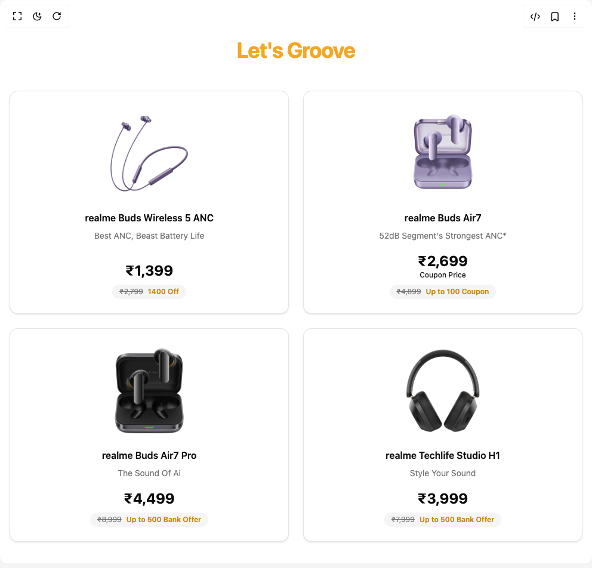

# Build Product Card 2 in BuilderStudio

> Build this component in our Agentic IDE: [BuilderStudio](https://builderstudio.dev).
>
> Join the BuilderStudio community on [Discord](https://discord.gg/QdWeSGCqfe) and [Reddit](https://reddit.com/r/builderstudio).



## Component

- Author group: `ravikatiyar`
- Component: `product-card-2`
- Variant: `default`
- Rendered HTML snapshot: [`rendered.html`](rendered.html)

## BuilderStudio prompt

You are implementing a React component based on a component reference.

## Component identity

- Author: ravikatiyar
- Component slug: product-card-2
- Demo slug: default
- Title: product-card-2
- Description: 

## Goal

Recreate this component in a React + TypeScript + Tailwind CSS project. Preserve the visual layout, spacing, colors, border radius, shadows, interaction behavior, animation behavior, responsive behavior, and dark mode behavior shown in the rendered demo.

## Implementation requirements

- Use React and TypeScript.
- Use Tailwind CSS classes whenever possible.
- Keep the component self-contained unless the source files require helper components.
- If the source uses CSS variables, custom CSS, animations, or keyframes, include them.
- If the source uses external packages, list and use the required packages.
- Preserve accessibility attributes, button semantics, links, keyboard behavior, and ARIA attributes when visible in the source.
- Do not replace the component with a simplified placeholder.
- Return complete production-ready code.

## Dependencies

No reference metadata available.

## Rendered DOM snapshot

This is the rendered demo HTML extracted from the live preview. Use it to verify structure, class names, visible content, and layout.

```html
<div id="root"><div class="w-screen min-h-screen flex justify-center items-center"><div class="w-screen min-h-screen flex justify-center items-center"><div class="w-full bg-background px-4 py-16"><div class="mx-auto max-w-7xl"><div class="mb-12 text-center"><h2 class="text-4xl font-bold tracking-tight" style="color: rgb(245, 166, 35);">Let's Groove</h2></div><div class="grid grid-cols-1 gap-6 sm:grid-cols-2 lg:grid-cols-4" style="opacity: 1;"><div style="opacity: 1; transform: none;"><div class="group relative flex h-full w-full flex-col items-center justify-start overflow-hidden rounded-xl border bg-card p-6 text-center text-card-foreground shadow-sm transition-all duration-300 ease-in-out hover:shadow-md"><div class="relative mb-4 flex h-40 w-full items-center justify-center"></div><div class="flex flex-grow flex-col items-center gap-2"><h3 class="font-semibold">realme Buds Wireless 5 ANC</h3><p class="text-sm text-muted-foreground">Best ANC, Beast Battery Life</p></div><div class="mt-4 flex flex-col items-center gap-2"><div class="flex flex-col items-center"><span class="text-2xl font-bold">₹1,399</span></div><div class="flex items-center gap-2 rounded-full bg-secondary px-3 py-1 text-xs text-secondary-foreground"><span class="text-muted-foreground line-through">₹2,799</span><span class="font-semibold text-yellow-600 dark:text-yellow-500">1400 Off</span></div></div></div></div><div style="opacity: 1; transform: none;"><div class="group relative flex h-full w-full flex-col items-center justify-start overflow-hidden rounded-xl border bg-card p-6 text-center text-card-foreground shadow-sm transition-all duration-300 ease-in-out hover:shadow-md"><div class="relative mb-4 flex h-40 w-full items-center justify-center"></div><div class="flex flex-grow flex-col items-center gap-2"><h3 class="font-semibold">realme Buds Air7</h3><p class="text-sm text-muted-foreground">52dB Segment's Strongest ANC*</p></div><div class="mt-4 flex flex-col items-center gap-2"><div class="flex flex-col items-center"><span class="text-2xl font-bold">₹2,699</span><span class="text-xs font-medium text-primary">Coupon Price</span></div><div class="flex items-center gap-2 rounded-full bg-secondary px-3 py-1 text-xs text-secondary-foreground"><span class="text-muted-foreground line-through">₹4,899</span><span class="font-semibold text-yellow-600 dark:text-yellow-500">Up to 100 Coupon</span></div></div></div></div><div style="opacity: 1; transform: none;"><div class="group relative flex h-full w-full flex-col items-center justify-start overflow-hidden rounded-xl border bg-card p-6 text-center text-card-foreground shadow-sm transition-all duration-300 ease-in-out hover:shadow-md"><div class="relative mb-4 flex h-40 w-full items-center justify-center"></div><div class="flex flex-grow flex-col items-center gap-2"><h3 class="font-semibold">realme Buds Air7 Pro</h3><p class="text-sm text-muted-foreground">The Sound Of Ai</p></div><div class="mt-4 flex flex-col items-center gap-2"><div class="flex flex-col items-center"><span class="text-2xl font-bold">₹4,499</span></div><div class="flex items-center gap-2 rounded-full bg-secondary px-3 py-1 text-xs text-secondary-foreground"><span class="text-muted-foreground line-through">₹8,999</span><span class="font-semibold text-yellow-600 dark:text-yellow-500">Up to 500 Bank Offer</span></div></div></div></div><div style="opacity: 1; transform: none;"><div class="group relative flex h-full w-full flex-col items-center justify-start overflow-hidden rounded-xl border bg-card p-6 text-center text-card-foreground shadow-sm transition-all duration-300 ease-in-out hover:shadow-md"><div class="relative mb-4 flex h-40 w-full items-center justify-center"></div><div class="flex flex-grow flex-col items-center gap-2"><h3 class="font-semibold">realme Techlife Studio H1</h3><p class="text-sm text-muted-foreground">Style Your Sound</p></div><div class="mt-4 flex flex-col items-center gap-2"><div class="flex flex-col items-center"><span class="text-2xl font-bold">₹3,999</span></div><div class="flex items-center gap-2 rounded-full bg-secondary px-3 py-1 text-xs text-secondary-foreground"><span class="text-muted-foreground line-through">₹7,999</span><span class="font-semibold text-yellow-600 dark:text-yellow-500">Up to 500 Bank Offer</span></div></div></div></div></div></div></div></div></div></div>
```

## Reference source files

No reference source files were available.
