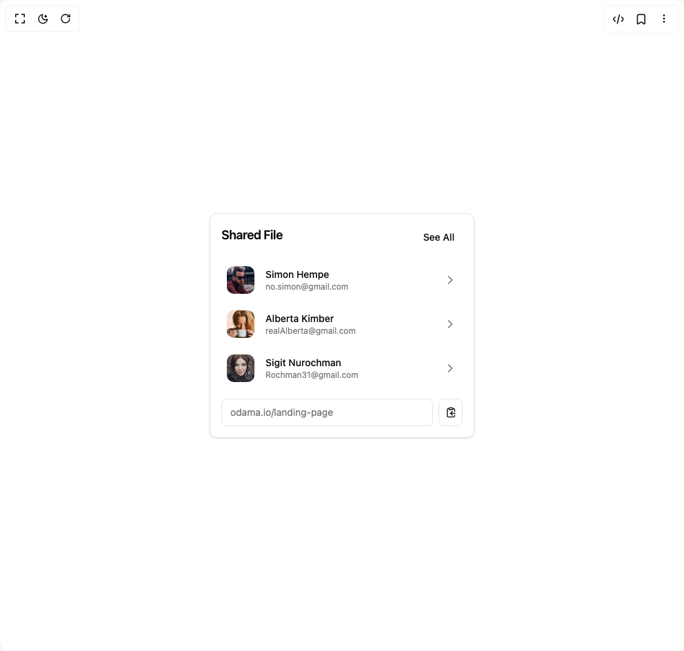

# Build Shared Files in BuilderStudio

> Build this component in our Agentic IDE: [BuilderStudio](https://builderstudio.dev).
>
> Join the BuilderStudio community on [Discord](https://discord.gg/QdWeSGCqfe) and [Reddit](https://reddit.com/r/builderstudio).



## Component

- Author group: `ravikatiyar`
- Component: `shared-files`
- Variant: `default`
- Rendered HTML snapshot: [`rendered.html`](rendered.html)

## BuilderStudio prompt

You are implementing a React component based on a component reference.

## Component identity

- Author: ravikatiyar
- Component slug: shared-files
- Demo slug: default
- Title: shared-files
- Description: 

## Goal

Recreate this component in a React + TypeScript + Tailwind CSS project. Preserve the visual layout, spacing, colors, border radius, shadows, interaction behavior, animation behavior, responsive behavior, and dark mode behavior shown in the rendered demo.

## Implementation requirements

- Use React and TypeScript.
- Use Tailwind CSS classes whenever possible.
- Keep the component self-contained unless the source files require helper components.
- If the source uses CSS variables, custom CSS, animations, or keyframes, include them.
- If the source uses external packages, list and use the required packages.
- Preserve accessibility attributes, button semantics, links, keyboard behavior, and ARIA attributes when visible in the source.
- Do not replace the component with a simplified placeholder.
- Return complete production-ready code.

## Dependencies

No reference metadata available.

## Rendered DOM snapshot

This is the rendered demo HTML extracted from the live preview. Use it to verify structure, class names, visible content, and layout.

```html
<div id="root"><div class="w-screen min-h-screen flex justify-center items-center"><div class="w-screen min-h-screen flex justify-center items-center"><div class="flex min-h-[500px] w-full items-center justify-center bg-background p-4"><div class="rounded-lg border bg-card text-card-foreground shadow-sm w-full max-w-sm overflow-hidden"><div class="space-y-1.5 flex flex-row items-center justify-between p-4"><h3 class="tracking-tight text-lg font-semibold">Shared File</h3><button class="inline-flex items-center justify-center whitespace-nowrap text-sm font-medium ring-offset-background transition-colors focus-visible:outline-none focus-visible:ring-2 focus-visible:ring-ring focus-visible:ring-offset-2 disabled:pointer-events-none disabled:opacity-50 hover:bg-accent hover:text-accent-foreground h-9 rounded-md px-3">See All</button></div><div class="p-4 pt-0"><ul class="space-y-2"><li><button class="w-full flex items-center p-2 rounded-lg text-left transition-all duration-200 ease-in-out hover:bg-accent focus-visible:outline-none focus-visible:ring-2 focus-visible:ring-ring focus-visible:ring-offset-2" aria-label="View details for Simon Hempe"><span class="relative flex shrink-0 overflow-hidden rounded-lg h-10 w-10 mr-4"></span><div class="flex-grow"><p class="font-medium text-sm text-card-foreground">Simon Hempe</p><p class="text-xs text-muted-foreground">no.simon@gmail.com</p></div><svg xmlns="http://www.w3.org/2000/svg" width="24" height="24" viewBox="0 0 24 24" fill="none" stroke="currentColor" stroke-width="2" stroke-linecap="round" stroke-linejoin="round" class="lucide lucide-chevron-right h-5 w-5 text-muted-foreground" aria-hidden="true"><path d="m9 18 6-6-6-6"></path></svg></button></li><li><button class="w-full flex items-center p-2 rounded-lg text-left transition-all duration-200 ease-in-out hover:bg-accent focus-visible:outline-none focus-visible:ring-2 focus-visible:ring-ring focus-visible:ring-offset-2" aria-label="View details for Alberta Kimber"><span class="relative flex shrink-0 overflow-hidden rounded-lg h-10 w-10 mr-4"></span><div class="flex-grow"><p class="font-medium text-sm text-card-foreground">Alberta Kimber</p><p class="text-xs text-muted-foreground">realAlberta@gmail.com</p></div><svg xmlns="http://www.w3.org/2000/svg" width="24" height="24" viewBox="0 0 24 24" fill="none" stroke="currentColor" stroke-width="2" stroke-linecap="round" stroke-linejoin="round" class="lucide lucide-chevron-right h-5 w-5 text-muted-foreground" aria-hidden="true"><path d="m9 18 6-6-6-6"></path></svg></button></li><li><button class="w-full flex items-center p-2 rounded-lg text-left transition-all duration-200 ease-in-out hover:bg-accent focus-visible:outline-none focus-visible:ring-2 focus-visible:ring-ring focus-visible:ring-offset-2" aria-label="View details for Sigit Nurochman"><span class="relative flex shrink-0 overflow-hidden rounded-lg h-10 w-10 mr-4"></span><div class="flex-grow"><p class="font-medium text-sm text-card-foreground">Sigit Nurochman</p><p class="text-xs text-muted-foreground">Rochman31@gmail.com</p></div><svg xmlns="http://www.w3.org/2000/svg" width="24" height="24" viewBox="0 0 24 24" fill="none" stroke="currentColor" stroke-width="2" stroke-linecap="round" stroke-linejoin="round" class="lucide lucide-chevron-right h-5 w-5 text-muted-foreground" aria-hidden="true"><path d="m9 18 6-6-6-6"></path></svg></button></li></ul><div class="mt-4 flex items-center space-x-2"><div class="flex-grow flex items-center h-10 w-full rounded-md border border-input bg-transparent px-3 py-2 text-sm text-muted-foreground overflow-hidden whitespace-nowrap"><span class="truncate">odama.io/landing-page</span></div><button class="inline-flex items-center justify-center whitespace-nowrap rounded-md text-sm font-medium ring-offset-background transition-colors focus-visible:outline-none focus-visible:ring-2 focus-visible:ring-ring focus-visible:ring-offset-2 disabled:pointer-events-none disabled:opacity-50 border border-input bg-background hover:bg-accent hover:text-accent-foreground h-10 w-10" aria-label="Copy file link"><svg xmlns="http://www.w3.org/2000/svg" width="24" height="24" viewBox="0 0 24 24" fill="none" stroke="currentColor" stroke-width="2" stroke-linecap="round" stroke-linejoin="round" class="lucide lucide-clipboard-copy h-4 w-4" aria-hidden="true"><rect width="8" height="4" x="8" y="2" rx="1" ry="1"></rect><path d="M8 4H6a2 2 0 0 0-2 2v14a2 2 0 0 0 2 2h12a2 2 0 0 0 2-2v-2"></path><path d="M16 4h2a2 2 0 0 1 2 2v4"></path><path d="M21 14H11"></path><path d="m15 10-4 4 4 4"></path></svg></button></div></div></div></div></div></div></div>
```

## Reference source files

No reference source files were available.
