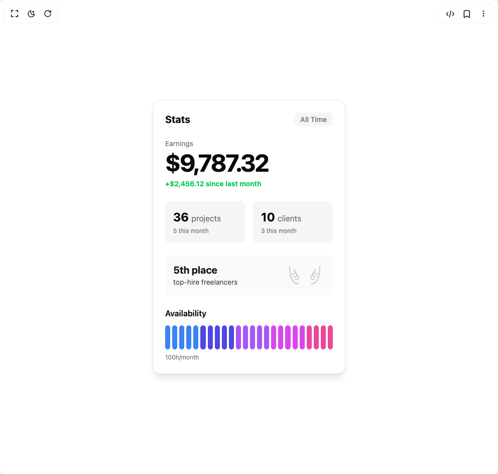

# Build Stats Card in BuilderStudio

> Build this component in our Agentic IDE: [BuilderStudio](https://builderstudio.dev).
>
> Join the BuilderStudio community on [Discord](https://discord.gg/QdWeSGCqfe) and [Reddit](https://reddit.com/r/builderstudio).



## Component

- Author group: `ravikatiyar`
- Component: `stats-card`
- Variant: `default`
- Rendered HTML snapshot: [`rendered.html`](rendered.html)

## BuilderStudio prompt

You are implementing a React component based on a component reference.

## Component identity

- Author: ravikatiyar
- Component slug: stats-card
- Demo slug: default
- Title: stats-card
- Description: 

## Goal

Recreate this component in a React + TypeScript + Tailwind CSS project. Preserve the visual layout, spacing, colors, border radius, shadows, interaction behavior, animation behavior, responsive behavior, and dark mode behavior shown in the rendered demo.

## Implementation requirements

- Use React and TypeScript.
- Use Tailwind CSS classes whenever possible.
- Keep the component self-contained unless the source files require helper components.
- If the source uses CSS variables, custom CSS, animations, or keyframes, include them.
- If the source uses external packages, list and use the required packages.
- Preserve accessibility attributes, button semantics, links, keyboard behavior, and ARIA attributes when visible in the source.
- Do not replace the component with a simplified placeholder.
- Return complete production-ready code.

## Dependencies

No reference metadata available.

## Rendered DOM snapshot

This is the rendered demo HTML extracted from the live preview. Use it to verify structure, class names, visible content, and layout.

```html
<div id="root"><div class="w-screen min-h-screen flex justify-center items-center"><div class="w-screen min-h-screen flex justify-center items-center"><div class="flex min-h-screen w-full items-center justify-center bg-background p-4"><div class="w-full max-w-sm rounded-2xl bg-card text-card-foreground p-6 shadow-lg font-sans flex flex-col gap-6 border" aria-labelledby="stats-card-title"><header class="flex justify-between items-center"><h2 id="stats-card-title" class="text-xl font-bold">Stats</h2><div class="text-sm font-medium px-3 py-1 rounded-md bg-muted text-muted-foreground">All Time</div></header><section aria-label="Earnings"><p class="text-sm text-muted-foreground">Earnings</p><h3 class="text-5xl font-bold tracking-tighter mt-1">$9,787.32</h3><p class="text-sm font-semibold mt-2 text-green-500">+$2,456.12 since last month</p></section><section class="grid grid-cols-2 gap-4" aria-label="Projects and Clients"><div class="bg-muted rounded-lg p-4"><p class="text-2xl font-bold">36 <span class="text-base font-normal text-muted-foreground">projects</span></p><p class="text-xs text-muted-foreground mt-1">5 this month</p></div><div class="bg-muted rounded-lg p-4"><p class="text-2xl font-bold">10 <span class="text-base font-normal text-muted-foreground">clients</span></p><p class="text-xs text-muted-foreground mt-1">3 this month</p></div></section><section class="flex items-center justify-between bg-primary-foreground text-primary p-4 rounded-lg" aria-label="Ranking: 5th place"><div><h4 class="text-xl font-bold">5th place</h4><p class="text-sm text-primary/80">top-hire freelancers</p></div><div aria-hidden="true"><svg width="80" height="36" viewBox="0 0 80 36" fill="none" xmlns="http://www.w3.org/2000/svg" class="opacity-20" aria-hidden="true"><path d="M26.6667 35C20 35 15.3333 30.8333 12.6667 22.3333C10 13.8333 10 1 10 1M53.3333 35C60 35 64.6667 30.8333 67.3333 22.3333C70 13.8333 70 1 70 1" stroke="currentColor" stroke-width="2" stroke-linecap="round" stroke-linejoin="round"></path><path d="M18 6.83331C19.1667 7.49998 22.3 9.7 20.5 13.5C18.7 17.3 14.8333 15.6666 14 15" stroke="currentColor" stroke-width="2" stroke-linecap="round" stroke-linejoin="round"></path><path d="M21.3333 12.3333C22.5 13 25.6333 15.2 23.8333 19C22.0333 22.8 18.1667 21.1666 17.3333 20.5" stroke="currentColor" stroke-width="2" stroke-linecap="round" stroke-linejoin="round"></path><path d="M24.6667 17.8333C25.8333 18.5 28.9667 20.7 27.1667 24.5C25.3667 28.3 21.5 26.6666 20.6667 26" stroke="currentColor" stroke-width="2" stroke-linecap="round" stroke-linejoin="round"></path><path d="M62 6.83331C60.8333 7.49998 57.7 9.7 59.5 13.5C61.3 17.3 65.1667 15.6666 66 15" stroke="currentColor" stroke-width="2" stroke-linecap="round" stroke-linejoin="round"></path><path d="M58.6667 12.3333C57.5 13 54.3667 15.2 56.1667 19C57.9667 22.8 61.8333 21.1666 62.6667 20.5" stroke="currentColor" stroke-width="2" stroke-linecap="round" stroke-linejoin="round"></path><path d="M55.3333 17.8333C54.1667 18.5 51.0333 20.7 52.8333 24.5C54.6333 28.3 58.5 26.6666 59.3333 26" stroke="currentColor" stroke-width="2" stroke-linecap="round" stroke-linejoin="round"></path></svg></div></section><section aria-labelledby="availability-title"><h4 id="availability-title" class="text-md font-semibold">Availability</h4><div class="flex items-end gap-1 h-12 mt-3" aria-label="Availability chart" style="opacity: 1;"><div class="w-full h-full rounded-sm flex items-end" style="background-color: transparent;"><div class="w-full rounded-sm" style="height: 100%; background-color: rgb(59, 130, 246); opacity: 1;"></div></div><div class="w-full h-full rounded-sm flex items-end" style="background-color: transparent;"><div class="w-full rounded-sm" style="height: 100%; background-color: rgb(59, 130, 246); opacity: 1;"></div></div><div class="w-full h-full rounded-sm flex items-end" style="background-color: transparent;"><div class="w-full rounded-sm" style="height: 100%; background-color: rgb(59, 130, 246); opacity: 1;"></div></div><div class="w-full h-full rounded-sm flex items-end" style="background-color: transparent;"><div class="w-full rounded-sm" style="height: 100%; background-color: rgb(59, 130, 246); opacity: 1;"></div></div><div class="w-full h-full rounded-sm flex items-end" style="background-color: transparent;"><div class="w-full rounded-sm" style="height: 100%; background-color: rgb(59, 130, 246); opacity: 1;"></div></div><div class="w-full h-full rounded-sm flex items-end" style="background-color: transparent;"><div class="w-full rounded-sm" style="height: 100%; background-color: rgb(79, 70, 229); opacity: 1;"></div></div><div class="w-full h-full rounded-sm flex items-end" style="background-color: transparent;"><div class="w-full rounded-sm" style="height: 100%; background-color: rgb(79, 70, 229); opacity: 1;"></div></div><div class="w-full h-full rounded-sm flex items-end" style="background-color: transparent;"><div class="w-full rounded-sm" style="height: 100%; background-color: rgb(79, 70, 229); opacity: 1;"></div></div><div class="w-full h-full rounded-sm flex items-end" style="background-color: transparent;"><div class="w-full rounded-sm" style="height: 100%; background-color: rgb(79, 70, 229); opacity: 1;"></div></div><div class="w-full h-full rounded-sm flex items-end" style="background-color: transparent;"><div class="w-full rounded-sm" style="height: 100%; background-color: rgb(79, 70, 229); opacity: 1;"></div></div><div class="w-full h-full rounded-sm flex items-end" style="background-color: transparent;"><div class="w-full rounded-sm" style="height: 100%; background-color: rgb(168, 85, 247); opacity: 1;"></div></div><div class="w-full h-full rounded-sm flex items-end" style="background-color: transparent;"><div class="w-full rounded-sm" style="height: 100%; background-color: rgb(168, 85, 247); opacity: 1;"></div></div><div class="w-full h-full rounded-sm flex items-end" style="background-color: transparent;"><div class="w-full rounded-sm" style="height: 100%; background-color: rgb(168, 85, 247); opacity: 1;"></div></div><div class="w-full h-full rounded-sm flex items-end" style="background-color: transparent;"><div class="w-full rounded-sm" style="height: 100%; background-color: rgb(168, 85, 247); opacity: 1;"></div></div><div class="w-full h-full rounded-sm flex items-end" style="background-color: transparent;"><div class="w-full rounded-sm" style="height: 100%; background-color: rgb(168, 85, 247); opacity: 1;"></div></div><div class="w-full h-full rounded-sm flex items-end" style="background-color: transparent;"><div class="w-full rounded-sm" style="height: 100%; background-color: rgb(217, 70, 239); opacity: 1;"></div></div><div class="w-full h-full rounded-sm flex items-end" style="background-color: transparent;"><div class="w-full rounded-sm" style="height: 100%; background-color: rgb(217, 70, 239); opacity: 1;"></div></div><div class="w-full h-full rounded-sm flex items-end" style="background-color: transparent;"><div class="w-full rounded-sm" style="height: 100%; background-color: rgb(217, 70, 239); opacity: 1;"></div></div><div class="w-full h-full rounded-sm flex items-end" style="background-color: transparent;"><div class="w-full rounded-sm" style="height: 100%; background-color: rgb(217, 70, 239); opacity: 1;"></div></div><div class="w-full h-full rounded-sm flex items-end" style="background-color: transparent;"><div class="w-full rounded-sm" style="height: 100%; background-color: rgb(217, 70, 239); opacity: 1;"></div></div><div class="w-full h-full rounded-sm flex items-end" style="background-color: transparent;"><div class="w-full rounded-sm" style="height: 100%; background-color: rgb(236, 72, 153); opacity: 1;"></div></div><div class="w-full h-full rounded-sm flex items-end" style="background-color: transparent;"><div class="w-full rounded-sm" style="height: 100%; background-color: rgb(236, 72, 153); opacity: 1;"></div></div><div class="w-full h-full rounded-sm flex items-end" style="background-color: transparent;"><div class="w-full rounded-sm" style="height: 100%; background-color: rgb(236, 72, 153); opacity: 1;"></div></div><div class="w-full h-full rounded-sm flex items-end" style="background-color: transparent;"><div class="w-full rounded-sm" style="height: 100%; background-color: rgb(236, 72, 153); opacity: 1;"></div></div></div><p class="text-xs text-muted-foreground mt-2">100h/month</p></section></div></div></div></div></div>
```

## Reference source files

No reference source files were available.
