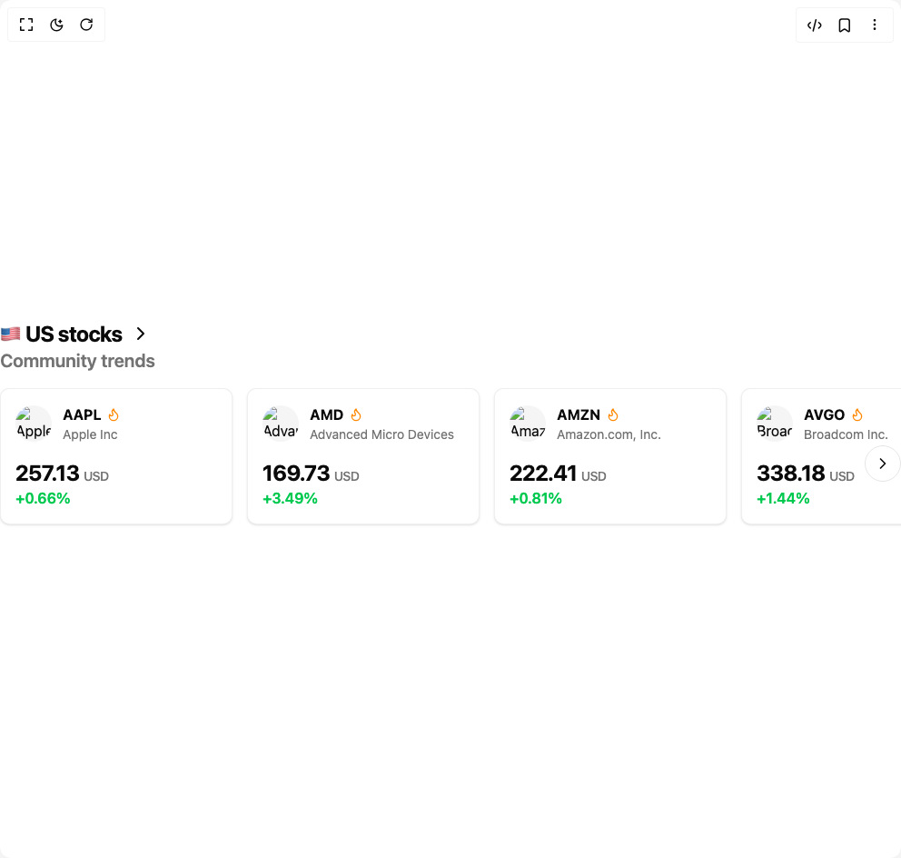

# Build Stock Trends Carousel in BuilderStudio

> Build this component in our Agentic IDE: [BuilderStudio](https://builderstudio.dev).
>
> Join the BuilderStudio community on [Discord](https://discord.gg/QdWeSGCqfe) and [Reddit](https://reddit.com/r/builderstudio).



## Component

- Author group: `ravikatiyar`
- Component: `stock-trends-carousel`
- Variant: `default`
- Rendered HTML snapshot: [`rendered.html`](rendered.html)

## BuilderStudio prompt

You are implementing a React component based on a component reference.

## Component identity

- Author: ravikatiyar
- Component slug: stock-trends-carousel
- Demo slug: default
- Title: stock-trends-carousel
- Description: 

## Goal

Recreate this component in a React + TypeScript + Tailwind CSS project. Preserve the visual layout, spacing, colors, border radius, shadows, interaction behavior, animation behavior, responsive behavior, and dark mode behavior shown in the rendered demo.

## Implementation requirements

- Use React and TypeScript.
- Use Tailwind CSS classes whenever possible.
- Keep the component self-contained unless the source files require helper components.
- If the source uses CSS variables, custom CSS, animations, or keyframes, include them.
- If the source uses external packages, list and use the required packages.
- Preserve accessibility attributes, button semantics, links, keyboard behavior, and ARIA attributes when visible in the source.
- Do not replace the component with a simplified placeholder.
- Return complete production-ready code.

## Dependencies

No reference metadata available.

## Rendered DOM snapshot

This is the rendered demo HTML extracted from the live preview. Use it to verify structure, class names, visible content, and layout.

```html
<div id="root"><div class="w-screen min-h-screen flex justify-center items-center"><div class="w-screen min-h-screen flex justify-center items-center"><div class="w-full bg-background flex items-center justify-center py-12"><section class="w-full max-w-6xl mx-auto space-y-4"><div class="px-4 md:px-0"><div class="flex items-center gap-2 text-2xl font-bold tracking-tight text-foreground">🇺🇸 US stocks <svg xmlns="http://www.w3.org/2000/svg" width="24" height="24" viewBox="0 0 24 24" fill="none" stroke="currentColor" stroke-width="2" stroke-linecap="round" stroke-linejoin="round" class="lucide lucide-chevron-right h-6 w-6" aria-hidden="true"><path d="m9 18 6-6-6-6"></path></svg></div><h3 class="text-xl font-semibold text-muted-foreground">Community trends</h3></div><div class="relative"><div class="flex w-full space-x-4 overflow-x-auto pb-4 px-4 md:px-0 scrollbar-hide" style="opacity: 1;"><div class="flex-shrink-0" style="opacity: 1; transform: none;"><div class="rounded-lg border bg-card text-card-foreground shadow-sm w-64 p-4 h-full flex flex-col justify-between border-border/60 hover:border-border transition-colors duration-300"><div><div class="flex items-center gap-3 mb-4"><div><div class="flex items-center gap-1.5"><p class="font-bold text-foreground">AAPL</p><svg xmlns="http://www.w3.org/2000/svg" width="24" height="24" viewBox="0 0 24 24" fill="none" stroke="currentColor" stroke-width="2" stroke-linecap="round" stroke-linejoin="round" class="lucide lucide-flame h-4 w-4 text-orange-400" aria-hidden="true"><path d="M8.5 14.5A2.5 2.5 0 0 0 11 12c0-1.38-.5-2-1-3-1.072-2.143-.224-4.054 2-6 .5 2.5 2 4.9 4 6.5 2 1.6 3 3.5 3 5.5a7 7 0 1 1-14 0c0-1.153.433-2.294 1-3a2.5 2.5 0 0 0 2.5 2.5z"></path></svg></div><p class="text-sm text-muted-foreground truncate">Apple Inc</p></div></div></div><div><p class="text-2xl font-bold tracking-tight text-foreground">257.13 <span class="text-sm font-medium text-muted-foreground">USD</span></p><p class="font-semibold text-green-500">+0.66%</p></div></div></div><div class="flex-shrink-0" style="opacity: 1; transform: none;"><div class="rounded-lg border bg-card text-card-foreground shadow-sm w-64 p-4 h-full flex flex-col justify-between border-border/60 hover:border-border transition-colors duration-300"><div><div class="flex items-center gap-3 mb-4"><div><div class="flex items-center gap-1.5"><p class="font-bold text-foreground">AMD</p><svg xmlns="http://www.w3.org/2000/svg" width="24" height="24" viewBox="0 0 24 24" fill="none" stroke="currentColor" stroke-width="2" stroke-linecap="round" stroke-linejoin="round" class="lucide lucide-flame h-4 w-4 text-orange-400" aria-hidden="true"><path d="M8.5 14.5A2.5 2.5 0 0 0 11 12c0-1.38-.5-2-1-3-1.072-2.143-.224-4.054 2-6 .5 2.5 2 4.9 4 6.5 2 1.6 3 3.5 3 5.5a7 7 0 1 1-14 0c0-1.153.433-2.294 1-3a2.5 2.5 0 0 0 2.5 2.5z"></path></svg></div><p class="text-sm text-muted-foreground truncate">Advanced Micro Devices</p></div></div></div><div><p class="text-2xl font-bold tracking-tight text-foreground">169.73 <span class="text-sm font-medium text-muted-foreground">USD</span></p><p class="font-semibold text-green-500">+3.49%</p></div></div></div><div class="flex-shrink-0" style="opacity: 1; transform: none;"><div class="rounded-lg border bg-card text-card-foreground shadow-sm w-64 p-4 h-full flex flex-col justify-between border-border/60 hover:border-border transition-colors duration-300"><div><div class="flex items-center gap-3 mb-4"><div><div class="flex items-center gap-1.5"><p class="font-bold text-foreground">AMZN</p><svg xmlns="http://www.w3.org/2000/svg" width="24" height="24" viewBox="0 0 24 24" fill="none" stroke="currentColor" stroke-width="2" stroke-linecap="round" stroke-linejoin="round" class="lucide lucide-flame h-4 w-4 text-orange-400" aria-hidden="true"><path d="M8.5 14.5A2.5 2.5 0 0 0 11 12c0-1.38-.5-2-1-3-1.072-2.143-.224-4.054 2-6 .5 2.5 2 4.9 4 6.5 2 1.6 3 3.5 3 5.5a7 7 0 1 1-14 0c0-1.153.433-2.294 1-3a2.5 2.5 0 0 0 2.5 2.5z"></path></svg></div><p class="text-sm text-muted-foreground truncate">Amazon.com, Inc.</p></div></div></div><div><p class="text-2xl font-bold tracking-tight text-foreground">222.41 <span class="text-sm font-medium text-muted-foreground">USD</span></p><p class="font-semibold text-green-500">+0.81%</p></div></div></div><div class="flex-shrink-0" style="opacity: 1; transform: none;"><div class="rounded-lg border bg-card text-card-foreground shadow-sm w-64 p-4 h-full flex flex-col justify-between border-border/60 hover:border-border transition-colors duration-300"><div><div class="flex items-center gap-3 mb-4"><div><div class="flex items-center gap-1.5"><p class="font-bold text-foreground">AVGO</p><svg xmlns="http://www.w3.org/2000/svg" width="24" height="24" viewBox="0 0 24 24" fill="none" stroke="currentColor" stroke-width="2" stroke-linecap="round" stroke-linejoin="round" class="lucide lucide-flame h-4 w-4 text-orange-400" aria-hidden="true"><path d="M8.5 14.5A2.5 2.5 0 0 0 11 12c0-1.38-.5-2-1-3-1.072-2.143-.224-4.054 2-6 .5 2.5 2 4.9 4 6.5 2 1.6 3 3.5 3 5.5a7 7 0 1 1-14 0c0-1.153.433-2.294 1-3a2.5 2.5 0 0 0 2.5 2.5z"></path></svg></div><p class="text-sm text-muted-foreground truncate">Broadcom Inc.</p></div></div></div><div><p class="text-2xl font-bold tracking-tight text-foreground">338.18 <span class="text-sm font-medium text-muted-foreground">USD</span></p><p class="font-semibold text-green-500">+1.44%</p></div></div></div><div class="flex-shrink-0" style="opacity: 1; transform: none;"><div class="rounded-lg border bg-card text-card-foreground shadow-sm w-64 p-4 h-full flex flex-col justify-between border-border/60 hover:border-border transition-colors duration-300"><div><div class="flex items-center gap-3 mb-4"><div><div class="flex items-center gap-1.5"><p class="font-bold text-foreground">BABA</p><svg xmlns="http://www.w3.org/2000/svg" width="24" height="24" viewBox="0 0 24 24" fill="none" stroke="currentColor" stroke-width="2" stroke-linecap="round" stroke-linejoin="round" class="lucide lucide-flame h-4 w-4 text-orange-400" aria-hidden="true"><path d="M8.5 14.5A2.5 2.5 0 0 0 11 12c0-1.38-.5-2-1-3-1.072-2.143-.224-4.054 2-6 .5 2.5 2 4.9 4 6.5 2 1.6 3 3.5 3 5.5a7 7 0 1 1-14 0c0-1.153.433-2.294 1-3a2.5 2.5 0 0 0 2.5 2.5z"></path></svg></div><p class="text-sm text-muted-foreground truncate">Alibaba Group Holdings</p></div></div></div><div><p class="text-2xl font-bold tracking-tight text-foreground">189.34 <span class="text-sm font-medium text-muted-foreground">USD</span></p><p class="font-semibold text-green-500">+3.59%</p></div></div></div><div class="flex-shrink-0" style="opacity: 1; transform: none;"><div class="rounded-lg border bg-card text-card-foreground shadow-sm w-64 p-4 h-full flex flex-col justify-between border-border/60 hover:border-border transition-colors duration-300"><div><div class="flex items-center gap-3 mb-4"><div><div class="flex items-center gap-1.5"><p class="font-bold text-foreground">TSLA</p><svg xmlns="http://www.w3.org/2000/svg" width="24" height="24" viewBox="0 0 24 24" fill="none" stroke="currentColor" stroke-width="2" stroke-linecap="round" stroke-linejoin="round" class="lucide lucide-flame h-4 w-4 text-orange-400" aria-hidden="true"><path d="M8.5 14.5A2.5 2.5 0 0 0 11 12c0-1.38-.5-2-1-3-1.072-2.143-.224-4.054 2-6 .5 2.5 2 4.9 4 6.5 2 1.6 3 3.5 3 5.5a7 7 0 1 1-14 0c0-1.153.433-2.294 1-3a2.5 2.5 0 0 0 2.5 2.5z"></path></svg></div><p class="text-sm text-muted-foreground truncate">Tesla, Inc.</p></div></div></div><div><p class="text-2xl font-bold tracking-tight text-foreground">177.46 <span class="text-sm font-medium text-muted-foreground">USD</span></p><p class="font-semibold text-red-500">-1.21%</p></div></div></div><div class="flex-shrink-0" style="opacity: 1; transform: none;"><div class="rounded-lg border bg-card text-card-foreground shadow-sm w-64 p-4 h-full flex flex-col justify-between border-border/60 hover:border-border transition-colors duration-300"><div><div class="flex items-center gap-3 mb-4"><div><div class="flex items-center gap-1.5"><p class="font-bold text-foreground">GOOGL</p><svg xmlns="http://www.w3.org/2000/svg" width="24" height="24" viewBox="0 0 24 24" fill="none" stroke="currentColor" stroke-width="2" stroke-linecap="round" stroke-linejoin="round" class="lucide lucide-flame h-4 w-4 text-orange-400" aria-hidden="true"><path d="M8.5 14.5A2.5 2.5 0 0 0 11 12c0-1.38-.5-2-1-3-1.072-2.143-.224-4.054 2-6 .5 2.5 2 4.9 4 6.5 2 1.6 3 3.5 3 5.5a7 7 0 1 1-14 0c0-1.153.433-2.294 1-3a2.5 2.5 0 0 0 2.5 2.5z"></path></svg></div><p class="text-sm text-muted-foreground truncate">Alphabet Inc.</p></div></div></div><div><p class="text-2xl font-bold tracking-tight text-foreground">176.03 <span class="text-sm font-medium text-muted-foreground">USD</span></p><p class="font-semibold text-green-500">+0.92%</p></div></div></div></div><div class="absolute right-0 top-1/2 -translate-y-1/2 hidden md:block"><button class="inline-flex items-center justify-center whitespace-nowrap text-sm font-medium ring-offset-background transition-colors focus-visible:outline-none focus-visible:ring-2 focus-visible:ring-ring focus-visible:ring-offset-2 disabled:pointer-events-none disabled:opacity-50 border border-input hover:bg-accent hover:text-accent-foreground rounded-full h-10 w-10 bg-background/80 backdrop-blur-sm" aria-label="Scroll right"><svg xmlns="http://www.w3.org/2000/svg" width="24" height="24" viewBox="0 0 24 24" fill="none" stroke="currentColor" stroke-width="2" stroke-linecap="round" stroke-linejoin="round" class="lucide lucide-chevron-right h-5 w-5" aria-hidden="true"><path d="m9 18 6-6-6-6"></path></svg></button></div></div></section></div></div></div></div>
```

## Reference source files

No reference source files were available.
