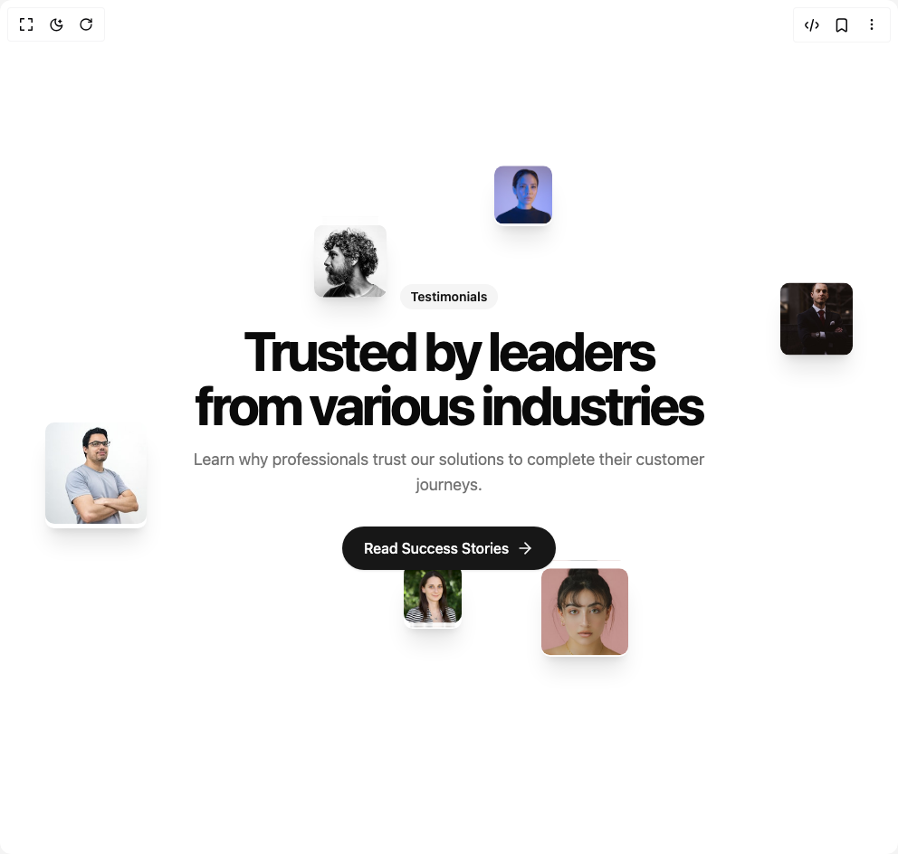

# Build Testimonial 2 in BuilderStudio

> Build this component in our Agentic IDE: [BuilderStudio](https://builderstudio.dev).
>
> Join the BuilderStudio community on [Discord](https://discord.gg/QdWeSGCqfe) and [Reddit](https://reddit.com/r/builderstudio).



## Component

- Author group: `ravikatiyar`
- Component: `testimonial-2`
- Variant: `default`
- Rendered HTML snapshot: [`rendered.html`](rendered.html)

## BuilderStudio prompt

You are implementing a React component based on a component reference.

## Component identity

- Author: ravikatiyar
- Component slug: testimonial-2
- Demo slug: default
- Title: testimonial-2
- Description: 

## Goal

Recreate this component in a React + TypeScript + Tailwind CSS project. Preserve the visual layout, spacing, colors, border radius, shadows, interaction behavior, animation behavior, responsive behavior, and dark mode behavior shown in the rendered demo.

## Implementation requirements

- Use React and TypeScript.
- Use Tailwind CSS classes whenever possible.
- Keep the component self-contained unless the source files require helper components.
- If the source uses CSS variables, custom CSS, animations, or keyframes, include them.
- If the source uses external packages, list and use the required packages.
- Preserve accessibility attributes, button semantics, links, keyboard behavior, and ARIA attributes when visible in the source.
- Do not replace the component with a simplified placeholder.
- Return complete production-ready code.

## Dependencies

No reference metadata available.

## Rendered DOM snapshot

This is the rendered demo HTML extracted from the live preview. Use it to verify structure, class names, visible content, and layout.

```html
<div id="root"><div class="w-screen min-h-screen flex justify-center items-center"><div class="w-screen min-h-screen flex justify-center items-center"><div class="w-full bg-background"><section class="relative w-full max-w-7xl mx-auto py-32 sm:py-40 px-4"><div class="absolute rounded-lg shadow-xl hidden lg:block w-24 h-24" style="top: 5%; left: 15%; opacity: 1; transform: none;"></div><div class="absolute rounded-lg shadow-xl hidden md:block w-20 h-20" style="top: 15%; left: 35%; opacity: 1; transform: none;"></div><div class="absolute rounded-lg shadow-xl hidden md:block w-16 h-16" style="top: 5%; left: 55%; opacity: 1; transform: none;"></div><div class="absolute rounded-lg shadow-xl hidden lg:block w-28 h-28" style="top: 10%; right: 15%; opacity: 1; transform: none;"></div><div class="absolute rounded-lg shadow-xl hidden md:block w-20 h-20" style="top: 25%; right: 5%; opacity: 1; transform: none;"></div><div class="absolute rounded-lg shadow-xl hidden lg:block w-24 h-24" style="top: 45%; right: 10%; opacity: 1; transform: none;"></div><div class="absolute rounded-lg shadow-xl hidden md:block w-28 h-28" style="top: 50%; left: 5%; opacity: 1; transform: none;"></div><div class="absolute rounded-lg shadow-xl hidden lg:block w-20 h-20" style="left: 20%; bottom: 5%; opacity: 1; transform: none;"></div><div class="absolute rounded-lg shadow-xl hidden md:block w-16 h-16" style="left: 45%; bottom: 15%; opacity: 1; transform: none;"></div><div class="absolute rounded-lg shadow-xl hidden md:block w-24 h-24" style="right: 30%; bottom: 10%; opacity: 1; transform: none;"></div><div class="absolute rounded-lg shadow-xl hidden lg:block w-20 h-20" style="right: 15%; bottom: 2%; opacity: 1; transform: none;"></div><div class="absolute rounded-lg shadow-xl block md:hidden w-16 h-16" style="top: 10%; left: 5%; opacity: 1; transform: none;"></div><div class="relative z-10 flex flex-col items-center text-center"><div class="mb-4 inline-block rounded-full bg-secondary px-3 py-1 text-sm font-semibold text-secondary-foreground">Testimonials</div><h1 class="text-4xl md:text-6xl font-bold tracking-tighter text-foreground mb-4 max-w-3xl">Trusted by leaders<br>from various industries</h1><p class="max-w-xl text-lg text-muted-foreground mb-8">Learn why professionals trust our solutions to complete their customer journeys.</p><a href="#" class="inline-flex items-center justify-center rounded-full bg-primary px-6 py-3 text-base font-medium text-primary-foreground shadow-sm transition-colors hover:bg-primary/90 focus:outline-none focus:ring-2 focus:ring-ring focus:ring-offset-2">Read Success Stories<svg xmlns="http://www.w3.org/2000/svg" width="24" height="24" viewBox="0 0 24 24" fill="none" stroke="currentColor" stroke-width="2" stroke-linecap="round" stroke-linejoin="round" class="lucide lucide-arrow-right ml-2 h-5 w-5" aria-hidden="true"><path d="M5 12h14"></path><path d="m12 5 7 7-7 7"></path></svg></a></div></section></div></div></div></div>
```

## Reference source files

No reference source files were available.
