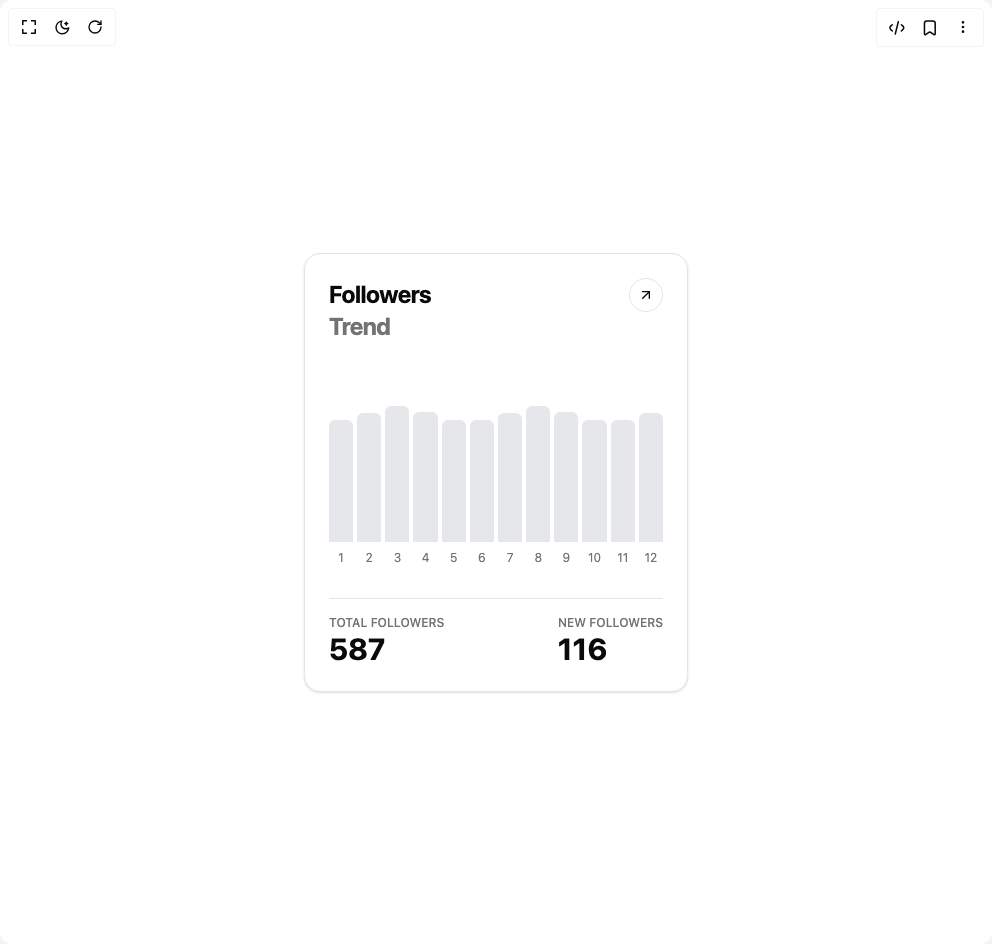

# Build Trend Card in BuilderStudio

> Build this component in our Agentic IDE: [BuilderStudio](https://builderstudio.dev).
>
> Join the BuilderStudio community on [Discord](https://discord.gg/QdWeSGCqfe) and [Reddit](https://reddit.com/r/builderstudio).



## Component

- Author group: `ravikatiyar`
- Component: `trend-card`
- Variant: `default`
- Rendered HTML snapshot: [`rendered.html`](rendered.html)

## BuilderStudio prompt

You are implementing a React component based on a component reference.

## Component identity

- Author: ravikatiyar
- Component slug: trend-card
- Demo slug: default
- Title: trend-card
- Description: 

## Goal

Recreate this component in a React + TypeScript + Tailwind CSS project. Preserve the visual layout, spacing, colors, border radius, shadows, interaction behavior, animation behavior, responsive behavior, and dark mode behavior shown in the rendered demo.

## Implementation requirements

- Use React and TypeScript.
- Use Tailwind CSS classes whenever possible.
- Keep the component self-contained unless the source files require helper components.
- If the source uses CSS variables, custom CSS, animations, or keyframes, include them.
- If the source uses external packages, list and use the required packages.
- Preserve accessibility attributes, button semantics, links, keyboard behavior, and ARIA attributes when visible in the source.
- Do not replace the component with a simplified placeholder.
- Return complete production-ready code.

## Dependencies

No reference metadata available.

## Rendered DOM snapshot

This is the rendered demo HTML extracted from the live preview. Use it to verify structure, class names, visible content, and layout.

```html
<div id="root"><div class="w-screen min-h-screen flex justify-center items-center"><div class="w-screen min-h-screen flex justify-center items-center"><div class="flex h-screen w-full items-center justify-center bg-background p-4"><div class="w-full max-w-sm rounded-2xl border bg-card p-6 text-card-foreground shadow-sm"><div class="flex items-start justify-between"><div><h2 class="text-2xl font-bold tracking-tight">Followers</h2><p class="text-2xl font-bold tracking-tight text-muted-foreground">Trend</p></div><button class="rounded-full border bg-background p-2 transition-colors hover:bg-muted"><svg xmlns="http://www.w3.org/2000/svg" width="24" height="24" viewBox="0 0 24 24" fill="none" stroke="currentColor" stroke-width="2" stroke-linecap="round" stroke-linejoin="round" class="lucide lucide-arrow-up-right h-4 w-4" aria-hidden="true"><path d="M7 7h10v10"></path><path d="M7 17 17 7"></path></svg></button></div><div class="relative mt-16 h-40" role="figure" aria-label="Followers trend chart showing data for 12 months."><div class="flex h-full w-full items-end justify-between gap-1"><div class="flex h-full flex-1 flex-col items-center justify-end"><div class="group relative h-full w-full flex items-end" aria-label="1: 520 followers" role="img"><div class="w-full rounded-t-sm" style="height: 89.6552%; background-color: rgb(229, 231, 235);"></div></div><span class="mt-2 text-xs text-muted-foreground">1</span></div><div class="flex h-full flex-1 flex-col items-center justify-end"><div class="group relative h-full w-full flex items-end" aria-label="2: 550 followers" role="img"><div class="w-full rounded-t-sm" style="height: 94.8276%; background-color: rgb(229, 231, 235);"></div></div><span class="mt-2 text-xs text-muted-foreground">2</span></div><div class="flex h-full flex-1 flex-col items-center justify-end"><div class="group relative h-full w-full flex items-end" aria-label="3: 580 followers" role="img"><div class="w-full rounded-t-sm" style="height: 100%; background-color: rgb(229, 231, 235);"></div></div><span class="mt-2 text-xs text-muted-foreground">3</span></div><div class="flex h-full flex-1 flex-col items-center justify-end"><div class="group relative h-full w-full flex items-end" aria-label="4: 553 followers" role="img"><div class="w-full rounded-t-sm" style="height: 95.3448%; background-color: rgb(229, 231, 235);"></div></div><span class="mt-2 text-xs text-muted-foreground">4</span></div><div class="flex h-full flex-1 flex-col items-center justify-end"><div class="group relative h-full w-full flex items-end" aria-label="5: 520 followers" role="img"><div class="w-full rounded-t-sm" style="height: 89.6552%; background-color: rgb(229, 231, 235);"></div></div><span class="mt-2 text-xs text-muted-foreground">5</span></div><div class="flex h-full flex-1 flex-col items-center justify-end"><div class="group relative h-full w-full flex items-end" aria-label="6: 520 followers" role="img"><div class="w-full rounded-t-sm" style="height: 89.6552%; background-color: rgb(229, 231, 235);"></div></div><span class="mt-2 text-xs text-muted-foreground">6</span></div><div class="flex h-full flex-1 flex-col items-center justify-end"><div class="group relative h-full w-full flex items-end" aria-label="7: 550 followers" role="img"><div class="w-full rounded-t-sm" style="height: 94.8276%; background-color: rgb(229, 231, 235);"></div></div><span class="mt-2 text-xs text-muted-foreground">7</span></div><div class="flex h-full flex-1 flex-col items-center justify-end"><div class="group relative h-full w-full flex items-end" aria-label="8: 580 followers" role="img"><div class="w-full rounded-t-sm" style="height: 100%; background-color: rgb(229, 231, 235);"></div></div><span class="mt-2 text-xs text-muted-foreground">8</span></div><div class="flex h-full flex-1 flex-col items-center justify-end"><div class="group relative h-full w-full flex items-end" aria-label="9: 553 followers" role="img"><div class="w-full rounded-t-sm" style="height: 95.3448%; background-color: rgb(229, 231, 235);"></div></div><span class="mt-2 text-xs text-muted-foreground">9</span></div><div class="flex h-full flex-1 flex-col items-center justify-end"><div class="group relative h-full w-full flex items-end" aria-label="10: 520 followers" role="img"><div class="w-full rounded-t-sm" style="height: 89.6552%; background-color: rgb(229, 231, 235);"></div></div><span class="mt-2 text-xs text-muted-foreground">10</span></div><div class="flex h-full flex-1 flex-col items-center justify-end"><div class="group relative h-full w-full flex items-end" aria-label="11: 520 followers" role="img"><div class="w-full rounded-t-sm" style="height: 89.6552%; background-color: rgb(229, 231, 235);"></div></div><span class="mt-2 text-xs text-muted-foreground">11</span></div><div class="flex h-full flex-1 flex-col items-center justify-end"><div class="group relative h-full w-full flex items-end" aria-label="12: 550 followers" role="img"><div class="w-full rounded-t-sm" style="height: 94.8276%; background-color: rgb(229, 231, 235);"></div></div><span class="mt-2 text-xs text-muted-foreground">12</span></div></div></div><div class="mt-8 flex justify-between border-t pt-4"><div><p class="text-xs font-medium uppercase text-muted-foreground">Total Followers</p><p class="text-3xl font-bold">587</p></div><div><p class="text-xs font-medium uppercase text-muted-foreground">New Followers</p><p class="text-3xl font-bold">116</p></div></div></div></div></div></div></div>
```

## Reference source files

No reference source files were available.
