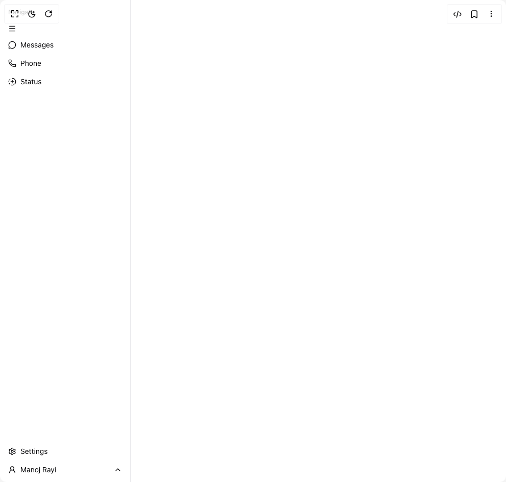

# Build Whatsapp Sidebar in BuilderStudio

> Build this component in our Agentic IDE: [BuilderStudio](https://builderstudio.dev).
>
> Join the BuilderStudio community on [Discord](https://discord.gg/QdWeSGCqfe) and [Reddit](https://reddit.com/r/builderstudio).



## Component

- Author group: `rayimanoj8`
- Component: `whatsapp-sidebar`
- Variant: `default`
- Rendered HTML snapshot: [`rendered.html`](rendered.html)

## BuilderStudio prompt

You are implementing a React component based on a component reference.

## Component identity

- Author: rayimanoj8
- Component slug: whatsapp-sidebar
- Demo slug: default
- Title: whatsapp-sidebar
- Description: 

## Goal

Recreate this component in a React + TypeScript + Tailwind CSS project. Preserve the visual layout, spacing, colors, border radius, shadows, interaction behavior, animation behavior, responsive behavior, and dark mode behavior shown in the rendered demo.

## Implementation requirements

- Use React and TypeScript.
- Use Tailwind CSS classes whenever possible.
- Keep the component self-contained unless the source files require helper components.
- If the source uses CSS variables, custom CSS, animations, or keyframes, include them.
- If the source uses external packages, list and use the required packages.
- Preserve accessibility attributes, button semantics, links, keyboard behavior, and ARIA attributes when visible in the source.
- Do not replace the component with a simplified placeholder.
- Return complete production-ready code.

## Dependencies

No reference metadata available.

## Rendered DOM snapshot

This is the rendered demo HTML extracted from the live preview. Use it to verify structure, class names, visible content, and layout.

```html
<div id="root"><div class="bg-background text-foreground"><div class="w-full"><div class="group/sidebar-wrapper flex min-h-svh w-full has-[[data-variant=inset]]:bg-sidebar" style="--sidebar-width: 16rem; --sidebar-width-icon: 3rem;"><div class="group peer hidden md:block text-sidebar-foreground" data-state="expanded" data-collapsible="" data-variant="float" data-side="left"><div class="duration-200 relative h-svh w-[--sidebar-width] bg-transparent transition-[width] ease-linear group-data-[collapsible=offcanvas]:w-0 group-data-[side=right]:rotate-180 group-data-[collapsible=icon]:w-[--sidebar-width-icon]"></div><div class="duration-200 fixed inset-y-0 z-10 hidden h-svh w-[--sidebar-width] transition-[left,right,width] ease-linear md:flex left-0 group-data-[collapsible=offcanvas]:left-[calc(var(--sidebar-width)*-1)] group-data-[collapsible=icon]:w-[--sidebar-width-icon] group-data-[side=left]:border-r group-data-[side=right]:border-l"><div data-sidebar="sidebar" class="flex h-full w-full flex-col bg-sidebar group-data-[variant=floating]:rounded-lg group-data-[variant=floating]:border group-data-[variant=floating]:border-sidebar-border group-data-[variant=floating]:shadow"><div data-sidebar="content" class="flex min-h-0 flex-1 flex-col gap-2 overflow-auto group-data-[collapsible=icon]:overflow-hidden"><div data-sidebar="group" class="relative flex w-full min-w-0 flex-col p-2"><div data-sidebar="group-label" class="duration-200 flex h-8 shrink-0 items-center rounded-md px-2 text-xs font-medium text-sidebar-foreground/70 outline-none ring-sidebar-ring transition-[margin,opacity] ease-linear focus-visible:ring-2 [&amp;&gt;svg]:size-4 [&amp;&gt;svg]:shrink-0 group-data-[collapsible=icon]:-mt-8 group-data-[collapsible=icon]:opacity-0">Navigate</div><div data-sidebar="group-content" class="w-full text-sm"><ul data-sidebar="menu" class="flex w-full min-w-0 flex-col gap-1"><li data-sidebar="menu-item" class="group/menu-item relative"><span data-sidebar="menu-button" data-size="default" data-active="false" class="peer/menu-button flex w-full items-center gap-2 overflow-hidden rounded-md p-2 text-left outline-none ring-sidebar-ring transition-[width,height,padding] focus-visible:ring-2 active:bg-sidebar-accent active:text-sidebar-accent-foreground disabled:pointer-events-none disabled:opacity-50 group-has-[[data-sidebar=menu-action]]/menu-item:pr-8 aria-disabled:pointer-events-none aria-disabled:opacity-50 data-[active=true]:bg-sidebar-accent data-[active=true]:font-medium data-[active=true]:text-sidebar-accent-foreground data-[state=open]:hover:bg-sidebar-accent data-[state=open]:hover:text-sidebar-accent-foreground group-data-[collapsible=icon]:!size-8 group-data-[collapsible=icon]:!p-2 [&amp;&gt;span:last-child]:truncate [&amp;&gt;svg]:size-4 [&amp;&gt;svg]:shrink-0 hover:bg-sidebar-accent hover:text-sidebar-accent-foreground h-8 text-sm"><svg xmlns="http://www.w3.org/2000/svg" width="24" height="24" viewBox="0 0 24 24" fill="none" stroke="currentColor" stroke-width="2" stroke-linecap="round" stroke-linejoin="round" class="lucide lucide-menu" aria-hidden="true"><path d="M4 5h16"></path><path d="M4 12h16"></path><path d="M4 19h16"></path></svg></span></li></ul><ul data-sidebar="menu" class="flex w-full min-w-0 flex-col gap-1"><li data-sidebar="menu-item" class="group/menu-item relative"><a href="#" data-sidebar="menu-button" data-size="default" data-active="false" class="peer/menu-button flex w-full items-center gap-2 overflow-hidden rounded-md p-2 text-left outline-none ring-sidebar-ring transition-[width,height,padding] focus-visible:ring-2 active:bg-sidebar-accent active:text-sidebar-accent-foreground disabled:pointer-events-none disabled:opacity-50 group-has-[[data-sidebar=menu-action]]/menu-item:pr-8 aria-disabled:pointer-events-none aria-disabled:opacity-50 data-[active=true]:bg-sidebar-accent data-[active=true]:font-medium data-[active=true]:text-sidebar-accent-foreground data-[state=open]:hover:bg-sidebar-accent data-[state=open]:hover:text-sidebar-accent-foreground group-data-[collapsible=icon]:!size-8 group-data-[collapsible=icon]:!p-2 [&amp;&gt;span:last-child]:truncate [&amp;&gt;svg]:size-4 [&amp;&gt;svg]:shrink-0 hover:bg-sidebar-accent hover:text-sidebar-accent-foreground h-8 text-sm"><svg xmlns="http://www.w3.org/2000/svg" width="24" height="24" viewBox="0 0 24 24" fill="none" stroke="currentColor" stroke-width="2" stroke-linecap="round" stroke-linejoin="round" class="lucide lucide-message-circle" aria-hidden="true"><path d="M2.992 16.342a2 2 0 0 1 .094 1.167l-1.065 3.29a1 1 0 0 0 1.236 1.168l3.413-.998a2 2 0 0 1 1.099.092 10 10 0 1 0-4.777-4.719"></path></svg><span>Messages</span></a></li><li data-sidebar="menu-item" class="group/menu-item relative"><a href="#" data-sidebar="menu-button" data-size="default" data-active="false" class="peer/menu-button flex w-full items-center gap-2 overflow-hidden rounded-md p-2 text-left outline-none ring-sidebar-ring transition-[width,height,padding] focus-visible:ring-2 active:bg-sidebar-accent active:text-sidebar-accent-foreground disabled:pointer-events-none disabled:opacity-50 group-has-[[data-sidebar=menu-action]]/menu-item:pr-8 aria-disabled:pointer-events-none aria-disabled:opacity-50 data-[active=true]:bg-sidebar-accent data-[active=true]:font-medium data-[active=true]:text-sidebar-accent-foreground data-[state=open]:hover:bg-sidebar-accent data-[state=open]:hover:text-sidebar-accent-foreground group-data-[collapsible=icon]:!size-8 group-data-[collapsible=icon]:!p-2 [&amp;&gt;span:last-child]:truncate [&amp;&gt;svg]:size-4 [&amp;&gt;svg]:shrink-0 hover:bg-sidebar-accent hover:text-sidebar-accent-foreground h-8 text-sm"><svg xmlns="http://www.w3.org/2000/svg" width="24" height="24" viewBox="0 0 24 24" fill="none" stroke="currentColor" stroke-width="2" stroke-linecap="round" stroke-linejoin="round" class="lucide lucide-phone" aria-hidden="true"><path d="M13.832 16.568a1 1 0 0 0 1.213-.303l.355-.465A2 2 0 0 1 17 15h3a2 2 0 0 1 2 2v3a2 2 0 0 1-2 2A18 18 0 0 1 2 4a2 2 0 0 1 2-2h3a2 2 0 0 1 2 2v3a2 2 0 0 1-.8 1.6l-.468.351a1 1 0 0 0-.292 1.233 14 14 0 0 0 6.392 6.384"></path></svg><span>Phone</span></a></li><li data-sidebar="menu-item" class="group/menu-item relative"><a href="#" data-sidebar="menu-button" data-size="default" data-active="false" class="peer/menu-button flex w-full items-center gap-2 overflow-hidden rounded-md p-2 text-left outline-none ring-sidebar-ring transition-[width,height,padding] focus-visible:ring-2 active:bg-sidebar-accent active:text-sidebar-accent-foreground disabled:pointer-events-none disabled:opacity-50 group-has-[[data-sidebar=menu-action]]/menu-item:pr-8 aria-disabled:pointer-events-none aria-disabled:opacity-50 data-[active=true]:bg-sidebar-accent data-[active=true]:font-medium data-[active=true]:text-sidebar-accent-foreground data-[state=open]:hover:bg-sidebar-accent data-[state=open]:hover:text-sidebar-accent-foreground group-data-[collapsible=icon]:!size-8 group-data-[collapsible=icon]:!p-2 [&amp;&gt;span:last-child]:truncate [&amp;&gt;svg]:size-4 [&amp;&gt;svg]:shrink-0 hover:bg-sidebar-accent hover:text-sidebar-accent-foreground h-8 text-sm"><svg xmlns="http://www.w3.org/2000/svg" width="24" height="24" viewBox="0 0 24 24" fill="none" stroke="currentColor" stroke-width="2" stroke-linecap="round" stroke-linejoin="round" class="lucide lucide-circle-fading-plus" aria-hidden="true"><path d="M12 2a10 10 0 0 1 7.38 16.75"></path><path d="M12 8v8"></path><path d="M16 12H8"></path><path d="M2.5 8.875a10 10 0 0 0-.5 3"></path><path d="M2.83 16a10 10 0 0 0 2.43 3.4"></path><path d="M4.636 5.235a10 10 0 0 1 .891-.857"></path><path d="M8.644 21.42a10 10 0 0 0 7.631-.38"></path></svg><span>Status</span></a></li></ul></div></div></div><div data-sidebar="footer" class="flex flex-col gap-2 p-2"><ul data-sidebar="menu" class="flex w-full min-w-0 flex-col gap-1"><li data-sidebar="menu-item" class="group/menu-item relative"><button data-sidebar="menu-button" data-size="default" data-active="false" class="peer/menu-button flex w-full items-center gap-2 overflow-hidden rounded-md p-2 text-left outline-none ring-sidebar-ring transition-[width,height,padding] focus-visible:ring-2 active:bg-sidebar-accent active:text-sidebar-accent-foreground disabled:pointer-events-none disabled:opacity-50 group-has-[[data-sidebar=menu-action]]/menu-item:pr-8 aria-disabled:pointer-events-none aria-disabled:opacity-50 data-[active=true]:bg-sidebar-accent data-[active=true]:font-medium data-[active=true]:text-sidebar-accent-foreground data-[state=open]:hover:bg-sidebar-accent data-[state=open]:hover:text-sidebar-accent-foreground group-data-[collapsible=icon]:!size-8 group-data-[collapsible=icon]:!p-2 [&amp;&gt;span:last-child]:truncate [&amp;&gt;svg]:size-4 [&amp;&gt;svg]:shrink-0 hover:bg-sidebar-accent hover:text-sidebar-accent-foreground h-8 text-sm"><svg xmlns="http://www.w3.org/2000/svg" width="24" height="24" viewBox="0 0 24 24" fill="none" stroke="currentColor" stroke-width="2" stroke-linecap="round" stroke-linejoin="round" class="lucide lucide-settings" aria-hidden="true"><path d="M9.671 4.136a2.34 2.34 0 0 1 4.659 0 2.34 2.34 0 0 0 3.319 1.915 2.34 2.34 0 0 1 2.33 4.033 2.34 2.34 0 0 0 0 3.831 2.34 2.34 0 0 1-2.33 4.033 2.34 2.34 0 0 0-3.319 1.915 2.34 2.34 0 0 1-4.659 0 2.34 2.34 0 0 0-3.32-1.915 2.34 2.34 0 0 1-2.33-4.033 2.34 2.34 0 0 0 0-3.831A2.34 2.34 0 0 1 6.35 6.051a2.34 2.34 0 0 0 3.319-1.915"></path><circle cx="12" cy="12" r="3"></circle></svg> Settings</button></li><li data-sidebar="menu-item" class="group/menu-item relative"><button data-sidebar="menu-button" data-size="default" data-active="false" class="peer/menu-button flex w-full items-center gap-2 overflow-hidden rounded-md p-2 text-left outline-none ring-sidebar-ring transition-[width,height,padding] focus-visible:ring-2 active:bg-sidebar-accent active:text-sidebar-accent-foreground disabled:pointer-events-none disabled:opacity-50 group-has-[[data-sidebar=menu-action]]/menu-item:pr-8 aria-disabled:pointer-events-none aria-disabled:opacity-50 data-[active=true]:bg-sidebar-accent data-[active=true]:font-medium data-[active=true]:text-sidebar-accent-foreground data-[state=open]:hover:bg-sidebar-accent data-[state=open]:hover:text-sidebar-accent-foreground group-data-[collapsible=icon]:!size-8 group-data-[collapsible=icon]:!p-2 [&amp;&gt;span:last-child]:truncate [&amp;&gt;svg]:size-4 [&amp;&gt;svg]:shrink-0 hover:bg-sidebar-accent hover:text-sidebar-accent-foreground h-8 text-sm" type="button" id="radix-_r_0_" aria-haspopup="menu" aria-expanded="false" data-state="closed"><svg xmlns="http://www.w3.org/2000/svg" width="24" height="24" viewBox="0 0 24 24" fill="none" stroke="currentColor" stroke-width="2" stroke-linecap="round" stroke-linejoin="round" class="lucide lucide-user-round" aria-hidden="true"><circle cx="12" cy="8" r="5"></circle><path d="M20 21a8 8 0 0 0-16 0"></path></svg> Manoj Rayi<svg xmlns="http://www.w3.org/2000/svg" width="24" height="24" viewBox="0 0 24 24" fill="none" stroke="currentColor" stroke-width="2" stroke-linecap="round" stroke-linejoin="round" class="lucide lucide-chevron-up ml-auto" aria-hidden="true"><path d="m18 15-6-6-6 6"></path></svg></button></li></ul></div></div></div></div><main class="relative flex min-h-svh flex-1 flex-col bg-background peer-data-[variant=inset]:min-h-[calc(100svh-theme(spacing.4))] md:peer-data-[variant=inset]:m-2 md:peer-data-[state=collapsed]:peer-data-[variant=inset]:ml-2 md:peer-data-[variant=inset]:ml-0 md:peer-data-[variant=inset]:rounded-xl md:peer-data-[variant=inset]:shadow"></main></div></div></div></div>
```

## Reference source files

No reference source files were available.
