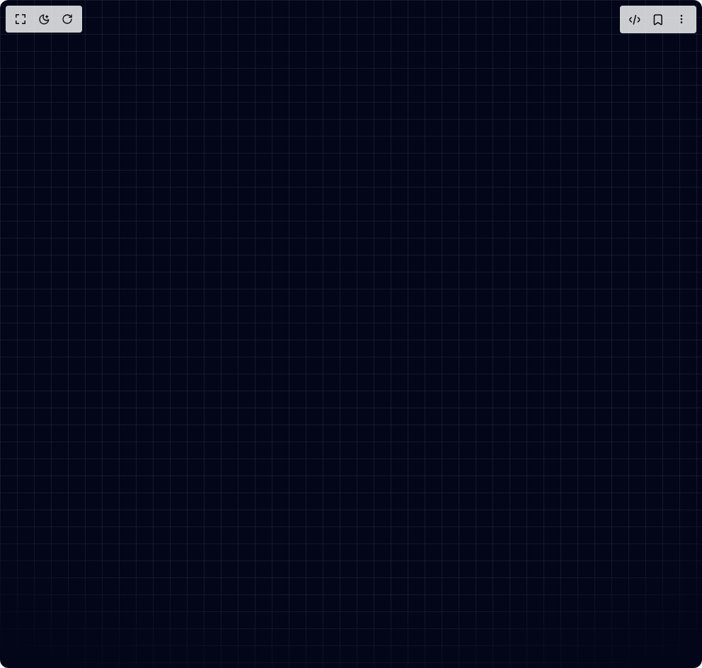

# Build Background Gradient Snippet in BuilderStudio

> Build this component in our Agentic IDE: [BuilderStudio](https://builderstudio.dev).
>
> Join the BuilderStudio community on [Discord](https://discord.gg/QdWeSGCqfe) and [Reddit](https://reddit.com/r/builderstudio).



## Component

- Author group: `reapollo`
- Component: `background-gradient-snippet`
- Variant: `background-grid-masked-slate`
- Rendered HTML snapshot: [`rendered.html`](rendered.html)

## BuilderStudio prompt

You are implementing a React component based on a component reference.

## Component identity

- Author: reapollo
- Component slug: background-gradient-snippet
- Demo slug: background-grid-masked-slate
- Title: background-gradient-snippet
- Description: 

## Goal

Recreate this component in a React + TypeScript + Tailwind CSS project. Preserve the visual layout, spacing, colors, border radius, shadows, interaction behavior, animation behavior, responsive behavior, and dark mode behavior shown in the rendered demo.

## Implementation requirements

- Use React and TypeScript.
- Use Tailwind CSS classes whenever possible.
- Keep the component self-contained unless the source files require helper components.
- If the source uses CSS variables, custom CSS, animations, or keyframes, include them.
- If the source uses external packages, list and use the required packages.
- Preserve accessibility attributes, button semantics, links, keyboard behavior, and ARIA attributes when visible in the source.
- Do not replace the component with a simplified placeholder.
- Return complete production-ready code.

## Dependencies

No reference metadata available.

## Rendered DOM snapshot

This is the rendered demo HTML extracted from the live preview. Use it to verify structure, class names, visible content, and layout.

```html
<div id="root"><div class="w-screen min-h-screen flex justify-center items-center"><div class="w-screen min-h-screen flex justify-center items-center"><div class="fixed inset-0 -z-10 bg-slate-950"><div class="absolute inset-0 bg-[linear-gradient(to_right,#47556940_1px,transparent_1px),linear-gradient(to_bottom,#47556940_1px,transparent_1px)] bg-[size:24px_24px] [mask-image:radial-gradient(ellipse_90%_70%_at_50%_40%,#000_70%,transparent_100%)] [-webkit-mask-image:radial-gradient(ellipse_90%_70%_at_50%_40%,#000_70%,transparent_100%)] [mask-repeat:no-repeat] [-webkit-mask-repeat:no-repeat]"></div></div></div></div></div>
```

## Reference source files

No reference source files were available.
