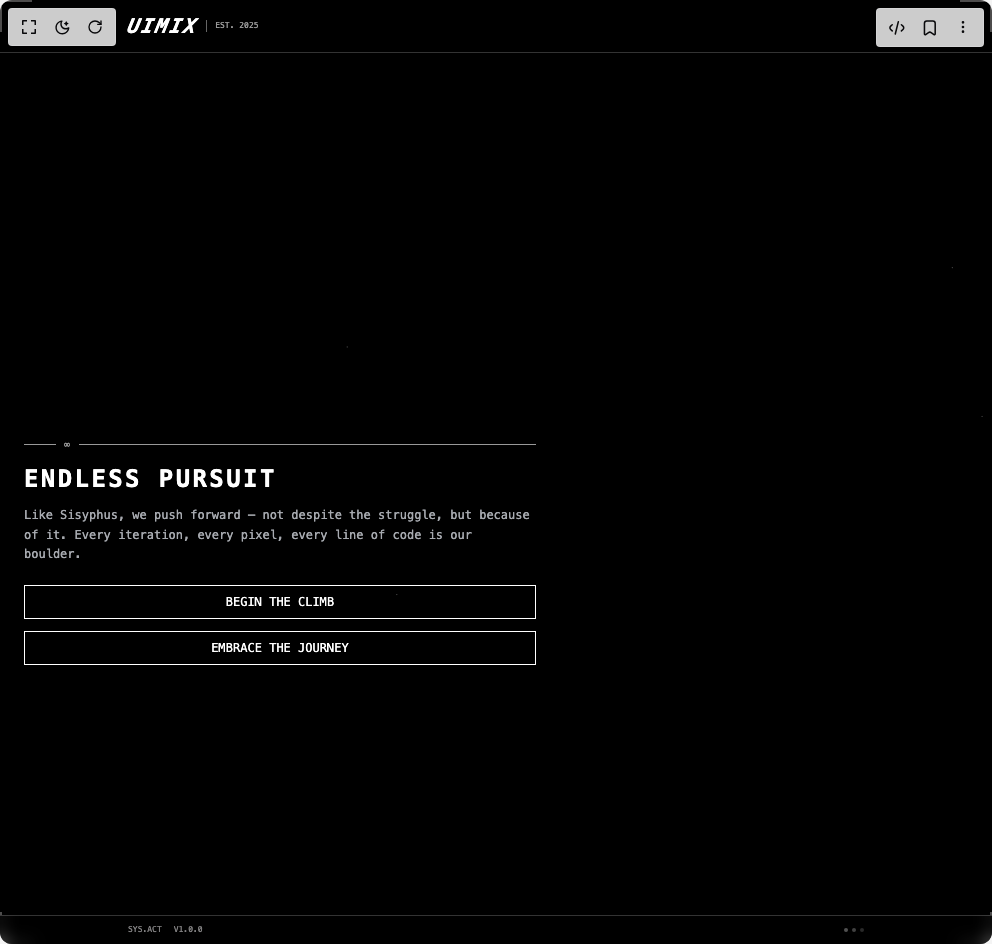

# Build Hero Ascii One in BuilderStudio

> Build this component in our Agentic IDE: [BuilderStudio](https://builderstudio.dev).
>
> Join the BuilderStudio community on [Discord](https://discord.gg/QdWeSGCqfe) and [Reddit](https://reddit.com/r/builderstudio).



## Component

- Author group: `reapollo`
- Component: `hero-ascii-one`
- Variant: `default`
- Rendered HTML snapshot: [`rendered.html`](rendered.html)

## BuilderStudio prompt

You are implementing a React component based on a component reference.

## Component identity

- Author: reapollo
- Component slug: hero-ascii-one
- Demo slug: default
- Title: hero-ascii-one
- Description: 

## Goal

Recreate this component in a React + TypeScript + Tailwind CSS project. Preserve the visual layout, spacing, colors, border radius, shadows, interaction behavior, animation behavior, responsive behavior, and dark mode behavior shown in the rendered demo.

## Implementation requirements

- Use React and TypeScript.
- Use Tailwind CSS classes whenever possible.
- Keep the component self-contained unless the source files require helper components.
- If the source uses CSS variables, custom CSS, animations, or keyframes, include them.
- If the source uses external packages, list and use the required packages.
- Preserve accessibility attributes, button semantics, links, keyboard behavior, and ARIA attributes when visible in the source.
- Do not replace the component with a simplified placeholder.
- Return complete production-ready code.

## Dependencies

No reference metadata available.

## Rendered DOM snapshot

This is the rendered demo HTML extracted from the live preview. Use it to verify structure, class names, visible content, and layout.

```html
<div id="root"><div class="w-screen min-h-screen flex justify-center items-center"><div class="w-screen min-h-screen flex justify-center items-center"><div class="w-screen h-screen"><main class="relative min-h-screen overflow-hidden bg-black"><div class="absolute inset-0 w-full h-full hidden lg:block"><div data-us-project="OMzqyUv6M3kSnv0JeAtC" data-us-initialized="true" data-scene-id="id-rl86a56j7mgt3uetexwvds" style="width: 100%; height: 100%; min-height: 100vh;"></div></div><div class="absolute inset-0 w-full h-full lg:hidden stars-bg"></div><div class="absolute top-0 left-0 right-0 z-20 border-b border-white/20"><div class="container mx-auto px-4 lg:px-8 py-3 lg:py-4 flex items-center justify-between"><div class="flex items-center gap-2 lg:gap-4"><div class="font-mono text-white text-xl lg:text-2xl font-bold tracking-widest italic transform -skew-x-12">UIMIX</div><div class="h-3 lg:h-4 w-px bg-white/40"></div><span class="text-white/60 text-[8px] lg:text-[10px] font-mono">EST. 2025</span></div><div class="hidden lg:flex items-center gap-3 text-[10px] font-mono text-white/60"><span>LAT: 37.7749°</span><div class="w-1 h-1 bg-white/40 rounded-full"></div><span>LONG: 122.4194°</span></div></div></div><div class="absolute top-0 left-0 w-8 h-8 lg:w-12 lg:h-12 border-t-2 border-l-2 border-white/30 z-20"></div><div class="absolute top-0 right-0 w-8 h-8 lg:w-12 lg:h-12 border-t-2 border-r-2 border-white/30 z-20"></div><div class="absolute left-0 w-8 h-8 lg:w-12 lg:h-12 border-b-2 border-l-2 border-white/30 z-20" style="bottom: 5vh;"></div><div class="absolute right-0 w-8 h-8 lg:w-12 lg:h-12 border-b-2 border-r-2 border-white/30 z-20" style="bottom: 5vh;"></div><div class="relative z-10 flex min-h-screen items-center justify-end pt-16 lg:pt-0" style="margin-top: 5vh;"><div class="w-full lg:w-1/2 px-6 lg:px-16 lg:pr-[10%]"><div class="max-w-lg relative lg:ml-auto"><div class="flex items-center gap-2 mb-3 opacity-60"><div class="w-8 h-px bg-white"></div><span class="text-white text-[10px] font-mono tracking-wider">∞</span><div class="flex-1 h-px bg-white"></div></div><div class="relative"><div class="hidden lg:block absolute -right-3 top-0 bottom-0 w-1 dither-pattern opacity-40"></div><h1 class="text-2xl lg:text-5xl font-bold text-white mb-3 lg:mb-4 leading-tight font-mono tracking-wider whitespace-nowrap lg:-ml-[5%]" style="letter-spacing: 0.1em;">ENDLESS PURSUIT</h1></div><div class="hidden lg:flex gap-1 mb-3 opacity-40"><div class="w-0.5 h-0.5 bg-white rounded-full"></div><div class="w-0.5 h-0.5 bg-white rounded-full"></div><div class="w-0.5 h-0.5 bg-white rounded-full"></div><div class="w-0.5 h-0.5 bg-white rounded-full"></div><div class="w-0.5 h-0.5 bg-white rounded-full"></div><div class="w-0.5 h-0.5 bg-white rounded-full"></div><div class="w-0.5 h-0.5 bg-white rounded-full"></div><div class="w-0.5 h-0.5 bg-white rounded-full"></div><div class="w-0.5 h-0.5 bg-white rounded-full"></div><div class="w-0.5 h-0.5 bg-white rounded-full"></div><div class="w-0.5 h-0.5 bg-white rounded-full"></div><div class="w-0.5 h-0.5 bg-white rounded-full"></div><div class="w-0.5 h-0.5 bg-white rounded-full"></div><div class="w-0.5 h-0.5 bg-white rounded-full"></div><div class="w-0.5 h-0.5 bg-white rounded-full"></div><div class="w-0.5 h-0.5 bg-white rounded-full"></div><div class="w-0.5 h-0.5 bg-white rounded-full"></div><div class="w-0.5 h-0.5 bg-white rounded-full"></div><div class="w-0.5 h-0.5 bg-white rounded-full"></div><div class="w-0.5 h-0.5 bg-white rounded-full"></div><div class="w-0.5 h-0.5 bg-white rounded-full"></div><div class="w-0.5 h-0.5 bg-white rounded-full"></div><div class="w-0.5 h-0.5 bg-white rounded-full"></div><div class="w-0.5 h-0.5 bg-white rounded-full"></div><div class="w-0.5 h-0.5 bg-white rounded-full"></div><div class="w-0.5 h-0.5 bg-white rounded-full"></div><div class="w-0.5 h-0.5 bg-white rounded-full"></div><div class="w-0.5 h-0.5 bg-white rounded-full"></div><div class="w-0.5 h-0.5 bg-white rounded-full"></div><div class="w-0.5 h-0.5 bg-white rounded-full"></div><div class="w-0.5 h-0.5 bg-white rounded-full"></div><div class="w-0.5 h-0.5 bg-white rounded-full"></div><div class="w-0.5 h-0.5 bg-white rounded-full"></div><div class="w-0.5 h-0.5 bg-white rounded-full"></div><div class="w-0.5 h-0.5 bg-white rounded-full"></div><div class="w-0.5 h-0.5 bg-white rounded-full"></div><div class="w-0.5 h-0.5 bg-white rounded-full"></div><div class="w-0.5 h-0.5 bg-white rounded-full"></div><div class="w-0.5 h-0.5 bg-white rounded-full"></div><div class="w-0.5 h-0.5 bg-white rounded-full"></div></div><div class="relative"><p class="text-xs lg:text-base text-gray-300 mb-5 lg:mb-6 leading-relaxed font-mono opacity-80">Like Sisyphus, we push forward — not despite the struggle, but because of it. Every iteration, every pixel, every line of code is our boulder.</p><div class="hidden lg:block absolute -left-4 top-1/2 w-3 h-3 border border-white opacity-30" style="transform: translateY(-50%);"><div class="absolute top-1/2 left-1/2 w-1 h-1 bg-white" style="transform: translate(-50%, -50%);"></div></div></div><div class="flex flex-col lg:flex-row gap-3 lg:gap-4"><button class="relative px-5 lg:px-6 py-2 lg:py-2.5 bg-transparent text-white font-mono text-xs lg:text-sm border border-white hover:bg-white hover:text-black transition-all duration-200 group"><span class="hidden lg:block absolute -top-1 -left-1 w-2 h-2 border-t border-l border-white opacity-0 group-hover:opacity-100 transition-opacity"></span><span class="hidden lg:block absolute -bottom-1 -right-1 w-2 h-2 border-b border-r border-white opacity-0 group-hover:opacity-100 transition-opacity"></span>BEGIN THE CLIMB</button><button class="relative px-5 lg:px-6 py-2 lg:py-2.5 bg-transparent border border-white text-white font-mono text-xs lg:text-sm hover:bg-white hover:text-black transition-all duration-200" style="border-width: 1px;">EMBRACE THE JOURNEY</button></div><div class="hidden lg:flex items-center gap-2 mt-6 opacity-40"><span class="text-white text-[9px] font-mono">∞</span><div class="flex-1 h-px bg-white"></div><span class="text-white text-[9px] font-mono">SISYPHUS.PROTOCOL</span></div></div></div></div><div class="absolute left-0 right-0 z-20 border-t border-white/20 bg-black/40 backdrop-blur-sm" style="bottom: 5vh;"><div class="container mx-auto px-4 lg:px-8 py-2 lg:py-3 flex items-center justify-between"><div class="flex items-center gap-3 lg:gap-6 text-[8px] lg:text-[9px] font-mono text-white/50"><span class="hidden lg:inline">SYSTEM.ACTIVE</span><span class="lg:hidden">SYS.ACT</span><div class="hidden lg:flex gap-1"><div class="w-1 h-3 bg-white/30" style="height: 10.877px;"></div><div class="w-1 h-3 bg-white/30" style="height: 9.10218px;"></div><div class="w-1 h-3 bg-white/30" style="height: 6.85624px;"></div><div class="w-1 h-3 bg-white/30" style="height: 8.48458px;"></div><div class="w-1 h-3 bg-white/30" style="height: 4.1646px;"></div><div class="w-1 h-3 bg-white/30" style="height: 13.4788px;"></div><div class="w-1 h-3 bg-white/30" style="height: 15.3502px;"></div><div class="w-1 h-3 bg-white/30" style="height: 12.3481px;"></div></div><span>V1.0.0</span></div><div class="flex items-center gap-2 lg:gap-4 text-[8px] lg:text-[9px] font-mono text-white/50"><span class="hidden lg:inline">◐ RENDERING</span><div class="flex gap-1"><div class="w-1 h-1 bg-white/60 rounded-full animate-pulse"></div><div class="w-1 h-1 bg-white/40 rounded-full animate-pulse" style="animation-delay: 0.2s;"></div><div class="w-1 h-1 bg-white/20 rounded-full animate-pulse" style="animation-delay: 0.4s;"></div></div><span class="hidden lg:inline">FRAME: ∞</span></div></div></div><style>
        .dither-pattern {
          background-image: 
            repeating-linear-gradient(0deg, transparent 0px, transparent 1px, white 1px, white 2px),
            repeating-linear-gradient(90deg, transparent 0px, transparent 1px, white 1px, white 2px);
          background-size: 3px 3px;
        }
        
        .stars-bg {
          background-image: 
            radial-gradient(1px 1px at 20% 30%, white, transparent),
            radial-gradient(1px 1px at 60% 70%, white, transparent),
            radial-gradient(1px 1px at 50% 50%, white, transparent),
            radial-gradient(1px 1px at 80% 10%, white, transparent),
            radial-gradient(1px 1px at 90% 60%, white, transparent),
            radial-gradient(1px 1px at 33% 80%, white, transparent),
            radial-gradient(1px 1px at 15% 60%, white, transparent),
            radial-gradient(1px 1px at 70% 40%, white, transparent);
          background-size: 200% 200%, 180% 180%, 250% 250%, 220% 220%, 190% 190%, 240% 240%, 210% 210%, 230% 230%;
          background-position: 0% 0%, 40% 40%, 60% 60%, 20% 20%, 80% 80%, 30% 30%, 70% 70%, 50% 50%;
          opacity: 0.3;
        }
      </style></main></div></div></div></div>
```

## Reference source files

No reference source files were available.
