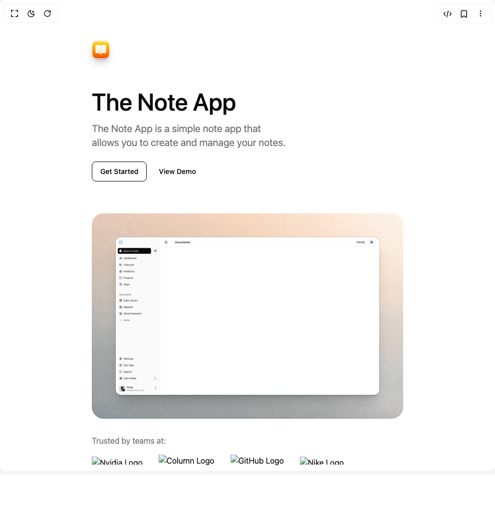

# Build Hero Section 4 in BuilderStudio

> Build this component in our Agentic IDE: [BuilderStudio](https://builderstudio.dev).
>
> Join the BuilderStudio community on [Discord](https://discord.gg/QdWeSGCqfe) and [Reddit](https://reddit.com/r/builderstudio).



## Component

- Author group: `reapollo`
- Component: `hero-section-4`
- Variant: `default`
- Rendered HTML snapshot: [`rendered.html`](rendered.html)

## BuilderStudio prompt

You are implementing a React component based on a component reference.

## Component identity

- Author: reapollo
- Component slug: hero-section-4
- Demo slug: default
- Title: hero-section-4
- Description: 

## Goal

Recreate this component in a React + TypeScript + Tailwind CSS project. Preserve the visual layout, spacing, colors, border radius, shadows, interaction behavior, animation behavior, responsive behavior, and dark mode behavior shown in the rendered demo.

## Implementation requirements

- Use React and TypeScript.
- Use Tailwind CSS classes whenever possible.
- Keep the component self-contained unless the source files require helper components.
- If the source uses CSS variables, custom CSS, animations, or keyframes, include them.
- If the source uses external packages, list and use the required packages.
- Preserve accessibility attributes, button semantics, links, keyboard behavior, and ARIA attributes when visible in the source.
- Do not replace the component with a simplified placeholder.
- Return complete production-ready code.

## Dependencies

No reference metadata available.

## Rendered DOM snapshot

This is the rendered demo HTML extracted from the live preview. Use it to verify structure, class names, visible content, and layout.

```html
<div id="root"><div class="w-screen min-h-screen flex justify-center items-center"><div class="w-screen min-h-screen flex justify-center items-center"><section class="py-20"><div class="relative z-10 mx-auto w-full max-w-2xl px-6 lg:px-0"><div class="relative"><div aria-hidden="true" class="relative flex size-9 items-center justify-center translate-y-0.5 rounded-[var(--radius)] border border-background bg-gradient-to-b from-yellow-300 to-orange-600 shadow-lg shadow-black/20 ring-1 ring-black/10"><svg xmlns="http://www.w3.org/2000/svg" width="24" height="24" viewBox="0 0 24 24" fill="none" stroke="currentColor" stroke-width="2" stroke-linecap="round" stroke-linejoin="round" class="lucide lucide-book-open mask-b-from-25% size-6 fill-white stroke-white drop-shadow-sm" aria-hidden="true"><path d="M12 7v14"></path><path d="M3 18a1 1 0 0 1-1-1V4a1 1 0 0 1 1-1h5a4 4 0 0 1 4 4 4 4 0 0 1 4-4h5a1 1 0 0 1 1 1v13a1 1 0 0 1-1 1h-6a3 3 0 0 0-3 3 3 3 0 0 0-3-3z"></path></svg><svg xmlns="http://www.w3.org/2000/svg" width="24" height="24" viewBox="0 0 24 24" fill="none" stroke="currentColor" stroke-width="2" stroke-linecap="round" stroke-linejoin="round" class="lucide lucide-book-open absolute inset-0 m-auto size-6 fill-white stroke-white opacity-65 drop-shadow-sm" aria-hidden="true"><path d="M12 7v14"></path><path d="M3 18a1 1 0 0 1-1-1V4a1 1 0 0 1 1-1h5a4 4 0 0 1 4 4 4 4 0 0 1 4-4h5a1 1 0 0 1 1 1v13a1 1 0 0 1-1 1h-6a3 3 0 0 0-3 3 3 3 0 0 0-3-3z"></path></svg><div class="absolute inset-2 z-10 m-auto h-[18px] w-px translate-y-px rounded-full bg-black/10"></div></div><h1 class="mt-16 max-w-xl text-balance text-5xl font-medium">The Note App</h1><p class="text-muted-foreground mb-6 mt-4 text-balance text-xl">The Note App is a simple note app that allows you to create and manage your notes.</p><div class="flex flex-col items-center gap-2 sm:flex-row"><a href="#link" class="inline-flex items-center justify-center whitespace-nowrap rounded-md text-sm font-medium ring-offset-background transition-colors focus-visible:outline-none focus-visible:ring-2 focus-visible:ring-ring focus-visible:ring-offset-2 disabled:pointer-events-none disabled:opacity-50 border bg-background h-10 px-4 py-2 w-full sm:w-auto border-black text-black hover:bg-black hover:text-white"><span class="whitespace-nowrap">Get Started</span></a><a href="#link" class="inline-flex items-center justify-center whitespace-nowrap rounded-md text-sm font-medium ring-offset-background transition-colors focus-visible:outline-none focus-visible:ring-2 focus-visible:ring-ring focus-visible:ring-offset-2 disabled:pointer-events-none disabled:opacity-50 hover:bg-accent hover:text-accent-foreground h-10 px-4 py-2 w-full sm:w-auto"><span class="whitespace-nowrap">View Demo</span></a></div></div><div class="relative mt-12 overflow-hidden rounded-3xl bg-black/10 md:mt-16"><div class="relative m-4 overflow-hidden rounded-[var(--radius)] border border-transparent bg-background shadow-xl shadow-black/15 ring-1 ring-black/10 sm:m-8 md:m-12"></div></div><div class="mt-8 flex flex-wrap items-center gap-4"><p class="text-muted-foreground text-center">Trusted by teams at:</p><div class="flex items-center justify-center gap-8"><div class="flex"></div><div class="flex"></div><div class="flex"></div><div class="flex"></div></div></div></div></section></div></div></div>
```

## Reference source files

No reference source files were available.
