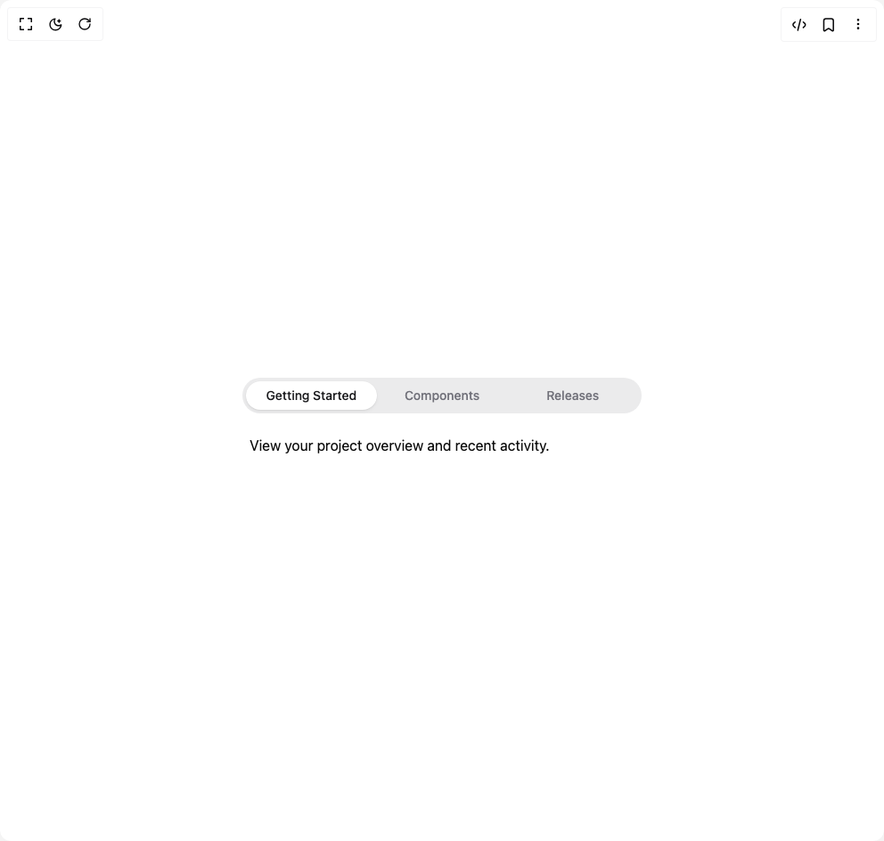

# Build Heroui Tabs in BuilderStudio

> Build this component in our Agentic IDE: [BuilderStudio](https://builderstudio.dev).
>
> Join the BuilderStudio community on [Discord](https://discord.gg/QdWeSGCqfe) and [Reddit](https://reddit.com/r/builderstudio).



## Component

- Author group: `reapollo`
- Component: `heroui-tabs`
- Variant: `custom-render`
- Rendered HTML snapshot: [`rendered.html`](rendered.html)

## BuilderStudio prompt

You are implementing a React component based on a component reference.

## Component identity

- Author: reapollo
- Component slug: heroui-tabs
- Demo slug: custom-render
- Title: heroui-tabs
- Description: 

## Goal

Recreate this component in a React + TypeScript + Tailwind CSS project. Preserve the visual layout, spacing, colors, border radius, shadows, interaction behavior, animation behavior, responsive behavior, and dark mode behavior shown in the rendered demo.

## Implementation requirements

- Use React and TypeScript.
- Use Tailwind CSS classes whenever possible.
- Keep the component self-contained unless the source files require helper components.
- If the source uses CSS variables, custom CSS, animations, or keyframes, include them.
- If the source uses external packages, list and use the required packages.
- Preserve accessibility attributes, button semantics, links, keyboard behavior, and ARIA attributes when visible in the source.
- Do not replace the component with a simplified placeholder.
- Return complete production-ready code.

## Dependencies

No reference metadata available.

## Rendered DOM snapshot

This is the rendered demo HTML extracted from the live preview. Use it to verify structure, class names, visible content, and layout.

```html
<div id="root"><div class="w-screen min-h-screen flex justify-center items-center"><div class="w-screen min-h-screen flex justify-center items-center"><div class="flex min-h-[320px] w-full items-center justify-center p-8"><template><div class="tabs__list-container" data-slot="tabs-list-container"></div></template><div data-slot="tabs" class="tabs w-full max-w-md" data-rac="" data-orientation="horizontal" data-custom="foo"><div class="tabs__list-container" data-slot="tabs-list-container"><div data-slot="tabs-list" class="tabs__list" data-rac="" data-collection="react-aria5261697819-«r0»" id="react-aria5261697819-«r1»" aria-label="Options" role="tablist" aria-orientation="horizontal" data-orientation="horizontal"><a data-slot="tabs-tab" class="tabs__tab" data-rac="" tabindex="0" href="#getting-started" data-collection="react-aria5261697819-«r0»" data-key="getting-started" data-react-aria-pressable="true" id="react-aria5261697819-«r1»-tab-getting-started" aria-selected="true" role="tab" aria-controls="react-aria5261697819-«r1»-tabpanel-getting-started" data-selected="true">Getting Started<div data-slot="tabs-indicator" class="tabs__indicator" data-rac=""></div></a><a data-slot="tabs-tab" class="tabs__tab" data-rac="" tabindex="-1" href="#components" data-collection="react-aria5261697819-«r0»" data-key="components" data-react-aria-pressable="true" id="react-aria5261697819-«r1»-tab-components" aria-selected="false" role="tab">Components</a><a data-slot="tabs-tab" class="tabs__tab" data-rac="" tabindex="-1" href="#releases" data-collection="react-aria5261697819-«r0»" data-key="releases" data-react-aria-pressable="true" id="react-aria5261697819-«r1»-tab-releases" aria-selected="false" role="tab">Releases</a></div></div><div data-slot="tabs-panel" id="react-aria5261697819-«r1»-tabpanel-getting-started" aria-labelledby="react-aria5261697819-«r1»-tab-getting-started" tabindex="0" role="tabpanel" class="tabs__panel pt-4" data-rac=""><p>View your project overview and recent activity.</p></div></div></div></div></div></div>
```

## Reference source files

No reference source files were available.
