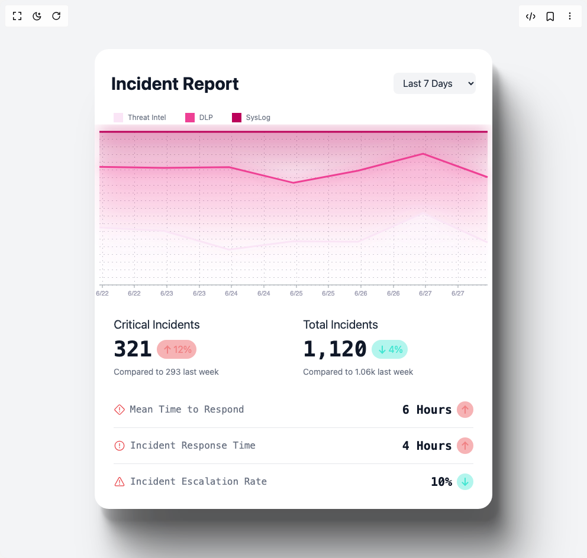
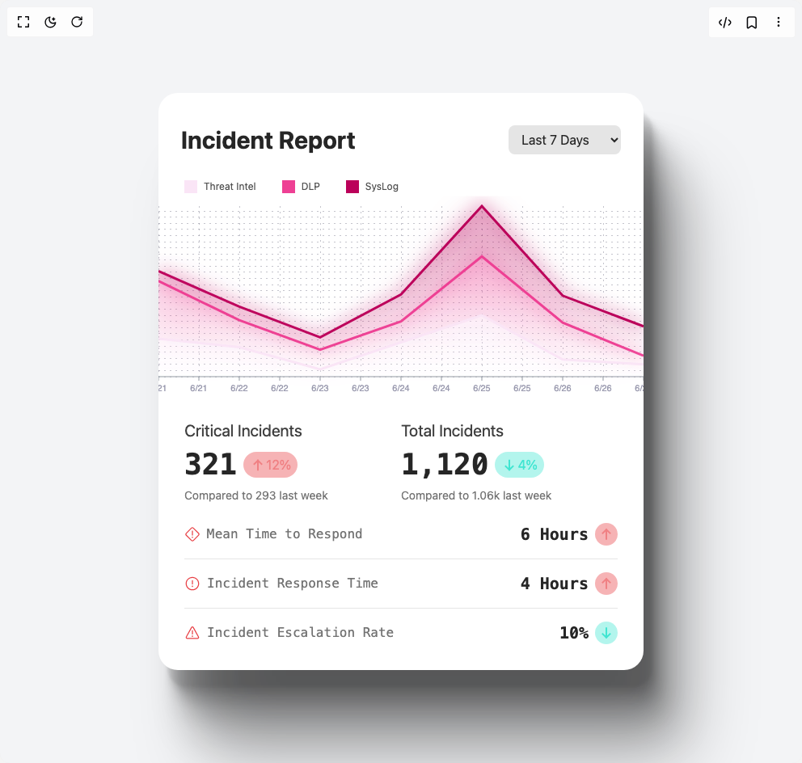
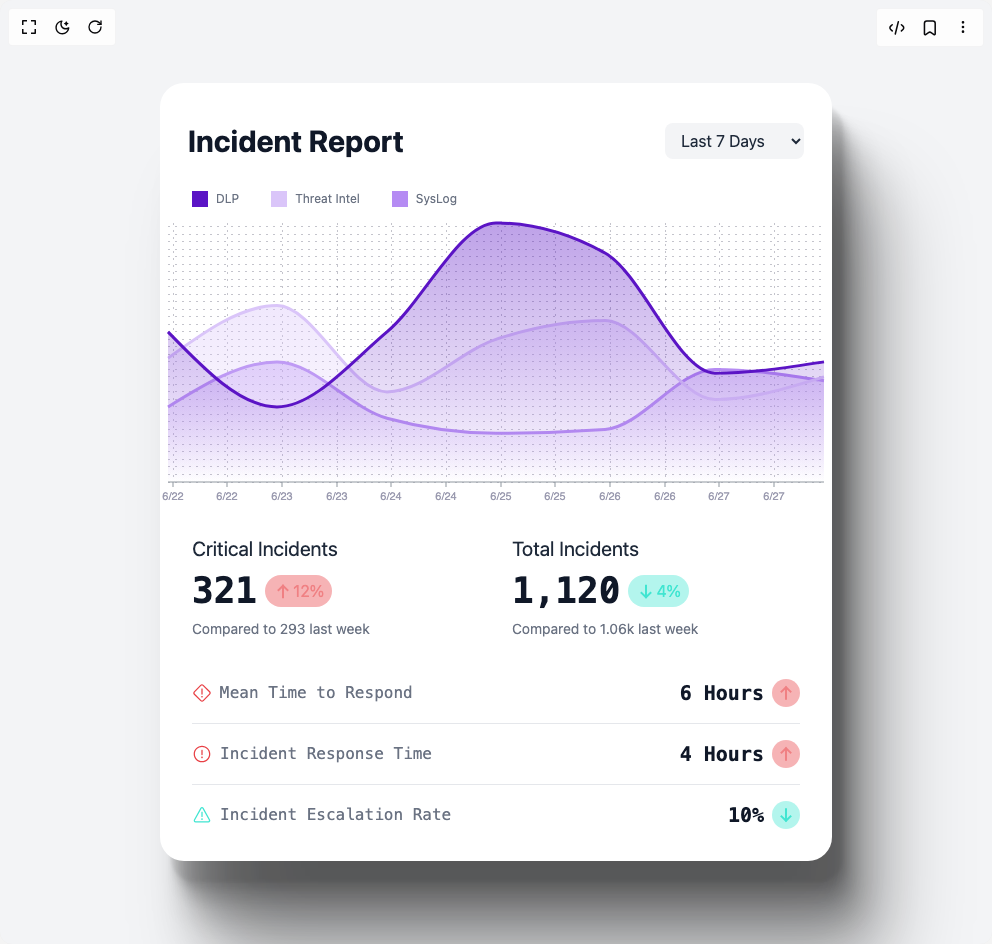
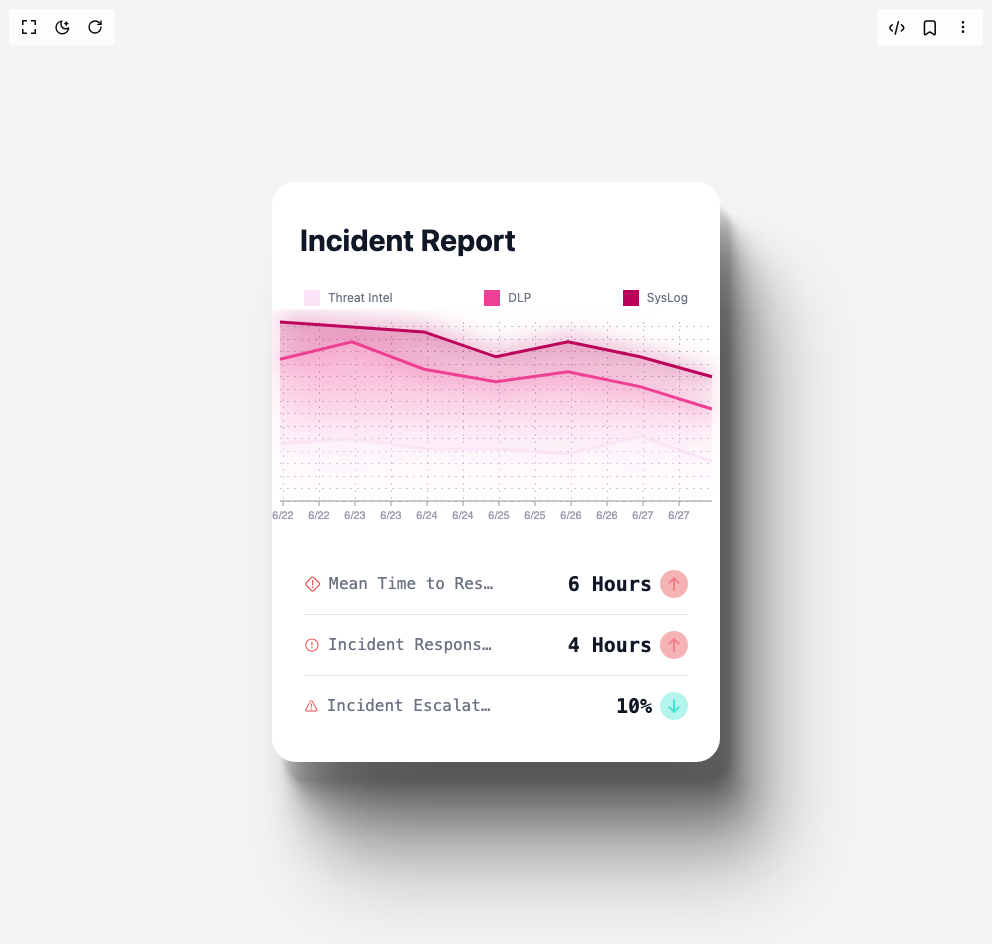
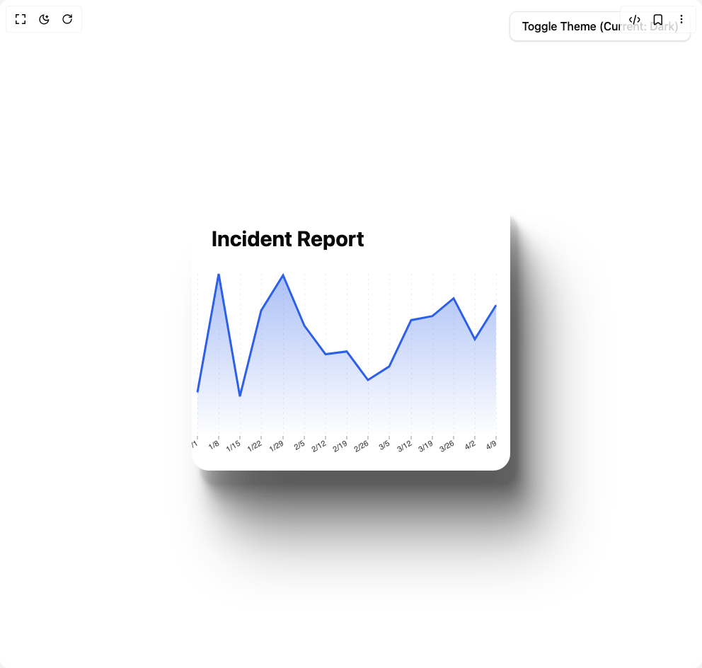
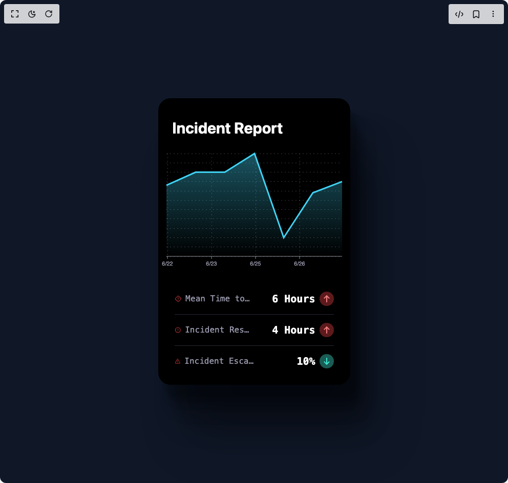

# Reaviz Components

8 components are available in this author group.

> Build any component in [BuilderStudio](https://builderstudio.dev), then share improvements with the community on [Discord](https://discord.gg/QdWeSGCqfe) or [Reddit](https://reddit.com/r/builderstudio).

| Preview | Component | Variant |
| --- | --- | --- |
|  | [Advanced Normalized Incident Report](advanced-normalized-incident-report/default/README.md) | `default` |
|  | [Area Chart 1](area-chart-1/default/README.md) | `default` |
|  | [Area Chart 2](area-chart-2/default/README.md) | `default` |
|  | [Area Chart Medium](area-chart-medium/default/README.md) | `default` |
|  | [Area Chart Small](area-chart-small/default/README.md) | `default` |
|  | [Area Chart Xs](area-chart-xs/default/README.md) | `default` |
|  | [Area Chart](area-chart/default/README.md) | `default` |
|  | [Areachart Multiseries](areachart-multiseries/default/README.md) | `default` |
