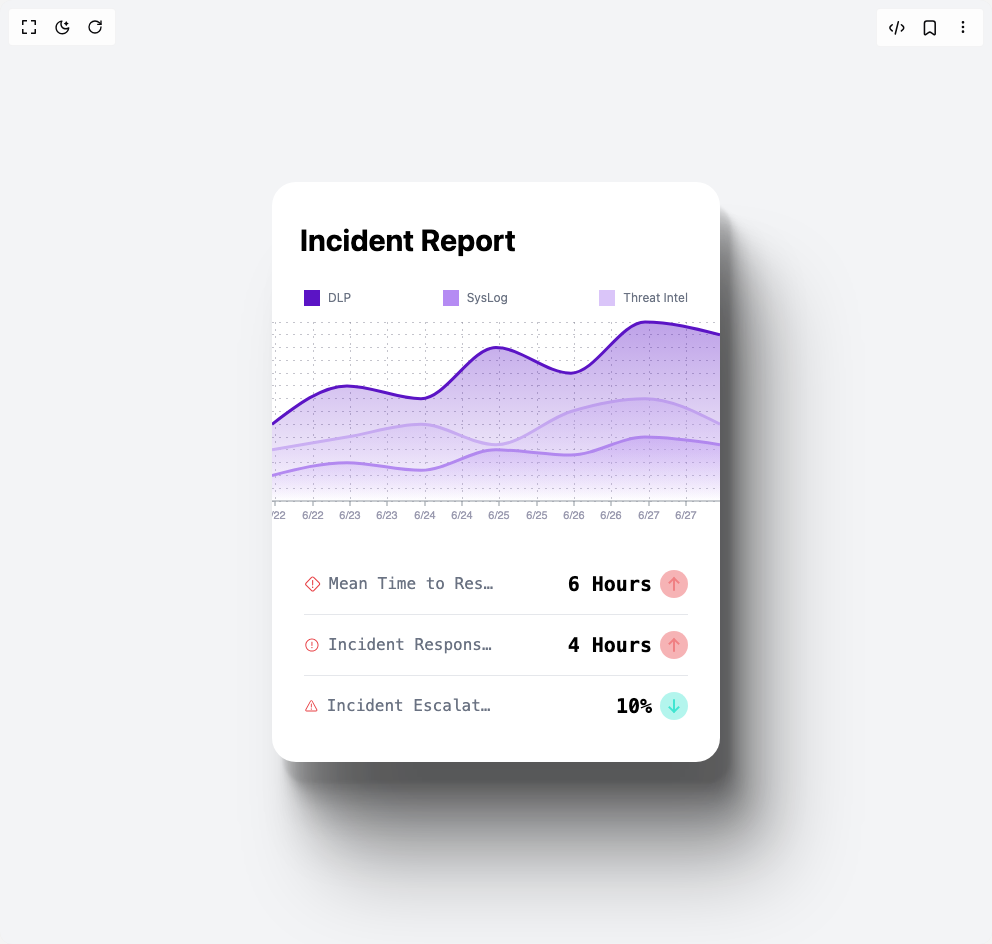

# Build Area Chart 1 in BuilderStudio

> Build this component in our Agentic IDE: [BuilderStudio](https://builderstudio.dev).
>
> Join the BuilderStudio community on [Discord](https://discord.gg/QdWeSGCqfe) and [Reddit](https://reddit.com/r/builderstudio).



## Component

- Author group: `reaviz`
- Component: `area-chart-1`
- Variant: `default`
- Rendered HTML snapshot: [`rendered.html`](rendered.html)

## BuilderStudio prompt

You are implementing a React component based on a component reference.

## Component identity

- Author: reaviz
- Component slug: area-chart-1
- Demo slug: default
- Title: area-chart-1
- Description: 

## Goal

Recreate this component in a React + TypeScript + Tailwind CSS project. Preserve the visual layout, spacing, colors, border radius, shadows, interaction behavior, animation behavior, responsive behavior, and dark mode behavior shown in the rendered demo.

## Implementation requirements

- Use React and TypeScript.
- Use Tailwind CSS classes whenever possible.
- Keep the component self-contained unless the source files require helper components.
- If the source uses CSS variables, custom CSS, animations, or keyframes, include them.
- If the source uses external packages, list and use the required packages.
- Preserve accessibility attributes, button semantics, links, keyboard behavior, and ARIA attributes when visible in the source.
- Do not replace the component with a simplified placeholder.
- Return complete production-ready code.

## Dependencies

No reference metadata available.

## Rendered DOM snapshot

This is the rendered demo HTML extracted from the live preview. Use it to verify structure, class names, visible content, and layout.

```html
<div id="root"><div class="flex items-center justify-center min-h-screen bg-gray-100 dark:bg-gray-900 p-4 transition-colors duration-300"><style>
        :root {
          --reaviz-tick-fill: #9A9AAF;
          --reaviz-gridline-stroke: #7E7E8F75;
        }
        .dark {
          --reaviz-tick-fill: #A0AEC0; /* Slightly lighter gray for dark mode */
          --reaviz-gridline-stroke: rgba(74, 85, 104, 0.6); /* Darker, less opaque gridline */
        }
      </style><div class="flex flex-col pt-4 pb-4 bg-white dark:bg-black rounded-3xl shadow-[11px_21px_3px_rgba(0,0,0,0.06),14px_27px_7px_rgba(0,0,0,0.10),19px_38px_14px_rgba(0,0,0,0.13),27px_54px_27px_rgba(0,0,0,0.16),39px_78px_50px_rgba(0,0,0,0.20),55px_110px_86px_rgba(0,0,0,0.26)] w-full max-w-md min-h-[580px] overflow-hidden transition-colors duration-300"><h3 class="text-3xl text-left p-7 pt-6 pb-8 font-bold text-black dark:text-white transition-colors duration-300">Incident Report</h3><div class="flex justify-between w-full pl-8 pr-8 mb-4"><div class="flex gap-2 items-center"><div class="w-4 h-4" style="background-color: rgb(91, 20, 197);"></div><span class="text-gray-500 dark:text-gray-400 text-xs transition-colors duration-300">DLP</span></div><div class="flex gap-2 items-center"><div class="w-4 h-4" style="background-color: rgb(181, 139, 243);"></div><span class="text-gray-500 dark:text-gray-400 text-xs transition-colors duration-300">SysLog</span></div><div class="flex gap-2 items-center"><div class="w-4 h-4" style="background-color: rgb(218, 197, 249);"></div><span class="text-gray-500 dark:text-gray-400 text-xs transition-colors duration-300">Threat Intel</span></div></div><div class="reaviz-chart-container h-[200px]"> <div class="_container_1u3dt_1" height="200" style="height: 200px; width: 100%;"><svg width="448" height="200" class="_svg_1u3dt_30 _areaChart_yyojn_1" tabindex="0"><g transform="translate(0, 0)"><g style="pointer-events: none;"><line y1="179" y2="179" x1="0" x2="448" class="_gridLine_5yx3q_1" stroke-dasharray="2 5" stroke-width="1" stroke="var(--reaviz-gridline-stroke)" fill="none"></line><line y1="166.21428571428572" y2="166.21428571428572" x1="0" x2="448" class="_gridLine_5yx3q_1" stroke-dasharray="2 5" stroke-width="1" stroke="var(--reaviz-gridline-stroke)" fill="none"></line><line y1="153.42857142857144" y2="153.42857142857144" x1="0" x2="448" class="_gridLine_5yx3q_1" stroke-dasharray="2 5" stroke-width="1" stroke="var(--reaviz-gridline-stroke)" fill="none"></line><line y1="140.64285714285714" y2="140.64285714285714" x1="0" x2="448" class="_gridLine_5yx3q_1" stroke-dasharray="2 5" stroke-width="1" stroke="var(--reaviz-gridline-stroke)" fill="none"></line><line y1="127.85714285714286" y2="127.85714285714286" x1="0" x2="448" class="_gridLine_5yx3q_1" stroke-dasharray="2 5" stroke-width="1" stroke="var(--reaviz-gridline-stroke)" fill="none"></line><line y1="115.07142857142856" y2="115.07142857142856" x1="0" x2="448" class="_gridLine_5yx3q_1" stroke-dasharray="2 5" stroke-width="1" stroke="var(--reaviz-gridline-stroke)" fill="none"></line><line y1="102.28571428571428" y2="102.28571428571428" x1="0" x2="448" class="_gridLine_5yx3q_1" stroke-dasharray="2 5" stroke-width="1" stroke="var(--reaviz-gridline-stroke)" fill="none"></line><line y1="89.5" y2="89.5" x1="0" x2="448" class="_gridLine_5yx3q_1" stroke-dasharray="2 5" stroke-width="1" stroke="var(--reaviz-gridline-stroke)" fill="none"></line><line y1="76.71428571428572" y2="76.71428571428572" x1="0" x2="448" class="_gridLine_5yx3q_1" stroke-dasharray="2 5" stroke-width="1" stroke="var(--reaviz-gridline-stroke)" fill="none"></line><line y1="63.92857142857142" y2="63.92857142857142" x1="0" x2="448" class="_gridLine_5yx3q_1" stroke-dasharray="2 5" stroke-width="1" stroke="var(--reaviz-gridline-stroke)" fill="none"></line><line y1="51.14285714285714" y2="51.14285714285714" x1="0" x2="448" class="_gridLine_5yx3q_1" stroke-dasharray="2 5" stroke-width="1" stroke="var(--reaviz-gridline-stroke)" fill="none"></line><line y1="38.35714285714286" y2="38.35714285714286" x1="0" x2="448" class="_gridLine_5yx3q_1" stroke-dasharray="2 5" stroke-width="1" stroke="var(--reaviz-gridline-stroke)" fill="none"></line><line y1="25.57142857142858" y2="25.57142857142858" x1="0" x2="448" class="_gridLine_5yx3q_1" stroke-dasharray="2 5" stroke-width="1" stroke="var(--reaviz-gridline-stroke)" fill="none"></line><line y1="12.78571428571428" y2="12.78571428571428" x1="0" x2="448" class="_gridLine_5yx3q_1" stroke-dasharray="2 5" stroke-width="1" stroke="var(--reaviz-gridline-stroke)" fill="none"></line><line y1="0" y2="0" x1="0" x2="448" class="_gridLine_5yx3q_1" stroke-dasharray="2 5" stroke-width="1" stroke="var(--reaviz-gridline-stroke)" fill="none"></line><line x1="3" x2="3" y1="0" y2="179" class="_gridLine_5yx3q_1" stroke-dasharray="2 5" stroke-width="1" stroke="var(--reaviz-gridline-stroke)" fill="none"></line><line x1="41" x2="41" y1="0" y2="179" class="_gridLine_5yx3q_1" stroke-dasharray="2 5" stroke-width="1" stroke="var(--reaviz-gridline-stroke)" fill="none"></line><line x1="78" x2="78" y1="0" y2="179" class="_gridLine_5yx3q_1" stroke-dasharray="2 5" stroke-width="1" stroke="var(--reaviz-gridline-stroke)" fill="none"></line><line x1="115" x2="115" y1="0" y2="179" class="_gridLine_5yx3q_1" stroke-dasharray="2 5" stroke-width="1" stroke="var(--reaviz-gridline-stroke)" fill="none"></line><line x1="153" x2="153" y1="0" y2="179" class="_gridLine_5yx3q_1" stroke-dasharray="2 5" stroke-width="1" stroke="var(--reaviz-gridline-stroke)" fill="none"></line><line x1="190" x2="190" y1="0" y2="179" class="_gridLine_5yx3q_1" stroke-dasharray="2 5" stroke-width="1" stroke="var(--reaviz-gridline-stroke)" fill="none"></line><line x1="227" x2="227" y1="0" y2="179" class="_gridLine_5yx3q_1" stroke-dasharray="2 5" stroke-width="1" stroke="var(--reaviz-gridline-stroke)" fill="none"></line><line x1="265" x2="265" y1="0" y2="179" class="_gridLine_5yx3q_1" stroke-dasharray="2 5" stroke-width="1" stroke="var(--reaviz-gridline-stroke)" fill="none"></line><line x1="302" x2="302" y1="0" y2="179" class="_gridLine_5yx3q_1" stroke-dasharray="2 5" stroke-width="1" stroke="var(--reaviz-gridline-stroke)" fill="none"></line><line x1="339" x2="339" y1="0" y2="179" class="_gridLine_5yx3q_1" stroke-dasharray="2 5" stroke-width="1" stroke="var(--reaviz-gridline-stroke)" fill="none"></line><line x1="377" x2="377" y1="0" y2="179" class="_gridLine_5yx3q_1" stroke-dasharray="2 5" stroke-width="1" stroke="var(--reaviz-gridline-stroke)" fill="none"></line><line x1="414" x2="414" y1="0" y2="179" class="_gridLine_5yx3q_1" stroke-dasharray="2 5" stroke-width="1" stroke="var(--reaviz-gridline-stroke)" fill="none"></line></g><g transform="translate(0, 179)" visibility="visible"><line x1="0" x2="448" y1="0" y2="0.00001" stroke-width="1" stroke="#8F979F"></line><g transform="translate(3, 0)"><line stroke-width="1" stroke="#8F979F" x1="0" x2="0" y1="0" y2="5"></line><g transform="translate(0, 10)" font-size="11" font-family="sans-serif"><title>6/22</title><text transform="" text-anchor="middle" alignment-baseline="hanging" fill="var(--reaviz-tick-fill)">6/22</text></g></g><g transform="translate(41, 0)"><line stroke-width="1" stroke="#8F979F" x1="0" x2="0" y1="0" y2="5"></line><g transform="translate(0, 10)" font-size="11" font-family="sans-serif"><title>6/22</title><text transform="" text-anchor="middle" alignment-baseline="hanging" fill="var(--reaviz-tick-fill)">6/22</text></g></g><g transform="translate(78, 0)"><line stroke-width="1" stroke="#8F979F" x1="0" x2="0" y1="0" y2="5"></line><g transform="translate(0, 10)" font-size="11" font-family="sans-serif"><title>6/23</title><text transform="" text-anchor="middle" alignment-baseline="hanging" fill="var(--reaviz-tick-fill)">6/23</text></g></g><g transform="translate(115, 0)"><line stroke-width="1" stroke="#8F979F" x1="0" x2="0" y1="0" y2="5"></line><g transform="translate(0, 10)" font-size="11" font-family="sans-serif"><title>6/23</title><text transform="" text-anchor="middle" alignment-baseline="hanging" fill="var(--reaviz-tick-fill)">6/23</text></g></g><g transform="translate(153, 0)"><line stroke-width="1" stroke="#8F979F" x1="0" x2="0" y1="0" y2="5"></line><g transform="translate(0, 10)" font-size="11" font-family="sans-serif"><title>6/24</title><text transform="" text-anchor="middle" alignment-baseline="hanging" fill="var(--reaviz-tick-fill)">6/24</text></g></g><g transform="translate(190, 0)"><line stroke-width="1" stroke="#8F979F" x1="0" x2="0" y1="0" y2="5"></line><g transform="translate(0, 10)" font-size="11" font-family="sans-serif"><title>6/24</title><text transform="" text-anchor="middle" alignment-baseline="hanging" fill="var(--reaviz-tick-fill)">6/24</text></g></g><g transform="translate(227, 0)"><line stroke-width="1" stroke="#8F979F" x1="0" x2="0" y1="0" y2="5"></line><g transform="translate(0, 10)" font-size="11" font-family="sans-serif"><title>6/25</title><text transform="" text-anchor="middle" alignment-baseline="hanging" fill="var(--reaviz-tick-fill)">6/25</text></g></g><g transform="translate(265, 0)"><line stroke-width="1" stroke="#8F979F" x1="0" x2="0" y1="0" y2="5"></line><g transform="translate(0, 10)" font-size="11" font-family="sans-serif"><title>6/25</title><text transform="" text-anchor="middle" alignment-baseline="hanging" fill="var(--reaviz-tick-fill)">6/25</text></g></g><g transform="translate(302, 0)"><line stroke-width="1" stroke="#8F979F" x1="0" x2="0" y1="0" y2="5"></line><g transform="translate(0, 10)" font-size="11" font-family="sans-serif"><title>6/26</title><text transform="" text-anchor="middle" alignment-baseline="hanging" fill="var(--reaviz-tick-fill)">6/26</text></g></g><g transform="translate(339, 0)"><line stroke-width="1" stroke="#8F979F" x1="0" x2="0" y1="0" y2="5"></line><g transform="translate(0, 10)" font-size="11" font-family="sans-serif"><title>6/26</title><text transform="" text-anchor="middle" alignment-baseline="hanging" fill="var(--reaviz-tick-fill)">6/26</text></g></g><g transform="translate(377, 0)"><line stroke-width="1" stroke="#8F979F" x1="0" x2="0" y1="0" y2="5"></line><g transform="translate(0, 10)" font-size="11" font-family="sans-serif"><title>6/27</title><text transform="" text-anchor="middle" alignment-baseline="hanging" fill="var(--reaviz-tick-fill)">6/27</text></g></g><g transform="translate(414, 0)"><line stroke-width="1" stroke="#8F979F" x1="0" x2="0" y1="0" y2="5"></line><g transform="translate(0, 10)" font-size="11" font-family="sans-serif"><title>6/27</title><text transform="" text-anchor="middle" alignment-baseline="hanging" fill="var(--reaviz-tick-fill)">6/27</text></g></g></g><g transform="translate(0, 0)" visibility="visible"></g><defs><clipPath id="area-series-multi-series-interpolation-smooth-path"><rect width="473" height="204" x="-12.5" y="-12.5"></rect></clipPath></defs><g><rect height="179" width="448" opacity="0" cursor="auto"></rect><g clip-path="url(#area-series-multi-series-interpolation-smooth-path)"><path class="" pointer-events="none" stroke="#B58BF3" stroke-width="3" fill="none" d="M0,153.429C25,147.036,50,140.643,75,140.643C99.667,140.643,124.333,148.314,149,148.314C174,148.314,199,127.857,224,127.857C249,127.857,274,132.971,299,132.971C323.667,132.971,348.333,115.071,373,115.071C398,115.071,423,118.907,448,122.743" opacity="1" stroke-dasharray=""></path><path class="" pointer-events="none" mask="" fill="url(#gradient-area-series-multi-series-interpolation-smooth-area-2)" d="M0,153.429C25,147.036,50,140.643,75,140.643C99.667,140.643,124.333,148.314,149,148.314C174,148.314,199,127.857,224,127.857C249,127.857,274,132.971,299,132.971C323.667,132.971,348.333,115.071,373,115.071C398,115.071,423,118.907,448,122.743L448,179C423,179,398,179,373,179C348.333,179,323.667,179,299,179C274,179,249,179,224,179C199,179,174,179,149,179C124.333,179,99.667,179,75,179C50,179,25,179,0,179Z" opacity="1"></path><linearGradient spreadMethod="pad" id="gradient-area-series-multi-series-interpolation-smooth-area-2" x1="10%" x2="10%" y1="100%" y2="0%"><stop stop-opacity="0" stop-color="#B58BF3"></stop><stop offset="100%" stop-opacity="0.4" stop-color="#B58BF3"></stop></linearGradient><path class="" pointer-events="none" stroke="#DAC5F9" stroke-width="3" fill="none" d="M0,127.857C25,123.61,50,119.362,75,115.071C99.667,110.838,124.333,102.286,149,102.286C174,102.286,199,122.743,224,122.743C249,122.743,274,97.178,299,89.5C323.667,81.925,348.333,76.714,373,76.714C398,76.714,423,89.5,448,102.286" opacity="1" stroke-dasharray=""></path><path class="" pointer-events="none" mask="" fill="url(#gradient-area-series-multi-series-interpolation-smooth-area-1)" d="M0,127.857C25,123.61,50,119.362,75,115.071C99.667,110.838,124.333,102.286,149,102.286C174,102.286,199,122.743,224,122.743C249,122.743,274,97.178,299,89.5C323.667,81.925,348.333,76.714,373,76.714C398,76.714,423,89.5,448,102.286L448,179C423,179,398,179,373,179C348.333,179,323.667,179,299,179C274,179,249,179,224,179C199,179,174,179,149,179C124.333,179,99.667,179,75,179C50,179,25,179,0,179Z" opacity="1"></path><linearGradient spreadMethod="pad" id="gradient-area-series-multi-series-interpolation-smooth-area-1" x1="10%" x2="10%" y1="100%" y2="0%"><stop stop-opacity="0" stop-color="#DAC5F9"></stop><stop offset="100%" stop-opacity="0.4" stop-color="#DAC5F9"></stop></linearGradient><path class="" pointer-events="none" stroke="#5B14C5" stroke-width="3" fill="none" d="M0,102.286C25,83.107,50,63.929,75,63.929C99.667,63.929,124.333,76.714,149,76.714C174,76.714,199,25.571,224,25.571C249,25.571,274,51.143,299,51.143C323.667,51.143,348.333,0,373,0C398,0,423,6.393,448,12.786" opacity="1" stroke-dasharray=""></path><path class="" pointer-events="none" mask="" fill="url(#gradient-area-series-multi-series-interpolation-smooth-area-0)" d="M0,102.286C25,83.107,50,63.929,75,63.929C99.667,63.929,124.333,76.714,149,76.714C174,76.714,199,25.571,224,25.571C249,25.571,274,51.143,299,51.143C323.667,51.143,348.333,0,373,0C398,0,423,6.393,448,12.786L448,179C423,179,398,179,373,179C348.333,179,323.667,179,299,179C274,179,249,179,224,179C199,179,174,179,149,179C124.333,179,99.667,179,75,179C50,179,25,179,0,179Z" opacity="1"></path><linearGradient spreadMethod="pad" id="gradient-area-series-multi-series-interpolation-smooth-area-0" x1="10%" x2="10%" y1="100%" y2="0%"><stop stop-opacity="0" stop-color="#5B14C5"></stop><stop offset="100%" stop-opacity="0.4" stop-color="#5B14C5"></stop></linearGradient><defs><clipPath id="area-series-multi-series-interpolation-smooth-path"><rect width="473" height="204" x="-12.5" y="-12.5"></rect></clipPath></defs><g clip-path="url(#area-series-multi-series-interpolation-smooth-path)"><g class="_hidden_jp2yc_5" tabindex="0" aria-label="Threat Intel: 10" role="graphics-document"><circle class="_point_u68jv_1" fill="#B58BF3" cx="0" cy="153.42857142857144" r="4" opacity="1" style="cursor: pointer;"></circle></g><g class="_hidden_jp2yc_5" tabindex="0" aria-label="Threat Intel: 15" role="graphics-document"><circle class="_point_u68jv_1" fill="#B58BF3" cx="75" cy="140.64285714285714" r="4" opacity="1" style="cursor: pointer;"></circle></g><g class="_hidden_jp2yc_5" tabindex="0" aria-label="Threat Intel: 12" role="graphics-document"><circle class="_point_u68jv_1" fill="#B58BF3" cx="149" cy="148.31428571428572" r="4" opacity="1" style="cursor: pointer;"></circle></g><g class="_hidden_jp2yc_5" tabindex="0" aria-label="Threat Intel: 20" role="graphics-document"><circle class="_point_u68jv_1" fill="#B58BF3" cx="224" cy="127.85714285714286" r="4" opacity="1" style="cursor: pointer;"></circle></g><g class="_hidden_jp2yc_5" tabindex="0" aria-label="Threat Intel: 18" role="graphics-document"><circle class="_point_u68jv_1" fill="#B58BF3" cx="299" cy="132.9714285714286" r="4" opacity="1" style="cursor: pointer;"></circle></g><g class="_hidden_jp2yc_5" tabindex="0" aria-label="Threat Intel: 25" role="graphics-document"><circle class="_point_u68jv_1" fill="#B58BF3" cx="373" cy="115.07142857142856" r="4" opacity="1" style="cursor: pointer;"></circle></g><g class="_hidden_jp2yc_5" tabindex="0" aria-label="Threat Intel: 22" role="graphics-document"><circle class="_point_u68jv_1" fill="#B58BF3" cx="448" cy="122.74285714285715" r="4" opacity="1" style="cursor: pointer;"></circle></g></g><defs><clipPath id="area-series-multi-series-interpolation-smooth-path"><rect width="473" height="204" x="-12.5" y="-12.5"></rect></clipPath></defs><g clip-path="url(#area-series-multi-series-interpolation-smooth-path)"><g class="_hidden_jp2yc_5" tabindex="0" aria-label="SysLog: 20" role="graphics-document"><circle class="_point_u68jv_1" fill="#DAC5F9" cx="0" cy="127.85714285714286" r="4" opacity="1" style="cursor: pointer;"></circle></g><g class="_hidden_jp2yc_5" tabindex="0" aria-label="SysLog: 25" role="graphics-document"><circle class="_point_u68jv_1" fill="#DAC5F9" cx="75" cy="115.07142857142856" r="4" opacity="1" style="cursor: pointer;"></circle></g><g class="_hidden_jp2yc_5" tabindex="0" aria-label="SysLog: 30" role="graphics-document"><circle class="_point_u68jv_1" fill="#DAC5F9" cx="149" cy="102.28571428571428" r="4" opacity="1" style="cursor: pointer;"></circle></g><g class="_hidden_jp2yc_5" tabindex="0" aria-label="SysLog: 22" role="graphics-document"><circle class="_point_u68jv_1" fill="#DAC5F9" cx="224" cy="122.74285714285715" r="4" opacity="1" style="cursor: pointer;"></circle></g><g class="_hidden_jp2yc_5" tabindex="0" aria-label="SysLog: 35" role="graphics-document"><circle class="_point_u68jv_1" fill="#DAC5F9" cx="299" cy="89.5" r="4" opacity="1" style="cursor: pointer;"></circle></g><g class="_hidden_jp2yc_5" tabindex="0" aria-label="SysLog: 40" role="graphics-document"><circle class="_point_u68jv_1" fill="#DAC5F9" cx="373" cy="76.71428571428572" r="4" opacity="1" style="cursor: pointer;"></circle></g><g class="_hidden_jp2yc_5" tabindex="0" aria-label="SysLog: 30" role="graphics-document"><circle class="_point_u68jv_1" fill="#DAC5F9" cx="448" cy="102.28571428571428" r="4" opacity="1" style="cursor: pointer;"></circle></g></g><defs><clipPath id="area-series-multi-series-interpolation-smooth-path"><rect width="473" height="204" x="-12.5" y="-12.5"></rect></clipPath></defs><g clip-path="url(#area-series-multi-series-interpolation-smooth-path)"><g class="_hidden_jp2yc_5" tabindex="0" aria-label="DLP: 30" role="graphics-document"><circle class="_point_u68jv_1" fill="#5B14C5" cx="0" cy="102.28571428571428" r="4" opacity="1" style="cursor: pointer;"></circle></g><g class="_hidden_jp2yc_5" tabindex="0" aria-label="DLP: 45" role="graphics-document"><circle class="_point_u68jv_1" fill="#5B14C5" cx="75" cy="63.92857142857142" r="4" opacity="1" style="cursor: pointer;"></circle></g><g class="_hidden_jp2yc_5" tabindex="0" aria-label="DLP: 40" role="graphics-document"><circle class="_point_u68jv_1" fill="#5B14C5" cx="149" cy="76.71428571428572" r="4" opacity="1" style="cursor: pointer;"></circle></g><g class="_hidden_jp2yc_5" tabindex="0" aria-label="DLP: 60" role="graphics-document"><circle class="_point_u68jv_1" fill="#5B14C5" cx="224" cy="25.57142857142858" r="4" opacity="1" style="cursor: pointer;"></circle></g><g class="_hidden_jp2yc_5" tabindex="0" aria-label="DLP: 50" role="graphics-document"><circle class="_point_u68jv_1" fill="#5B14C5" cx="299" cy="51.14285714285714" r="4" opacity="1" style="cursor: pointer;"></circle></g><g class="_hidden_jp2yc_5" tabindex="0" aria-label="DLP: 70" role="graphics-document"><circle class="_point_u68jv_1" fill="#5B14C5" cx="373" cy="0" r="4" opacity="1" style="cursor: pointer;"></circle></g><g class="_hidden_jp2yc_5" tabindex="0" aria-label="DLP: 65" role="graphics-document"><circle class="_point_u68jv_1" fill="#5B14C5" cx="448" cy="12.78571428571428" r="4" opacity="1" style="cursor: pointer;"></circle></g></g></g></g></g></svg></div></div><div class="flex flex-col pl-8 pr-8 pt-8 font-mono divide-y divide-gray-200 dark:divide-gray-700 transition-colors duration-300"><div class="flex w-full py-4 items-center gap-2" style="opacity: 1; transform: none;"><div class="flex flex-row gap-2 items-center text-base w-1/2 text-gray-500 dark:text-gray-400 transition-colors duration-300"><svg xmlns="http://www.w3.org/2000/svg" width="20" height="20" viewBox="0 0 20 20" fill="none"><path d="M9.92844 1.25411C9.32947 1.25895 8.73263 1.49041 8.28293 1.94747L1.92062 8.41475C1.02123 9.32885 1.03336 10.8178 1.94748 11.7172L8.41476 18.0795C9.32886 18.9789 10.8178 18.9667 11.7172 18.0526L18.0795 11.5861C18.0798 11.5859 18.08 11.5856 18.0803 11.5853C18.979 10.6708 18.9667 9.18232 18.0526 8.28291L11.5853 1.92061C11.1283 1.47091 10.5274 1.24926 9.92844 1.25411ZM9.93901 2.49597C10.2155 2.49373 10.4926 2.59892 10.7089 2.81172L17.1762 9.17403C17.6087 9.59962 17.6139 10.2767 17.1884 10.7097L10.8261 17.1761C10.4005 17.6087 9.72379 17.614 9.29123 17.1884L2.82394 10.826C2.39139 10.4005 2.38613 9.72378 2.81174 9.29121L9.17404 2.82393C9.38684 2.60765 9.66256 2.4982 9.93901 2.49597ZM9.99028 5.40775C9.82481 5.41034 9.66711 5.47845 9.55178 5.59714C9.43645 5.71583 9.37289 5.87541 9.37505 6.04089V11.0409C9.37388 11.1237 9.38918 11.2059 9.42006 11.2828C9.45095 11.3596 9.4968 11.4296 9.55495 11.4886C9.6131 11.5476 9.6824 11.5944 9.75881 11.6264C9.83522 11.6583 9.91722 11.6748 10 11.6748C10.0829 11.6748 10.1649 11.6583 10.2413 11.6264C10.3177 11.5944 10.387 11.5476 10.4451 11.4886C10.5033 11.4296 10.5492 11.3596 10.58 11.2828C10.6109 11.2059 10.6262 11.1237 10.625 11.0409V6.04089C10.6261 5.95731 10.6105 5.87435 10.5789 5.79694C10.5474 5.71952 10.5006 5.64922 10.4415 5.59019C10.3823 5.53115 10.3119 5.48459 10.2344 5.45326C10.1569 5.42192 10.0739 5.40645 9.99028 5.40775ZM10 12.9159C9.77904 12.9159 9.56707 13.0037 9.41079 13.16C9.25451 13.3162 9.16672 13.5282 9.16672 13.7492C9.16672 13.9702 9.25451 14.1822 9.41079 14.3385C9.56707 14.4948 9.77904 14.5826 10 14.5826C10.2211 14.5826 10.433 14.4948 10.5893 14.3385C10.7456 14.1822 10.8334 13.9702 10.8334 13.7492C10.8334 13.5282 10.7456 13.3162 10.5893 13.16C10.433 13.0037 10.2211 12.9159 10 12.9159Z" fill="#E84045"></path></svg><span class="truncate" title="Mean Time to Respond">Mean Time to Respond</span></div><div class="flex gap-2 w-1/2 justify-end items-center"><span class="font-semibold text-xl text-black dark:text-white transition-colors duration-300">6 Hours</span><svg width="28" height="28" viewBox="0 0 28 28" fill="none" xmlns="http://www.w3.org/2000/svg"><rect width="28" height="28" rx="14" fill="#E84045" fill-opacity="0.4"></rect><path d="M9.50134 12.6111L14.0013 8.16663M14.0013 8.16663L18.5013 12.6111M14.0013 8.16663L14.0013 19.8333" stroke="#F08083" stroke-width="2" stroke-linecap="square"></path></svg></div></div><div class="flex w-full py-4 items-center gap-2" style="opacity: 1; transform: none;"><div class="flex flex-row gap-2 items-center text-base w-1/2 text-gray-500 dark:text-gray-400 transition-colors duration-300"><svg xmlns="http://www.w3.org/2000/svg" width="20" height="20" viewBox="0 0 20 20" fill="none"><path d="M10.0001 1.66663C5.40511 1.66663 1.66675 5.40499 1.66675 9.99996C1.66675 14.5949 5.40511 18.3333 10.0001 18.3333C14.5951 18.3333 18.3334 14.5949 18.3334 9.99996C18.3334 5.40499 14.5951 1.66663 10.0001 1.66663ZM10.0001 2.91663C13.9195 2.91663 17.0834 6.08054 17.0834 9.99996C17.0834 13.9194 13.9195 17.0833 10.0001 17.0833C6.08066 17.0833 2.91675 13.9194 2.91675 9.99996C2.91675 6.08054 6.08066 2.91663 10.0001 2.91663ZM9.99032 5.82434C9.82470 5.82693 9.66688 5.89515 9.55152 6.01401C9.43616 6.13288 9.37271 6.29267 9.37508 6.45829V10.625C9.37391 10.7078 9.38921 10.79 9.42009 10.8669C9.45098 10.9437 9.49683 11.0137 9.55498 11.0726C9.61313 11.1316 9.68243 11.1785 9.75884 11.2104C9.83525 11.2424 9.91725 11.2589 10.0001 11.2589C10.0829 11.2589 10.1649 11.2424 10.2413 11.2104C10.3177 11.1785 10.387 11.1316 10.4452 11.0726C10.5033 11.0137 10.5492 10.9437 10.5801 10.8669C10.611 10.79 10.6263 10.7078 10.6251 10.625V6.45829C10.6263 6.37464 10.6107 6.29160 10.5792 6.21409C10.5477 6.13658 10.5010 6.06618 10.4418 6.00706C10.3826 5.94794 10.3121 5.90130 10.2346 5.86992C10.1570 5.83853 10.0740 5.82303 9.99032 5.82434ZM10.0001 12.5C9.77907 12.5 9.56711 12.5878 9.41083 12.7440C9.25455 12.9003 9.16675 13.1123 9.16675 13.3333C9.16675 13.5543 9.25455 13.7663 9.41083 13.9225C9.56711 14.0788 9.77907 14.1666 10.0001 14.1666C10.2211 14.1666 10.4331 14.0788 10.5893 13.9225C10.7456 13.7663 10.8334 13.5543 10.8334 13.3333C10.8334 13.1123 10.7456 12.9003 10.5893 12.7440C10.4331 12.5878 10.2211 12.5000 10.0001 12.5Z" fill="#E84045"></path></svg><span class="truncate" title="Incident Response Time">Incident Response Time</span></div><div class="flex gap-2 w-1/2 justify-end items-center"><span class="font-semibold text-xl text-black dark:text-white transition-colors duration-300">4 Hours</span><svg width="28" height="28" viewBox="0 0 28 28" fill="none" xmlns="http://www.w3.org/2000/svg"><rect width="28" height="28" rx="14" fill="#E84045" fill-opacity="0.4"></rect><path d="M9.50134 12.6111L14.0013 8.16663M14.0013 8.16663L18.5013 12.6111M14.0013 8.16663L14.0013 19.8333" stroke="#F08083" stroke-width="2" stroke-linecap="square"></path></svg></div></div><div class="flex w-full py-4 items-center gap-2" style="opacity: 1; transform: none;"><div class="flex flex-row gap-2 items-center text-base w-1/2 text-gray-500 dark:text-gray-400 transition-colors duration-300"><svg xmlns="http://www.w3.org/2000/svg" width="20" height="20" viewBox="0 0 20 20" fill="none"><path d="M10.0001 2.10535C9.35241 2.10535 8.70472 2.42118 8.35459 3.05343L1.90440 14.7063C1.22414 15.9354 2.14514 17.5000 3.54990 17.5000H16.4511C17.8559 17.5000 18.7769 15.9354 18.0966 14.7063L11.6456 3.05343C11.2955 2.42118 10.6478 2.10535 10.0001 2.10535ZM10.0001 3.31222C10.2120 3.31222 10.4237 3.42739 10.5519 3.65889L17.0029 15.3117C17.2501 15.7585 16.9605 16.2500 16.4511 16.2500H3.54990C3.04051 16.2500 2.75090 15.7585 2.99815 15.3117L9.44834 3.65889C9.57655 3.42739 9.78821 3.31222 10.0001 3.31222ZM9.99033 6.65776C9.82472 6.66034 9.66690 6.72856 9.55154 6.84743C9.43618 6.96629 9.37272 7.12609 9.37510 7.29171V11.4584C9.37393 11.5412 9.38923 11.6234 9.42011 11.7003C9.45100 11.7771 9.49685 11.8471 9.55500 11.9061C9.61315 11.9650 9.68245 12.0119 9.75886 12.0438C9.83527 12.0758 9.91727 12.0923 10.0001 12.0923C10.0829 12.0923 10.1649 12.0758 10.2413 12.0438C10.3178 12.0119 10.3870 11.9650 10.4452 11.9061C10.5034 11.8471 10.5492 11.7771 10.5801 11.7003C10.6110 11.6234 10.6263 11.5412 10.6251 11.4584V7.29171C10.6263 7.20806 10.6107 7.12501 10.5792 7.04750C10.5477 6.96999 10.5010 6.89959 10.4418 6.84047C10.3826 6.78135 10.3121 6.73472 10.2346 6.70333C10.1570 6.67195 10.0740 6.65645 9.99033 6.65776ZM10.0001 13.3334C9.77909 13.3334 9.56712 13.4212 9.41084 13.5775C9.25456 13.7337 9.16677 13.9457 9.16677 14.1667C9.16677 14.3877 9.25456 14.5997 9.41084 14.7560C9.56712 14.9122 9.77909 15.0000 10.0001 15.0000C10.2211 15.0000 10.4331 14.9122 10.5894 14.7560C10.7456 14.5997 10.8334 14.3877 10.8334 14.1667C10.8334 13.9457 10.7456 13.7337 10.5894 13.5775C10.4331 13.4212 10.2211 13.3334 10.0001 13.3334Z" fill="#E84045"></path></svg><span class="truncate" title="Incident Escalation Rate">Incident Escalation Rate</span></div><div class="flex gap-2 w-1/2 justify-end items-center"><span class="font-semibold text-xl text-black dark:text-white transition-colors duration-300">10%</span><svg width="28" height="28" viewBox="0 0 28 28" fill="none" xmlns="http://www.w3.org/2000/svg"><rect width="28" height="28" rx="14" fill="#40E5D1" fill-opacity="0.4"></rect><path d="M18.4987 15.3889L13.9987 19.8334M13.9987 19.8334L9.49866 15.3889M13.9987 19.8334V8.16671" stroke="#40E5D1" stroke-width="2" stroke-linecap="square"></path></svg></div></div></div></div></div></div>
```

## Reference source files

No reference source files were available.
