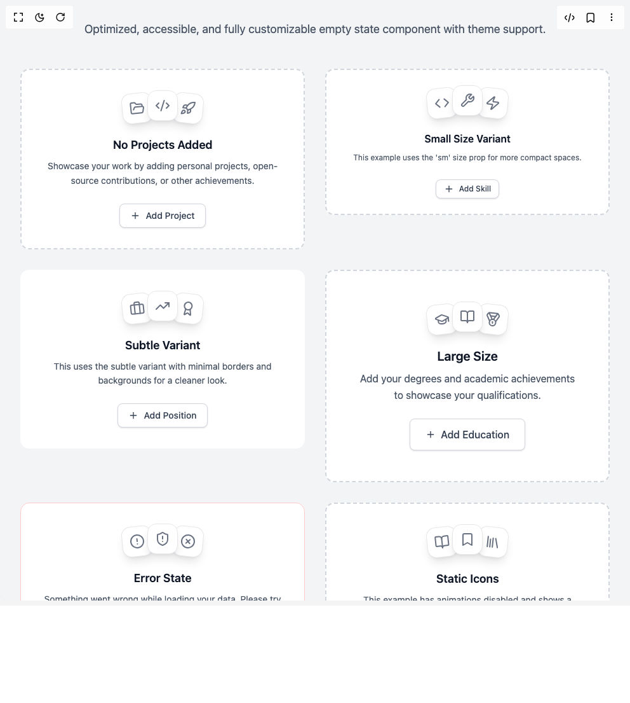

# Build Interactive Empty State in BuilderStudio

> Build this component in our Agentic IDE: [BuilderStudio](https://builderstudio.dev).
>
> Join the BuilderStudio community on [Discord](https://discord.gg/QdWeSGCqfe) and [Reddit](https://reddit.com/r/builderstudio).



## Component

- Author group: `remcostoeten`
- Component: `interactive-empty-state`
- Variant: `default`
- Rendered HTML snapshot: [`rendered.html`](rendered.html)

## BuilderStudio prompt

You are implementing a React component based on a component reference.

## Component identity

- Author: remcostoeten
- Component slug: interactive-empty-state
- Demo slug: default
- Title: interactive-empty-state
- Description: 

## Goal

Recreate this component in a React + TypeScript + Tailwind CSS project. Preserve the visual layout, spacing, colors, border radius, shadows, interaction behavior, animation behavior, responsive behavior, and dark mode behavior shown in the rendered demo.

## Implementation requirements

- Use React and TypeScript.
- Use Tailwind CSS classes whenever possible.
- Keep the component self-contained unless the source files require helper components.
- If the source uses CSS variables, custom CSS, animations, or keyframes, include them.
- If the source uses external packages, list and use the required packages.
- Preserve accessibility attributes, button semantics, links, keyboard behavior, and ARIA attributes when visible in the source.
- Do not replace the component with a simplified placeholder.
- Return complete production-ready code.

## Dependencies

No reference metadata available.

## Rendered DOM snapshot

This is the rendered demo HTML extracted from the live preview. Use it to verify structure, class names, visible content, and layout.

```html
<div id="root"><div class="w-screen min-h-screen flex justify-center items-center"><div class="w-screen min-h-screen flex justify-center items-center"><div class="min-h-screen font-sans p-4 sm:p-8 bg-gray-100"><div class="max-w-7xl mx-auto"><header class="text-center mb-12"><p class="text-base sm:text-lg max-w-3xl mx-auto text-gray-600" style="opacity: 1; transform: none;">Optimized, accessible, and fully customizable empty state component with theme support.</p></header><main class="grid grid-cols-1 md:grid-cols-2 lg:grid-cols-3 gap-8"><div style="opacity: 1; transform: none;"><section role="region" aria-labelledby="«r0»" aria-describedby="«r1»" class="group transition-all duration-300 rounded-xl relative overflow-hidden text-center flex flex-col items-center justify-center p-8 bg-white border-dashed border-2 border-gray-300 hover:border-gray-400 hover:bg-gray-50/50"><div aria-hidden="true" class="absolute inset-0 opacity-0 group-hover:opacity-[0.02] transition-opacity duration-500" style="background-image: radial-gradient(circle at 2px 2px, rgb(255, 255, 255) 1px, transparent 1px); background-size: 24px 24px;"></div><div class="relative z-10 flex flex-col items-center"><div class="mb-6"><div class="flex justify-center isolate relative"><div class="w-12 h-12 rounded-xl flex items-center justify-center relative shadow-lg transition-all duration-300 bg-white border border-gray-200 group-hover:shadow-xl group-hover:border-gray-300 left-2 top-1 z-10" style="opacity: 1; transform: rotate(-6deg);"><div class="text-sm transition-colors duration-300 text-gray-500 group-hover:text-gray-700"><svg xmlns="http://www.w3.org/2000/svg" width="24" height="24" viewBox="0 0 24 24" fill="none" stroke="currentColor" stroke-width="2" stroke-linecap="round" stroke-linejoin="round" class="lucide lucide-folder-open h-6 w-6" aria-hidden="true"><path d="m6 14 1.5-2.9A2 2 0 0 1 9.24 10H20a2 2 0 0 1 1.94 2.5l-1.54 6a2 2 0 0 1-1.95 1.5H4a2 2 0 0 1-2-2V5a2 2 0 0 1 2-2h3.9a2 2 0 0 1 1.69.9l.81 1.2a2 2 0 0 0 1.67.9H18a2 2 0 0 1 2 2v2"></path></svg></div></div><div class="w-12 h-12 rounded-xl flex items-center justify-center relative shadow-lg transition-all duration-300 bg-white border border-gray-200 group-hover:shadow-xl group-hover:border-gray-300 z-20" style="opacity: 1; transform: none;"><div class="text-sm transition-colors duration-300 text-gray-500 group-hover:text-gray-700"><svg xmlns="http://www.w3.org/2000/svg" width="24" height="24" viewBox="0 0 24 24" fill="none" stroke="currentColor" stroke-width="2" stroke-linecap="round" stroke-linejoin="round" class="lucide lucide-code-xml h-6 w-6" aria-hidden="true"><path d="m18 16 4-4-4-4"></path><path d="m6 8-4 4 4 4"></path><path d="m14.5 4-5 16"></path></svg></div></div><div class="w-12 h-12 rounded-xl flex items-center justify-center relative shadow-lg transition-all duration-300 bg-white border border-gray-200 group-hover:shadow-xl group-hover:border-gray-300 right-2 top-1 z-10" style="opacity: 1; transform: rotate(6deg);"><div class="text-sm transition-colors duration-300 text-gray-500 group-hover:text-gray-700"><svg xmlns="http://www.w3.org/2000/svg" width="24" height="24" viewBox="0 0 24 24" fill="none" stroke="currentColor" stroke-width="2" stroke-linecap="round" stroke-linejoin="round" class="lucide lucide-rocket h-6 w-6" aria-hidden="true"><path d="M4.5 16.5c-1.5 1.26-2 5-2 5s3.74-.5 5-2c.71-.84.7-2.13-.09-2.91a2.18 2.18 0 0 0-2.91-.09z"></path><path d="m12 15-3-3a22 22 0 0 1 2-3.95A12.88 12.88 0 0 1 22 2c0 2.72-.78 7.5-6 11a22.35 22.35 0 0 1-4 2z"></path><path d="M9 12H4s.55-3.03 2-4c1.62-1.08 5 0 5 0"></path><path d="M12 15v5s3.03-.55 4-2c1.08-1.62 0-5 0-5"></path></svg></div></div></div></div><div class="space-y-2 mb-6" style="opacity: 1; transform: none;"><h2 id="«r0»" class="text-lg text-gray-900 font-semibold transition-colors duration-200">No Projects Added</h2><p id="«r1»" class="text-sm text-gray-600  transition-colors duration-200 max-w-md leading-relaxed">Showcase your work by adding personal projects, open-source contributions, or other achievements.</p></div><div style="opacity: 1; transform: none;"><button type="button" class="inline-flex items-center gap-2 border rounded-md font-medium shadow-sm hover:shadow-md transition-all duration-200 relative overflow-hidden group/button disabled:opacity-50 disabled:cursor-not-allowed text-sm px-4 py-2 border-gray-300 bg-white hover:bg-gray-50 text-gray-700" tabindex="0"><div class="transition-transform group-hover/button:rotate-90"><svg xmlns="http://www.w3.org/2000/svg" width="24" height="24" viewBox="0 0 24 24" fill="none" stroke="currentColor" stroke-width="2" stroke-linecap="round" stroke-linejoin="round" class="lucide lucide-plus h-4 w-4" aria-hidden="true"><path d="M5 12h14"></path><path d="M12 5v14"></path></svg></div><span class="relative z-10">Add Project</span></button></div></div></section></div><div style="opacity: 1; transform: none;"><section role="region" aria-labelledby="«r2»" aria-describedby="«r3»" class="group transition-all duration-300 rounded-xl relative overflow-hidden text-center flex flex-col items-center justify-center p-6 bg-white border-dashed border-2 border-gray-300 hover:border-gray-400 hover:bg-gray-50/50"><div aria-hidden="true" class="absolute inset-0 opacity-0 group-hover:opacity-[0.02] transition-opacity duration-500" style="background-image: radial-gradient(circle at 2px 2px, rgb(255, 255, 255) 1px, transparent 1px); background-size: 24px 24px;"></div><div class="relative z-10 flex flex-col items-center"><div class="mb-6"><div class="flex justify-center isolate relative"><div class="w-12 h-12 rounded-xl flex items-center justify-center relative shadow-lg transition-all duration-300 bg-white border border-gray-200 group-hover:shadow-xl group-hover:border-gray-300 left-2 top-1 z-10" style="opacity: 1; transform: rotate(-6deg);"><div class="text-sm transition-colors duration-300 text-gray-500 group-hover:text-gray-700"><svg xmlns="http://www.w3.org/2000/svg" width="24" height="24" viewBox="0 0 24 24" fill="none" stroke="currentColor" stroke-width="2" stroke-linecap="round" stroke-linejoin="round" class="lucide lucide-code h-6 w-6" aria-hidden="true"><polyline points="16 18 22 12 16 6"></polyline><polyline points="8 6 2 12 8 18"></polyline></svg></div></div><div class="w-12 h-12 rounded-xl flex items-center justify-center relative shadow-lg transition-all duration-300 bg-white border border-gray-200 group-hover:shadow-xl group-hover:border-gray-300 z-20" style="opacity: 1; transform: none;"><div class="text-sm transition-colors duration-300 text-gray-500 group-hover:text-gray-700"><svg xmlns="http://www.w3.org/2000/svg" width="24" height="24" viewBox="0 0 24 24" fill="none" stroke="currentColor" stroke-width="2" stroke-linecap="round" stroke-linejoin="round" class="lucide lucide-wrench h-6 w-6" aria-hidden="true"><path d="M14.7 6.3a1 1 0 0 0 0 1.4l1.6 1.6a1 1 0 0 0 1.4 0l3.77-3.77a6 6 0 0 1-7.94 7.94l-6.91 6.91a2.12 2.12 0 0 1-3-3l6.91-6.91a6 6 0 0 1 7.94-7.94l-3.76 3.76z"></path></svg></div></div><div class="w-12 h-12 rounded-xl flex items-center justify-center relative shadow-lg transition-all duration-300 bg-white border border-gray-200 group-hover:shadow-xl group-hover:border-gray-300 right-2 top-1 z-10" style="opacity: 1; transform: rotate(6deg);"><div class="text-sm transition-colors duration-300 text-gray-500 group-hover:text-gray-700"><svg xmlns="http://www.w3.org/2000/svg" width="24" height="24" viewBox="0 0 24 24" fill="none" stroke="currentColor" stroke-width="2" stroke-linecap="round" stroke-linejoin="round" class="lucide lucide-zap h-6 w-6" aria-hidden="true"><path d="M4 14a1 1 0 0 1-.78-1.63l9.9-10.2a.5.5 0 0 1 .86.46l-1.92 6.02A1 1 0 0 0 13 10h7a1 1 0 0 1 .78 1.63l-9.9 10.2a.5.5 0 0 1-.86-.46l1.92-6.02A1 1 0 0 0 11 14z"></path></svg></div></div></div></div><div class="space-y-2 mb-6" style="opacity: 1; transform: none;"><h2 id="«r2»" class="text-base text-gray-900 font-semibold transition-colors duration-200">Small Size Variant</h2><p id="«r3»" class="text-xs text-gray-600  transition-colors duration-200 max-w-md leading-relaxed">This example uses the 'sm' size prop for more compact spaces.</p></div><div style="opacity: 1; transform: none;"><button type="button" class="inline-flex items-center gap-2 border rounded-md font-medium shadow-sm hover:shadow-md transition-all duration-200 relative overflow-hidden group/button disabled:opacity-50 disabled:cursor-not-allowed text-xs px-3 py-1.5 border-gray-300 bg-white hover:bg-gray-50 text-gray-700" tabindex="0"><div class="transition-transform group-hover/button:rotate-90"><svg xmlns="http://www.w3.org/2000/svg" width="24" height="24" viewBox="0 0 24 24" fill="none" stroke="currentColor" stroke-width="2" stroke-linecap="round" stroke-linejoin="round" class="lucide lucide-plus h-4 w-4" aria-hidden="true"><path d="M5 12h14"></path><path d="M12 5v14"></path></svg></div><span class="relative z-10">Add Skill</span></button></div></div></section></div><div style="opacity: 1; transform: none;"><section role="region" aria-labelledby="«r4»" aria-describedby="«r5»" class="group transition-all duration-300 rounded-xl relative overflow-hidden text-center flex flex-col items-center justify-center p-8 bg-white border border-transparent hover:bg-gray-50/30"><div aria-hidden="true" class="absolute inset-0 opacity-0 group-hover:opacity-[0.02] transition-opacity duration-500" style="background-image: radial-gradient(circle at 2px 2px, rgb(255, 255, 255) 1px, transparent 1px); background-size: 24px 24px;"></div><div class="relative z-10 flex flex-col items-center"><div class="mb-6"><div class="flex justify-center isolate relative"><div class="w-12 h-12 rounded-xl flex items-center justify-center relative shadow-lg transition-all duration-300 bg-white border border-gray-200 group-hover:shadow-xl group-hover:border-gray-300 left-2 top-1 z-10" style="opacity: 1; transform: rotate(-6deg);"><div class="text-sm transition-colors duration-300 text-gray-500 group-hover:text-gray-700"><svg xmlns="http://www.w3.org/2000/svg" width="24" height="24" viewBox="0 0 24 24" fill="none" stroke="currentColor" stroke-width="2" stroke-linecap="round" stroke-linejoin="round" class="lucide lucide-briefcase h-6 w-6" aria-hidden="true"><path d="M16 20V4a2 2 0 0 0-2-2h-4a2 2 0 0 0-2 2v16"></path><rect width="20" height="14" x="2" y="6" rx="2"></rect></svg></div></div><div class="w-12 h-12 rounded-xl flex items-center justify-center relative shadow-lg transition-all duration-300 bg-white border border-gray-200 group-hover:shadow-xl group-hover:border-gray-300 z-20" style="opacity: 1; transform: none;"><div class="text-sm transition-colors duration-300 text-gray-500 group-hover:text-gray-700"><svg xmlns="http://www.w3.org/2000/svg" width="24" height="24" viewBox="0 0 24 24" fill="none" stroke="currentColor" stroke-width="2" stroke-linecap="round" stroke-linejoin="round" class="lucide lucide-trending-up h-6 w-6" aria-hidden="true"><polyline points="22 7 13.5 15.5 8.5 10.5 2 17"></polyline><polyline points="16 7 22 7 22 13"></polyline></svg></div></div><div class="w-12 h-12 rounded-xl flex items-center justify-center relative shadow-lg transition-all duration-300 bg-white border border-gray-200 group-hover:shadow-xl group-hover:border-gray-300 right-2 top-1 z-10" style="opacity: 1; transform: rotate(6deg);"><div class="text-sm transition-colors duration-300 text-gray-500 group-hover:text-gray-700"><svg xmlns="http://www.w3.org/2000/svg" width="24" height="24" viewBox="0 0 24 24" fill="none" stroke="currentColor" stroke-width="2" stroke-linecap="round" stroke-linejoin="round" class="lucide lucide-award h-6 w-6" aria-hidden="true"><path d="m15.477 12.89 1.515 8.526a.5.5 0 0 1-.81.47l-3.58-2.687a1 1 0 0 0-1.197 0l-3.586 2.686a.5.5 0 0 1-.81-.469l1.514-8.526"></path><circle cx="12" cy="8" r="6"></circle></svg></div></div></div></div><div class="space-y-2 mb-6" style="opacity: 1; transform: none;"><h2 id="«r4»" class="text-lg text-gray-900 font-semibold transition-colors duration-200">Subtle Variant</h2><p id="«r5»" class="text-sm text-gray-600  transition-colors duration-200 max-w-md leading-relaxed">This uses the subtle variant with minimal borders and backgrounds for a cleaner look.</p></div><div style="opacity: 1; transform: none;"><button type="button" class="inline-flex items-center gap-2 border rounded-md font-medium shadow-sm hover:shadow-md transition-all duration-200 relative overflow-hidden group/button disabled:opacity-50 disabled:cursor-not-allowed text-sm px-4 py-2 border-gray-300 bg-white hover:bg-gray-50 text-gray-700" tabindex="0"><div class="transition-transform group-hover/button:rotate-90"><svg xmlns="http://www.w3.org/2000/svg" width="24" height="24" viewBox="0 0 24 24" fill="none" stroke="currentColor" stroke-width="2" stroke-linecap="round" stroke-linejoin="round" class="lucide lucide-plus h-4 w-4" aria-hidden="true"><path d="M5 12h14"></path><path d="M12 5v14"></path></svg></div><span class="relative z-10">Add Position</span></button></div></div></section></div><div style="opacity: 1; transform: none;"><section role="region" aria-labelledby="«r6»" aria-describedby="«r7»" class="group transition-all duration-300 rounded-xl relative overflow-hidden text-center flex flex-col items-center justify-center p-12 bg-white border-dashed border-2 border-gray-300 hover:border-gray-400 hover:bg-gray-50/50"><div aria-hidden="true" class="absolute inset-0 opacity-0 group-hover:opacity-[0.02] transition-opacity duration-500" style="background-image: radial-gradient(circle at 2px 2px, rgb(255, 255, 255) 1px, transparent 1px); background-size: 24px 24px;"></div><div class="relative z-10 flex flex-col items-center"><div class="mb-6"><div class="flex justify-center isolate relative"><div class="w-12 h-12 rounded-xl flex items-center justify-center relative shadow-lg transition-all duration-300 bg-white border border-gray-200 group-hover:shadow-xl group-hover:border-gray-300 left-2 top-1 z-10" style="opacity: 1; transform: rotate(-6deg);"><div class="text-sm transition-colors duration-300 text-gray-500 group-hover:text-gray-700"><svg xmlns="http://www.w3.org/2000/svg" width="24" height="24" viewBox="0 0 24 24" fill="none" stroke="currentColor" stroke-width="2" stroke-linecap="round" stroke-linejoin="round" class="lucide lucide-graduation-cap h-6 w-6" aria-hidden="true"><path d="M21.42 10.922a1 1 0 0 0-.019-1.838L12.83 5.18a2 2 0 0 0-1.66 0L2.6 9.08a1 1 0 0 0 0 1.832l8.57 3.908a2 2 0 0 0 1.66 0z"></path><path d="M22 10v6"></path><path d="M6 12.5V16a6 3 0 0 0 12 0v-3.5"></path></svg></div></div><div class="w-12 h-12 rounded-xl flex items-center justify-center relative shadow-lg transition-all duration-300 bg-white border border-gray-200 group-hover:shadow-xl group-hover:border-gray-300 z-20" style="opacity: 1; transform: none;"><div class="text-sm transition-colors duration-300 text-gray-500 group-hover:text-gray-700"><svg xmlns="http://www.w3.org/2000/svg" width="24" height="24" viewBox="0 0 24 24" fill="none" stroke="currentColor" stroke-width="2" stroke-linecap="round" stroke-linejoin="round" class="lucide lucide-book-open h-6 w-6" aria-hidden="true"><path d="M12 7v14"></path><path d="M3 18a1 1 0 0 1-1-1V4a1 1 0 0 1 1-1h5a4 4 0 0 1 4 4 4 4 0 0 1 4-4h5a1 1 0 0 1 1 1v13a1 1 0 0 1-1 1h-6a3 3 0 0 0-3 3 3 3 0 0 0-3-3z"></path></svg></div></div><div class="w-12 h-12 rounded-xl flex items-center justify-center relative shadow-lg transition-all duration-300 bg-white border border-gray-200 group-hover:shadow-xl group-hover:border-gray-300 right-2 top-1 z-10" style="opacity: 1; transform: rotate(6deg);"><div class="text-sm transition-colors duration-300 text-gray-500 group-hover:text-gray-700"><svg xmlns="http://www.w3.org/2000/svg" width="24" height="24" viewBox="0 0 24 24" fill="none" stroke="currentColor" stroke-width="2" stroke-linecap="round" stroke-linejoin="round" class="lucide lucide-medal h-6 w-6" aria-hidden="true"><path d="M7.21 15 2.66 7.14a2 2 0 0 1 .13-2.2L4.4 2.8A2 2 0 0 1 6 2h12a2 2 0 0 1 1.6.8l1.6 2.14a2 2 0 0 1 .14 2.2L16.79 15"></path><path d="M11 12 5.12 2.2"></path><path d="m13 12 5.88-9.8"></path><path d="M8 7h8"></path><circle cx="12" cy="17" r="5"></circle><path d="M12 18v-2h-.5"></path></svg></div></div></div></div><div class="space-y-2 mb-6" style="opacity: 1; transform: none;"><h2 id="«r6»" class="text-xl text-gray-900 font-semibold transition-colors duration-200">Large Size</h2><p id="«r7»" class="text-base text-gray-600  transition-colors duration-200 max-w-md leading-relaxed">Add your degrees and academic achievements to showcase your qualifications.</p></div><div style="opacity: 1; transform: none;"><button type="button" class="inline-flex items-center gap-2 border rounded-md font-medium shadow-sm hover:shadow-md transition-all duration-200 relative overflow-hidden group/button disabled:opacity-50 disabled:cursor-not-allowed text-base px-6 py-3 border-gray-300 bg-white hover:bg-gray-50 text-gray-700" tabindex="0"><div class="transition-transform group-hover/button:rotate-90"><svg xmlns="http://www.w3.org/2000/svg" width="24" height="24" viewBox="0 0 24 24" fill="none" stroke="currentColor" stroke-width="2" stroke-linecap="round" stroke-linejoin="round" class="lucide lucide-plus h-4 w-4" aria-hidden="true"><path d="M5 12h14"></path><path d="M12 5v14"></path></svg></div><span class="relative z-10">Add Education</span></button></div></div></section></div><div style="opacity: 1; transform: none;"><section role="region" aria-labelledby="«r8»" aria-describedby="«r9»" class="group transition-all duration-300 rounded-xl relative overflow-hidden text-center flex flex-col items-center justify-center p-8 bg-white border border-red-200 bg-red-50/50 hover:bg-red-50/80"><div aria-hidden="true" class="absolute inset-0 opacity-0 group-hover:opacity-[0.02] transition-opacity duration-500" style="background-image: radial-gradient(circle at 2px 2px, rgb(255, 255, 255) 1px, transparent 1px); background-size: 24px 24px;"></div><div class="relative z-10 flex flex-col items-center"><div class="mb-6"><div class="flex justify-center isolate relative"><div class="w-12 h-12 rounded-xl flex items-center justify-center relative shadow-lg transition-all duration-300 bg-white border border-gray-200 group-hover:shadow-xl group-hover:border-gray-300 left-2 top-1 z-10" style="opacity: 1; transform: rotate(-6deg);"><div class="text-sm transition-colors duration-300 text-gray-500 group-hover:text-gray-700"><svg xmlns="http://www.w3.org/2000/svg" width="24" height="24" viewBox="0 0 24 24" fill="none" stroke="currentColor" stroke-width="2" stroke-linecap="round" stroke-linejoin="round" class="lucide lucide-circle-alert h-6 w-6" aria-hidden="true"><circle cx="12" cy="12" r="10"></circle><line x1="12" x2="12" y1="8" y2="12"></line><line x1="12" x2="12.01" y1="16" y2="16"></line></svg></div></div><div class="w-12 h-12 rounded-xl flex items-center justify-center relative shadow-lg transition-all duration-300 bg-white border border-gray-200 group-hover:shadow-xl group-hover:border-gray-300 z-20" style="opacity: 1; transform: none;"><div class="text-sm transition-colors duration-300 text-gray-500 group-hover:text-gray-700"><svg xmlns="http://www.w3.org/2000/svg" width="24" height="24" viewBox="0 0 24 24" fill="none" stroke="currentColor" stroke-width="2" stroke-linecap="round" stroke-linejoin="round" class="lucide lucide-shield-alert h-6 w-6" aria-hidden="true"><path d="M20 13c0 5-3.5 7.5-7.66 8.95a1 1 0 0 1-.67-.01C7.5 20.5 4 18 4 13V6a1 1 0 0 1 1-1c2 0 4.5-1.2 6.24-2.72a1.17 1.17 0 0 1 1.52 0C14.51 3.81 17 5 19 5a1 1 0 0 1 1 1z"></path><path d="M12 8v4"></path><path d="M12 16h.01"></path></svg></div></div><div class="w-12 h-12 rounded-xl flex items-center justify-center relative shadow-lg transition-all duration-300 bg-white border border-gray-200 group-hover:shadow-xl group-hover:border-gray-300 right-2 top-1 z-10" style="opacity: 1; transform: rotate(6deg);"><div class="text-sm transition-colors duration-300 text-gray-500 group-hover:text-gray-700"><svg xmlns="http://www.w3.org/2000/svg" width="24" height="24" viewBox="0 0 24 24" fill="none" stroke="currentColor" stroke-width="2" stroke-linecap="round" stroke-linejoin="round" class="lucide lucide-circle-x h-6 w-6" aria-hidden="true"><circle cx="12" cy="12" r="10"></circle><path d="m15 9-6 6"></path><path d="m9 9 6 6"></path></svg></div></div></div></div><div class="space-y-2 mb-6" style="opacity: 1; transform: none;"><h2 id="«r8»" class="text-lg text-gray-900 font-semibold transition-colors duration-200">Error State</h2><p id="«r9»" class="text-sm text-gray-600  transition-colors duration-200 max-w-md leading-relaxed">Something went wrong while loading your data. Please try again.</p></div><div style="opacity: 1; transform: none;"><button type="button" class="inline-flex items-center gap-2 border rounded-md font-medium shadow-sm hover:shadow-md transition-all duration-200 relative overflow-hidden group/button disabled:opacity-50 disabled:cursor-not-allowed text-sm px-4 py-2 border-gray-300 bg-white hover:bg-gray-50 text-gray-700" tabindex="0"><span class="relative z-10">Retry</span></button></div></div></section></div><div style="opacity: 1; transform: none;"><section role="region" aria-labelledby="«ra»" aria-describedby="«rb»" class="group transition-all duration-300 rounded-xl relative overflow-hidden text-center flex flex-col items-center justify-center p-8 bg-white border-dashed border-2 border-gray-300 hover:border-gray-400 hover:bg-gray-50/50"><div aria-hidden="true" class="absolute inset-0 opacity-0 group-hover:opacity-[0.02] transition-opacity duration-500" style="background-image: radial-gradient(circle at 2px 2px, rgb(255, 255, 255) 1px, transparent 1px); background-size: 24px 24px;"></div><div class="relative z-10 flex flex-col items-center"><div class="mb-6"><div class="flex justify-center isolate relative"><div class="w-12 h-12 rounded-xl flex items-center justify-center relative shadow-lg transition-all duration-300 bg-white border border-gray-200 group-hover:shadow-xl group-hover:border-gray-300 left-2 top-1 z-10" style="opacity: 1; transform: rotate(-6deg);"><div class="text-sm transition-colors duration-300 text-gray-500 group-hover:text-gray-700"><svg xmlns="http://www.w3.org/2000/svg" width="24" height="24" viewBox="0 0 24 24" fill="none" stroke="currentColor" stroke-width="2" stroke-linecap="round" stroke-linejoin="round" class="lucide lucide-book-open h-6 w-6" aria-hidden="true"><path d="M12 7v14"></path><path d="M3 18a1 1 0 0 1-1-1V4a1 1 0 0 1 1-1h5a4 4 0 0 1 4 4 4 4 0 0 1 4-4h5a1 1 0 0 1 1 1v13a1 1 0 0 1-1 1h-6a3 3 0 0 0-3 3 3 3 0 0 0-3-3z"></path></svg></div></div><div class="w-12 h-12 rounded-xl flex items-center justify-center relative shadow-lg transition-all duration-300 bg-white border border-gray-200 group-hover:shadow-xl group-hover:border-gray-300 z-20" style="opacity: 1; transform: none;"><div class="text-sm transition-colors duration-300 text-gray-500 group-hover:text-gray-700"><svg xmlns="http://www.w3.org/2000/svg" width="24" height="24" viewBox="0 0 24 24" fill="none" stroke="currentColor" stroke-width="2" stroke-linecap="round" stroke-linejoin="round" class="lucide lucide-bookmark h-6 w-6" aria-hidden="true"><path d="m19 21-7-4-7 4V5a2 2 0 0 1 2-2h10a2 2 0 0 1 2 2v16z"></path></svg></div></div><div class="w-12 h-12 rounded-xl flex items-center justify-center relative shadow-lg transition-all duration-300 bg-white border border-gray-200 group-hover:shadow-xl group-hover:border-gray-300 right-2 top-1 z-10" style="opacity: 1; transform: rotate(6deg);"><div class="text-sm transition-colors duration-300 text-gray-500 group-hover:text-gray-700"><svg xmlns="http://www.w3.org/2000/svg" width="24" height="24" viewBox="0 0 24 24" fill="none" stroke="currentColor" stroke-width="2" stroke-linecap="round" stroke-linejoin="round" class="lucide lucide-library h-6 w-6" aria-hidden="true"><path d="m16 6 4 14"></path><path d="M12 6v14"></path><path d="M8 8v12"></path><path d="M4 4v16"></path></svg></div></div></div></div><div class="space-y-2 mb-6" style="opacity: 1; transform: none;"><h2 id="«ra»" class="text-lg text-gray-900 font-semibold transition-colors duration-200">Static Icons</h2><p id="«rb»" class="text-sm text-gray-600  transition-colors duration-200 max-w-md leading-relaxed">This example has animations disabled and shows a reading list state.</p></div><div style="opacity: 1; transform: none;"><button type="button" class="inline-flex items-center gap-2 border rounded-md font-medium shadow-sm hover:shadow-md transition-all duration-200 relative overflow-hidden group/button disabled:opacity-50 disabled:cursor-not-allowed text-sm px-4 py-2 border-gray-300 bg-white hover:bg-gray-50 text-gray-700" tabindex="0"><div class="transition-transform group-hover/button:rotate-90"><svg xmlns="http://www.w3.org/2000/svg" width="24" height="24" viewBox="0 0 24 24" fill="none" stroke="currentColor" stroke-width="2" stroke-linecap="round" stroke-linejoin="round" class="lucide lucide-mouse-pointer-click h-4 w-4" aria-hidden="true"><path d="M14 4.1 12 6"></path><path d="m5.1 8-2.9-.8"></path><path d="m6 12-1.9 2"></path><path d="M7.2 2.2 8 5.1"></path><path d="M9.037 9.69a.498.498 0 0 1 .653-.653l11 4.5a.5.5 0 0 1-.074.949l-4.349 1.041a1 1 0 0 0-.74.739l-1.04 4.35a.5.5 0 0 1-.95.074z"></path></svg></div><span class="relative z-10">Explore Books</span></button></div></div></section></div></main></div></div></div></div></div>
```

## Reference source files

No reference source files were available.
