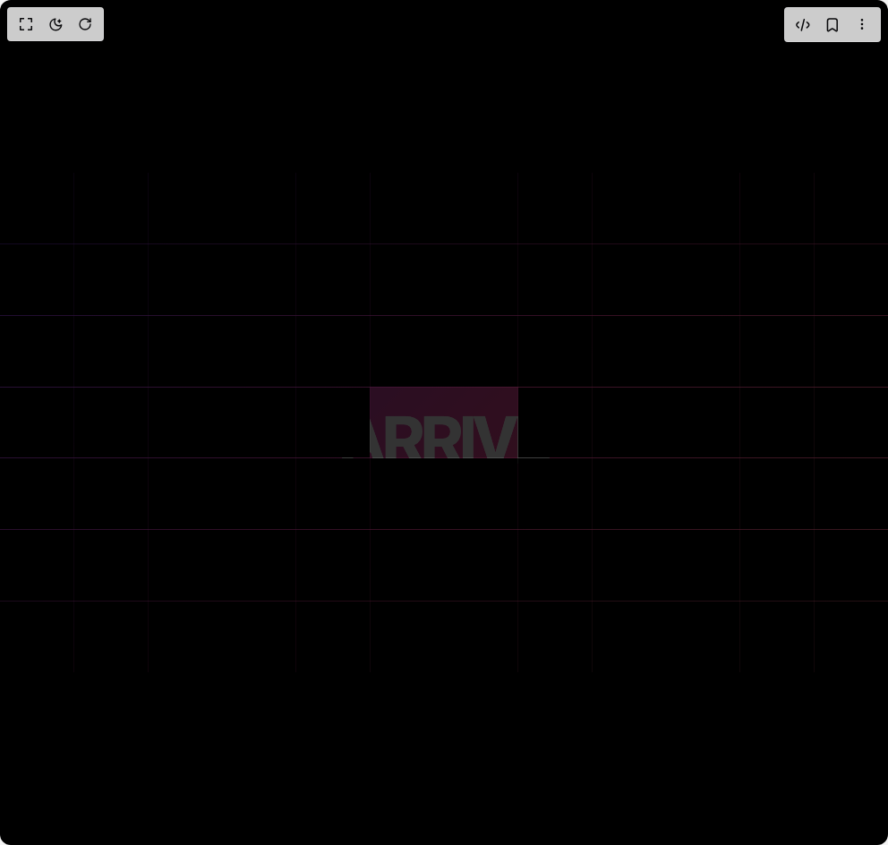
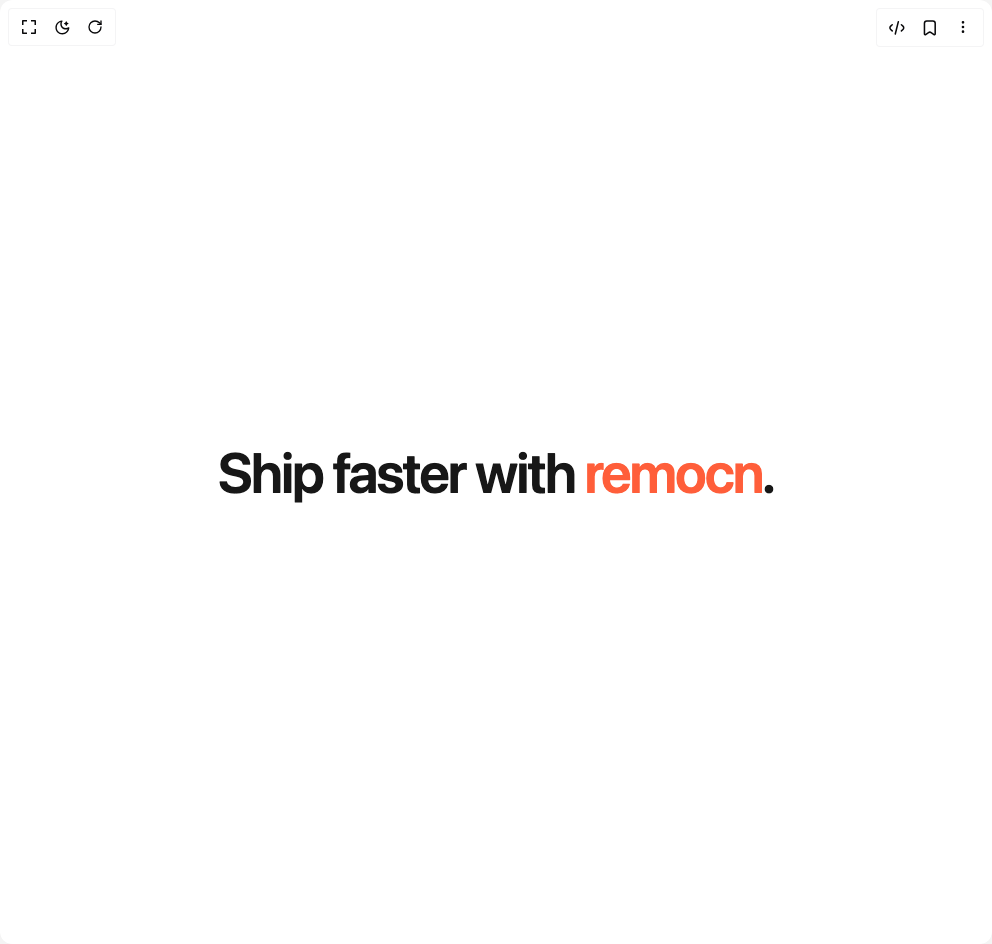
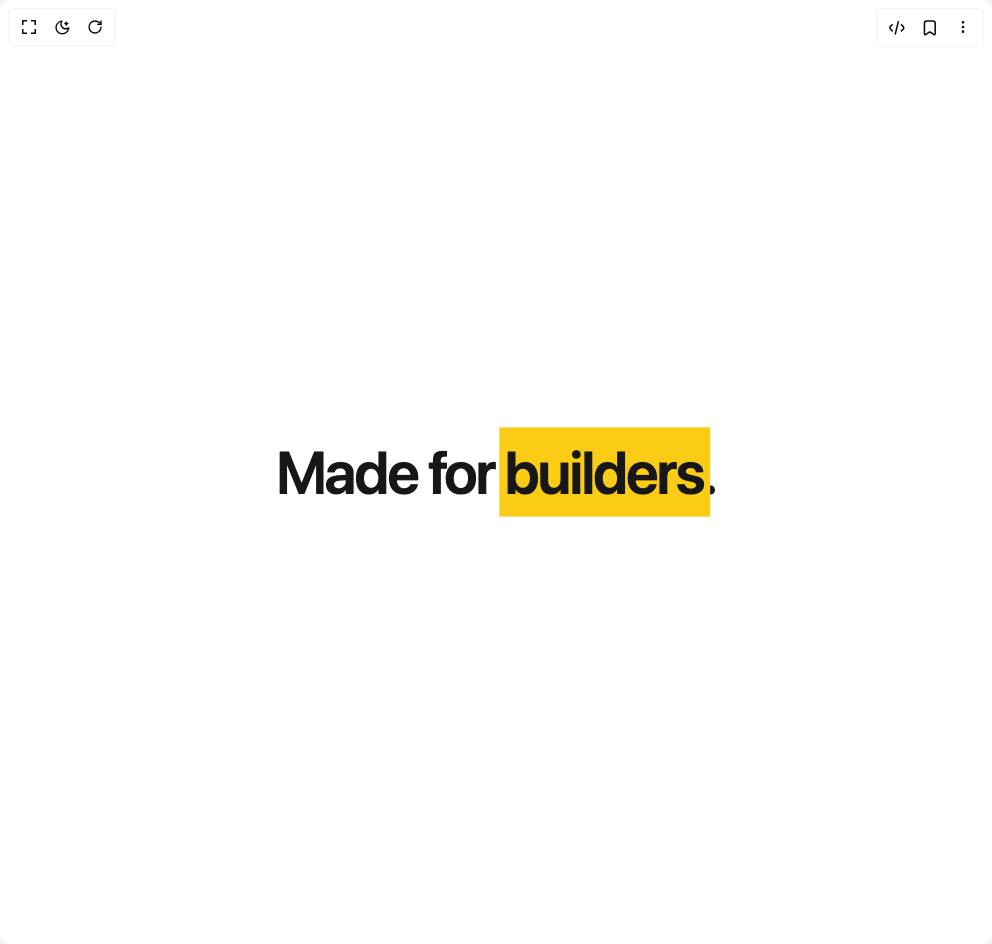
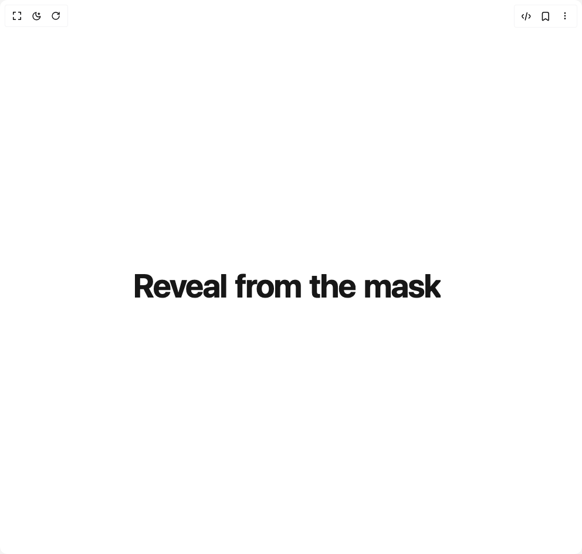
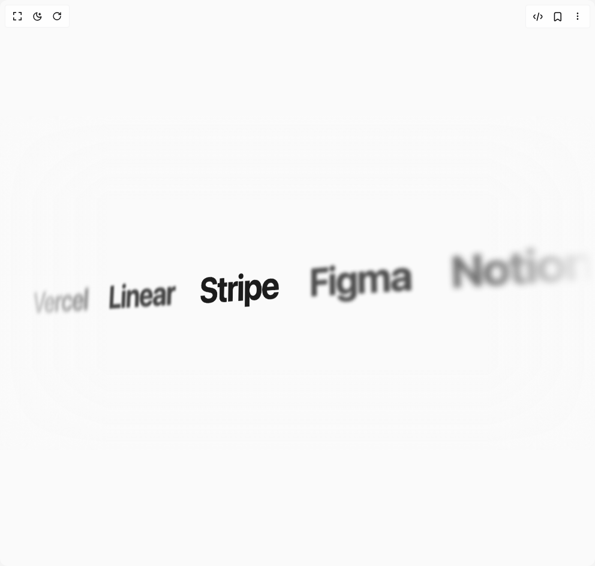
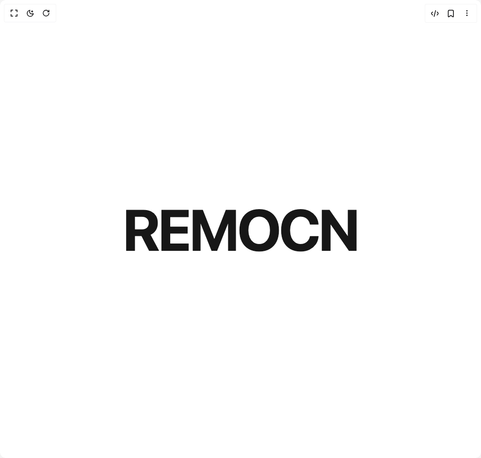

# Remocn Components

7 components are available in this author group.

> Build any component in [BuilderStudio](https://builderstudio.dev), then share improvements with the community on [Discord](https://discord.gg/QdWeSGCqfe) or [Reddit](https://reddit.com/r/builderstudio).

| Preview | Component | Variant |
| --- | --- | --- |
|  | [Grid Pixelate Wipe](grid-pixelate-wipe/default/README.md) | `default` |
|  | [Infinite Bento Pan](infinite-bento-pan/default/README.md) | `default` |
|  | [Inline Highlight](inline-highlight/default/README.md) | `default` |
|  | [Marker Highlight](marker-highlight/default/README.md) | `default` |
|  | [Masked Slide Reveal](masked-slide-reveal/default/README.md) | `default` |
|  | [Remocn Perspective Marquee](remocn-perspective-marquee/default/README.md) | `default` |
|  | [Tracking In](tracking-in/default/README.md) | `default` |
