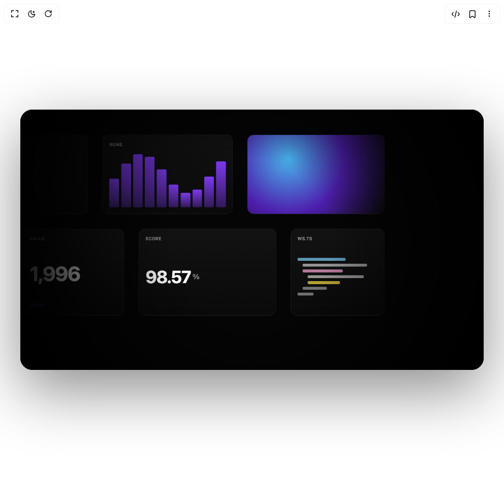

# Build Infinite Bento Pan in BuilderStudio

> Build this component in our Agentic IDE: [BuilderStudio](https://builderstudio.dev).
>
> Join the BuilderStudio community on [Discord](https://discord.gg/QdWeSGCqfe) and [Reddit](https://reddit.com/r/builderstudio).



## Component

- Author group: `remocn`
- Component: `infinite-bento-pan`
- Variant: `default`
- Rendered HTML snapshot: [`rendered.html`](rendered.html)

## BuilderStudio prompt

You are implementing a React component based on a component reference.

## Component identity

- Author: Remocn
- Component slug: infinite-bento-pan
- Demo slug: default
- Title: infinite-bento-pan
- Description: 

## Goal

Recreate this component in a React + TypeScript + Tailwind CSS project. Preserve the visual layout, spacing, colors, border radius, shadows, interaction behavior, animation behavior, responsive behavior, and dark mode behavior shown in the rendered demo.

## Implementation requirements

- Use React and TypeScript.
- Use Tailwind CSS classes whenever possible.
- Keep the component self-contained unless the source files require helper components.
- If the source uses CSS variables, custom CSS, animations, or keyframes, include them.
- If the source uses external packages, list and use the required packages.
- Preserve accessibility attributes, button semantics, links, keyboard behavior, and ARIA attributes when visible in the source.
- Do not replace the component with a simplified placeholder.
- Return complete production-ready code.

## Dependencies

No reference metadata available.

## Rendered DOM snapshot

This is the rendered demo HTML extracted from the live preview. Use it to verify structure, class names, visible content, and layout.

```html
<div id="root"><div class="w-screen min-h-screen flex justify-center items-center"><div class="fixed top-4 left-4 z-10"><select class="appearance-none h-8 max-w-[200px] text-sm leading-tight rounded-lg pl-3 pr-7 py-0 border bg-background focus:outline-none focus:ring-0"><option value="default.tsx_InfiniteBentoPanDemo">default.tsx</option></select><div class="absolute top-1/2 transform -translate-y-1/2 right-2 pointer-events-none"><svg class="w-4 h-4 fill-current" viewBox="0 0 20 20"><path d="M5.516 7.548c.436-.446 1.043-.48 1.576 0L10 10.405l2.908-2.857c.533-.48 1.14-.446 1.576 0 .436.445.408 1.197 0 1.615l-3.734 3.705c-.533.534-1.39.534-1.923 0l-3.734-3.705c-.408-.418-.436-1.17 0-1.615z"></path></svg></div></div><div class="w-screen min-h-screen flex justify-center items-center"><div class="flex w-full min-h-screen items-center justify-center overflow-hidden bg-background p-6 md:p-10"><div class="w-full max-w-[1200px]"><audio preload="metadata" src="data:audio/mp3;base64,/+MYxAAJcAV8AAgAABn//////+/gQ5BAMA+D4Pg+BAQBAEAwD4Pg+D4EBAEAQDAPg++hYBH///hUFQVBUFREDQNHmf///////+MYxBUGkAGIMAAAAP/29Xt6lUxBTUUzLjEwMFVVVVVVVVVVVVVVVVVVVVVVVVVVVVVVVVVVVVVVVVVVVVVVVVVVVVVVVVVV/+MYxDUAAANIAAAAAFVVVVVVVVVVVVVVVVVVVVVVVVVVVVVVVVVVVVVVVVVVVVVVVVVVVVVVVVVVVVVVVVVVVVVVVVVVVVVV"></audio><audio preload="metadata" src="data:audio/mp3;base64,/+MYxAAJcAV8AAgAABn//////+/gQ5BAMA+D4Pg+BAQBAEAwD4Pg+D4EBAEAQDAPg++hYBH///hUFQVBUFREDQNHmf///////+MYxBUGkAGIMAAAAP/29Xt6lUxBTUUzLjEwMFVVVVVVVVVVVVVVVVVVVVVVVVVVVVVVVVVVVVVVVVVVVVVVVVVVVVVVVVVV/+MYxDUAAANIAAAAAFVVVVVVVVVVVVVVVVVVVVVVVVVVVVVVVVVVVVVVVVVVVVVVVVVVVVVVVVVVVVVVVVVVVVVVVVVVVVVV"></audio><audio preload="metadata" src="data:audio/mp3;base64,/+MYxAAJcAV8AAgAABn//////+/gQ5BAMA+D4Pg+BAQBAEAwD4Pg+D4EBAEAQDAPg++hYBH///hUFQVBUFREDQNHmf///////+MYxBUGkAGIMAAAAP/29Xt6lUxBTUUzLjEwMFVVVVVVVVVVVVVVVVVVVVVVVVVVVVVVVVVVVVVVVVVVVVVVVVVVVVVVVVVV/+MYxDUAAANIAAAAAFVVVVVVVVVVVVVVVVVVVVVVVVVVVVVVVVVVVVVVVVVVVVVVVVVVVVVVVVVVVVVVVVVVVVVVVVVVVVVV"></audio><audio preload="metadata" src="data:audio/mp3;base64,/+MYxAAJcAV8AAgAABn//////+/gQ5BAMA+D4Pg+BAQBAEAwD4Pg+D4EBAEAQDAPg++hYBH///hUFQVBUFREDQNHmf///////+MYxBUGkAGIMAAAAP/29Xt6lUxBTUUzLjEwMFVVVVVVVVVVVVVVVVVVVVVVVVVVVVVVVVVVVVVVVVVVVVVVVVVVVVVVVVVV/+MYxDUAAANIAAAAAFVVVVVVVVVVVVVVVVVVVVVVVVVVVVVVVVVVVVVVVVVVVVVVVVVVVVVVVVVVVVVVVVVVVVVVVVVVVVVV"></audio><audio preload="metadata" src="data:audio/mp3;base64,/+MYxAAJcAV8AAgAABn//////+/gQ5BAMA+D4Pg+BAQBAEAwD4Pg+D4EBAEAQDAPg++hYBH///hUFQVBUFREDQNHmf///////+MYxBUGkAGIMAAAAP/29Xt6lUxBTUUzLjEwMFVVVVVVVVVVVVVVVVVVVVVVVVVVVVVVVVVVVVVVVVVVVVVVVVVVVVVVVVVV/+MYxDUAAANIAAAAAFVVVVVVVVVVVVVVVVVVVVVVVVVVVVVVVVVVVVVVVVVVVVVVVVVVVVVVVVVVVVVVVVVVVVVVVVVVVVVV"></audio><div style="position: relative; overflow: hidden; width: 100%; height: auto; opacity: 1; aspect-ratio: 16 / 9; border-radius: 24px; background: rgb(5, 5, 5); box-shadow: rgba(0, 0, 0, 0.45) 0px 40px 120px;"><div style="width: 912px; height: 513px; display: flex; flex-direction: column; position: absolute; overflow: hidden; left: 0px; top: 0px;"><div class="__remotion-player" style="position: absolute; width: 1280px; height: 720px; display: flex; transform: scale(0.7125); overflow: hidden; margin-left: -184px; margin-top: -103.5px;"><div style="position: absolute; inset: 0px; background: rgb(5, 5, 5); overflow: hidden; font-family: var(--font-geist-sans), -apple-system, BlinkMacSystemFont, sans-serif;"><div style="position: absolute; left: 0px; top: 0px; width: 3500px; height: 2500px; transform: translate(-1924px, -1542.67px); will-change: transform;"><div style="position: absolute; left: 80px; top: 80px; width: 480px; height: 280px; border-radius: 18px; background: linear-gradient(rgb(19, 19, 19) 0%, rgb(10, 10, 10) 100%); border: 1px solid rgba(255, 255, 255, 0.07); overflow: hidden; padding: 18px; color: white; display: flex; flex-direction: column;"><div style="font-size: 12px; font-weight: 600; color: rgba(255, 255, 255, 0.55); letter-spacing: 0.04em; text-transform: uppercase; margin-bottom: 8px;">Revenue</div><div style="flex: 1 1 0%;"><svg viewBox="0 0 100 60" preserveAspectRatio="none" style="width: 100%; height: 100%;"><polyline points="0,74.98396867203401 9.090909090909092,66.97569994283552 18.181818181818183,53.38370932754872 27.27272727272727,40.139441930320004 36.36363636363637,32.7046564789772 45.45454545454545,33.623803154367664 54.54545454545454,41.47766755264078 63.63636363636363,51.70666320909473 72.72727272727273,58.89196577014519 81.81818181818183,59.40005551598928 90.9090909090909,53.1317446807103 100,43.54675964394015" fill="none" stroke="#7c3aed" stroke-width="1.4" stroke-linecap="round" stroke-linejoin="round"></polyline><polyline points="0,74.98396867203401 9.090909090909092,66.97569994283552 18.181818181818183,53.38370932754872 27.27272727272727,40.139441930320004 36.36363636363637,32.7046564789772 45.45454545454545,33.623803154367664 54.54545454545454,41.47766755264078 63.63636363636363,51.70666320909473 72.72727272727273,58.89196577014519 81.81818181818183,59.40005551598928 90.9090909090909,53.1317446807103 100,43.54675964394015 100,60 0,60" fill="#7c3aed22" stroke="none"></polyline></svg></div></div><div style="position: absolute; left: 600px; top: 80px; width: 280px; height: 280px; border-radius: 18px; background: linear-gradient(rgb(19, 19, 19) 0%, rgb(10, 10, 10) 100%); border: 1px solid rgba(255, 255, 255, 0.07); overflow: hidden; padding: 18px; color: white; display: flex; flex-direction: column;"><div style="font-size: 12px; font-weight: 600; color: rgba(255, 255, 255, 0.55); letter-spacing: 0.04em; text-transform: uppercase; margin-bottom: 8px;">MRR</div><div style="flex: 1 1 0%; display: flex; align-items: center; justify-content: flex-start; font-size: 56px; font-weight: 700; letter-spacing: -0.04em; color: white;">1,998</div><div style="font-size: 12px; color: rgb(124, 58, 237); font-weight: 600;">+8.8%</div></div><div style="position: absolute; left: 920px; top: 80px; width: 360px; height: 180px; border-radius: 18px; background: linear-gradient(rgb(19, 19, 19) 0%, rgb(10, 10, 10) 100%); border: 1px solid rgba(255, 255, 255, 0.07); overflow: hidden; padding: 0px; color: white; display: flex; flex-direction: column;"><div style="width: 100%; height: 100%; background: radial-gradient(circle at 30% 30%, rgb(71, 180, 235) 0%, rgb(78, 31, 173) 50%, rgb(10, 10, 10) 100%);"></div></div><div style="position: absolute; left: 1320px; top: 80px; width: 480px; height: 280px; border-radius: 18px; background: linear-gradient(rgb(19, 19, 19) 0%, rgb(10, 10, 10) 100%); border: 1px solid rgba(255, 255, 255, 0.07); overflow: hidden; padding: 18px; color: white; display: flex; flex-direction: column;"><div style="font-size: 12px; font-weight: 600; color: rgba(255, 255, 255, 0.55); letter-spacing: 0.04em; text-transform: uppercase; margin-bottom: 8px;">deploy.ts</div><div style="flex: 1 1 0%; display: flex; align-items: center;"><div style="width: 100%;"><div style="display: flex; flex-direction: column; gap: 8px; font-family: ui-monospace, SFMono-Regular, Menlo, monospace;"><div style="margin-left: 0px; width: 60%; height: 8px; border-radius: 3px; background: rgb(125, 211, 252); opacity: 0.7;"></div><div style="margin-left: 14px; width: 80%; height: 8px; border-radius: 3px; background: rgba(255, 255, 255, 0.8); opacity: 0.7;"></div><div style="margin-left: 14px; width: 50%; height: 8px; border-radius: 3px; background: rgb(249, 168, 212); opacity: 0.7;"></div><div style="margin-left: 28px; width: 70%; height: 8px; border-radius: 3px; background: rgba(255, 255, 255, 0.8); opacity: 0.7;"></div><div style="margin-left: 28px; width: 40%; height: 8px; border-radius: 3px; background: rgb(253, 224, 71); opacity: 0.7;"></div><div style="margin-left: 14px; width: 30%; height: 8px; border-radius: 3px; background: rgba(255, 255, 255, 0.6); opacity: 0.7;"></div><div style="margin-left: 0px; width: 20%; height: 8px; border-radius: 3px; background: rgba(255, 255, 255, 0.6); opacity: 0.7;"></div></div></div></div></div><div style="position: absolute; left: 1840px; top: 80px; width: 280px; height: 280px; border-radius: 18px; background: linear-gradient(rgb(19, 19, 19) 0%, rgb(10, 10, 10) 100%); border: 1px solid rgba(255, 255, 255, 0.07); overflow: hidden; padding: 0px; color: white; display: flex; flex-direction: column;"><div style="width: 100%; height: 100%; display: flex; align-items: center; justify-content: center;"><div style="width: 80px; height: 80px; border-radius: 20px; background: linear-gradient(135deg, rgb(124, 58, 237) 0%, rgb(221, 60, 167) 100%); box-shadow: rgba(124, 58, 237, 0.267) 0px 10px 30px;"></div></div></div><div style="position: absolute; left: 2160px; top: 80px; width: 380px; height: 180px; border-radius: 18px; background: linear-gradient(rgb(19, 19, 19) 0%, rgb(10, 10, 10) 100%); border: 1px solid rgba(255, 255, 255, 0.07); overflow: hidden; padding: 18px; color: white; display: flex; flex-direction: column;"><div style="font-size: 12px; font-weight: 600; color: rgba(255, 255, 255, 0.55); letter-spacing: 0.04em; text-transform: uppercase; margin-bottom: 8px;">Uptime</div><div style="flex: 1 1 0%; display: flex; align-items: center; font-size: 48px; font-weight: 700; letter-spacing: -0.03em;">96.02<span style="font-size: 20px; color: rgba(255, 255, 255, 0.5); margin-left: 4px;">%</span></div></div><div style="position: absolute; left: 2580px; top: 80px; width: 360px; height: 280px; border-radius: 18px; background: linear-gradient(rgb(19, 19, 19) 0%, rgb(10, 10, 10) 100%); border: 1px solid rgba(255, 255, 255, 0.07); overflow: hidden; padding: 18px; color: white; display: flex; flex-direction: column;"><div style="font-size: 12px; font-weight: 600; color: rgba(255, 255, 255, 0.55); letter-spacing: 0.04em; text-transform: uppercase; margin-bottom: 8px;">Visits</div><div style="flex: 1 1 0%;"><div style="display: flex; align-items: flex-end; gap: 6px; height: 100%; width: 100%;"><div style="flex: 1 1 0%; height: 28.4209%; background: linear-gradient(rgb(124, 58, 237) 0%, rgba(124, 58, 237, 0.333) 100%); border-radius: 4px;"></div><div style="flex: 1 1 0%; height: 27.1725%; background: linear-gradient(rgb(124, 58, 237) 0%, rgba(124, 58, 237, 0.333) 100%); border-radius: 4px;"></div><div style="flex: 1 1 0%; height: 45.8368%; background: linear-gradient(rgb(124, 58, 237) 0%, rgba(124, 58, 237, 0.333) 100%); border-radius: 4px;"></div><div style="flex: 1 1 0%; height: 73.0923%; background: linear-gradient(rgb(124, 58, 237) 0%, rgba(124, 58, 237, 0.333) 100%); border-radius: 4px;"></div><div style="flex: 1 1 0%; height: 92.4062%; background: linear-gradient(rgb(124, 58, 237) 0%, rgba(124, 58, 237, 0.333) 100%); border-radius: 4px;"></div><div style="flex: 1 1 0%; height: 92.0629%; background: linear-gradient(rgb(124, 58, 237) 0%, rgba(124, 58, 237, 0.333) 100%); border-radius: 4px;"></div><div style="flex: 1 1 0%; height: 72.2707%; background: linear-gradient(rgb(124, 58, 237) 0%, rgba(124, 58, 237, 0.333) 100%); border-radius: 4px;"></div><div style="flex: 1 1 0%; height: 45.0352%; background: linear-gradient(rgb(124, 58, 237) 0%, rgba(124, 58, 237, 0.333) 100%); border-radius: 4px;"></div><div style="flex: 1 1 0%; height: 26.8772%; background: linear-gradient(rgb(124, 58, 237) 0%, rgba(124, 58, 237, 0.333) 100%); border-radius: 4px;"></div><div style="flex: 1 1 0%; height: 28.811%; background: linear-gradient(rgb(124, 58, 237) 0%, rgba(124, 58, 237, 0.333) 100%); border-radius: 4px;"></div></div></div></div><div style="position: absolute; left: 920px; top: 300px; width: 360px; height: 200px; border-radius: 18px; background: linear-gradient(rgb(19, 19, 19) 0%, rgb(10, 10, 10) 100%); border: 1px solid rgba(255, 255, 255, 0.07); overflow: hidden; padding: 18px; color: white; display: flex; flex-direction: column;"><div style="font-size: 12px; font-weight: 600; color: rgba(255, 255, 255, 0.55); letter-spacing: 0.04em; text-transform: uppercase; margin-bottom: 8px;">Users</div><div style="flex: 1 1 0%; display: flex; align-items: center; justify-content: flex-start; font-size: 56px; font-weight: 700; letter-spacing: -0.04em; color: white;">1,991</div><div style="font-size: 12px; color: rgb(124, 58, 237); font-weight: 600;">+10.2%</div></div><div style="position: absolute; left: 2160px; top: 300px; width: 380px; height: 200px; border-radius: 18px; background: linear-gradient(rgb(19, 19, 19) 0%, rgb(10, 10, 10) 100%); border: 1px solid rgba(255, 255, 255, 0.07); overflow: hidden; padding: 18px; color: white; display: flex; flex-direction: column;"><div style="font-size: 12px; font-weight: 600; color: rgba(255, 255, 255, 0.55); letter-spacing: 0.04em; text-transform: uppercase; margin-bottom: 8px;">Latency</div><div style="flex: 1 1 0%;"><svg viewBox="0 0 100 60" preserveAspectRatio="none" style="width: 100%; height: 100%;"><polyline points="0,72.59454658296184 9.090909090909092,61.56711032411519 18.181818181818183,47.33897198420298 27.27272727272727,35.99279465812269 36.36363636363637,31.99839984054841 45.45454545454545,36.24733598853531 54.54545454545454,45.78940723836733 63.63636363636363,55.37047356216959 72.72727272727273,60.0245454967005 81.81818181818183,57.48196903924857 90.9090909090909,49.24963139380956 100,39.85313666533549" fill="none" stroke="#7c3aed" stroke-width="1.4" stroke-linecap="round" stroke-linejoin="round"></polyline><polyline points="0,72.59454658296184 9.090909090909092,61.56711032411519 18.181818181818183,47.33897198420298 27.27272727272727,35.99279465812269 36.36363636363637,31.99839984054841 45.45454545454545,36.24733598853531 54.54545454545454,45.78940723836733 63.63636363636363,55.37047356216959 72.72727272727273,60.0245454967005 81.81818181818183,57.48196903924857 90.9090909090909,49.24963139380956 100,39.85313666533549 100,60 0,60" fill="#7c3aed22" stroke="none"></polyline></svg></div></div><div style="position: absolute; left: 80px; top: 400px; width: 280px; height: 280px; border-radius: 18px; background: linear-gradient(rgb(19, 19, 19) 0%, rgb(10, 10, 10) 100%); border: 1px solid rgba(255, 255, 255, 0.07); overflow: hidden; padding: 0px; color: white; display: flex; flex-direction: column;"><div style="width: 100%; height: 100%; background: radial-gradient(circle at 30% 30%, rgb(235, 71, 126) 0%, rgb(173, 126, 31) 50%, rgb(10, 10, 10) 100%);"></div></div><div style="position: absolute; left: 400px; top: 400px; width: 480px; height: 280px; border-radius: 18px; background: linear-gradient(rgb(19, 19, 19) 0%, rgb(10, 10, 10) 100%); border: 1px solid rgba(255, 255, 255, 0.07); overflow: hidden; padding: 18px; color: white; display: flex; flex-direction: column;"><div style="font-size: 12px; font-weight: 600; color: rgba(255, 255, 255, 0.55); letter-spacing: 0.04em; text-transform: uppercase; margin-bottom: 8px;">api.ts</div><div style="flex: 1 1 0%; display: flex; align-items: center;"><div style="width: 100%;"><div style="display: flex; flex-direction: column; gap: 8px; font-family: ui-monospace, SFMono-Regular, Menlo, monospace;"><div style="margin-left: 0px; width: 60%; height: 8px; border-radius: 3px; background: rgb(125, 211, 252); opacity: 0.7;"></div><div style="margin-left: 14px; width: 80%; height: 8px; border-radius: 3px; background: rgba(255, 255, 255, 0.8); opacity: 0.7;"></div><div style="margin-left: 14px; width: 50%; height: 8px; border-radius: 3px; background: rgb(249, 168, 212); opacity: 0.7;"></div><div style="margin-left: 28px; width: 70%; height: 8px; border-radius: 3px; background: rgba(255, 255, 255, 0.8); opacity: 0.7;"></div><div style="margin-left: 28px; width: 40%; height: 8px; border-radius: 3px; background: rgb(253, 224, 71); opacity: 0.7;"></div><div style="margin-left: 14px; width: 30%; height: 8px; border-radius: 3px; background: rgba(255, 255, 255, 0.6); opacity: 0.7;"></div><div style="margin-left: 0px; width: 20%; height: 8px; border-radius: 3px; background: rgba(255, 255, 255, 0.6); opacity: 0.7;"></div></div></div></div></div><div style="position: absolute; left: 1320px; top: 420px; width: 280px; height: 280px; border-radius: 18px; background: linear-gradient(rgb(19, 19, 19) 0%, rgb(10, 10, 10) 100%); border: 1px solid rgba(255, 255, 255, 0.07); overflow: hidden; padding: 18px; color: white; display: flex; flex-direction: column;"><div style="font-size: 12px; font-weight: 600; color: rgba(255, 255, 255, 0.55); letter-spacing: 0.04em; text-transform: uppercase; margin-bottom: 8px;">P95</div><div style="flex: 1 1 0%; display: flex; align-items: center; font-size: 48px; font-weight: 700; letter-spacing: -0.03em;">95.52<span style="font-size: 20px; color: rgba(255, 255, 255, 0.5); margin-left: 4px;">%</span></div></div><div style="position: absolute; left: 1640px; top: 420px; width: 380px; height: 280px; border-radius: 18px; background: linear-gradient(rgb(19, 19, 19) 0%, rgb(10, 10, 10) 100%); border: 1px solid rgba(255, 255, 255, 0.07); overflow: hidden; padding: 18px; color: white; display: flex; flex-direction: column;"><div style="font-size: 12px; font-weight: 600; color: rgba(255, 255, 255, 0.55); letter-spacing: 0.04em; text-transform: uppercase; margin-bottom: 8px;">Builds</div><div style="flex: 1 1 0%;"><div style="display: flex; align-items: flex-end; gap: 6px; height: 100%; width: 100%;"><div style="flex: 1 1 0%; height: 50.9629%; background: linear-gradient(rgb(124, 58, 237) 0%, rgba(124, 58, 237, 0.333) 100%); border-radius: 4px;"></div><div style="flex: 1 1 0%; height: 29.4477%; background: linear-gradient(rgb(124, 58, 237) 0%, rgba(124, 58, 237, 0.333) 100%); border-radius: 4px;"></div><div style="flex: 1 1 0%; height: 26.4651%; background: linear-gradient(rgb(124, 58, 237) 0%, rgba(124, 58, 237, 0.333) 100%); border-radius: 4px;"></div><div style="flex: 1 1 0%; height: 43.8243%; background: linear-gradient(rgb(124, 58, 237) 0%, rgba(124, 58, 237, 0.333) 100%); border-radius: 4px;"></div><div style="flex: 1 1 0%; height: 70.9955%; background: linear-gradient(rgb(124, 58, 237) 0%, rgba(124, 58, 237, 0.333) 100%); border-radius: 4px;"></div><div style="flex: 1 1 0%; height: 91.4969%; background: linear-gradient(rgb(124, 58, 237) 0%, rgba(124, 58, 237, 0.333) 100%); border-radius: 4px;"></div><div style="flex: 1 1 0%; height: 92.8928%; background: linear-gradient(rgb(124, 58, 237) 0%, rgba(124, 58, 237, 0.333) 100%); border-radius: 4px;"></div><div style="flex: 1 1 0%; height: 74.3363%; background: linear-gradient(rgb(124, 58, 237) 0%, rgba(124, 58, 237, 0.333) 100%); border-radius: 4px;"></div><div style="flex: 1 1 0%; height: 47.0836%; background: linear-gradient(rgb(124, 58, 237) 0%, rgba(124, 58, 237, 0.333) 100%); border-radius: 4px;"></div><div style="flex: 1 1 0%; height: 27.6658%; background: linear-gradient(rgb(124, 58, 237) 0%, rgba(124, 58, 237, 0.333) 100%); border-radius: 4px;"></div></div></div></div><div style="position: absolute; left: 2580px; top: 420px; width: 360px; height: 280px; border-radius: 18px; background: linear-gradient(rgb(19, 19, 19) 0%, rgb(10, 10, 10) 100%); border: 1px solid rgba(255, 255, 255, 0.07); overflow: hidden; padding: 0px; color: white; display: flex; flex-direction: column;"><div style="width: 100%; height: 100%; display: flex; align-items: center; justify-content: center;"><div style="width: 80px; height: 80px; border-radius: 20px; background: linear-gradient(135deg, rgb(124, 58, 237) 0%, rgb(60, 167, 221) 100%); box-shadow: rgba(124, 58, 237, 0.267) 0px 10px 30px;"></div></div></div><div style="position: absolute; left: 80px; top: 720px; width: 480px; height: 240px; border-radius: 18px; background: linear-gradient(rgb(19, 19, 19) 0%, rgb(10, 10, 10) 100%); border: 1px solid rgba(255, 255, 255, 0.07); overflow: hidden; padding: 18px; color: white; display: flex; flex-direction: column;"><div style="font-size: 12px; font-weight: 600; color: rgba(255, 255, 255, 0.55); letter-spacing: 0.04em; text-transform: uppercase; margin-bottom: 8px;">Errors</div><div style="flex: 1 1 0%;"><svg viewBox="0 0 100 60" preserveAspectRatio="none" style="width: 100%; height: 100%;"><polyline points="0,64.54884667873395 9.090909090909092,50.472431217875695 18.181818181818183,37.943868171175225 27.27272727272727,32.028573285710365 36.36363636363637,34.53274720691085 45.45454545454545,43.307957134728966 54.54545454545454,53.41482747511608 63.63636363636363,59.574342921406625 72.72727272727273,58.73363193279009 81.81818181818183,51.52640181637747 90.9090909090909,41.93727271816414 100,35.33381942480925" fill="none" stroke="#7c3aed" stroke-width="1.4" stroke-linecap="round" stroke-linejoin="round"></polyline><polyline points="0,64.54884667873395 9.090909090909092,50.472431217875695 18.181818181818183,37.943868171175225 27.27272727272727,32.028573285710365 36.36363636363637,34.53274720691085 45.45454545454545,43.307957134728966 54.54545454545454,53.41482747511608 63.63636363636363,59.574342921406625 72.72727272727273,58.73363193279009 81.81818181818183,51.52640181637747 90.9090909090909,41.93727271816414 100,35.33381942480925 100,60 0,60" fill="#7c3aed22" stroke="none"></polyline></svg></div></div><div style="position: absolute; left: 600px; top: 720px; width: 280px; height: 240px; border-radius: 18px; background: linear-gradient(rgb(19, 19, 19) 0%, rgb(10, 10, 10) 100%); border: 1px solid rgba(255, 255, 255, 0.07); overflow: hidden; padding: 18px; color: white; display: flex; flex-direction: column;"><div style="font-size: 12px; font-weight: 600; color: rgba(255, 255, 255, 0.55); letter-spacing: 0.04em; text-transform: uppercase; margin-bottom: 8px;">RPS</div><div style="flex: 1 1 0%; display: flex; align-items: center; font-size: 48px; font-weight: 700; letter-spacing: -0.03em;">97.64<span style="font-size: 20px; color: rgba(255, 255, 255, 0.5); margin-left: 4px;">%</span></div></div><div style="position: absolute; left: 920px; top: 740px; width: 380px; height: 220px; border-radius: 18px; background: linear-gradient(rgb(19, 19, 19) 0%, rgb(10, 10, 10) 100%); border: 1px solid rgba(255, 255, 255, 0.07); overflow: hidden; padding: 0px; color: white; display: flex; flex-direction: column;"><div style="width: 100%; height: 100%; background: radial-gradient(circle at 30% 30%, rgb(71, 71, 235) 0%, rgb(173, 31, 173) 50%, rgb(10, 10, 10) 100%);"></div></div><div style="position: absolute; left: 1320px; top: 740px; width: 360px; height: 220px; border-radius: 18px; background: linear-gradient(rgb(19, 19, 19) 0%, rgb(10, 10, 10) 100%); border: 1px solid rgba(255, 255, 255, 0.07); overflow: hidden; padding: 18px; color: white; display: flex; flex-direction: column;"><div style="font-size: 12px; font-weight: 600; color: rgba(255, 255, 255, 0.55); letter-spacing: 0.04em; text-transform: uppercase; margin-bottom: 8px;">Active</div><div style="flex: 1 1 0%; display: flex; align-items: center; justify-content: flex-start; font-size: 56px; font-weight: 700; letter-spacing: -0.04em; color: white;">1,227</div><div style="font-size: 12px; color: rgb(124, 58, 237); font-weight: 600;">+4.8%</div></div><div style="position: absolute; left: 1720px; top: 740px; width: 480px; height: 240px; border-radius: 18px; background: linear-gradient(rgb(19, 19, 19) 0%, rgb(10, 10, 10) 100%); border: 1px solid rgba(255, 255, 255, 0.07); overflow: hidden; padding: 18px; color: white; display: flex; flex-direction: column;"><div style="font-size: 12px; font-weight: 600; color: rgba(255, 255, 255, 0.55); letter-spacing: 0.04em; text-transform: uppercase; margin-bottom: 8px;">worker.ts</div><div style="flex: 1 1 0%; display: flex; align-items: center;"><div style="width: 100%;"><div style="display: flex; flex-direction: column; gap: 8px; font-family: ui-monospace, SFMono-Regular, Menlo, monospace;"><div style="margin-left: 0px; width: 60%; height: 8px; border-radius: 3px; background: rgb(125, 211, 252); opacity: 0.7;"></div><div style="margin-left: 14px; width: 80%; height: 8px; border-radius: 3px; background: rgba(255, 255, 255, 0.8); opacity: 0.7;"></div><div style="margin-left: 14px; width: 50%; height: 8px; border-radius: 3px; background: rgb(249, 168, 212); opacity: 0.7;"></div><div style="margin-left: 28px; width: 70%; height: 8px; border-radius: 3px; background: rgba(255, 255, 255, 0.8); opacity: 0.7;"></div><div style="margin-left: 28px; width: 40%; height: 8px; border-radius: 3px; background: rgb(253, 224, 71); opacity: 0.7;"></div><div style="margin-left: 14px; width: 30%; height: 8px; border-radius: 3px; background: rgba(255, 255, 255, 0.6); opacity: 0.7;"></div><div style="margin-left: 0px; width: 20%; height: 8px; border-radius: 3px; background: rgba(255, 255, 255, 0.6); opacity: 0.7;"></div></div></div></div></div><div style="position: absolute; left: 2240px; top: 740px; width: 360px; height: 240px; border-radius: 18px; background: linear-gradient(rgb(19, 19, 19) 0%, rgb(10, 10, 10) 100%); border: 1px solid rgba(255, 255, 255, 0.07); overflow: hidden; padding: 18px; color: white; display: flex; flex-direction: column;"><div style="font-size: 12px; font-weight: 600; color: rgba(255, 255, 255, 0.55); letter-spacing: 0.04em; text-transform: uppercase; margin-bottom: 8px;">Queue</div><div style="flex: 1 1 0%;"><div style="display: flex; align-items: flex-end; gap: 6px; height: 100%; width: 100%;"><div style="flex: 1 1 0%; height: 32.8159%; background: linear-gradient(rgb(124, 58, 237) 0%, rgba(124, 58, 237, 0.333) 100%); border-radius: 4px;"></div><div style="flex: 1 1 0%; height: 56.8754%; background: linear-gradient(rgb(124, 58, 237) 0%, rgba(124, 58, 237, 0.333) 100%); border-radius: 4px;"></div><div style="flex: 1 1 0%; height: 82.8303%; background: linear-gradient(rgb(124, 58, 237) 0%, rgba(124, 58, 237, 0.333) 100%); border-radius: 4px;"></div><div style="flex: 1 1 0%; height: 94.9366%; background: linear-gradient(rgb(124, 58, 237) 0%, rgba(124, 58, 237, 0.333) 100%); border-radius: 4px;"></div><div style="flex: 1 1 0%; height: 85.8508%; background: linear-gradient(rgb(124, 58, 237) 0%, rgba(124, 58, 237, 0.333) 100%); border-radius: 4px;"></div><div style="flex: 1 1 0%; height: 61.0843%; background: linear-gradient(rgb(124, 58, 237) 0%, rgba(124, 58, 237, 0.333) 100%); border-radius: 4px;"></div><div style="flex: 1 1 0%; height: 35.66%; background: linear-gradient(rgb(124, 58, 237) 0%, rgba(124, 58, 237, 0.333) 100%); border-radius: 4px;"></div><div style="flex: 1 1 0%; height: 25.0001%; background: linear-gradient(rgb(124, 58, 237) 0%, rgba(124, 58, 237, 0.333) 100%); border-radius: 4px;"></div><div style="flex: 1 1 0%; height: 35.5706%; background: linear-gradient(rgb(124, 58, 237) 0%, rgba(124, 58, 237, 0.333) 100%); border-radius: 4px;"></div><div style="flex: 1 1 0%; height: 60.9597%; background: linear-gradient(rgb(124, 58, 237) 0%, rgba(124, 58, 237, 0.333) 100%); border-radius: 4px;"></div></div></div></div><div style="position: absolute; left: 80px; top: 1000px; width: 360px; height: 220px; border-radius: 18px; background: linear-gradient(rgb(19, 19, 19) 0%, rgb(10, 10, 10) 100%); border: 1px solid rgba(255, 255, 255, 0.07); overflow: hidden; padding: 0px; color: white; display: flex; flex-direction: column;"><div style="width: 100%; height: 100%; display: flex; align-items: center; justify-content: center;"><div style="width: 80px; height: 80px; border-radius: 20px; background: linear-gradient(135deg, rgb(124, 58, 237) 0%, rgb(60, 221, 221) 100%); box-shadow: rgba(124, 58, 237, 0.267) 0px 10px 30px;"></div></div></div><div style="position: absolute; left: 460px; top: 1000px; width: 380px; height: 220px; border-radius: 18px; background: linear-gradient(rgb(19, 19, 19) 0%, rgb(10, 10, 10) 100%); border: 1px solid rgba(255, 255, 255, 0.07); overflow: hidden; padding: 18px; color: white; display: flex; flex-direction: column;"><div style="font-size: 12px; font-weight: 600; color: rgba(255, 255, 255, 0.55); letter-spacing: 0.04em; text-transform: uppercase; margin-bottom: 8px;">Cache</div><div style="flex: 1 1 0%; display: flex; align-items: center; font-size: 48px; font-weight: 700; letter-spacing: -0.03em;">98.34<span style="font-size: 20px; color: rgba(255, 255, 255, 0.5); margin-left: 4px;">%</span></div></div><div style="position: absolute; left: 880px; top: 1000px; width: 480px; height: 220px; border-radius: 18px; background: linear-gradient(rgb(19, 19, 19) 0%, rgb(10, 10, 10) 100%); border: 1px solid rgba(255, 255, 255, 0.07); overflow: hidden; padding: 18px; color: white; display: flex; flex-direction: column;"><div style="font-size: 12px; font-weight: 600; color: rgba(255, 255, 255, 0.55); letter-spacing: 0.04em; text-transform: uppercase; margin-bottom: 8px;">CPU</div><div style="flex: 1 1 0%;"><svg viewBox="0 0 100 60" preserveAspectRatio="none" style="width: 100%; height: 100%;"><polyline points="0,27.153619018747957 9.090909090909092,29.65924389478273 18.181818181818183,40.66586127396175 27.27272727272727,55.96147078496443 36.36363636363637,69.3328375862703 45.45454545454545,75.33286977811862 54.54545454545454,71.70958951711035 63.63636363636363,60.37529380301174 72.72727272727273,46.47429927355048 81.81818181818183,35.992914970333985 90.9090909090909,33.03106462729012 100,38.00500961263998" fill="none" stroke="#7c3aed" stroke-width="1.4" stroke-linecap="round" stroke-linejoin="round"></polyline><polyline points="0,27.153619018747957 9.090909090909092,29.65924389478273 18.181818181818183,40.66586127396175 27.27272727272727,55.96147078496443 36.36363636363637,69.3328375862703 45.45454545454545,75.33286977811862 54.54545454545454,71.70958951711035 63.63636363636363,60.37529380301174 72.72727272727273,46.47429927355048 81.81818181818183,35.992914970333985 90.9090909090909,33.03106462729012 100,38.00500961263998 100,60 0,60" fill="#7c3aed22" stroke="none"></polyline></svg></div></div><div style="position: absolute; left: 1400px; top: 1000px; width: 280px; height: 220px; border-radius: 18px; background: linear-gradient(rgb(19, 19, 19) 0%, rgb(10, 10, 10) 100%); border: 1px solid rgba(255, 255, 255, 0.07); overflow: hidden; padding: 18px; color: white; display: flex; flex-direction: column;"><div style="font-size: 12px; font-weight: 600; color: rgba(255, 255, 255, 0.55); letter-spacing: 0.04em; text-transform: uppercase; margin-bottom: 8px;">Jobs</div><div style="flex: 1 1 0%; display: flex; align-items: center; justify-content: flex-start; font-size: 56px; font-weight: 700; letter-spacing: -0.04em; color: white;">1,201</div><div style="font-size: 12px; color: rgb(124, 58, 237); font-weight: 600;">+3.2%</div></div><div style="position: absolute; left: 1720px; top: 1020px; width: 360px; height: 220px; border-radius: 18px; background: linear-gradient(rgb(19, 19, 19) 0%, rgb(10, 10, 10) 100%); border: 1px solid rgba(255, 255, 255, 0.07); overflow: hidden; padding: 0px; color: white; display: flex; flex-direction: column;"><div style="width: 100%; height: 100%; background: radial-gradient(circle at 30% 30%, rgb(71, 235, 71) 0%, rgb(31, 173, 173) 50%, rgb(10, 10, 10) 100%);"></div></div><div style="position: absolute; left: 2120px; top: 1020px; width: 380px; height: 220px; border-radius: 18px; background: linear-gradient(rgb(19, 19, 19) 0%, rgb(10, 10, 10) 100%); border: 1px solid rgba(255, 255, 255, 0.07); overflow: hidden; padding: 18px; color: white; display: flex; flex-direction: column;"><div style="font-size: 12px; font-weight: 600; color: rgba(255, 255, 255, 0.55); letter-spacing: 0.04em; text-transform: uppercase; margin-bottom: 8px;">db.sql</div><div style="flex: 1 1 0%; display: flex; align-items: center;"><div style="width: 100%;"><div style="display: flex; flex-direction: column; gap: 8px; font-family: ui-monospace, SFMono-Regular, Menlo, monospace;"><div style="margin-left: 0px; width: 60%; height: 8px; border-radius: 3px; background: rgb(125, 211, 252); opacity: 0.7;"></div><div style="margin-left: 14px; width: 80%; height: 8px; border-radius: 3px; background: rgba(255, 255, 255, 0.8); opacity: 0.7;"></div><div style="margin-left: 14px; width: 50%; height: 8px; border-radius: 3px; background: rgb(249, 168, 212); opacity: 0.7;"></div><div style="margin-left: 28px; width: 70%; height: 8px; border-radius: 3px; background: rgba(255, 255, 255, 0.8); opacity: 0.7;"></div><div style="margin-left: 28px; width: 40%; height: 8px; border-radius: 3px; background: rgb(253, 224, 71); opacity: 0.7;"></div><div style="margin-left: 14px; width: 30%; height: 8px; border-radius: 3px; background: rgba(255, 255, 255, 0.6); opacity: 0.7;"></div><div style="margin-left: 0px; width: 20%; height: 8px; border-radius: 3px; background: rgba(255, 255, 255, 0.6); opacity: 0.7;"></div></div></div></div></div><div style="position: absolute; left: 2540px; top: 1020px; width: 400px; height: 220px; border-radius: 18px; background: linear-gradient(rgb(19, 19, 19) 0%, rgb(10, 10, 10) 100%); border: 1px solid rgba(255, 255, 255, 0.07); overflow: hidden; padding: 18px; color: white; display: flex; flex-direction: column;"><div style="font-size: 12px; font-weight: 600; color: rgba(255, 255, 255, 0.55); letter-spacing: 0.04em; text-transform: uppercase; margin-bottom: 8px;">Tasks</div><div style="flex: 1 1 0%;"><div style="display: flex; align-items: flex-end; gap: 6px; height: 100%; width: 100%;"><div style="flex: 1 1 0%; height: 59.7319%; background: linear-gradient(rgb(124, 58, 237) 0%, rgba(124, 58, 237, 0.333) 100%); border-radius: 4px;"></div><div style="flex: 1 1 0%; height: 84.92%; background: linear-gradient(rgb(124, 58, 237) 0%, rgba(124, 58, 237, 0.333) 100%); border-radius: 4px;"></div><div style="flex: 1 1 0%; height: 94.9919%; background: linear-gradient(rgb(124, 58, 237) 0%, rgba(124, 58, 237, 0.333) 100%); border-radius: 4px;"></div><div style="flex: 1 1 0%; height: 83.8382%; background: linear-gradient(rgb(124, 58, 237) 0%, rgba(124, 58, 237, 0.333) 100%); border-radius: 4px;"></div><div style="flex: 1 1 0%; height: 58.2246%; background: linear-gradient(rgb(124, 58, 237) 0%, rgba(124, 58, 237, 0.333) 100%); border-radius: 4px;"></div><div style="flex: 1 1 0%; height: 33.6879%; background: linear-gradient(rgb(124, 58, 237) 0%, rgba(124, 58, 237, 0.333) 100%); border-radius: 4px;"></div><div style="flex: 1 1 0%; height: 25.1118%; background: linear-gradient(rgb(124, 58, 237) 0%, rgba(124, 58, 237, 0.333) 100%); border-radius: 4px;"></div><div style="flex: 1 1 0%; height: 37.6984%; background: linear-gradient(rgb(124, 58, 237) 0%, rgba(124, 58, 237, 0.333) 100%); border-radius: 4px;"></div><div style="flex: 1 1 0%; height: 63.8129%; background: linear-gradient(rgb(124, 58, 237) 0%, rgba(124, 58, 237, 0.333) 100%); border-radius: 4px;"></div><div style="flex: 1 1 0%; height: 87.6145%; background: linear-gradient(rgb(124, 58, 237) 0%, rgba(124, 58, 237, 0.333) 100%); border-radius: 4px;"></div></div></div></div><div style="position: absolute; left: 80px; top: 1280px; width: 480px; height: 260px; border-radius: 18px; background: linear-gradient(rgb(19, 19, 19) 0%, rgb(10, 10, 10) 100%); border: 1px solid rgba(255, 255, 255, 0.07); overflow: hidden; padding: 18px; color: white; display: flex; flex-direction: column;"><div style="font-size: 12px; font-weight: 600; color: rgba(255, 255, 255, 0.55); letter-spacing: 0.04em; text-transform: uppercase; margin-bottom: 8px;">edge.ts</div><div style="flex: 1 1 0%; display: flex; align-items: center;"><div style="width: 100%;"><div style="display: flex; flex-direction: column; gap: 8px; font-family: ui-monospace, SFMono-Regular, Menlo, monospace;"><div style="margin-left: 0px; width: 60%; height: 8px; border-radius: 3px; background: rgb(125, 211, 252); opacity: 0.7;"></div><div style="margin-left: 14px; width: 80%; height: 8px; border-radius: 3px; background: rgba(255, 255, 255, 0.8); opacity: 0.7;"></div><div style="margin-left: 14px; width: 50%; height: 8px; border-radius: 3px; background: rgb(249, 168, 212); opacity: 0.7;"></div><div style="margin-left: 28px; width: 70%; height: 8px; border-radius: 3px; background: rgba(255, 255, 255, 0.8); opacity: 0.7;"></div><div style="margin-left: 28px; width: 40%; height: 8px; border-radius: 3px; background: rgb(253, 224, 71); opacity: 0.7;"></div><div style="margin-left: 14px; width: 30%; height: 8px; border-radius: 3px; background: rgba(255, 255, 255, 0.6); opacity: 0.7;"></div><div style="margin-left: 0px; width: 20%; height: 8px; border-radius: 3px; background: rgba(255, 255, 255, 0.6); opacity: 0.7;"></div></div></div></div></div><div style="position: absolute; left: 600px; top: 1280px; width: 360px; height: 260px; border-radius: 18px; background: linear-gradient(rgb(19, 19, 19) 0%, rgb(10, 10, 10) 100%); border: 1px solid rgba(255, 255, 255, 0.07); overflow: hidden; padding: 18px; color: white; display: flex; flex-direction: column;"><div style="font-size: 12px; font-weight: 600; color: rgba(255, 255, 255, 0.55); letter-spacing: 0.04em; text-transform: uppercase; margin-bottom: 8px;">TTFB</div><div style="flex: 1 1 0%;"><svg viewBox="0 0 100 60" preserveAspectRatio="none" style="width: 100%; height: 100%;"><polyline points="0,30.585896062791296 9.090909090909092,42.278510790129275 18.181818181818183,57.65694543891411 27.27272727272727,70.45731879396195 36.36363636363637,75.46672403149246 45.45454545454545,70.84748394757743 54.54545454545454,58.91960724316385 63.63636363636363,45.046363925004 72.72727272727273,35.15078782834086 81.81818181818183,33.024987390688835 90.9090909090909,38.68273848302943 100,48.50867648370399" fill="none" stroke="#7c3aed" stroke-width="1.4" stroke-linecap="round" stroke-linejoin="round"></polyline><polyline points="0,30.585896062791296 9.090909090909092,42.278510790129275 18.181818181818183,57.65694543891411 27.27272727272727,70.45731879396195 36.36363636363637,75.46672403149246 45.45454545454545,70.84748394757743 54.54545454545454,58.91960724316385 63.63636363636363,45.046363925004 72.72727272727273,35.15078782834086 81.81818181818183,33.024987390688835 90.9090909090909,38.68273848302943 100,48.50867648370399 100,60 0,60" fill="#7c3aed22" stroke="none"></polyline></svg></div></div><div style="position: absolute; left: 1000px; top: 1280px; width: 280px; height: 260px; border-radius: 18px; background: linear-gradient(rgb(19, 19, 19) 0%, rgb(10, 10, 10) 100%); border: 1px solid rgba(255, 255, 255, 0.07); overflow: hidden; padding: 0px; color: white; display: flex; flex-direction: column;"><div style="width: 100%; height: 100%; display: flex; align-items: center; justify-content: center;"><div style="width: 80px; height: 80px; border-radius: 20px; background: linear-gradient(135deg, rgb(124, 58, 237) 0%, rgb(221, 221, 60) 100%); box-shadow: rgba(124, 58, 237, 0.267) 0px 10px 30px;"></div></div></div><div style="position: absolute; left: 1320px; top: 1280px; width: 380px; height: 260px; border-radius: 18px; background: linear-gradient(rgb(19, 19, 19) 0%, rgb(10, 10, 10) 100%); border: 1px solid rgba(255, 255, 255, 0.07); overflow: hidden; padding: 18px; color: white; display: flex; flex-direction: column;"><div style="font-size: 12px; font-weight: 600; color: rgba(255, 255, 255, 0.55); letter-spacing: 0.04em; text-transform: uppercase; margin-bottom: 8px;">Hits</div><div style="flex: 1 1 0%; display: flex; align-items: center; font-size: 48px; font-weight: 700; letter-spacing: -0.03em;">95.77<span style="font-size: 20px; color: rgba(255, 255, 255, 0.5); margin-left: 4px;">%</span></div></div><div style="position: absolute; left: 1740px; top: 1280px; width: 360px; height: 260px; border-radius: 18px; background: linear-gradient(rgb(19, 19, 19) 0%, rgb(10, 10, 10) 100%); border: 1px solid rgba(255, 255, 255, 0.07); overflow: hidden; padding: 18px; color: white; display: flex; flex-direction: column;"><div style="font-size: 12px; font-weight: 600; color: rgba(255, 255, 255, 0.55); letter-spacing: 0.04em; text-transform: uppercase; margin-bottom: 8px;">Bytes</div><div style="flex: 1 1 0%; display: flex; align-items: center; justify-content: flex-start; font-size: 56px; font-weight: 700; letter-spacing: -0.04em; color: white;">1,692</div><div style="font-size: 12px; color: rgb(124, 58, 237); font-weight: 600;">+11.7%</div></div><div style="position: absolute; left: 2140px; top: 1280px; width: 380px; height: 260px; border-radius: 18px; background: linear-gradient(rgb(19, 19, 19) 0%, rgb(10, 10, 10) 100%); border: 1px solid rgba(255, 255, 255, 0.07); overflow: hidden; padding: 0px; color: white; display: flex; flex-direction: column;"><div style="width: 100%; height: 100%; background: radial-gradient(circle at 30% 30%, rgb(71, 235, 180) 0%, rgb(31, 78, 173) 50%, rgb(10, 10, 10) 100%);"></div></div><div style="position: absolute; left: 2560px; top: 1280px; width: 380px; height: 260px; border-radius: 18px; background: linear-gradient(rgb(19, 19, 19) 0%, rgb(10, 10, 10) 100%); border: 1px solid rgba(255, 255, 255, 0.07); overflow: hidden; padding: 18px; color: white; display: flex; flex-direction: column;"><div style="font-size: 12px; font-weight: 600; color: rgba(255, 255, 255, 0.55); letter-spacing: 0.04em; text-transform: uppercase; margin-bottom: 8px;">Errors</div><div style="flex: 1 1 0%;"><div style="display: flex; align-items: flex-end; gap: 6px; height: 100%; width: 100%;"><div style="flex: 1 1 0%; height: 38.2869%; background: linear-gradient(rgb(124, 58, 237) 0%, rgba(124, 58, 237, 0.333) 100%); border-radius: 4px;"></div><div style="flex: 1 1 0%; height: 64.5643%; background: linear-gradient(rgb(124, 58, 237) 0%, rgba(124, 58, 237, 0.333) 100%); border-radius: 4px;"></div><div style="flex: 1 1 0%; height: 88.073%; background: linear-gradient(rgb(124, 58, 237) 0%, rgba(124, 58, 237, 0.333) 100%); border-radius: 4px;"></div><div style="flex: 1 1 0%; height: 94.553%; background: linear-gradient(rgb(124, 58, 237) 0%, rgba(124, 58, 237, 0.333) 100%); border-radius: 4px;"></div><div style="flex: 1 1 0%; height: 80.0736%; background: linear-gradient(rgb(124, 58, 237) 0%, rgba(124, 58, 237, 0.333) 100%); border-radius: 4px;"></div><div style="flex: 1 1 0%; height: 53.4178%; background: linear-gradient(rgb(124, 58, 237) 0%, rgba(124, 58, 237, 0.333) 100%); border-radius: 4px;"></div><div style="flex: 1 1 0%; height: 30.7547%; background: linear-gradient(rgb(124, 58, 237) 0%, rgba(124, 58, 237, 0.333) 100%); border-radius: 4px;"></div><div style="flex: 1 1 0%; height: 25.8314%; background: linear-gradient(rgb(124, 58, 237) 0%, rgba(124, 58, 237, 0.333) 100%); border-radius: 4px;"></div><div style="flex: 1 1 0%; height: 41.6343%; background: linear-gradient(rgb(124, 58, 237) 0%, rgba(124, 58, 237, 0.333) 100%); border-radius: 4px;"></div><div style="flex: 1 1 0%; height: 68.5776%; background: linear-gradient(rgb(124, 58, 237) 0%, rgba(124, 58, 237, 0.333) 100%); border-radius: 4px;"></div></div></div></div><div style="position: absolute; left: 80px; top: 1600px; width: 380px; height: 220px; border-radius: 18px; background: linear-gradient(rgb(19, 19, 19) 0%, rgb(10, 10, 10) 100%); border: 1px solid rgba(255, 255, 255, 0.07); overflow: hidden; padding: 18px; color: white; display: flex; flex-direction: column;"><div style="font-size: 12px; font-weight: 600; color: rgba(255, 255, 255, 0.55); letter-spacing: 0.04em; text-transform: uppercase; margin-bottom: 8px;">Saved</div><div style="flex: 1 1 0%; display: flex; align-items: center; font-size: 48px; font-weight: 700; letter-spacing: -0.03em;">97.27<span style="font-size: 20px; color: rgba(255, 255, 255, 0.5); margin-left: 4px;">%</span></div></div><div style="position: absolute; left: 500px; top: 1600px; width: 480px; height: 220px; border-radius: 18px; background: linear-gradient(rgb(19, 19, 19) 0%, rgb(10, 10, 10) 100%); border: 1px solid rgba(255, 255, 255, 0.07); overflow: hidden; padding: 18px; color: white; display: flex; flex-direction: column;"><div style="font-size: 12px; font-weight: 600; color: rgba(255, 255, 255, 0.55); letter-spacing: 0.04em; text-transform: uppercase; margin-bottom: 8px;">Net Out</div><div style="flex: 1 1 0%;"><svg viewBox="0 0 100 60" preserveAspectRatio="none" style="width: 100%; height: 100%;"><polyline points="0,35.96887817656356 9.090909090909092,27.815688697751682 18.181818181818183,28.049294171403584 27.27272727272727,37.28004740921563 36.36363636363637,52.09624493816453 45.45454545454545,66.52193094760953 54.54545454545454,74.67081506001622 63.63636363636363,73.37285930212741 72.72727272727273,63.56060080558278 81.81818181818183,49.77971436881976 90.9090909090909,38.06203315519398 100,33.15965469212139" fill="none" stroke="#7c3aed" stroke-width="1.4" stroke-linecap="round" stroke-linejoin="round"></polyline><polyline points="0,35.96887817656356 9.090909090909092,27.815688697751682 18.181818181818183,28.049294171403584 27.27272727272727,37.28004740921563 36.36363636363637,52.09624493816453 45.45454545454545,66.52193094760953 54.54545454545454,74.67081506001622 63.63636363636363,73.37285930212741 72.72727272727273,63.56060080558278 81.81818181818183,49.77971436881976 90.9090909090909,38.06203315519398 100,33.15965469212139 100,60 0,60" fill="#7c3aed22" stroke="none"></polyline></svg></div></div><div style="position: absolute; left: 1020px; top: 1600px; width: 360px; height: 220px; border-radius: 18px; background: linear-gradient(rgb(19, 19, 19) 0%, rgb(10, 10, 10) 100%); border: 1px solid rgba(255, 255, 255, 0.07); overflow: hidden; padding: 18px; color: white; display: flex; flex-direction: column;"><div style="font-size: 12px; font-weight: 600; color: rgba(255, 255, 255, 0.55); letter-spacing: 0.04em; text-transform: uppercase; margin-bottom: 8px;">auth.ts</div><div style="flex: 1 1 0%; display: flex; align-items: center;"><div style="width: 100%;"><div style="display: flex; flex-direction: column; gap: 8px; font-family: ui-monospace, SFMono-Regular, Menlo, monospace;"><div style="margin-left: 0px; width: 60%; height: 8px; border-radius: 3px; background: rgb(125, 211, 252); opacity: 0.7;"></div><div style="margin-left: 14px; width: 80%; height: 8px; border-radius: 3px; background: rgba(255, 255, 255, 0.8); opacity: 0.7;"></div><div style="margin-left: 14px; width: 50%; height: 8px; border-radius: 3px; background: rgb(249, 168, 212); opacity: 0.7;"></div><div style="margin-left: 28px; width: 70%; height: 8px; border-radius: 3px; background: rgba(255, 255, 255, 0.8); opacity: 0.7;"></div><div style="margin-left: 28px; width: 40%; height: 8px; border-radius: 3px; background: rgb(253, 224, 71); opacity: 0.7;"></div><div style="margin-left: 14px; width: 30%; height: 8px; border-radius: 3px; background: rgba(255, 255, 255, 0.6); opacity: 0.7;"></div><div style="margin-left: 0px; width: 20%; height: 8px; border-radius: 3px; background: rgba(255, 255, 255, 0.6); opacity: 0.7;"></div></div></div></div></div><div style="position: absolute; left: 1420px; top: 1600px; width: 280px; height: 220px; border-radius: 18px; background: linear-gradient(rgb(19, 19, 19) 0%, rgb(10, 10, 10) 100%); border: 1px solid rgba(255, 255, 255, 0.07); overflow: hidden; padding: 0px; color: white; display: flex; flex-direction: column;"><div style="width: 100%; height: 100%; display: flex; align-items: center; justify-content: center;"><div style="width: 80px; height: 80px; border-radius: 20px; background: linear-gradient(135deg, rgb(124, 58, 237) 0%, rgb(60, 113, 221) 100%); box-shadow: rgba(124, 58, 237, 0.267) 0px 10px 30px;"></div></div></div><div style="position: absolute; left: 1740px; top: 1620px; width: 380px; height: 220px; border-radius: 18px; background: linear-gradient(rgb(19, 19, 19) 0%, rgb(10, 10, 10) 100%); border: 1px solid rgba(255, 255, 255, 0.07); overflow: hidden; padding: 18px; color: white; display: flex; flex-direction: column;"><div style="font-size: 12px; font-weight: 600; color: rgba(255, 255, 255, 0.55); letter-spacing: 0.04em; text-transform: uppercase; margin-bottom: 8px;">Hooks</div><div style="flex: 1 1 0%; display: flex; align-items: center; justify-content: flex-start; font-size: 56px; font-weight: 700; letter-spacing: -0.04em; color: white;">1,925</div><div style="font-size: 12px; color: rgb(124, 58, 237); font-weight: 600;">+11.6%</div></div><div style="position: absolute; left: 2160px; top: 1620px; width: 360px; height: 220px; border-radius: 18px; background: linear-gradient(rgb(19, 19, 19) 0%, rgb(10, 10, 10) 100%); border: 1px solid rgba(255, 255, 255, 0.07); overflow: hidden; padding: 18px; color: white; display: flex; flex-direction: column;"><div style="font-size: 12px; font-weight: 600; color: rgba(255, 255, 255, 0.55); letter-spacing: 0.04em; text-transform: uppercase; margin-bottom: 8px;">Runs</div><div style="flex: 1 1 0%;"><div style="display: flex; align-items: flex-end; gap: 6px; height: 100%; width: 100%;"><div style="flex: 1 1 0%; height: 52.1074%; background: linear-gradient(rgb(124, 58, 237) 0%, rgba(124, 58, 237, 0.333) 100%); border-radius: 4px;"></div><div style="flex: 1 1 0%; height: 78.962%; background: linear-gradient(rgb(124, 58, 237) 0%, rgba(124, 58, 237, 0.333) 100%); border-radius: 4px;"></div><div style="flex: 1 1 0%; height: 94.3144%; background: linear-gradient(rgb(124, 58, 237) 0%, rgba(124, 58, 237, 0.333) 100%); border-radius: 4px;"></div><div style="flex: 1 1 0%; height: 88.8522%; background: linear-gradient(rgb(124, 58, 237) 0%, rgba(124, 58, 237, 0.333) 100%); border-radius: 4px;"></div><div style="flex: 1 1 0%; height: 65.8886%; background: linear-gradient(rgb(124, 58, 237) 0%, rgba(124, 58, 237, 0.333) 100%); border-radius: 4px;"></div><div style="flex: 1 1 0%; height: 39.3531%; background: linear-gradient(rgb(124, 58, 237) 0%, rgba(124, 58, 237, 0.333) 100%); border-radius: 4px;"></div><div style="flex: 1 1 0%; height: 25.3417%; background: linear-gradient(rgb(124, 58, 237) 0%, rgba(124, 58, 237, 0.333) 100%); border-radius: 4px;"></div><div style="flex: 1 1 0%; height: 32.3536%; background: linear-gradient(rgb(124, 58, 237) 0%, rgba(124, 58, 237, 0.333) 100%); border-radius: 4px;"></div><div style="flex: 1 1 0%; height: 56.1354%; background: linear-gradient(rgb(124, 58, 237) 0%, rgba(124, 58, 237, 0.333) 100%); border-radius: 4px;"></div><div style="flex: 1 1 0%; height: 82.2614%; background: linear-gradient(rgb(124, 58, 237) 0%, rgba(124, 58, 237, 0.333) 100%); border-radius: 4px;"></div></div></div></div><div style="position: absolute; left: 2560px; top: 1620px; width: 380px; height: 220px; border-radius: 18px; background: linear-gradient(rgb(19, 19, 19) 0%, rgb(10, 10, 10) 100%); border: 1px solid rgba(255, 255, 255, 0.07); overflow: hidden; padding: 0px; color: white; display: flex; flex-direction: column;"><div style="width: 100%; height: 100%; background: radial-gradient(circle at 30% 30%, rgb(71, 180, 235) 0%, rgb(78, 31, 173) 50%, rgb(10, 10, 10) 100%);"></div></div><div style="position: absolute; left: 80px; top: 1880px; width: 480px; height: 240px; border-radius: 18px; background: linear-gradient(rgb(19, 19, 19) 0%, rgb(10, 10, 10) 100%); border: 1px solid rgba(255, 255, 255, 0.07); overflow: hidden; padding: 18px; color: white; display: flex; flex-direction: column;"><div style="font-size: 12px; font-weight: 600; color: rgba(255, 255, 255, 0.55); letter-spacing: 0.04em; text-transform: uppercase; margin-bottom: 8px;">Edges</div><div style="flex: 1 1 0%;"><div style="display: flex; align-items: flex-end; gap: 6px; height: 100%; width: 100%;"><div style="flex: 1 1 0%; height: 86.6824%; background: linear-gradient(rgb(124, 58, 237) 0%, rgba(124, 58, 237, 0.333) 100%); border-radius: 4px;"></div><div style="flex: 1 1 0%; height: 94.8384%; background: linear-gradient(rgb(124, 58, 237) 0%, rgba(124, 58, 237, 0.333) 100%); border-radius: 4px;"></div><div style="flex: 1 1 0%; height: 81.8618%; background: linear-gradient(rgb(124, 58, 237) 0%, rgba(124, 58, 237, 0.333) 100%); border-radius: 4px;"></div><div style="flex: 1 1 0%; height: 55.6242%; background: linear-gradient(rgb(124, 58, 237) 0%, rgba(124, 58, 237, 0.333) 100%); border-radius: 4px;"></div><div style="flex: 1 1 0%; height: 32.0409%; background: linear-gradient(rgb(124, 58, 237) 0%, rgba(124, 58, 237, 0.333) 100%); border-radius: 4px;"></div><div style="flex: 1 1 0%; height: 25.4172%; background: linear-gradient(rgb(124, 58, 237) 0%, rgba(124, 58, 237, 0.333) 100%); border-radius: 4px;"></div><div style="flex: 1 1 0%; height: 39.771%; background: linear-gradient(rgb(124, 58, 237) 0%, rgba(124, 58, 237, 0.333) 100%); border-radius: 4px;"></div><div style="flex: 1 1 0%; height: 66.3954%; background: linear-gradient(rgb(124, 58, 237) 0%, rgba(124, 58, 237, 0.333) 100%); border-radius: 4px;"></div><div style="flex: 1 1 0%; height: 89.1405%; background: linear-gradient(rgb(124, 58, 237) 0%, rgba(124, 58, 237, 0.333) 100%); border-radius: 4px;"></div><div style="flex: 1 1 0%; height: 94.2093%; background: linear-gradient(rgb(124, 58, 237) 0%, rgba(124, 58, 237, 0.333) 100%); border-radius: 4px;"></div></div></div></div><div style="position: absolute; left: 600px; top: 1880px; width: 380px; height: 240px; border-radius: 18px; background: linear-gradient(rgb(19, 19, 19) 0%, rgb(10, 10, 10) 100%); border: 1px solid rgba(255, 255, 255, 0.07); overflow: hidden; padding: 0px; color: white; display: flex; flex-direction: column;"><div style="width: 100%; height: 100%; background: radial-gradient(circle at 30% 30%, rgb(235, 71, 180) 0%, rgb(173, 78, 31) 50%, rgb(10, 10, 10) 100%);"></div></div><div style="position: absolute; left: 1020px; top: 1880px; width: 360px; height: 240px; border-radius: 18px; background: linear-gradient(rgb(19, 19, 19) 0%, rgb(10, 10, 10) 100%); border: 1px solid rgba(255, 255, 255, 0.07); overflow: hidden; padding: 0px; color: white; display: flex; flex-direction: column;"><div style="width: 100%; height: 100%; display: flex; align-items: center; justify-content: center;"><div style="width: 80px; height: 80px; border-radius: 20px; background: linear-gradient(135deg, rgb(124, 58, 237) 0%, rgb(167, 221, 60) 100%); box-shadow: rgba(124, 58, 237, 0.267) 0px 10px 30px;"></div></div></div><div style="position: absolute; left: 1420px; top: 1880px; width: 480px; height: 240px; border-radius: 18px; background: linear-gradient(rgb(19, 19, 19) 0%, rgb(10, 10, 10) 100%); border: 1px solid rgba(255, 255, 255, 0.07); overflow: hidden; padding: 18px; color: white; display: flex; flex-direction: column;"><div style="font-size: 12px; font-weight: 600; color: rgba(255, 255, 255, 0.55); letter-spacing: 0.04em; text-transform: uppercase; margin-bottom: 8px;">Tokens</div><div style="flex: 1 1 0%;"><svg viewBox="0 0 100 60" preserveAspectRatio="none" style="width: 100%; height: 100%;"><polyline points="0,74.73446722833579 9.090909090909092,66.22796602311735 18.181818181818183,52.47019057152842 27.27272727272727,39.4475260173205 36.36363636363637,32.50114770029316 45.45454545454545,33.93869413856616 54.54545454545454,42.10040912189144 63.63636363636363,52.29504859151808 72.72727272727273,59.14086260074068 81.81818181818183,59.18939896367405 90.9090909090909,52.58348020037754 100,42.96387939238041" fill="none" stroke="#7c3aed" stroke-width="1.4" stroke-linecap="round" stroke-linejoin="round"></polyline><polyline points="0,74.73446722833579 9.090909090909092,66.22796602311735 18.181818181818183,52.47019057152842 27.27272727272727,39.4475260173205 36.36363636363637,32.50114770029316 45.45454545454545,33.93869413856616 54.54545454545454,42.10040912189144 63.63636363636363,52.29504859151808 72.72727272727273,59.14086260074068 81.81818181818183,59.18939896367405 90.9090909090909,52.58348020037754 100,42.96387939238041 100,60 0,60" fill="#7c3aed22" stroke="none"></polyline></svg></div></div><div style="position: absolute; left: 1940px; top: 1880px; width: 280px; height: 240px; border-radius: 18px; background: linear-gradient(rgb(19, 19, 19) 0%, rgb(10, 10, 10) 100%); border: 1px solid rgba(255, 255, 255, 0.07); overflow: hidden; padding: 18px; color: white; display: flex; flex-direction: column;"><div style="font-size: 12px; font-weight: 600; color: rgba(255, 255, 255, 0.55); letter-spacing: 0.04em; text-transform: uppercase; margin-bottom: 8px;">Calls</div><div style="flex: 1 1 0%; display: flex; align-items: center; justify-content: flex-start; font-size: 56px; font-weight: 700; letter-spacing: -0.04em; color: white;">1,998</div><div style="font-size: 12px; color: rgb(124, 58, 237); font-weight: 600;">+8.7%</div></div><div style="position: absolute; left: 2260px; top: 1880px; width: 380px; height: 240px; border-radius: 18px; background: linear-gradient(rgb(19, 19, 19) 0%, rgb(10, 10, 10) 100%); border: 1px solid rgba(255, 255, 255, 0.07); overflow: hidden; padding: 18px; color: white; display: flex; flex-direction: column;"><div style="font-size: 12px; font-weight: 600; color: rgba(255, 255, 255, 0.55); letter-spacing: 0.04em; text-transform: uppercase; margin-bottom: 8px;">Score</div><div style="flex: 1 1 0%; display: flex; align-items: center; font-size: 48px; font-weight: 700; letter-spacing: -0.03em;">98.64<span style="font-size: 20px; color: rgba(255, 255, 255, 0.5); margin-left: 4px;">%</span></div></div><div style="position: absolute; left: 2680px; top: 1880px; width: 260px; height: 240px; border-radius: 18px; background: linear-gradient(rgb(19, 19, 19) 0%, rgb(10, 10, 10) 100%); border: 1px solid rgba(255, 255, 255, 0.07); overflow: hidden; padding: 18px; color: white; display: flex; flex-direction: column;"><div style="font-size: 12px; font-weight: 600; color: rgba(255, 255, 255, 0.55); letter-spacing: 0.04em; text-transform: uppercase; margin-bottom: 8px;">ws.ts</div><div style="flex: 1 1 0%; display: flex; align-items: center;"><div style="width: 100%;"><div style="display: flex; flex-direction: column; gap: 8px; font-family: ui-monospace, SFMono-Regular, Menlo, monospace;"><div style="margin-left: 0px; width: 60%; height: 8px; border-radius: 3px; background: rgb(125, 211, 252); opacity: 0.7;"></div><div style="margin-left: 14px; width: 80%; height: 8px; border-radius: 3px; background: rgba(255, 255, 255, 0.8); opacity: 0.7;"></div><div style="margin-left: 14px; width: 50%; height: 8px; border-radius: 3px; background: rgb(249, 168, 212); opacity: 0.7;"></div><div style="margin-left: 28px; width: 70%; height: 8px; border-radius: 3px; background: rgba(255, 255, 255, 0.8); opacity: 0.7;"></div><div style="margin-left: 28px; width: 40%; height: 8px; border-radius: 3px; background: rgb(253, 224, 71); opacity: 0.7;"></div><div style="margin-left: 14px; width: 30%; height: 8px; border-radius: 3px; background: rgba(255, 255, 255, 0.6); opacity: 0.7;"></div><div style="margin-left: 0px; width: 20%; height: 8px; border-radius: 3px; background: rgba(255, 255, 255, 0.6); opacity: 0.7;"></div></div></div></div></div></div><div style="position: absolute; inset: 0px; background: radial-gradient(circle, transparent 30%, rgba(0, 0, 0, 0.85) 80%, rgb(0, 0, 0) 100%); pointer-events: none;"></div></div></div></div></div></div></div></div></div></div>
```

## Reference source files

No reference source files were available.
