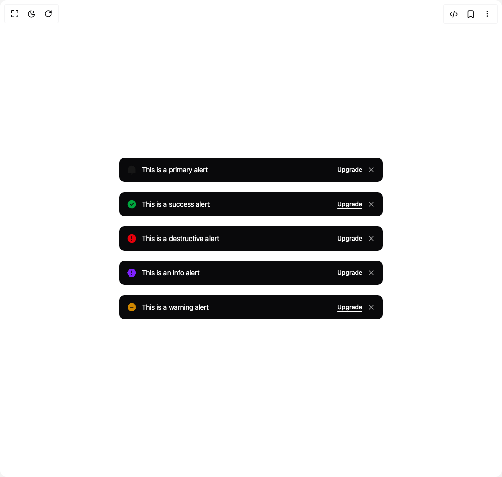

# Build Alert 1 in BuilderStudio

> Build this component in our Agentic IDE: [BuilderStudio](https://builderstudio.dev).
>
> Join the BuilderStudio community on [Discord](https://discord.gg/QdWeSGCqfe) and [Reddit](https://reddit.com/r/builderstudio).



## Component

- Author group: `reui`
- Component: `alert-1`
- Variant: `mono`
- Rendered HTML snapshot: [`rendered.html`](rendered.html)

## BuilderStudio prompt

You are implementing a React component based on a component reference.

## Component identity

- Author: reui
- Component slug: alert-1
- Demo slug: mono
- Title: alert-1
- Description: 

## Goal

Recreate this component in a React + TypeScript + Tailwind CSS project. Preserve the visual layout, spacing, colors, border radius, shadows, interaction behavior, animation behavior, responsive behavior, and dark mode behavior shown in the rendered demo.

## Implementation requirements

- Use React and TypeScript.
- Use Tailwind CSS classes whenever possible.
- Keep the component self-contained unless the source files require helper components.
- If the source uses CSS variables, custom CSS, animations, or keyframes, include them.
- If the source uses external packages, list and use the required packages.
- Preserve accessibility attributes, button semantics, links, keyboard behavior, and ARIA attributes when visible in the source.
- Do not replace the component with a simplified placeholder.
- Return complete production-ready code.

## Dependencies

No reference metadata available.

## Rendered DOM snapshot

This is the rendered demo HTML extracted from the live preview. Use it to verify structure, class names, visible content, and layout.

```html
<div id="root"><div class="w-screen min-h-screen flex justify-center items-center"><div class="w-screen min-h-screen flex justify-center items-center"><div class="flex flex-col gap-5 p-10 w-full mx-auto max-w-[600px] h-screen justify-center items-center"><div data-slot="alert" role="alert" class="flex items-stretch w-full group-[.toaster]:w-(--width) rounded-lg p-3.5 gap-2.5 text-sm [&amp;&gt;[data-slot=alert-icon]&gt;svg]:size-5 *:data-slot=alert-icon:mt-0 [&amp;_[data-slot=alert-close]]:mt-0.5 bg-zinc-950 text-white dark:bg-zinc-300 dark:text-black *:data-slot-[alert=close]:text-white [&amp;_[data-slot=alert-icon]]:text-primary"><div data-slot="alert-icon" class="shrink-0"><svg viewBox="0 0 24 24" xmlns="http://www.w3.org/2000/svg" width="24" height="24" fill="currentColor" class="remixicon "><path d="M12 2C16.9706 2 21 6.04348 21 11.0314V20H3V11.0314C3 6.04348 7.02944 2 12 2ZM9.5 21H14.5C14.5 22.3807 13.3807 23.5 12 23.5C10.6193 23.5 9.5 22.3807 9.5 21Z"></path></svg></div><div data-slot="alert-title" class="grow tracking-tight">This is a primary alert</div><div data-slot="alert-toolbar" class=""><button data-slot="button" class="cursor-pointer group focus-visible:outline-hidden items-center justify-center has-data-[arrow=true]:justify-between whitespace-nowrap ring-offset-background transition-[color,box-shadow] disabled:pointer-events-none disabled:opacity-60 [&amp;_svg]:shrink-0 gap-1.25 text-xs [&amp;_svg:not([class*=size-])]:size-3.5 h-auto p-0 bg-transparent rounded-none hover:bg-transparent data-[state=open]:bg-transparent font-medium text-inherit [&amp;_svg:not([role=img]):not([class*=text-])]:opacity-60 underline underline-offset-4 decoration-solid flex mt-0.5">Upgrade</button></div><button data-slot="alert-close" class="cursor-pointer group focus-visible:outline-hidden inline-flex items-center justify-center has-data-[arrow=true]:justify-between whitespace-nowrap font-medium ring-offset-background transition-[color,box-shadow] disabled:pointer-events-none disabled:opacity-60 [&amp;_svg]:shrink-0 rounded-md gap-1.25 text-xs [&amp;_svg:not([class*=size-])]:size-3.5 focus-visible:ring-2 focus-visible:ring-ring focus-visible:ring-offset-2 p-0 [[&amp;_svg:not([class*=size-])]:size-3.5 group shrink-0 size-4" aria-label="Dismiss"><svg xmlns="http://www.w3.org/2000/svg" width="24" height="24" viewBox="0 0 24 24" fill="none" stroke="currentColor" stroke-width="2" stroke-linecap="round" stroke-linejoin="round" class="lucide lucide-x opacity-60 group-hover:opacity-100 size-4" aria-hidden="true"><path d="M18 6 6 18"></path><path d="m6 6 12 12"></path></svg></button></div><div data-slot="alert" role="alert" class="flex items-stretch w-full group-[.toaster]:w-(--width) rounded-lg p-3.5 gap-2.5 text-sm [&amp;&gt;[data-slot=alert-icon]&gt;svg]:size-5 *:data-slot=alert-icon:mt-0 [&amp;_[data-slot=alert-close]]:mt-0.5 bg-zinc-950 text-white dark:bg-zinc-300 dark:text-black *:data-slot-[alert=close]:text-white [&amp;_[data-slot=alert-icon]]:text-[var(--color-success-foreground,var(--color-green-600))]"><div data-slot="alert-icon" class="shrink-0"><svg viewBox="0 0 24 24" xmlns="http://www.w3.org/2000/svg" width="24" height="24" fill="currentColor" class="remixicon "><path d="M12 22C17.5228 22 22 17.5228 22 12C22 6.47715 17.5228 2 12 2C6.47715 2 2 6.47715 2 12C2 17.5228 6.47715 22 12 22ZM17.4571 9.45711L11 15.9142L6.79289 11.7071L8.20711 10.2929L11 13.0858L16.0429 8.04289L17.4571 9.45711Z"></path></svg></div><div data-slot="alert-title" class="grow tracking-tight">This is a success alert</div><div data-slot="alert-toolbar" class=""><button data-slot="button" class="cursor-pointer group focus-visible:outline-hidden items-center justify-center has-data-[arrow=true]:justify-between whitespace-nowrap ring-offset-background transition-[color,box-shadow] disabled:pointer-events-none disabled:opacity-60 [&amp;_svg]:shrink-0 gap-1.25 text-xs [&amp;_svg:not([class*=size-])]:size-3.5 h-auto p-0 bg-transparent rounded-none hover:bg-transparent data-[state=open]:bg-transparent font-medium text-inherit [&amp;_svg:not([role=img]):not([class*=text-])]:opacity-60 underline underline-offset-4 decoration-solid flex mt-0.5">Upgrade</button></div><button data-slot="alert-close" class="cursor-pointer group focus-visible:outline-hidden inline-flex items-center justify-center has-data-[arrow=true]:justify-between whitespace-nowrap font-medium ring-offset-background transition-[color,box-shadow] disabled:pointer-events-none disabled:opacity-60 [&amp;_svg]:shrink-0 rounded-md gap-1.25 text-xs [&amp;_svg:not([class*=size-])]:size-3.5 focus-visible:ring-2 focus-visible:ring-ring focus-visible:ring-offset-2 p-0 [[&amp;_svg:not([class*=size-])]:size-3.5 group shrink-0 size-4" aria-label="Dismiss"><svg xmlns="http://www.w3.org/2000/svg" width="24" height="24" viewBox="0 0 24 24" fill="none" stroke="currentColor" stroke-width="2" stroke-linecap="round" stroke-linejoin="round" class="lucide lucide-x opacity-60 group-hover:opacity-100 size-4" aria-hidden="true"><path d="M18 6 6 18"></path><path d="m6 6 12 12"></path></svg></button></div><div data-slot="alert" role="alert" class="flex items-stretch w-full group-[.toaster]:w-(--width) rounded-lg p-3.5 gap-2.5 text-sm [&amp;&gt;[data-slot=alert-icon]&gt;svg]:size-5 *:data-slot=alert-icon:mt-0 [&amp;_[data-slot=alert-close]]:mt-0.5 bg-zinc-950 text-white dark:bg-zinc-300 dark:text-black *:data-slot-[alert=close]:text-white [&amp;_[data-slot=alert-icon]]:text-destructive"><div data-slot="alert-icon" class="shrink-0"><svg viewBox="0 0 24 24" xmlns="http://www.w3.org/2000/svg" width="24" height="24" fill="currentColor" class="remixicon "><path d="M12 22C6.47715 22 2 17.5228 2 12C2 6.47715 6.47715 2 12 2C17.5228 2 22 6.47715 22 12C22 17.5228 17.5228 22 12 22ZM11 15V17H13V15H11ZM11 7V13H13V7H11Z"></path></svg></div><div data-slot="alert-title" class="grow tracking-tight">This is a destructive alert</div><div data-slot="alert-toolbar" class=""><button data-slot="button" class="cursor-pointer group focus-visible:outline-hidden items-center justify-center has-data-[arrow=true]:justify-between whitespace-nowrap ring-offset-background transition-[color,box-shadow] disabled:pointer-events-none disabled:opacity-60 [&amp;_svg]:shrink-0 gap-1.25 text-xs [&amp;_svg:not([class*=size-])]:size-3.5 h-auto p-0 bg-transparent rounded-none hover:bg-transparent data-[state=open]:bg-transparent font-medium text-inherit [&amp;_svg:not([role=img]):not([class*=text-])]:opacity-60 underline underline-offset-4 decoration-solid flex mt-0.5">Upgrade</button></div><button data-slot="alert-close" class="cursor-pointer group focus-visible:outline-hidden inline-flex items-center justify-center has-data-[arrow=true]:justify-between whitespace-nowrap font-medium ring-offset-background transition-[color,box-shadow] disabled:pointer-events-none disabled:opacity-60 [&amp;_svg]:shrink-0 rounded-md gap-1.25 text-xs [&amp;_svg:not([class*=size-])]:size-3.5 focus-visible:ring-2 focus-visible:ring-ring focus-visible:ring-offset-2 p-0 [[&amp;_svg:not([class*=size-])]:size-3.5 group shrink-0 size-4" aria-label="Dismiss"><svg xmlns="http://www.w3.org/2000/svg" width="24" height="24" viewBox="0 0 24 24" fill="none" stroke="currentColor" stroke-width="2" stroke-linecap="round" stroke-linejoin="round" class="lucide lucide-x opacity-60 group-hover:opacity-100 size-4" aria-hidden="true"><path d="M18 6 6 18"></path><path d="m6 6 12 12"></path></svg></button></div><div data-slot="alert" role="alert" class="flex items-stretch w-full group-[.toaster]:w-(--width) rounded-lg p-3.5 gap-2.5 text-sm [&amp;&gt;[data-slot=alert-icon]&gt;svg]:size-5 *:data-slot=alert-icon:mt-0 [&amp;_[data-slot=alert-close]]:mt-0.5 bg-zinc-950 text-white dark:bg-zinc-300 dark:text-black *:data-slot-[alert=close]:text-white [&amp;_[data-slot=alert-icon]]:text-[var(--color-info-foreground,var(--color-violet-600))]"><div data-slot="alert-icon" class="shrink-0"><svg viewBox="0 0 24 24" xmlns="http://www.w3.org/2000/svg" width="24" height="24" fill="currentColor" class="remixicon "><path d="M17.5 2.5L23 12L17.5 21.5H6.5L1 12L6.5 2.5H17.5ZM11 15V17H13V15H11ZM11 7V13H13V7H11Z"></path></svg></div><div data-slot="alert-title" class="grow tracking-tight">This is an info alert</div><div data-slot="alert-toolbar" class=""><button data-slot="button" class="cursor-pointer group focus-visible:outline-hidden items-center justify-center has-data-[arrow=true]:justify-between whitespace-nowrap ring-offset-background transition-[color,box-shadow] disabled:pointer-events-none disabled:opacity-60 [&amp;_svg]:shrink-0 gap-1.25 text-xs [&amp;_svg:not([class*=size-])]:size-3.5 h-auto p-0 bg-transparent rounded-none hover:bg-transparent data-[state=open]:bg-transparent font-medium text-inherit [&amp;_svg:not([role=img]):not([class*=text-])]:opacity-60 underline underline-offset-4 decoration-solid flex mt-0.5">Upgrade</button></div><button data-slot="alert-close" class="cursor-pointer group focus-visible:outline-hidden inline-flex items-center justify-center has-data-[arrow=true]:justify-between whitespace-nowrap font-medium ring-offset-background transition-[color,box-shadow] disabled:pointer-events-none disabled:opacity-60 [&amp;_svg]:shrink-0 rounded-md gap-1.25 text-xs [&amp;_svg:not([class*=size-])]:size-3.5 focus-visible:ring-2 focus-visible:ring-ring focus-visible:ring-offset-2 p-0 [[&amp;_svg:not([class*=size-])]:size-3.5 group shrink-0 size-4" aria-label="Dismiss"><svg xmlns="http://www.w3.org/2000/svg" width="24" height="24" viewBox="0 0 24 24" fill="none" stroke="currentColor" stroke-width="2" stroke-linecap="round" stroke-linejoin="round" class="lucide lucide-x opacity-60 group-hover:opacity-100 size-4" aria-hidden="true"><path d="M18 6 6 18"></path><path d="m6 6 12 12"></path></svg></button></div><div data-slot="alert" role="alert" class="flex items-stretch w-full group-[.toaster]:w-(--width) rounded-lg p-3.5 gap-2.5 text-sm [&amp;&gt;[data-slot=alert-icon]&gt;svg]:size-5 *:data-slot=alert-icon:mt-0 [&amp;_[data-slot=alert-close]]:mt-0.5 bg-zinc-950 text-white dark:bg-zinc-300 dark:text-black *:data-slot-[alert=close]:text-white [&amp;_[data-slot=alert-icon]]:text-[var(--color-warning-foreground,var(--color-yellow-600))]"><div data-slot="alert-icon" class="shrink-0"><svg viewBox="0 0 24 24" xmlns="http://www.w3.org/2000/svg" width="24" height="24" fill="currentColor" class="remixicon "><path d="M15.936 2.50098L21.501 8.06595V15.936L15.936 21.501H8.06595L2.50098 15.936V8.06595L8.06595 2.50098H15.936ZM8.00024 11.0002V13.0002H16.0002V11.0002H8.00024Z"></path></svg></div><div data-slot="alert-title" class="grow tracking-tight">This is a warning alert</div><div data-slot="alert-toolbar" class=""><button data-slot="button" class="cursor-pointer group focus-visible:outline-hidden items-center justify-center has-data-[arrow=true]:justify-between whitespace-nowrap ring-offset-background transition-[color,box-shadow] disabled:pointer-events-none disabled:opacity-60 [&amp;_svg]:shrink-0 gap-1.25 text-xs [&amp;_svg:not([class*=size-])]:size-3.5 h-auto p-0 bg-transparent rounded-none hover:bg-transparent data-[state=open]:bg-transparent font-medium text-inherit [&amp;_svg:not([role=img]):not([class*=text-])]:opacity-60 underline underline-offset-4 decoration-solid flex mt-0.5">Upgrade</button></div><button data-slot="alert-close" class="cursor-pointer group focus-visible:outline-hidden inline-flex items-center justify-center has-data-[arrow=true]:justify-between whitespace-nowrap font-medium ring-offset-background transition-[color,box-shadow] disabled:pointer-events-none disabled:opacity-60 [&amp;_svg]:shrink-0 rounded-md gap-1.25 text-xs [&amp;_svg:not([class*=size-])]:size-3.5 focus-visible:ring-2 focus-visible:ring-ring focus-visible:ring-offset-2 p-0 [[&amp;_svg:not([class*=size-])]:size-3.5 group shrink-0 size-4" aria-label="Dismiss"><svg xmlns="http://www.w3.org/2000/svg" width="24" height="24" viewBox="0 0 24 24" fill="none" stroke="currentColor" stroke-width="2" stroke-linecap="round" stroke-linejoin="round" class="lucide lucide-x opacity-60 group-hover:opacity-100 size-4" aria-hidden="true"><path d="M18 6 6 18"></path><path d="m6 6 12 12"></path></svg></button></div></div></div></div></div>
```

## Reference source files

No reference source files were available.
