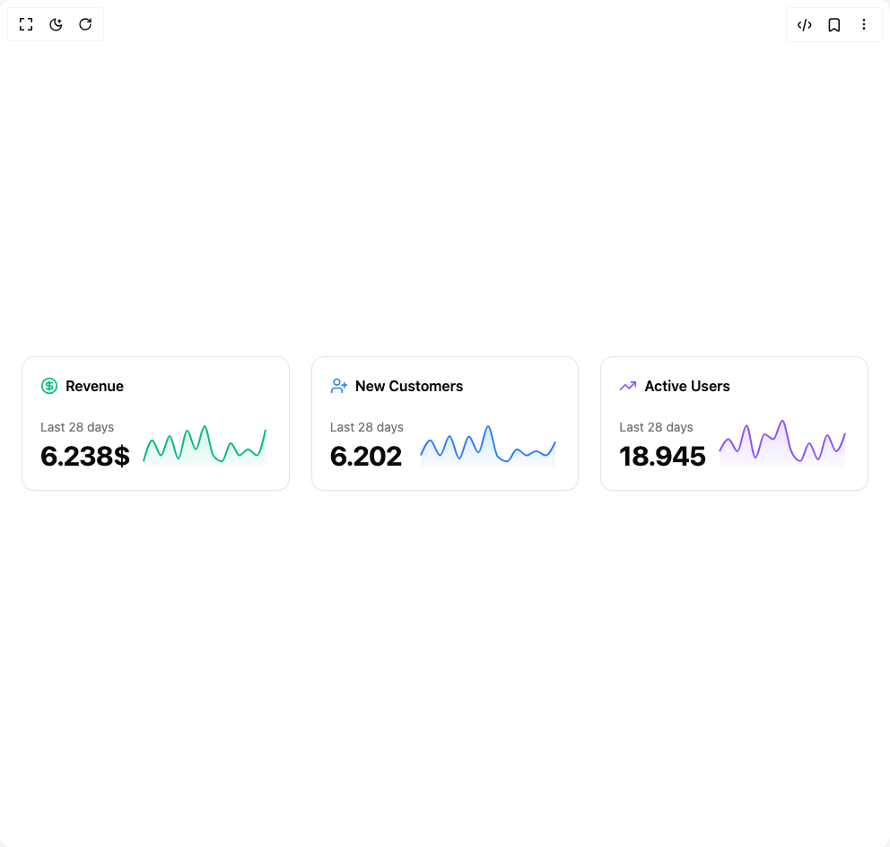

# Build Area Charts 1 in BuilderStudio

> Build this component in our Agentic IDE: [BuilderStudio](https://builderstudio.dev).
>
> Join the BuilderStudio community on [Discord](https://discord.gg/QdWeSGCqfe) and [Reddit](https://reddit.com/r/builderstudio).



## Component

- Author group: `reui`
- Component: `area-charts-1`
- Variant: `default`
- Rendered HTML snapshot: [`rendered.html`](rendered.html)

## BuilderStudio prompt

You are implementing a React component based on a component reference.

## Component identity

- Author: reui
- Component slug: area-charts-1
- Demo slug: default
- Title: area-charts-1
- Description: 

## Goal

Recreate this component in a React + TypeScript + Tailwind CSS project. Preserve the visual layout, spacing, colors, border radius, shadows, interaction behavior, animation behavior, responsive behavior, and dark mode behavior shown in the rendered demo.

## Implementation requirements

- Use React and TypeScript.
- Use Tailwind CSS classes whenever possible.
- Keep the component self-contained unless the source files require helper components.
- If the source uses CSS variables, custom CSS, animations, or keyframes, include them.
- If the source uses external packages, list and use the required packages.
- Preserve accessibility attributes, button semantics, links, keyboard behavior, and ARIA attributes when visible in the source.
- Do not replace the component with a simplified placeholder.
- Return complete production-ready code.

## Dependencies

No reference metadata available.

## Rendered DOM snapshot

This is the rendered demo HTML extracted from the live preview. Use it to verify structure, class names, visible content, and layout.

```html
<div id="root"><div class="w-screen min-h-screen flex justify-center items-center"><div class="w-screen min-h-screen flex justify-center items-center"><div class="w-full max-w-5xl min-h-screen flex items-center justify-center p-6 lg:p-8"><div class="@container w-full max-w-6xl"><div class="grid grid-cols-1 @3xl:grid-cols-3 gap-6"><div data-slot="card" class="flex flex-col items-stretch text-card-foreground rounded-xl bg-card border border-border shadow-xs black/5"><div data-slot="card-content" class="grow p-5 space-y-5"><div class="flex items-center gap-2"><svg xmlns="http://www.w3.org/2000/svg" width="24" height="24" viewBox="0 0 24 24" fill="none" stroke="currentColor" stroke-width="2" stroke-linecap="round" stroke-linejoin="round" class="lucide lucide-circle-dollar-sign size-5" aria-hidden="true" style="color: var(--color-emerald-500);"><circle cx="12" cy="12" r="10"></circle><path d="M16 8h-6a2 2 0 1 0 0 4h4a2 2 0 1 1 0 4H8"></path><path d="M12 18V6"></path></svg><span class="text-base font-semibold">Revenue</span></div><div class="flex items-end gap-2.5 justify-between"><div class="flex flex-col gap-1"><div class="text-sm text-muted-foreground whitespace-nowrap">Last 28 days</div><div class="text-3xl font-bold text-foreground tracking-tight">6.238$</div></div><div class="max-w-40 h-16 w-full relative"><div class="recharts-responsive-container" style="width: 100%; height: 100%; min-width: 0px;"><div style="width: 0px; height: 0px; overflow: visible;"><div class="recharts-wrapper" style="position: relative; cursor: default; width: 146px; height: 64px;"><div xmlns="http://www.w3.org/1999/xhtml" tabindex="-1" class="recharts-tooltip-wrapper" style="visibility: hidden; pointer-events: none; position: absolute; top: 0px; left: 0px;"></div><svg role="application" tabindex="0" class="recharts-surface" width="146" height="64" viewBox="0 0 146 64" style="width: 100%; height: 100%;"><title></title><desc></desc><defs><clipPath id="recharts1-clip"><rect x="5" y="5" height="54" width="136"></rect></clipPath></defs><defs><linearGradient id="revenueGradient" x1="0" y1="0" x2="0" y2="1"><stop offset="0%" stop-color="var(--color-emerald-500)" stop-opacity="0.3"></stop><stop offset="100%" stop-color="var(--color-emerald-500)" stop-opacity="0.05"></stop></linearGradient><filter id="dotShadow0" x="-50%" y="-50%" width="200%" height="200%"><feDropShadow dx="2" dy="2" stdDeviation="3" flood-color="rgba(0,0,0,0.5)"></feDropShadow></filter></defs><g class="recharts-layer recharts-area"><g class="recharts-layer"><path stroke-width="2" fill="url(#revenueGradient)" fill-opacity="0.6" height="54" width="136" stroke="none" class="recharts-curve recharts-area-area" d="M5,52.25C8.238,40.438,11.476,28.625,14.714,28.625C17.952,28.625,21.19,45.5,24.429,45.5C27.667,45.5,30.905,23.9,34.143,23.9C37.381,23.9,40.619,48.875,43.857,48.875C47.095,48.875,50.333,17.825,53.571,17.825C56.81,17.825,60.048,38.75,63.286,38.75C66.524,38.75,69.762,13.1,73,13.1C76.238,13.1,79.476,41,82.714,45.5C85.952,50,89.19,52.25,92.429,52.25C95.667,52.25,98.905,32,102.143,32C105.381,32,108.619,45.5,111.857,45.5C115.095,45.5,118.333,38.75,121.571,38.75C124.81,38.75,128.048,45.5,131.286,45.5C134.524,45.5,137.762,31.197,141,16.893L141,59C137.762,59,134.524,59,131.286,59C128.048,59,124.81,59,121.571,59C118.333,59,115.095,59,111.857,59C108.619,59,105.381,59,102.143,59C98.905,59,95.667,59,92.429,59C89.19,59,85.952,59,82.714,59C79.476,59,76.238,59,73,59C69.762,59,66.524,59,63.286,59C60.048,59,56.81,59,53.571,59C50.333,59,47.095,59,43.857,59C40.619,59,37.381,59,34.143,59C30.905,59,27.667,59,24.429,59C21.19,59,17.952,59,14.714,59C11.476,59,8.238,59,5,59Z"></path><path stroke-width="2" fill="none" fill-opacity="0.6" height="54" stroke="var(--color-emerald-500)" width="136" class="recharts-curve recharts-area-curve" d="M5,52.25C8.238,40.438,11.476,28.625,14.714,28.625C17.952,28.625,21.19,45.5,24.429,45.5C27.667,45.5,30.905,23.9,34.143,23.9C37.381,23.9,40.619,48.875,43.857,48.875C47.095,48.875,50.333,17.825,53.571,17.825C56.81,17.825,60.048,38.75,63.286,38.75C66.524,38.75,69.762,13.1,73,13.1C76.238,13.1,79.476,41,82.714,45.5C85.952,50,89.19,52.25,92.429,52.25C95.667,52.25,98.905,32,102.143,32C105.381,32,108.619,45.5,111.857,45.5C115.095,45.5,118.333,38.75,121.571,38.75C124.81,38.75,128.048,45.5,131.286,45.5C134.524,45.5,137.762,31.197,141,16.893"></path></g></g></svg></div></div></div></div></div></div></div><div data-slot="card" class="flex flex-col items-stretch text-card-foreground rounded-xl bg-card border border-border shadow-xs black/5"><div data-slot="card-content" class="grow p-5 space-y-5"><div class="flex items-center gap-2"><svg xmlns="http://www.w3.org/2000/svg" width="24" height="24" viewBox="0 0 24 24" fill="none" stroke="currentColor" stroke-width="2" stroke-linecap="round" stroke-linejoin="round" class="lucide lucide-user-plus size-5" aria-hidden="true" style="color: var(--color-blue-500);"><path d="M16 21v-2a4 4 0 0 0-4-4H6a4 4 0 0 0-4 4v2"></path><circle cx="9" cy="7" r="4"></circle><line x1="19" x2="19" y1="8" y2="14"></line><line x1="22" x2="16" y1="11" y2="11"></line></svg><span class="text-base font-semibold">New Customers</span></div><div class="flex items-end gap-2.5 justify-between"><div class="flex flex-col gap-1"><div class="text-sm text-muted-foreground whitespace-nowrap">Last 28 days</div><div class="text-3xl font-bold text-foreground tracking-tight">6.202</div></div><div class="max-w-40 h-16 w-full relative"><div class="recharts-responsive-container" style="width: 100%; height: 100%; min-width: 0px;"><div style="width: 0px; height: 0px; overflow: visible;"><div class="recharts-wrapper" style="position: relative; cursor: default; width: 160px; height: 64px;"><div xmlns="http://www.w3.org/1999/xhtml" tabindex="-1" class="recharts-tooltip-wrapper" style="visibility: hidden; pointer-events: none; position: absolute; top: 0px; left: 0px;"></div><svg role="application" tabindex="0" class="recharts-surface" width="160" height="64" viewBox="0 0 160 64" style="width: 100%; height: 100%;"><title></title><desc></desc><defs><clipPath id="recharts3-clip"><rect x="5" y="5" height="54" width="150"></rect></clipPath></defs><defs><linearGradient id="customersGradient" x1="0" y1="0" x2="0" y2="1"><stop offset="0%" stop-color="var(--color-blue-500)" stop-opacity="0.3"></stop><stop offset="100%" stop-color="var(--color-blue-500)" stop-opacity="0.05"></stop></linearGradient><filter id="dotShadow1" x="-50%" y="-50%" width="200%" height="200%"><feDropShadow dx="2" dy="2" stdDeviation="3" flood-color="rgba(0,0,0,0.5)"></feDropShadow></filter></defs><g class="recharts-layer recharts-area"><g class="recharts-layer"><path stroke-width="2" fill="url(#customersGradient)" fill-opacity="0.6" height="54" width="150" stroke="none" class="recharts-curve recharts-area-area" d="M5,45.5C8.571,37.063,12.143,28.625,15.714,28.625C19.286,28.625,22.857,45.5,26.429,45.5C30,45.5,33.571,23.9,37.143,23.9C40.714,23.9,44.286,48.875,47.857,48.875C51.429,48.875,55,24.575,58.571,24.575C62.143,24.575,65.714,42.125,69.286,42.125C72.857,42.125,76.429,13.1,80,13.1C83.571,13.1,87.143,43.25,90.714,46.85C94.286,50.45,97.857,52.25,101.429,52.25C105,52.25,108.571,38.75,112.143,38.75C115.714,38.75,119.286,45.5,122.857,45.5C126.429,45.5,130,40.775,133.571,40.775C137.143,40.775,140.714,45.5,144.286,45.5C147.857,45.5,151.429,37.947,155,30.393L155,59C151.429,59,147.857,59,144.286,59C140.714,59,137.143,59,133.571,59C130,59,126.429,59,122.857,59C119.286,59,115.714,59,112.143,59C108.571,59,105,59,101.429,59C97.857,59,94.286,59,90.714,59C87.143,59,83.571,59,80,59C76.429,59,72.857,59,69.286,59C65.714,59,62.143,59,58.571,59C55,59,51.429,59,47.857,59C44.286,59,40.714,59,37.143,59C33.571,59,30,59,26.429,59C22.857,59,19.286,59,15.714,59C12.143,59,8.571,59,5,59Z"></path><path stroke-width="2" fill="none" fill-opacity="0.6" height="54" stroke="var(--color-blue-500)" width="150" class="recharts-curve recharts-area-curve" d="M5,45.5C8.571,37.063,12.143,28.625,15.714,28.625C19.286,28.625,22.857,45.5,26.429,45.5C30,45.5,33.571,23.9,37.143,23.9C40.714,23.9,44.286,48.875,47.857,48.875C51.429,48.875,55,24.575,58.571,24.575C62.143,24.575,65.714,42.125,69.286,42.125C72.857,42.125,76.429,13.1,80,13.1C83.571,13.1,87.143,43.25,90.714,46.85C94.286,50.45,97.857,52.25,101.429,52.25C105,52.25,108.571,38.75,112.143,38.75C115.714,38.75,119.286,45.5,122.857,45.5C126.429,45.5,130,40.775,133.571,40.775C137.143,40.775,140.714,45.5,144.286,45.5C147.857,45.5,151.429,37.947,155,30.393"></path></g></g></svg></div></div></div></div></div></div></div><div data-slot="card" class="flex flex-col items-stretch text-card-foreground rounded-xl bg-card border border-border shadow-xs black/5"><div data-slot="card-content" class="grow p-5 space-y-5"><div class="flex items-center gap-2"><svg xmlns="http://www.w3.org/2000/svg" width="24" height="24" viewBox="0 0 24 24" fill="none" stroke="currentColor" stroke-width="2" stroke-linecap="round" stroke-linejoin="round" class="lucide lucide-trending-up size-5" aria-hidden="true" style="color: var(--color-violet-500);"><polyline points="22 7 13.5 15.5 8.5 10.5 2 17"></polyline><polyline points="16 7 22 7 22 13"></polyline></svg><span class="text-base font-semibold">Active Users</span></div><div class="flex items-end gap-2.5 justify-between"><div class="flex flex-col gap-1"><div class="text-sm text-muted-foreground whitespace-nowrap">Last 28 days</div><div class="text-3xl font-bold text-foreground tracking-tight">18.945</div></div><div class="max-w-40 h-16 w-full relative"><div class="recharts-responsive-container" style="width: 100%; height: 100%; min-width: 0px;"><div style="width: 0px; height: 0px; overflow: visible;"><div class="recharts-wrapper" style="position: relative; cursor: default; width: 150px; height: 64px;"><div xmlns="http://www.w3.org/1999/xhtml" tabindex="-1" class="recharts-tooltip-wrapper" style="visibility: hidden; pointer-events: none; position: absolute; top: 0px; left: 0px;"></div><svg role="application" tabindex="0" class="recharts-surface" width="150" height="64" viewBox="0 0 150 64" style="width: 100%; height: 100%;"><title></title><desc></desc><defs><clipPath id="recharts5-clip"><rect x="5" y="5" height="54" width="140"></rect></clipPath></defs><defs><linearGradient id="usersGradient" x1="0" y1="0" x2="0" y2="1"><stop offset="0%" stop-color="var(--color-violet-500)" stop-opacity="0.3"></stop><stop offset="100%" stop-color="var(--color-violet-500)" stop-opacity="0.05"></stop></linearGradient><filter id="dotShadow2" x="-50%" y="-50%" width="200%" height="200%"><feDropShadow dx="2" dy="2" stdDeviation="3" flood-color="rgba(0,0,0,0.5)"></feDropShadow></filter></defs><g class="recharts-layer recharts-area"><g class="recharts-layer"><path stroke-width="2" fill="url(#usersGradient)" fill-opacity="0.6" height="54" width="140" stroke="none" class="recharts-curve recharts-area-area" d="M5,41C8.333,34.25,11.667,27.5,15,27.5C18.333,27.5,21.667,41,25,41C28.333,41,31.667,12.2,35,12.2C38.333,12.2,41.667,48.2,45,48.2C48.333,48.2,51.667,22.1,55,22.1C58.333,22.1,61.667,27.5,65,27.5C68.333,27.5,71.667,6.8,75,6.8C78.333,6.8,81.667,33.8,85,41C88.333,48.2,91.667,51.8,95,51.8C98.333,51.8,101.667,32,105,32C108.333,32,111.667,50,115,50C118.333,50,121.667,23,125,23C128.333,23,131.667,41,135,41C138.333,41,141.667,30.929,145,20.858L145,59C141.667,59,138.333,59,135,59C131.667,59,128.333,59,125,59C121.667,59,118.333,59,115,59C111.667,59,108.333,59,105,59C101.667,59,98.333,59,95,59C91.667,59,88.333,59,85,59C81.667,59,78.333,59,75,59C71.667,59,68.333,59,65,59C61.667,59,58.333,59,55,59C51.667,59,48.333,59,45,59C41.667,59,38.333,59,35,59C31.667,59,28.333,59,25,59C21.667,59,18.333,59,15,59C11.667,59,8.333,59,5,59Z"></path><path stroke-width="2" fill="none" fill-opacity="0.6" height="54" stroke="var(--color-violet-500)" width="140" class="recharts-curve recharts-area-curve" d="M5,41C8.333,34.25,11.667,27.5,15,27.5C18.333,27.5,21.667,41,25,41C28.333,41,31.667,12.2,35,12.2C38.333,12.2,41.667,48.2,45,48.2C48.333,48.2,51.667,22.1,55,22.1C58.333,22.1,61.667,27.5,65,27.5C68.333,27.5,71.667,6.8,75,6.8C78.333,6.8,81.667,33.8,85,41C88.333,48.2,91.667,51.8,95,51.8C98.333,51.8,101.667,32,105,32C108.333,32,111.667,50,115,50C118.333,50,121.667,23,125,23C128.333,23,131.667,41,135,41C138.333,41,141.667,30.929,145,20.858"></path></g></g></svg></div></div></div></div></div></div></div></div></div></div></div></div></div>
```

## Reference source files

No reference source files were available.
