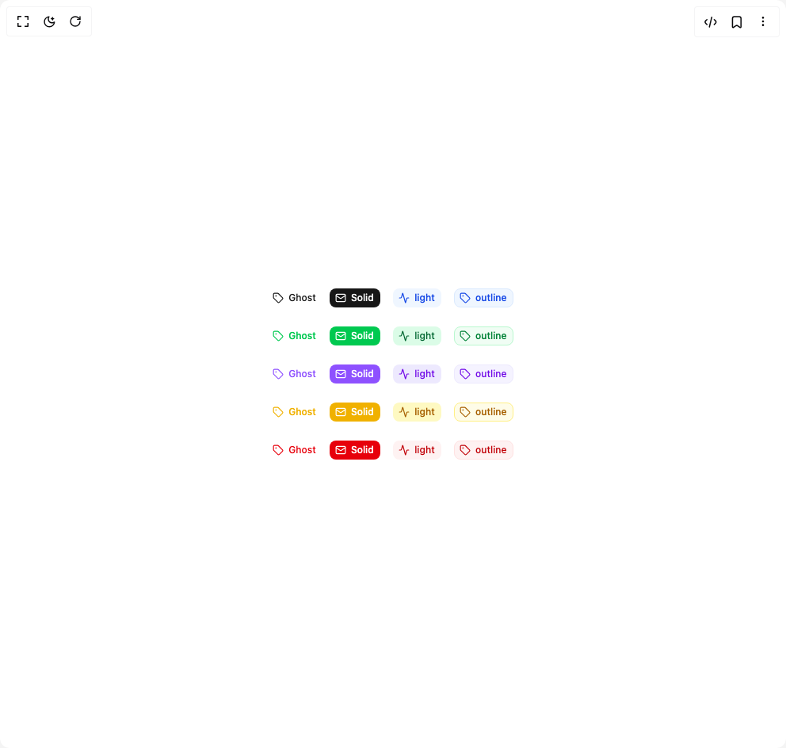

# Build Badge 2 in BuilderStudio

> Build this component in our Agentic IDE: [BuilderStudio](https://builderstudio.dev).
>
> Join the BuilderStudio community on [Discord](https://discord.gg/QdWeSGCqfe) and [Reddit](https://reddit.com/r/builderstudio).



## Component

- Author group: `reui`
- Component: `badge-2`
- Variant: `with-icon`
- Rendered HTML snapshot: [`rendered.html`](rendered.html)

## BuilderStudio prompt

You are implementing a React component based on a component reference.

## Component identity

- Author: reui
- Component slug: badge-2
- Demo slug: with-icon
- Title: badge-2
- Description: 

## Goal

Recreate this component in a React + TypeScript + Tailwind CSS project. Preserve the visual layout, spacing, colors, border radius, shadows, interaction behavior, animation behavior, responsive behavior, and dark mode behavior shown in the rendered demo.

## Implementation requirements

- Use React and TypeScript.
- Use Tailwind CSS classes whenever possible.
- Keep the component self-contained unless the source files require helper components.
- If the source uses CSS variables, custom CSS, animations, or keyframes, include them.
- If the source uses external packages, list and use the required packages.
- Preserve accessibility attributes, button semantics, links, keyboard behavior, and ARIA attributes when visible in the source.
- Do not replace the component with a simplified placeholder.
- Return complete production-ready code.

## Dependencies

No reference metadata available.

## Rendered DOM snapshot

This is the rendered demo HTML extracted from the live preview. Use it to verify structure, class names, visible content, and layout.

```html
<div id="root"><div class="w-screen min-h-screen flex justify-center items-center"><div class="w-screen min-h-screen flex justify-center items-center"><div class="flex flex-col items-center gap-6"><div class="flex items-center gap-4"><span data-slot="badge" class="inline-flex items-center justify-center border font-medium focus:outline-hidden focus:ring-2 focus:ring-ring focus:ring-offset-2 [&amp;_svg]:-ms-px [&amp;_svg]:shrink-0 border-transparent bg-transparent rounded-md h-6 min-w-6 gap-1.5 text-xs [&amp;_svg]:size-3.5 text-primary px-0"><svg xmlns="http://www.w3.org/2000/svg" width="24" height="24" viewBox="0 0 24 24" fill="none" stroke="currentColor" stroke-width="2" stroke-linecap="round" stroke-linejoin="round" class="lucide lucide-tag" aria-hidden="true"><path d="M12.586 2.586A2 2 0 0 0 11.172 2H4a2 2 0 0 0-2 2v7.172a2 2 0 0 0 .586 1.414l8.704 8.704a2.426 2.426 0 0 0 3.42 0l6.58-6.58a2.426 2.426 0 0 0 0-3.42z"></path><circle cx="7.5" cy="7.5" r=".5" fill="currentColor"></circle></svg> Ghost</span><span data-slot="badge" class="inline-flex items-center justify-center border border-transparent font-medium focus:outline-hidden focus:ring-2 focus:ring-ring focus:ring-offset-2 [&amp;_svg]:-ms-px [&amp;_svg]:shrink-0 bg-primary text-primary-foreground rounded-md px-[0.45rem] h-6 min-w-6 gap-1.5 text-xs [&amp;_svg]:size-3.5"><svg xmlns="http://www.w3.org/2000/svg" width="24" height="24" viewBox="0 0 24 24" fill="none" stroke="currentColor" stroke-width="2" stroke-linecap="round" stroke-linejoin="round" class="lucide lucide-mail" aria-hidden="true"><rect width="20" height="16" x="2" y="4" rx="2"></rect><path d="m22 7-8.97 5.7a1.94 1.94 0 0 1-2.06 0L2 7"></path></svg> Solid</span><span data-slot="badge" class="inline-flex items-center justify-center border border-transparent font-medium focus:outline-hidden focus:ring-2 focus:ring-ring focus:ring-offset-2 [&amp;_svg]:-ms-px [&amp;_svg]:shrink-0 rounded-md px-[0.45rem] h-6 min-w-6 gap-1.5 text-xs [&amp;_svg]:size-3.5 text-[var(--color-primary-accent,var(--color-blue-700))] bg-[var(--color-primary-soft,var(--color-blue-50))] dark:bg-[var(--color-primary-soft,var(--color-blue-950))] dark:text-[var(--color-primary-soft,var(--color-blue-600))]"><svg xmlns="http://www.w3.org/2000/svg" width="24" height="24" viewBox="0 0 24 24" fill="none" stroke="currentColor" stroke-width="2" stroke-linecap="round" stroke-linejoin="round" class="lucide lucide-activity" aria-hidden="true"><path d="M22 12h-2.48a2 2 0 0 0-1.93 1.46l-2.35 8.36a.25.25 0 0 1-.48 0L9.24 2.18a.25.25 0 0 0-.48 0l-2.35 8.36A2 2 0 0 1 4.49 12H2"></path></svg> light</span><span data-slot="badge" class="inline-flex items-center justify-center border font-medium focus:outline-hidden focus:ring-2 focus:ring-ring focus:ring-offset-2 [&amp;_svg]:-ms-px [&amp;_svg]:shrink-0 rounded-md px-[0.45rem] h-6 min-w-6 gap-1.5 text-xs [&amp;_svg]:size-3.5 text-[var(--color-primary-accent,var(--color-blue-700))] border-[var(--color-primary-soft,var(--color-blue-100))] bg-[var(--color-primary-soft,var(--color-blue-50))] dark:bg-[var(--color-primary-soft,var(--color-blue-950))] dark:border-[var(--color-primary-soft,var(--color-blue-900))] dark:text-[var(--color-primary-soft,var(--color-blue-600))]"><svg xmlns="http://www.w3.org/2000/svg" width="24" height="24" viewBox="0 0 24 24" fill="none" stroke="currentColor" stroke-width="2" stroke-linecap="round" stroke-linejoin="round" class="lucide lucide-tag" aria-hidden="true"><path d="M12.586 2.586A2 2 0 0 0 11.172 2H4a2 2 0 0 0-2 2v7.172a2 2 0 0 0 .586 1.414l8.704 8.704a2.426 2.426 0 0 0 3.42 0l6.58-6.58a2.426 2.426 0 0 0 0-3.42z"></path><circle cx="7.5" cy="7.5" r=".5" fill="currentColor"></circle></svg> outline</span></div><div class="flex items-center gap-4"><span data-slot="badge" class="inline-flex items-center justify-center border font-medium focus:outline-hidden focus:ring-2 focus:ring-ring focus:ring-offset-2 [&amp;_svg]:-ms-px [&amp;_svg]:shrink-0 border-transparent bg-transparent rounded-md h-6 min-w-6 gap-1.5 text-xs [&amp;_svg]:size-3.5 text-[var(--color-success-accent,var(--color-green-500))] px-0"><svg xmlns="http://www.w3.org/2000/svg" width="24" height="24" viewBox="0 0 24 24" fill="none" stroke="currentColor" stroke-width="2" stroke-linecap="round" stroke-linejoin="round" class="lucide lucide-tag" aria-hidden="true"><path d="M12.586 2.586A2 2 0 0 0 11.172 2H4a2 2 0 0 0-2 2v7.172a2 2 0 0 0 .586 1.414l8.704 8.704a2.426 2.426 0 0 0 3.42 0l6.58-6.58a2.426 2.426 0 0 0 0-3.42z"></path><circle cx="7.5" cy="7.5" r=".5" fill="currentColor"></circle></svg> Ghost</span><span data-slot="badge" class="inline-flex items-center justify-center border border-transparent font-medium focus:outline-hidden focus:ring-2 focus:ring-ring focus:ring-offset-2 [&amp;_svg]:-ms-px [&amp;_svg]:shrink-0 bg-[var(--color-success-accent,var(--color-green-500))] text-[var(--color-success-foreground,var(--color-white))] rounded-md px-[0.45rem] h-6 min-w-6 gap-1.5 text-xs [&amp;_svg]:size-3.5"><svg xmlns="http://www.w3.org/2000/svg" width="24" height="24" viewBox="0 0 24 24" fill="none" stroke="currentColor" stroke-width="2" stroke-linecap="round" stroke-linejoin="round" class="lucide lucide-mail" aria-hidden="true"><rect width="20" height="16" x="2" y="4" rx="2"></rect><path d="m22 7-8.97 5.7a1.94 1.94 0 0 1-2.06 0L2 7"></path></svg> Solid</span><span data-slot="badge" class="inline-flex items-center justify-center border border-transparent font-medium focus:outline-hidden focus:ring-2 focus:ring-ring focus:ring-offset-2 [&amp;_svg]:-ms-px [&amp;_svg]:shrink-0 rounded-md px-[0.45rem] h-6 min-w-6 gap-1.5 text-xs [&amp;_svg]:size-3.5 text-[var(--color-success-accent,var(--color-green-800))] bg-[var(--color-success-soft,var(--color-green-100))] dark:bg-[var(--color-success-soft,var(--color-green-950))] dark:text-[var(--color-success-soft,var(--color-green-600))]"><svg xmlns="http://www.w3.org/2000/svg" width="24" height="24" viewBox="0 0 24 24" fill="none" stroke="currentColor" stroke-width="2" stroke-linecap="round" stroke-linejoin="round" class="lucide lucide-activity" aria-hidden="true"><path d="M22 12h-2.48a2 2 0 0 0-1.93 1.46l-2.35 8.36a.25.25 0 0 1-.48 0L9.24 2.18a.25.25 0 0 0-.48 0l-2.35 8.36A2 2 0 0 1 4.49 12H2"></path></svg> light</span><span data-slot="badge" class="inline-flex items-center justify-center border font-medium focus:outline-hidden focus:ring-2 focus:ring-ring focus:ring-offset-2 [&amp;_svg]:-ms-px [&amp;_svg]:shrink-0 rounded-md px-[0.45rem] h-6 min-w-6 gap-1.5 text-xs [&amp;_svg]:size-3.5 text-[var(--color-success-accent,var(--color-green-700))] border-[var(--color-success-soft,var(--color-green-200))] bg-[var(--color-success-soft,var(--color-green-50))] dark:bg-[var(--color-success-soft,var(--color-green-950))] dark:border-[var(--color-success-soft,var(--color-green-900))] dark:text-[var(--color-success-soft,var(--color-green-600))]"><svg xmlns="http://www.w3.org/2000/svg" width="24" height="24" viewBox="0 0 24 24" fill="none" stroke="currentColor" stroke-width="2" stroke-linecap="round" stroke-linejoin="round" class="lucide lucide-tag" aria-hidden="true"><path d="M12.586 2.586A2 2 0 0 0 11.172 2H4a2 2 0 0 0-2 2v7.172a2 2 0 0 0 .586 1.414l8.704 8.704a2.426 2.426 0 0 0 3.42 0l6.58-6.58a2.426 2.426 0 0 0 0-3.42z"></path><circle cx="7.5" cy="7.5" r=".5" fill="currentColor"></circle></svg> outline</span></div><div class="flex items-center gap-4"><span data-slot="badge" class="inline-flex items-center justify-center border font-medium focus:outline-hidden focus:ring-2 focus:ring-ring focus:ring-offset-2 [&amp;_svg]:-ms-px [&amp;_svg]:shrink-0 border-transparent bg-transparent rounded-md h-6 min-w-6 gap-1.5 text-xs [&amp;_svg]:size-3.5 text-[var(--color-info-accent,var(--color-violet-500))] px-0"><svg xmlns="http://www.w3.org/2000/svg" width="24" height="24" viewBox="0 0 24 24" fill="none" stroke="currentColor" stroke-width="2" stroke-linecap="round" stroke-linejoin="round" class="lucide lucide-tag" aria-hidden="true"><path d="M12.586 2.586A2 2 0 0 0 11.172 2H4a2 2 0 0 0-2 2v7.172a2 2 0 0 0 .586 1.414l8.704 8.704a2.426 2.426 0 0 0 3.42 0l6.58-6.58a2.426 2.426 0 0 0 0-3.42z"></path><circle cx="7.5" cy="7.5" r=".5" fill="currentColor"></circle></svg> Ghost</span><span data-slot="badge" class="inline-flex items-center justify-center border border-transparent font-medium focus:outline-hidden focus:ring-2 focus:ring-ring focus:ring-offset-2 [&amp;_svg]:-ms-px [&amp;_svg]:shrink-0 bg-[var(--color-info-accent,var(--color-violet-500))] text-[var(--color-info-foreground,var(--color-white))] rounded-md px-[0.45rem] h-6 min-w-6 gap-1.5 text-xs [&amp;_svg]:size-3.5"><svg xmlns="http://www.w3.org/2000/svg" width="24" height="24" viewBox="0 0 24 24" fill="none" stroke="currentColor" stroke-width="2" stroke-linecap="round" stroke-linejoin="round" class="lucide lucide-mail" aria-hidden="true"><rect width="20" height="16" x="2" y="4" rx="2"></rect><path d="m22 7-8.97 5.7a1.94 1.94 0 0 1-2.06 0L2 7"></path></svg> Solid</span><span data-slot="badge" class="inline-flex items-center justify-center border border-transparent font-medium focus:outline-hidden focus:ring-2 focus:ring-ring focus:ring-offset-2 [&amp;_svg]:-ms-px [&amp;_svg]:shrink-0 rounded-md px-[0.45rem] h-6 min-w-6 gap-1.5 text-xs [&amp;_svg]:size-3.5 text-[var(--color-info-accent,var(--color-violet-700))] bg-[var(--color-info-soft,var(--color-violet-100))] dark:bg-[var(--color-info-soft,var(--color-violet-950))] dark:text-[var(--color-info-soft,var(--color-violet-400))]"><svg xmlns="http://www.w3.org/2000/svg" width="24" height="24" viewBox="0 0 24 24" fill="none" stroke="currentColor" stroke-width="2" stroke-linecap="round" stroke-linejoin="round" class="lucide lucide-activity" aria-hidden="true"><path d="M22 12h-2.48a2 2 0 0 0-1.93 1.46l-2.35 8.36a.25.25 0 0 1-.48 0L9.24 2.18a.25.25 0 0 0-.48 0l-2.35 8.36A2 2 0 0 1 4.49 12H2"></path></svg> light</span><span data-slot="badge" class="inline-flex items-center justify-center border font-medium focus:outline-hidden focus:ring-2 focus:ring-ring focus:ring-offset-2 [&amp;_svg]:-ms-px [&amp;_svg]:shrink-0 rounded-md px-[0.45rem] h-6 min-w-6 gap-1.5 text-xs [&amp;_svg]:size-3.5 text-[var(--color-info-accent,var(--color-violet-700))] border-[var(--color-info-soft,var(--color-violet-100))] bg-[var(--color-info-soft,var(--color-violet-50))] dark:bg-[var(--color-info-soft,var(--color-violet-950))] dark:border-[var(--color-info-soft,var(--color-violet-900))] dark:text-[var(--color-info-soft,var(--color-violet-400))]"><svg xmlns="http://www.w3.org/2000/svg" width="24" height="24" viewBox="0 0 24 24" fill="none" stroke="currentColor" stroke-width="2" stroke-linecap="round" stroke-linejoin="round" class="lucide lucide-tag" aria-hidden="true"><path d="M12.586 2.586A2 2 0 0 0 11.172 2H4a2 2 0 0 0-2 2v7.172a2 2 0 0 0 .586 1.414l8.704 8.704a2.426 2.426 0 0 0 3.42 0l6.58-6.58a2.426 2.426 0 0 0 0-3.42z"></path><circle cx="7.5" cy="7.5" r=".5" fill="currentColor"></circle></svg> outline</span></div><div class="flex items-center gap-4"><span data-slot="badge" class="inline-flex items-center justify-center border font-medium focus:outline-hidden focus:ring-2 focus:ring-ring focus:ring-offset-2 [&amp;_svg]:-ms-px [&amp;_svg]:shrink-0 border-transparent bg-transparent rounded-md h-6 min-w-6 gap-1.5 text-xs [&amp;_svg]:size-3.5 text-[var(--color-warning-accent,var(--color-yellow-500))] px-0"><svg xmlns="http://www.w3.org/2000/svg" width="24" height="24" viewBox="0 0 24 24" fill="none" stroke="currentColor" stroke-width="2" stroke-linecap="round" stroke-linejoin="round" class="lucide lucide-tag" aria-hidden="true"><path d="M12.586 2.586A2 2 0 0 0 11.172 2H4a2 2 0 0 0-2 2v7.172a2 2 0 0 0 .586 1.414l8.704 8.704a2.426 2.426 0 0 0 3.42 0l6.58-6.58a2.426 2.426 0 0 0 0-3.42z"></path><circle cx="7.5" cy="7.5" r=".5" fill="currentColor"></circle></svg> Ghost</span><span data-slot="badge" class="inline-flex items-center justify-center border border-transparent font-medium focus:outline-hidden focus:ring-2 focus:ring-ring focus:ring-offset-2 [&amp;_svg]:-ms-px [&amp;_svg]:shrink-0 bg-[var(--color-warning-accent,var(--color-yellow-500))] text-[var(--color-warning-foreground,var(--color-white))] rounded-md px-[0.45rem] h-6 min-w-6 gap-1.5 text-xs [&amp;_svg]:size-3.5"><svg xmlns="http://www.w3.org/2000/svg" width="24" height="24" viewBox="0 0 24 24" fill="none" stroke="currentColor" stroke-width="2" stroke-linecap="round" stroke-linejoin="round" class="lucide lucide-mail" aria-hidden="true"><rect width="20" height="16" x="2" y="4" rx="2"></rect><path d="m22 7-8.97 5.7a1.94 1.94 0 0 1-2.06 0L2 7"></path></svg> Solid</span><span data-slot="badge" class="inline-flex items-center justify-center border border-transparent font-medium focus:outline-hidden focus:ring-2 focus:ring-ring focus:ring-offset-2 [&amp;_svg]:-ms-px [&amp;_svg]:shrink-0 rounded-md px-[0.45rem] h-6 min-w-6 gap-1.5 text-xs [&amp;_svg]:size-3.5 text-[var(--color-warning-accent,var(--color-yellow-700))] bg-[var(--color-warning-soft,var(--color-yellow-100))] dark:bg-[var(--color-warning-soft,var(--color-yellow-950))] dark:text-[var(--color-warning-soft,var(--color-yellow-600))]"><svg xmlns="http://www.w3.org/2000/svg" width="24" height="24" viewBox="0 0 24 24" fill="none" stroke="currentColor" stroke-width="2" stroke-linecap="round" stroke-linejoin="round" class="lucide lucide-activity" aria-hidden="true"><path d="M22 12h-2.48a2 2 0 0 0-1.93 1.46l-2.35 8.36a.25.25 0 0 1-.48 0L9.24 2.18a.25.25 0 0 0-.48 0l-2.35 8.36A2 2 0 0 1 4.49 12H2"></path></svg> light</span><span data-slot="badge" class="inline-flex items-center justify-center border font-medium focus:outline-hidden focus:ring-2 focus:ring-ring focus:ring-offset-2 [&amp;_svg]:-ms-px [&amp;_svg]:shrink-0 rounded-md px-[0.45rem] h-6 min-w-6 gap-1.5 text-xs [&amp;_svg]:size-3.5 text-[var(--color-warning-accent,var(--color-yellow-700))] border-[var(--color-warning-soft,var(--color-yellow-200))] bg-[var(--color-warning-soft,var(--color-yellow-50))] dark:bg-[var(--color-warning-soft,var(--color-yellow-950))] dark:border-[var(--color-warning-soft,var(--color-yellow-900))] dark:text-[var(--color-warning-soft,var(--color-yellow-600))]"><svg xmlns="http://www.w3.org/2000/svg" width="24" height="24" viewBox="0 0 24 24" fill="none" stroke="currentColor" stroke-width="2" stroke-linecap="round" stroke-linejoin="round" class="lucide lucide-tag" aria-hidden="true"><path d="M12.586 2.586A2 2 0 0 0 11.172 2H4a2 2 0 0 0-2 2v7.172a2 2 0 0 0 .586 1.414l8.704 8.704a2.426 2.426 0 0 0 3.42 0l6.58-6.58a2.426 2.426 0 0 0 0-3.42z"></path><circle cx="7.5" cy="7.5" r=".5" fill="currentColor"></circle></svg> outline</span></div><div class="flex items-center gap-4"><span data-slot="badge" class="inline-flex items-center justify-center border font-medium focus:outline-hidden focus:ring-2 focus:ring-ring focus:ring-offset-2 [&amp;_svg]:-ms-px [&amp;_svg]:shrink-0 border-transparent bg-transparent rounded-md h-6 min-w-6 gap-1.5 text-xs [&amp;_svg]:size-3.5 text-destructive px-0"><svg xmlns="http://www.w3.org/2000/svg" width="24" height="24" viewBox="0 0 24 24" fill="none" stroke="currentColor" stroke-width="2" stroke-linecap="round" stroke-linejoin="round" class="lucide lucide-tag" aria-hidden="true"><path d="M12.586 2.586A2 2 0 0 0 11.172 2H4a2 2 0 0 0-2 2v7.172a2 2 0 0 0 .586 1.414l8.704 8.704a2.426 2.426 0 0 0 3.42 0l6.58-6.58a2.426 2.426 0 0 0 0-3.42z"></path><circle cx="7.5" cy="7.5" r=".5" fill="currentColor"></circle></svg> Ghost</span><span data-slot="badge" class="inline-flex items-center justify-center border border-transparent font-medium focus:outline-hidden focus:ring-2 focus:ring-ring focus:ring-offset-2 [&amp;_svg]:-ms-px [&amp;_svg]:shrink-0 bg-destructive text-destructive-foreground rounded-md px-[0.45rem] h-6 min-w-6 gap-1.5 text-xs [&amp;_svg]:size-3.5"><svg xmlns="http://www.w3.org/2000/svg" width="24" height="24" viewBox="0 0 24 24" fill="none" stroke="currentColor" stroke-width="2" stroke-linecap="round" stroke-linejoin="round" class="lucide lucide-mail" aria-hidden="true"><rect width="20" height="16" x="2" y="4" rx="2"></rect><path d="m22 7-8.97 5.7a1.94 1.94 0 0 1-2.06 0L2 7"></path></svg> Solid</span><span data-slot="badge" class="inline-flex items-center justify-center border border-transparent font-medium focus:outline-hidden focus:ring-2 focus:ring-ring focus:ring-offset-2 [&amp;_svg]:-ms-px [&amp;_svg]:shrink-0 rounded-md px-[0.45rem] h-6 min-w-6 gap-1.5 text-xs [&amp;_svg]:size-3.5 text-[var(--color-destructive-accent,var(--color-red-700))] bg-[var(--color-destructive-soft,var(--color-red-50))] dark:bg-[var(--color-destructive-soft,var(--color-red-950))] dark:text-[var(--color-destructive-soft,var(--color-red-600))]"><svg xmlns="http://www.w3.org/2000/svg" width="24" height="24" viewBox="0 0 24 24" fill="none" stroke="currentColor" stroke-width="2" stroke-linecap="round" stroke-linejoin="round" class="lucide lucide-activity" aria-hidden="true"><path d="M22 12h-2.48a2 2 0 0 0-1.93 1.46l-2.35 8.36a.25.25 0 0 1-.48 0L9.24 2.18a.25.25 0 0 0-.48 0l-2.35 8.36A2 2 0 0 1 4.49 12H2"></path></svg> light</span><span data-slot="badge" class="inline-flex items-center justify-center border font-medium focus:outline-hidden focus:ring-2 focus:ring-ring focus:ring-offset-2 [&amp;_svg]:-ms-px [&amp;_svg]:shrink-0 rounded-md px-[0.45rem] h-6 min-w-6 gap-1.5 text-xs [&amp;_svg]:size-3.5 text-[var(--color-destructive-accent,var(--color-red-700))] border-[var(--color-destructive-soft,var(--color-red-100))] bg-[var(--color-destructive-soft,var(--color-red-50))] dark:bg-[var(--color-destructive-soft,var(--color-red-950))] dark:border-[var(--color-destructive-soft,var(--color-red-900))] dark:text-[var(--color-destructive-soft,var(--color-red-600))]"><svg xmlns="http://www.w3.org/2000/svg" width="24" height="24" viewBox="0 0 24 24" fill="none" stroke="currentColor" stroke-width="2" stroke-linecap="round" stroke-linejoin="round" class="lucide lucide-tag" aria-hidden="true"><path d="M12.586 2.586A2 2 0 0 0 11.172 2H4a2 2 0 0 0-2 2v7.172a2 2 0 0 0 .586 1.414l8.704 8.704a2.426 2.426 0 0 0 3.42 0l6.58-6.58a2.426 2.426 0 0 0 0-3.42z"></path><circle cx="7.5" cy="7.5" r=".5" fill="currentColor"></circle></svg> outline</span></div></div></div></div></div>
```

## Reference source files

No reference source files were available.
