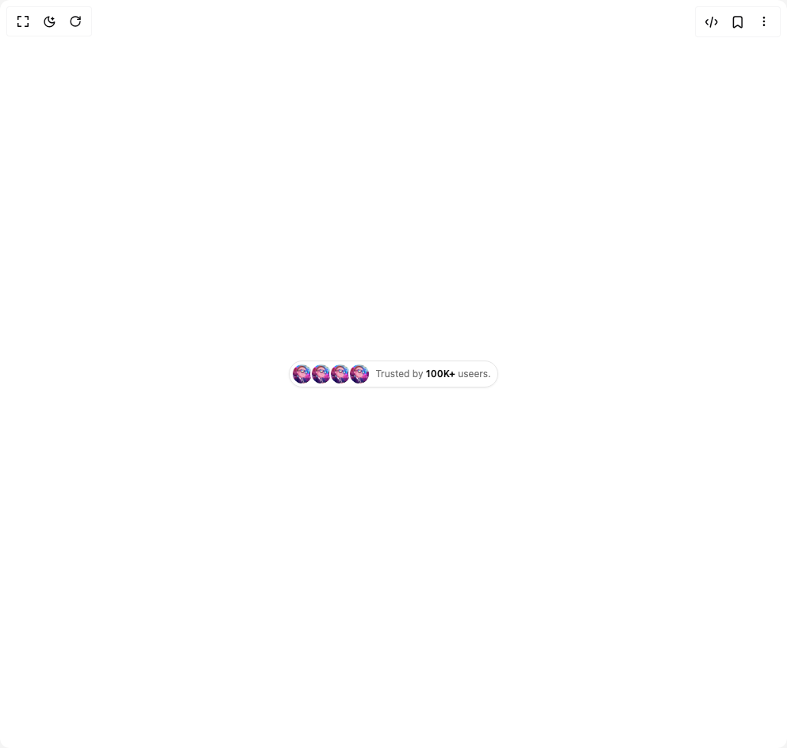

# Build Base Avatar 1 in BuilderStudio

> Build this component in our Agentic IDE: [BuilderStudio](https://builderstudio.dev).
>
> Join the BuilderStudio community on [Discord](https://discord.gg/QdWeSGCqfe) and [Reddit](https://reddit.com/r/builderstudio).



## Component

- Author group: `reui`
- Component: `base-avatar-1`
- Variant: `users`
- Rendered HTML snapshot: [`rendered.html`](rendered.html)

## BuilderStudio prompt

You are implementing a React component based on a component reference.

## Component identity

- Author: reui
- Component slug: base-avatar-1
- Demo slug: users
- Title: base-avatar-1
- Description: 

## Goal

Recreate this component in a React + TypeScript + Tailwind CSS project. Preserve the visual layout, spacing, colors, border radius, shadows, interaction behavior, animation behavior, responsive behavior, and dark mode behavior shown in the rendered demo.

## Implementation requirements

- Use React and TypeScript.
- Use Tailwind CSS classes whenever possible.
- Keep the component self-contained unless the source files require helper components.
- If the source uses CSS variables, custom CSS, animations, or keyframes, include them.
- If the source uses external packages, list and use the required packages.
- Preserve accessibility attributes, button semantics, links, keyboard behavior, and ARIA attributes when visible in the source.
- Do not replace the component with a simplified placeholder.
- Return complete production-ready code.

## Dependencies

No reference metadata available.

## Rendered DOM snapshot

This is the rendered demo HTML extracted from the live preview. Use it to verify structure, class names, visible content, and layout.

```html
<div id="root"><div class="w-screen min-h-screen flex justify-center items-center"><div class="w-screen min-h-screen flex justify-center items-center"><div class="flex items-center rounded-full p-0.5 gap-1.5 border border-border shadow-sm shadow-black/5"><div class="flex -space-x-1"><span data-slot="avatar" class="relative flex shrink-0 size-7"></span><span data-slot="avatar" class="relative flex shrink-0 size-7"></span><span data-slot="avatar" class="relative flex shrink-0 size-7"></span><span data-slot="avatar" class="relative flex shrink-0 size-7"></span></div><p class="text-xs text-muted-foreground me-1.5">Trusted by <span class="font-semibold text-foreground">100K+</span> useers.</p></div></div></div></div>
```

## Reference source files

No reference source files were available.
