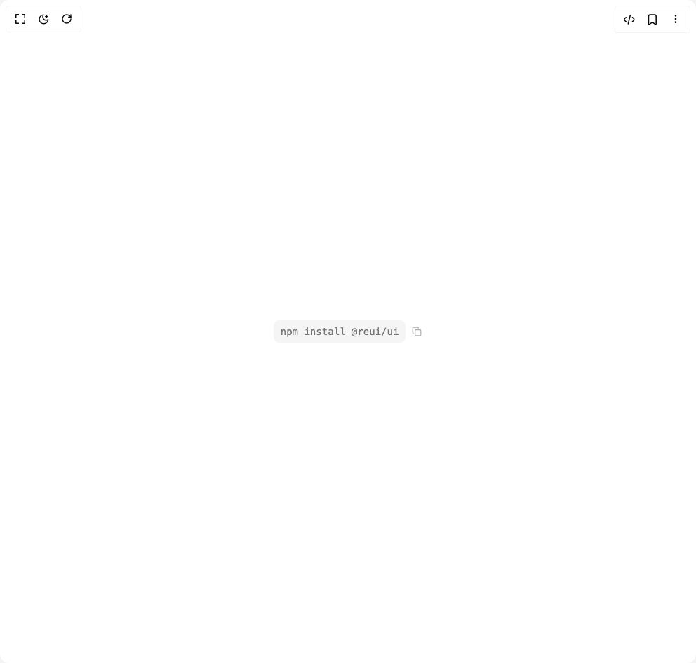

# Build Code in BuilderStudio

> Build this component in our Agentic IDE: [BuilderStudio](https://builderstudio.dev).
>
> Join the BuilderStudio community on [Discord](https://discord.gg/QdWeSGCqfe) and [Reddit](https://reddit.com/r/builderstudio).



## Component

- Author group: `reui`
- Component: `code`
- Variant: `copy-button`
- Rendered HTML snapshot: [`rendered.html`](rendered.html)

## BuilderStudio prompt

You are implementing a React component based on a component reference.

## Component identity

- Author: reui
- Component slug: code
- Demo slug: copy-button
- Title: code
- Description: 

## Goal

Recreate this component in a React + TypeScript + Tailwind CSS project. Preserve the visual layout, spacing, colors, border radius, shadows, interaction behavior, animation behavior, responsive behavior, and dark mode behavior shown in the rendered demo.

## Implementation requirements

- Use React and TypeScript.
- Use Tailwind CSS classes whenever possible.
- Keep the component self-contained unless the source files require helper components.
- If the source uses CSS variables, custom CSS, animations, or keyframes, include them.
- If the source uses external packages, list and use the required packages.
- Preserve accessibility attributes, button semantics, links, keyboard behavior, and ARIA attributes when visible in the source.
- Do not replace the component with a simplified placeholder.
- Return complete production-ready code.

## Dependencies

No reference metadata available.

## Rendered DOM snapshot

This is the rendered demo HTML extracted from the live preview. Use it to verify structure, class names, visible content, and layout.

```html
<div id="root"><div class="w-screen min-h-screen flex justify-center items-center"><div class="w-screen min-h-screen flex justify-center items-center"><span class="inline-flex items-center gap-2" data-slot="code"><code data-slot="code-panel" class="relative rounded-md font-mono font-medium bg-muted text-muted-foreground text-sm px-2.5 py-1.5">npm install @reui/ui</code><button data-slot="button" class="cursor-pointer group focus-visible:outline-hidden inline-flex items-center justify-center has-data-[arrow=true]:justify-between whitespace-nowrap font-medium ring-offset-background transition-[color,box-shadow] disabled:pointer-events-none disabled:opacity-60 [&amp;_svg]:shrink-0 hover:bg-accent hover:text-accent-foreground data-[state=open]:bg-accent data-[state=open]:text-accent-foreground rounded-md gap-1.25 text-xs [&amp;_svg:not([class*=size-])]:size-3.5 focus-visible:ring-2 focus-visible:ring-ring focus-visible:ring-offset-2 text-muted-foreground [[&amp;_svg:not([class*=size-])]:size-3.5 h-4 w-4 p-0 opacity-60 hover:opacity-100"><svg xmlns="http://www.w3.org/2000/svg" width="24" height="24" viewBox="0 0 24 24" fill="none" stroke="currentColor" stroke-width="2" stroke-linecap="round" stroke-linejoin="round" class="lucide lucide-copy h-3 w-3" aria-hidden="true"><rect width="14" height="14" x="8" y="8" rx="2" ry="2"></rect><path d="M4 16c-1.1 0-2-.9-2-2V4c0-1.1.9-2 2-2h10c1.1 0 2 .9 2 2"></path></svg></button></span></div></div></div>
```

## Reference source files

No reference source files were available.
