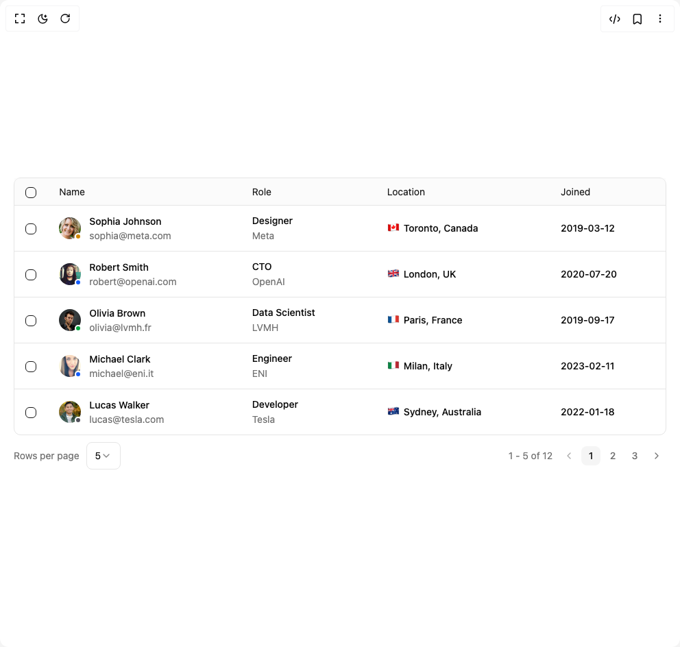

# Build Data Grid Table in BuilderStudio

> Build this component in our Agentic IDE: [BuilderStudio](https://builderstudio.dev).
>
> Join the BuilderStudio community on [Discord](https://discord.gg/QdWeSGCqfe) and [Reddit](https://reddit.com/r/builderstudio).



## Component

- Author group: `reui`
- Component: `data-grid-table`
- Variant: `row-selection-table`
- Rendered HTML snapshot: [`rendered.html`](rendered.html)

## BuilderStudio prompt

You are implementing a React component based on a component reference.

## Component identity

- Author: reui
- Component slug: data-grid-table
- Demo slug: row-selection-table
- Title: data-grid-table
- Description: 

## Goal

Recreate this component in a React + TypeScript + Tailwind CSS project. Preserve the visual layout, spacing, colors, border radius, shadows, interaction behavior, animation behavior, responsive behavior, and dark mode behavior shown in the rendered demo.

## Implementation requirements

- Use React and TypeScript.
- Use Tailwind CSS classes whenever possible.
- Keep the component self-contained unless the source files require helper components.
- If the source uses CSS variables, custom CSS, animations, or keyframes, include them.
- If the source uses external packages, list and use the required packages.
- Preserve accessibility attributes, button semantics, links, keyboard behavior, and ARIA attributes when visible in the source.
- Do not replace the component with a simplified placeholder.
- Return complete production-ready code.

## Dependencies

No reference metadata available.

## Rendered DOM snapshot

This is the rendered demo HTML extracted from the live preview. Use it to verify structure, class names, visible content, and layout.

```html
<div id="root"><div class="w-screen min-h-screen flex justify-center items-center"><div class="w-screen min-h-screen flex justify-center items-center"><div class="w-full space-y-2.5 px-5"><div data-slot="data-grid" class="grid w-full border border-border rounded-lg"><div dir="ltr" class="relative overflow-hidden" style="position: relative; --radix-scroll-area-corner-width: 0px; --radix-scroll-area-corner-height: 0px;"><style>[data-radix-scroll-area-viewport]{scrollbar-width:none;-ms-overflow-style:none;-webkit-overflow-scrolling:touch;}[data-radix-scroll-area-viewport]::-webkit-scrollbar{display:none}</style><div data-radix-scroll-area-viewport="" class="h-full w-full rounded-[inherit]" style="overflow: scroll;"><div style="min-width: 100%; display: table;"><table data-slot="data-grid-table" class="w-full align-middle caption-bottom text-left rtl:text-right text-foreground font-normal text-sm border-separate border-spacing-0 table-fixed"><thead class=""><tr class="bg-muted/40 [&amp;&gt;th]:border-b"><th class="relative h-10 text-left rtl:text-right align-middle font-normal text-accent-foreground [&amp;:has([role=checkbox])]:pe-0 px-4" style="width: 35px;"><button type="button" role="checkbox" aria-checked="false" data-state="unchecked" value="on" class="peer h-4 w-4 shrink-0 rounded-sm border border-primary ring-offset-background focus-visible:outline-none focus-visible:ring-2 focus-visible:ring-ring focus-visible:ring-offset-2 disabled:cursor-not-allowed disabled:opacity-50 data-[state=checked]:bg-primary data-[state=checked]:text-primary-foreground align-[inherit]" aria-label="Select all"></button></th><th class="relative h-10 text-left rtl:text-right align-middle font-normal text-accent-foreground [&amp;:has([role=checkbox])]:pe-0 px-4" style="width: 200px;">Name</th><th class="relative h-10 text-left rtl:text-right align-middle font-normal text-accent-foreground [&amp;:has([role=checkbox])]:pe-0 px-4" style="width: 140px;">Role</th><th class="relative h-10 text-left rtl:text-right align-middle font-normal text-accent-foreground [&amp;:has([role=checkbox])]:pe-0 px-4" style="width: 180px;">Location</th><th class="relative h-10 text-left rtl:text-right align-middle font-normal text-accent-foreground [&amp;:has([role=checkbox])]:pe-0 px-4" style="width: 120px;">Joined</th></tr></thead><tbody class="[&amp;_tr:last-child]:border-0"><tr class="hover:bg-muted/40 data-[state=selected]:bg-muted/50 border-b border-border [&amp;:not(:last-child)&gt;td]:border-b [&amp;_&gt;:first-child]:relative"><td class="align-middle px-4 py-3"><div class="hidden absolute top-0 bottom-0 start-0 w-[2px] bg-primary"></div><button type="button" role="checkbox" aria-checked="false" data-state="unchecked" value="on" class="peer h-4 w-4 shrink-0 rounded-sm border border-primary ring-offset-background focus-visible:outline-none focus-visible:ring-2 focus-visible:ring-ring focus-visible:ring-offset-2 disabled:cursor-not-allowed disabled:opacity-50 data-[state=checked]:bg-primary data-[state=checked]:text-primary-foreground align-[inherit]" aria-label="Select row"></button></td><td class="align-middle px-4 py-3"><div class="flex items-center gap-3"><span data-slot="avatar" class="relative flex shrink-0 size-8"><div class="relative overflow-hidden rounded-full"></div><div data-slot="avatar-indicator" class="absolute flex size-6 items-center justify-center -end-2 -bottom-2"><div data-slot="avatar-status" class="flex items-center rounded-full border-2 border-background bg-yellow-600 size-2.5"></div></div></span><div class="space-y-px"><div class="font-medium text-foreground">Sophia Johnson</div><div class="text-muted-foreground">sophia@meta.com</div></div></div></td><td class="align-middle px-4 py-3"><div class="space-y-0.5"><div class="font-medium text-foreground">Designer</div><div class="text-muted-foreground">Meta</div></div></td><td class="align-middle px-4 py-3 text-start"><div class="flex items-center gap-1.5">🇨🇦<div class="font-medium text-foreground">Toronto, Canada</div></div></td><td class="align-middle px-4 py-3 font-medium">2019-03-12</td></tr><tr class="hover:bg-muted/40 data-[state=selected]:bg-muted/50 border-b border-border [&amp;:not(:last-child)&gt;td]:border-b [&amp;_&gt;:first-child]:relative"><td class="align-middle px-4 py-3"><div class="hidden absolute top-0 bottom-0 start-0 w-[2px] bg-primary"></div><button type="button" role="checkbox" aria-checked="false" data-state="unchecked" value="on" class="peer h-4 w-4 shrink-0 rounded-sm border border-primary ring-offset-background focus-visible:outline-none focus-visible:ring-2 focus-visible:ring-ring focus-visible:ring-offset-2 disabled:cursor-not-allowed disabled:opacity-50 data-[state=checked]:bg-primary data-[state=checked]:text-primary-foreground align-[inherit]" aria-label="Select row"></button></td><td class="align-middle px-4 py-3"><div class="flex items-center gap-3"><span data-slot="avatar" class="relative flex shrink-0 size-8"><div class="relative overflow-hidden rounded-full"></div><div data-slot="avatar-indicator" class="absolute flex size-6 items-center justify-center -end-2 -bottom-2"><div data-slot="avatar-status" class="flex items-center rounded-full border-2 border-background bg-blue-600 size-2.5"></div></div></span><div class="space-y-px"><div class="font-medium text-foreground">Robert Smith</div><div class="text-muted-foreground">robert@openai.com</div></div></div></td><td class="align-middle px-4 py-3"><div class="space-y-0.5"><div class="font-medium text-foreground">CTO</div><div class="text-muted-foreground">OpenAI</div></div></td><td class="align-middle px-4 py-3 text-start"><div class="flex items-center gap-1.5">🇬🇧<div class="font-medium text-foreground">London, UK</div></div></td><td class="align-middle px-4 py-3 font-medium">2020-07-20</td></tr><tr class="hover:bg-muted/40 data-[state=selected]:bg-muted/50 border-b border-border [&amp;:not(:last-child)&gt;td]:border-b [&amp;_&gt;:first-child]:relative"><td class="align-middle px-4 py-3"><div class="hidden absolute top-0 bottom-0 start-0 w-[2px] bg-primary"></div><button type="button" role="checkbox" aria-checked="false" data-state="unchecked" value="on" class="peer h-4 w-4 shrink-0 rounded-sm border border-primary ring-offset-background focus-visible:outline-none focus-visible:ring-2 focus-visible:ring-ring focus-visible:ring-offset-2 disabled:cursor-not-allowed disabled:opacity-50 data-[state=checked]:bg-primary data-[state=checked]:text-primary-foreground align-[inherit]" aria-label="Select row"></button></td><td class="align-middle px-4 py-3"><div class="flex items-center gap-3"><span data-slot="avatar" class="relative flex shrink-0 size-8"><div class="relative overflow-hidden rounded-full"></div><div data-slot="avatar-indicator" class="absolute flex size-6 items-center justify-center -end-2 -bottom-2"><div data-slot="avatar-status" class="flex items-center rounded-full border-2 border-background bg-green-600 size-2.5"></div></div></span><div class="space-y-px"><div class="font-medium text-foreground">Olivia Brown</div><div class="text-muted-foreground">olivia@lvmh.fr</div></div></div></td><td class="align-middle px-4 py-3"><div class="space-y-0.5"><div class="font-medium text-foreground">Data Scientist</div><div class="text-muted-foreground">LVMH</div></div></td><td class="align-middle px-4 py-3 text-start"><div class="flex items-center gap-1.5">🇫🇷<div class="font-medium text-foreground">Paris, France</div></div></td><td class="align-middle px-4 py-3 font-medium">2019-09-17</td></tr><tr class="hover:bg-muted/40 data-[state=selected]:bg-muted/50 border-b border-border [&amp;:not(:last-child)&gt;td]:border-b [&amp;_&gt;:first-child]:relative"><td class="align-middle px-4 py-3"><div class="hidden absolute top-0 bottom-0 start-0 w-[2px] bg-primary"></div><button type="button" role="checkbox" aria-checked="false" data-state="unchecked" value="on" class="peer h-4 w-4 shrink-0 rounded-sm border border-primary ring-offset-background focus-visible:outline-none focus-visible:ring-2 focus-visible:ring-ring focus-visible:ring-offset-2 disabled:cursor-not-allowed disabled:opacity-50 data-[state=checked]:bg-primary data-[state=checked]:text-primary-foreground align-[inherit]" aria-label="Select row"></button></td><td class="align-middle px-4 py-3"><div class="flex items-center gap-3"><span data-slot="avatar" class="relative flex shrink-0 size-8"><div class="relative overflow-hidden rounded-full"></div><div data-slot="avatar-indicator" class="absolute flex size-6 items-center justify-center -end-2 -bottom-2"><div data-slot="avatar-status" class="flex items-center rounded-full border-2 border-background bg-blue-600 size-2.5"></div></div></span><div class="space-y-px"><div class="font-medium text-foreground">Michael Clark</div><div class="text-muted-foreground">michael@eni.it</div></div></div></td><td class="align-middle px-4 py-3"><div class="space-y-0.5"><div class="font-medium text-foreground">Engineer</div><div class="text-muted-foreground">ENI</div></div></td><td class="align-middle px-4 py-3 text-start"><div class="flex items-center gap-1.5">🇮🇹<div class="font-medium text-foreground">Milan, Italy</div></div></td><td class="align-middle px-4 py-3 font-medium">2023-02-11</td></tr><tr class="hover:bg-muted/40 data-[state=selected]:bg-muted/50 border-b border-border [&amp;:not(:last-child)&gt;td]:border-b [&amp;_&gt;:first-child]:relative"><td class="align-middle px-4 py-3"><div class="hidden absolute top-0 bottom-0 start-0 w-[2px] bg-primary"></div><button type="button" role="checkbox" aria-checked="false" data-state="unchecked" value="on" class="peer h-4 w-4 shrink-0 rounded-sm border border-primary ring-offset-background focus-visible:outline-none focus-visible:ring-2 focus-visible:ring-ring focus-visible:ring-offset-2 disabled:cursor-not-allowed disabled:opacity-50 data-[state=checked]:bg-primary data-[state=checked]:text-primary-foreground align-[inherit]" aria-label="Select row"></button></td><td class="align-middle px-4 py-3"><div class="flex items-center gap-3"><span data-slot="avatar" class="relative flex shrink-0 size-8"><div class="relative overflow-hidden rounded-full"></div><div data-slot="avatar-indicator" class="absolute flex size-6 items-center justify-center -end-2 -bottom-2"><div data-slot="avatar-status" class="flex items-center rounded-full border-2 border-background bg-zinc-600 dark:bg-zinc-300 size-2.5"></div></div></span><div class="space-y-px"><div class="font-medium text-foreground">Lucas Walker</div><div class="text-muted-foreground">lucas@tesla.com</div></div></div></td><td class="align-middle px-4 py-3"><div class="space-y-0.5"><div class="font-medium text-foreground">Developer</div><div class="text-muted-foreground">Tesla</div></div></td><td class="align-middle px-4 py-3 text-start"><div class="flex items-center gap-1.5">🇦🇺<div class="font-medium text-foreground">Sydney, Australia</div></div></td><td class="align-middle px-4 py-3 font-medium">2022-01-18</td></tr></tbody></table></div></div></div></div><div data-slot="data-grid-pagination" class="flex flex-wrap flex-col sm:flex-row justify-between items-center gap-2.5 py-2.5 sm:py-0 grow"><div class="flex flex-wrap items-center space-x-2.5 pb-2.5 sm:pb-0 order-2 sm:order-1"><div class="text-sm text-muted-foreground">Rows per page</div><button type="button" role="combobox" aria-controls="radix-«r0»" aria-expanded="false" aria-autocomplete="none" dir="ltr" data-state="closed" class="flex h-10 items-center justify-between rounded-md border border-input bg-background px-3 py-2 text-sm ring-offset-background placeholder:text-muted-foreground focus:outline-none focus:ring-2 focus:ring-ring focus:ring-offset-2 disabled:cursor-not-allowed disabled:opacity-50 [&amp;&gt;span]:line-clamp-1 w-fit"><span style="pointer-events: none;">5</span><svg xmlns="http://www.w3.org/2000/svg" width="24" height="24" viewBox="0 0 24 24" fill="none" stroke="currentColor" stroke-width="2" stroke-linecap="round" stroke-linejoin="round" class="lucide lucide-chevron-down h-4 w-4 opacity-50" aria-hidden="true"><path d="m6 9 6 6 6-6"></path></svg></button></div><div class="flex flex-col sm:flex-row justify-center sm:justify-end items-center gap-2.5 pt-2.5 sm:pt-0 order-1 sm:order-2"><div class="text-sm text-muted-foreground text-nowrap order-2 sm:order-1">1 - 5 of 12</div><div class="flex items-center space-x-1 order-1 sm:order-2"><button data-slot="button" class="cursor-pointer group focus-visible:outline-hidden inline-flex items-center justify-center has-data-[arrow=true]:justify-between whitespace-nowrap font-medium ring-offset-background transition-[color,box-shadow] disabled:pointer-events-none disabled:opacity-60 [&amp;_svg]:shrink-0 hover:bg-accent hover:text-accent-foreground data-[state=open]:bg-accent data-[state=open]:text-accent-foreground rounded-md gap-1.25 [&amp;_svg:not([class*=size-])]:size-3.5 focus-visible:ring-2 focus-visible:ring-ring focus-visible:ring-offset-2 text-muted-foreground [[&amp;_svg:not([class*=size-])]:size-3.5 size-7 p-0 text-sm rtl:transform rtl:rotate-180" disabled=""><span class="sr-only">Go to previous page</span><svg xmlns="http://www.w3.org/2000/svg" width="24" height="24" viewBox="0 0 24 24" fill="none" stroke="currentColor" stroke-width="2" stroke-linecap="round" stroke-linejoin="round" class="lucide lucide-chevron-left size-4" aria-hidden="true"><path d="m15 18-6-6 6-6"></path></svg></button><button data-slot="button" class="cursor-pointer group focus-visible:outline-hidden inline-flex items-center justify-center has-data-[arrow=true]:justify-between whitespace-nowrap font-medium ring-offset-background transition-[color,box-shadow] disabled:pointer-events-none disabled:opacity-60 [&amp;_svg]:shrink-0 hover:bg-accent hover:text-accent-foreground data-[state=open]:bg-accent data-[state=open]:text-accent-foreground rounded-md gap-1.25 [&amp;_svg:not([class*=size-])]:size-3.5 focus-visible:ring-2 focus-visible:ring-ring focus-visible:ring-offset-2 [[&amp;_svg:not([class*=size-])]:size-3.5 size-7 p-0 text-sm bg-accent text-accent-foreground">1</button><button data-slot="button" class="cursor-pointer group focus-visible:outline-hidden inline-flex items-center justify-center has-data-[arrow=true]:justify-between whitespace-nowrap font-medium ring-offset-background transition-[color,box-shadow] disabled:pointer-events-none disabled:opacity-60 [&amp;_svg]:shrink-0 hover:bg-accent hover:text-accent-foreground data-[state=open]:bg-accent data-[state=open]:text-accent-foreground rounded-md gap-1.25 [&amp;_svg:not([class*=size-])]:size-3.5 focus-visible:ring-2 focus-visible:ring-ring focus-visible:ring-offset-2 [[&amp;_svg:not([class*=size-])]:size-3.5 size-7 p-0 text-sm text-muted-foreground">2</button><button data-slot="button" class="cursor-pointer group focus-visible:outline-hidden inline-flex items-center justify-center has-data-[arrow=true]:justify-between whitespace-nowrap font-medium ring-offset-background transition-[color,box-shadow] disabled:pointer-events-none disabled:opacity-60 [&amp;_svg]:shrink-0 hover:bg-accent hover:text-accent-foreground data-[state=open]:bg-accent data-[state=open]:text-accent-foreground rounded-md gap-1.25 [&amp;_svg:not([class*=size-])]:size-3.5 focus-visible:ring-2 focus-visible:ring-ring focus-visible:ring-offset-2 [[&amp;_svg:not([class*=size-])]:size-3.5 size-7 p-0 text-sm text-muted-foreground">3</button><button data-slot="button" class="cursor-pointer group focus-visible:outline-hidden inline-flex items-center justify-center has-data-[arrow=true]:justify-between whitespace-nowrap font-medium ring-offset-background transition-[color,box-shadow] disabled:pointer-events-none disabled:opacity-60 [&amp;_svg]:shrink-0 hover:bg-accent hover:text-accent-foreground data-[state=open]:bg-accent data-[state=open]:text-accent-foreground rounded-md gap-1.25 [&amp;_svg:not([class*=size-])]:size-3.5 focus-visible:ring-2 focus-visible:ring-ring focus-visible:ring-offset-2 text-muted-foreground [[&amp;_svg:not([class*=size-])]:size-3.5 size-7 p-0 text-sm rtl:transform rtl:rotate-180"><span class="sr-only">Go to next page</span><svg xmlns="http://www.w3.org/2000/svg" width="24" height="24" viewBox="0 0 24 24" fill="none" stroke="currentColor" stroke-width="2" stroke-linecap="round" stroke-linejoin="round" class="lucide lucide-chevron-right size-4" aria-hidden="true"><path d="m9 18 6-6-6-6"></path></svg></button></div></div></div></div></div></div></div>
```

## Reference source files

No reference source files were available.
