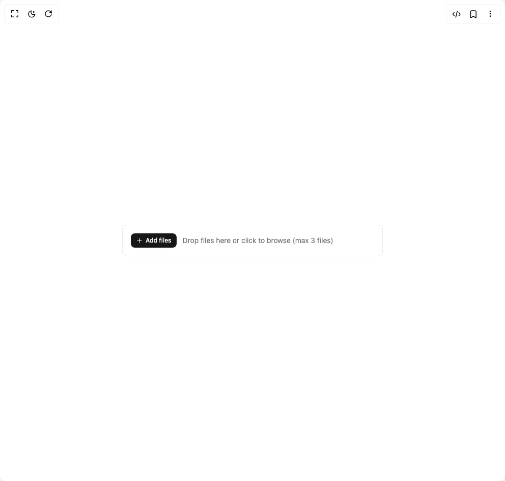

# Build File Upload in BuilderStudio

> Build this component in our Agentic IDE: [BuilderStudio](https://builderstudio.dev).
>
> Join the BuilderStudio community on [Discord](https://discord.gg/QdWeSGCqfe) and [Reddit](https://reddit.com/r/builderstudio).



## Component

- Author group: `reui`
- Component: `file-upload`
- Variant: `compact-upload`
- Rendered HTML snapshot: [`rendered.html`](rendered.html)

## BuilderStudio prompt

You are implementing a React component based on a component reference.

## Component identity

- Author: reui
- Component slug: file-upload
- Demo slug: compact-upload
- Title: file-upload
- Description: 

## Goal

Recreate this component in a React + TypeScript + Tailwind CSS project. Preserve the visual layout, spacing, colors, border radius, shadows, interaction behavior, animation behavior, responsive behavior, and dark mode behavior shown in the rendered demo.

## Implementation requirements

- Use React and TypeScript.
- Use Tailwind CSS classes whenever possible.
- Keep the component self-contained unless the source files require helper components.
- If the source uses CSS variables, custom CSS, animations, or keyframes, include them.
- If the source uses external packages, list and use the required packages.
- Preserve accessibility attributes, button semantics, links, keyboard behavior, and ARIA attributes when visible in the source.
- Do not replace the component with a simplified placeholder.
- Return complete production-ready code.

## Dependencies

No reference metadata available.

## Rendered DOM snapshot

This is the rendered demo HTML extracted from the live preview. Use it to verify structure, class names, visible content, and layout.

```html
<div id="root"><div class="w-screen min-h-screen flex justify-center items-center"><div class="w-screen min-h-screen flex justify-center items-center"><div class="w-full max-w-lg"><div class="flex items-center gap-3 rounded-lg border border-dashed p-4 transition-colors border-muted-foreground/25 hover:border-muted-foreground/50"><input accept="image/*" multiple="" class="sr-only" type="file"><button data-slot="button" class="cursor-pointer group focus-visible:outline-hidden inline-flex items-center justify-center has-data-[arrow=true]:justify-between whitespace-nowrap font-medium ring-offset-background transition-[color,box-shadow] disabled:pointer-events-none disabled:opacity-60 [&amp;_svg]:shrink-0 bg-primary text-primary-foreground hover:bg-primary/90 data-[state=open]:bg-primary/90 h-7 rounded-md px-2.5 gap-1.25 text-xs [&amp;_svg:not([class*=size-])]:size-3.5 focus-visible:ring-2 focus-visible:ring-ring focus-visible:ring-offset-2 shadow-xs shadow-black/5"><svg xmlns="http://www.w3.org/2000/svg" width="24" height="24" viewBox="0 0 24 24" fill="none" stroke="currentColor" stroke-width="2" stroke-linecap="round" stroke-linejoin="round" class="lucide lucide-plus h-4 w-4" aria-hidden="true"><path d="M5 12h14"></path><path d="M12 5v14"></path></svg>Add files</button><div class="flex flex-1 items-center gap-2"><p class="text-sm text-muted-foreground">Drop files here or click to browse (max 3 files)</p></div></div></div></div></div></div>
```

## Reference source files

No reference source files were available.
