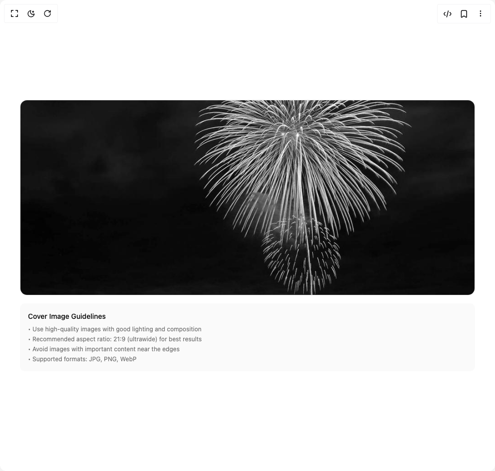

# Build File Upload in BuilderStudio

> Build this component in our Agentic IDE: [BuilderStudio](https://builderstudio.dev).
>
> Join the BuilderStudio community on [Discord](https://discord.gg/QdWeSGCqfe) and [Reddit](https://reddit.com/r/builderstudio).



## Component

- Author group: `reui`
- Component: `file-upload`
- Variant: `cover-upload`
- Rendered HTML snapshot: [`rendered.html`](rendered.html)

## BuilderStudio prompt

You are implementing a React component based on a component reference.

## Component identity

- Author: reui
- Component slug: file-upload
- Demo slug: cover-upload
- Title: file-upload
- Description: 

## Goal

Recreate this component in a React + TypeScript + Tailwind CSS project. Preserve the visual layout, spacing, colors, border radius, shadows, interaction behavior, animation behavior, responsive behavior, and dark mode behavior shown in the rendered demo.

## Implementation requirements

- Use React and TypeScript.
- Use Tailwind CSS classes whenever possible.
- Keep the component self-contained unless the source files require helper components.
- If the source uses CSS variables, custom CSS, animations, or keyframes, include them.
- If the source uses external packages, list and use the required packages.
- Preserve accessibility attributes, button semantics, links, keyboard behavior, and ARIA attributes when visible in the source.
- Do not replace the component with a simplified placeholder.
- Return complete production-ready code.

## Dependencies

No reference metadata available.

## Rendered DOM snapshot

This is the rendered demo HTML extracted from the live preview. Use it to verify structure, class names, visible content, and layout.

```html
<div id="root"><div class="w-screen min-h-screen flex justify-center items-center"><div class="w-screen min-h-screen flex justify-center items-center"><div class="flex flex-col gap-5 p-10 w-full mx-auto h-screen justify-center items-center"><div class="w-full space-y-4"><div class="group relative overflow-hidden rounded-xl transition-all duration-200 border border-border bg-background hover:border-primary/50"><input accept="image/*" class="sr-only" type="file"><div class="relative aspect-[21/9] w-full"><div class="absolute inset-0 bg-black/0 transition-all duration-200 group-hover:bg-black/40"></div><div class="absolute inset-0 flex items-center justify-center opacity-0 transition-opacity duration-200 group-hover:opacity-100"><div class="flex gap-2"><button data-slot="button" class="cursor-pointer group focus-visible:outline-hidden inline-flex items-center justify-center has-data-[arrow=true]:justify-between whitespace-nowrap font-medium ring-offset-background transition-[color,box-shadow] disabled:pointer-events-none disabled:opacity-60 [&amp;_svg]:shrink-0 data-[state=open]:bg-secondary/90 h-7 rounded-md px-2.5 gap-1.25 text-xs [&amp;_svg:not([class*=size-])]:size-3.5 focus-visible:ring-2 focus-visible:ring-ring focus-visible:ring-offset-2 [&amp;_svg:not([role=img]):not([class*=text-]):not([class*=opacity-])]:opacity-60 shadow-xs shadow-black/5 bg-white/90 text-gray-900 hover:bg-white"><svg xmlns="http://www.w3.org/2000/svg" width="24" height="24" viewBox="0 0 24 24" fill="none" stroke="currentColor" stroke-width="2" stroke-linecap="round" stroke-linejoin="round" class="lucide lucide-upload" aria-hidden="true"><path d="M21 15v4a2 2 0 0 1-2 2H5a2 2 0 0 1-2-2v-4"></path><polyline points="17 8 12 3 7 8"></polyline><line x1="12" x2="12" y1="3" y2="15"></line></svg>Change Cover</button><button data-slot="button" class="cursor-pointer group focus-visible:outline-hidden inline-flex items-center justify-center has-data-[arrow=true]:justify-between whitespace-nowrap font-medium ring-offset-background transition-[color,box-shadow] disabled:pointer-events-none disabled:opacity-60 [&amp;_svg]:shrink-0 bg-destructive text-destructive-foreground hover:bg-destructive/90 data-[state=open]:bg-destructive/90 h-7 rounded-md px-2.5 gap-1.25 text-xs [&amp;_svg:not([class*=size-])]:size-3.5 focus-visible:ring-2 focus-visible:ring-ring focus-visible:ring-offset-2 shadow-xs shadow-black/5"><svg xmlns="http://www.w3.org/2000/svg" width="24" height="24" viewBox="0 0 24 24" fill="none" stroke="currentColor" stroke-width="2" stroke-linecap="round" stroke-linejoin="round" class="lucide lucide-x" aria-hidden="true"><path d="M18 6 6 18"></path><path d="m6 6 12 12"></path></svg>Remove</button></div></div></div></div><div class="rounded-lg bg-muted/50 p-4"><h4 class="mb-2 text-sm font-medium">Cover Image Guidelines</h4><ul class="space-y-1 text-xs text-muted-foreground"><li>• Use high-quality images with good lighting and composition</li><li>• Recommended aspect ratio: 21:9 (ultrawide) for best results</li><li>• Avoid images with important content near the edges</li><li>• Supported formats: JPG, PNG, WebP</li></ul></div></div></div></div></div></div>
```

## Reference source files

No reference source files were available.
