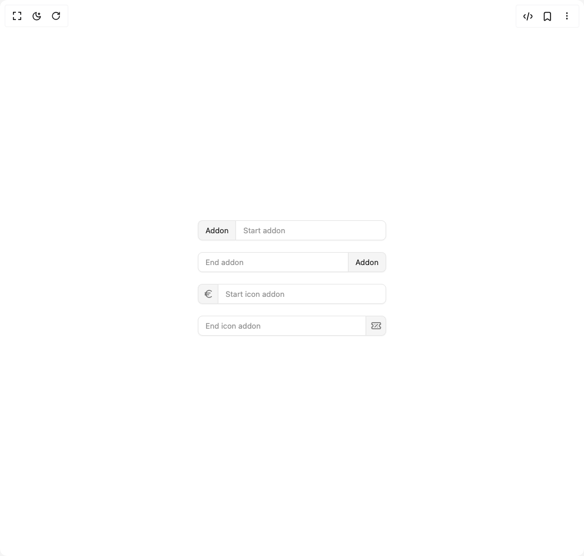

# Build Input in BuilderStudio

> Build this component in our Agentic IDE: [BuilderStudio](https://builderstudio.dev).
>
> Join the BuilderStudio community on [Discord](https://discord.gg/QdWeSGCqfe) and [Reddit](https://reddit.com/r/builderstudio).



## Component

- Author group: `reui`
- Component: `input`
- Variant: `addon`
- Rendered HTML snapshot: [`rendered.html`](rendered.html)

## BuilderStudio prompt

You are implementing a React component based on a component reference.

## Component identity

- Author: reui
- Component slug: input
- Demo slug: addon
- Title: input
- Description: 

## Goal

Recreate this component in a React + TypeScript + Tailwind CSS project. Preserve the visual layout, spacing, colors, border radius, shadows, interaction behavior, animation behavior, responsive behavior, and dark mode behavior shown in the rendered demo.

## Implementation requirements

- Use React and TypeScript.
- Use Tailwind CSS classes whenever possible.
- Keep the component self-contained unless the source files require helper components.
- If the source uses CSS variables, custom CSS, animations, or keyframes, include them.
- If the source uses external packages, list and use the required packages.
- Preserve accessibility attributes, button semantics, links, keyboard behavior, and ARIA attributes when visible in the source.
- Do not replace the component with a simplified placeholder.
- Return complete production-ready code.

## Dependencies

No reference metadata available.

## Rendered DOM snapshot

This is the rendered demo HTML extracted from the live preview. Use it to verify structure, class names, visible content, and layout.

```html
<div id="root"><div class="w-screen min-h-screen flex justify-center items-center"><div class="w-screen min-h-screen flex justify-center items-center"><div class="space-y-5 w-80"><div data-slot="input-group" class="flex items-stretch [&amp;_[data-slot=input]]:grow [&amp;_[data-slot=input-addon]:has(+[data-slot=input])]:rounded-e-none [&amp;_[data-slot=input-addon]:has(+[data-slot=input])]:border-e-0 [&amp;_[data-slot=input-addon]:has(+[data-slot=datefield])]:rounded-e-none [&amp;_[data-slot=input-addon]:has(+[data-slot=datefield])]:border-e-0 [&amp;_[data-slot=input]+[data-slot=input-addon]]:rounded-s-none [&amp;_[data-slot=input]+[data-slot=input-addon]]:border-s-0 [&amp;_[data-slot=input-addon]:has(+[data-slot=button])]:rounded-e-none [&amp;_[data-slot=input]+[data-slot=button]]:rounded-s-none [&amp;_[data-slot=button]+[data-slot=input]]:rounded-s-none [&amp;_[data-slot=input-addon]+[data-slot=input]]:rounded-s-none [&amp;_[data-slot=input-addon]+[data-slot=datefield]]:[&amp;_[data-slot=input]]:rounded-s-none [&amp;_[data-slot=datefield]:has(+[data-slot=input-addon])]:[&amp;_[data-slot=input]]:rounded-e-none [&amp;_[data-slot=input]:has(+[data-slot=button])]:rounded-e-none [&amp;_[data-slot=input]:has(+[data-slot=input-addon])]:rounded-e-none [&amp;_[data-slot=datefield]]:grow [&amp;_[data-slot=datefield]+[data-slot=input-addon]]:rounded-s-none [&amp;_[data-slot=datefield]+[data-slot=input-addon]]:border-s-0"><div data-slot="input-addon" class="flex items-center shrink-0 justify-center bg-muted border border-input shadow-xs shadow-[rgba(0,0,0,0.05)] text-secondary-foreground [&amp;_svg]:text-secondary-foreground/60 rounded-md h-8.5 min-w-8.5 px-3 text-[0.8125rem] leading-(--text-sm--line-height) [&amp;_svg:not([class*=size-])]:size-4.5">Addon</div><input data-slot="input" class="flex w-full bg-background border border-input shadow-xs shadow-black/5 transition-[color,box-shadow] text-foreground placeholder:text-muted-foreground/80 focus-visible:ring-ring/30 focus-visible:border-ring focus-visible:outline-none focus-visible:ring-[3px] disabled:cursor-not-allowed disabled:opacity-60 [&amp;[readonly]]:bg-muted/80 [&amp;[readonly]]:cursor-not-allowed file:h-full [&amp;[type=file]]:py-0 file:border-solid file:border-input file:bg-transparent file:font-medium file:not-italic file:text-foreground file:p-0 file:border-0 file:border-e aria-invalid:border-destructive/60 aria-invalid:ring-destructive/10 dark:aria-invalid:border-destructive dark:aria-invalid:ring-destructive/20 h-8.5 px-3 text-[0.8125rem] leading-(--text-sm--line-height) rounded-md file:pe-3 file:me-3" placeholder="Start addon" type="email"></div><div data-slot="input-group" class="flex items-stretch [&amp;_[data-slot=input]]:grow [&amp;_[data-slot=input-addon]:has(+[data-slot=input])]:rounded-e-none [&amp;_[data-slot=input-addon]:has(+[data-slot=input])]:border-e-0 [&amp;_[data-slot=input-addon]:has(+[data-slot=datefield])]:rounded-e-none [&amp;_[data-slot=input-addon]:has(+[data-slot=datefield])]:border-e-0 [&amp;_[data-slot=input]+[data-slot=input-addon]]:rounded-s-none [&amp;_[data-slot=input]+[data-slot=input-addon]]:border-s-0 [&amp;_[data-slot=input-addon]:has(+[data-slot=button])]:rounded-e-none [&amp;_[data-slot=input]+[data-slot=button]]:rounded-s-none [&amp;_[data-slot=button]+[data-slot=input]]:rounded-s-none [&amp;_[data-slot=input-addon]+[data-slot=input]]:rounded-s-none [&amp;_[data-slot=input-addon]+[data-slot=datefield]]:[&amp;_[data-slot=input]]:rounded-s-none [&amp;_[data-slot=datefield]:has(+[data-slot=input-addon])]:[&amp;_[data-slot=input]]:rounded-e-none [&amp;_[data-slot=input]:has(+[data-slot=button])]:rounded-e-none [&amp;_[data-slot=input]:has(+[data-slot=input-addon])]:rounded-e-none [&amp;_[data-slot=datefield]]:grow [&amp;_[data-slot=datefield]+[data-slot=input-addon]]:rounded-s-none [&amp;_[data-slot=datefield]+[data-slot=input-addon]]:border-s-0"><input data-slot="input" class="flex w-full bg-background border border-input shadow-xs shadow-black/5 transition-[color,box-shadow] text-foreground placeholder:text-muted-foreground/80 focus-visible:ring-ring/30 focus-visible:border-ring focus-visible:outline-none focus-visible:ring-[3px] disabled:cursor-not-allowed disabled:opacity-60 [&amp;[readonly]]:bg-muted/80 [&amp;[readonly]]:cursor-not-allowed file:h-full [&amp;[type=file]]:py-0 file:border-solid file:border-input file:bg-transparent file:font-medium file:not-italic file:text-foreground file:p-0 file:border-0 file:border-e aria-invalid:border-destructive/60 aria-invalid:ring-destructive/10 dark:aria-invalid:border-destructive dark:aria-invalid:ring-destructive/20 h-8.5 px-3 text-[0.8125rem] leading-(--text-sm--line-height) rounded-md file:pe-3 file:me-3" placeholder="End addon" type="email"><div data-slot="input-addon" class="flex items-center shrink-0 justify-center bg-muted border border-input shadow-xs shadow-[rgba(0,0,0,0.05)] text-secondary-foreground [&amp;_svg]:text-secondary-foreground/60 rounded-md h-8.5 min-w-8.5 px-3 text-[0.8125rem] leading-(--text-sm--line-height) [&amp;_svg:not([class*=size-])]:size-4.5">Addon</div></div><div data-slot="input-group" class="flex items-stretch [&amp;_[data-slot=input]]:grow [&amp;_[data-slot=input-addon]:has(+[data-slot=input])]:rounded-e-none [&amp;_[data-slot=input-addon]:has(+[data-slot=input])]:border-e-0 [&amp;_[data-slot=input-addon]:has(+[data-slot=datefield])]:rounded-e-none [&amp;_[data-slot=input-addon]:has(+[data-slot=datefield])]:border-e-0 [&amp;_[data-slot=input]+[data-slot=input-addon]]:rounded-s-none [&amp;_[data-slot=input]+[data-slot=input-addon]]:border-s-0 [&amp;_[data-slot=input-addon]:has(+[data-slot=button])]:rounded-e-none [&amp;_[data-slot=input]+[data-slot=button]]:rounded-s-none [&amp;_[data-slot=button]+[data-slot=input]]:rounded-s-none [&amp;_[data-slot=input-addon]+[data-slot=input]]:rounded-s-none [&amp;_[data-slot=input-addon]+[data-slot=datefield]]:[&amp;_[data-slot=input]]:rounded-s-none [&amp;_[data-slot=datefield]:has(+[data-slot=input-addon])]:[&amp;_[data-slot=input]]:rounded-e-none [&amp;_[data-slot=input]:has(+[data-slot=button])]:rounded-e-none [&amp;_[data-slot=input]:has(+[data-slot=input-addon])]:rounded-e-none [&amp;_[data-slot=datefield]]:grow [&amp;_[data-slot=datefield]+[data-slot=input-addon]]:rounded-s-none [&amp;_[data-slot=datefield]+[data-slot=input-addon]]:border-s-0"><div data-slot="input-addon" class="flex items-center shrink-0 bg-muted border border-input shadow-xs shadow-[rgba(0,0,0,0.05)] text-secondary-foreground [&amp;_svg]:text-secondary-foreground/60 rounded-md h-8.5 min-w-8.5 text-[0.8125rem] leading-(--text-sm--line-height) [&amp;_svg:not([class*=size-])]:size-4.5 px-0 justify-center"><svg xmlns="http://www.w3.org/2000/svg" width="24" height="24" viewBox="0 0 24 24" fill="none" stroke="currentColor" stroke-width="2" stroke-linecap="round" stroke-linejoin="round" class="lucide lucide-euro" aria-hidden="true"><path d="M4 10h12"></path><path d="M4 14h9"></path><path d="M19 6a7.7 7.7 0 0 0-5.2-2A7.9 7.9 0 0 0 6 12c0 4.4 3.5 8 7.8 8 2 0 3.8-.8 5.2-2"></path></svg></div><input data-slot="input" class="flex w-full bg-background border border-input shadow-xs shadow-black/5 transition-[color,box-shadow] text-foreground placeholder:text-muted-foreground/80 focus-visible:ring-ring/30 focus-visible:border-ring focus-visible:outline-none focus-visible:ring-[3px] disabled:cursor-not-allowed disabled:opacity-60 [&amp;[readonly]]:bg-muted/80 [&amp;[readonly]]:cursor-not-allowed file:h-full [&amp;[type=file]]:py-0 file:border-solid file:border-input file:bg-transparent file:font-medium file:not-italic file:text-foreground file:p-0 file:border-0 file:border-e aria-invalid:border-destructive/60 aria-invalid:ring-destructive/10 dark:aria-invalid:border-destructive dark:aria-invalid:ring-destructive/20 h-8.5 px-3 text-[0.8125rem] leading-(--text-sm--line-height) rounded-md file:pe-3 file:me-3" placeholder="Start icon addon" type="email"></div><div data-slot="input-group" class="flex items-stretch [&amp;_[data-slot=input]]:grow [&amp;_[data-slot=input-addon]:has(+[data-slot=input])]:rounded-e-none [&amp;_[data-slot=input-addon]:has(+[data-slot=input])]:border-e-0 [&amp;_[data-slot=input-addon]:has(+[data-slot=datefield])]:rounded-e-none [&amp;_[data-slot=input-addon]:has(+[data-slot=datefield])]:border-e-0 [&amp;_[data-slot=input]+[data-slot=input-addon]]:rounded-s-none [&amp;_[data-slot=input]+[data-slot=input-addon]]:border-s-0 [&amp;_[data-slot=input-addon]:has(+[data-slot=button])]:rounded-e-none [&amp;_[data-slot=input]+[data-slot=button]]:rounded-s-none [&amp;_[data-slot=button]+[data-slot=input]]:rounded-s-none [&amp;_[data-slot=input-addon]+[data-slot=input]]:rounded-s-none [&amp;_[data-slot=input-addon]+[data-slot=datefield]]:[&amp;_[data-slot=input]]:rounded-s-none [&amp;_[data-slot=datefield]:has(+[data-slot=input-addon])]:[&amp;_[data-slot=input]]:rounded-e-none [&amp;_[data-slot=input]:has(+[data-slot=button])]:rounded-e-none [&amp;_[data-slot=input]:has(+[data-slot=input-addon])]:rounded-e-none [&amp;_[data-slot=datefield]]:grow [&amp;_[data-slot=datefield]+[data-slot=input-addon]]:rounded-s-none [&amp;_[data-slot=datefield]+[data-slot=input-addon]]:border-s-0"><input data-slot="input" class="flex w-full bg-background border border-input shadow-xs shadow-black/5 transition-[color,box-shadow] text-foreground placeholder:text-muted-foreground/80 focus-visible:ring-ring/30 focus-visible:border-ring focus-visible:outline-none focus-visible:ring-[3px] disabled:cursor-not-allowed disabled:opacity-60 [&amp;[readonly]]:bg-muted/80 [&amp;[readonly]]:cursor-not-allowed file:h-full [&amp;[type=file]]:py-0 file:border-solid file:border-input file:bg-transparent file:font-medium file:not-italic file:text-foreground file:p-0 file:border-0 file:border-e aria-invalid:border-destructive/60 aria-invalid:ring-destructive/10 dark:aria-invalid:border-destructive dark:aria-invalid:ring-destructive/20 h-8.5 px-3 text-[0.8125rem] leading-(--text-sm--line-height) rounded-md file:pe-3 file:me-3" placeholder="End icon addon" type="email"><div data-slot="input-addon" class="flex items-center shrink-0 bg-muted border border-input shadow-xs shadow-[rgba(0,0,0,0.05)] text-secondary-foreground [&amp;_svg]:text-secondary-foreground/60 rounded-md h-8.5 min-w-8.5 text-[0.8125rem] leading-(--text-sm--line-height) [&amp;_svg:not([class*=size-])]:size-4.5 px-0 justify-center"><svg xmlns="http://www.w3.org/2000/svg" width="24" height="24" viewBox="0 0 24 24" fill="none" stroke="currentColor" stroke-width="2" stroke-linecap="round" stroke-linejoin="round" class="lucide lucide-ticket-percent" aria-hidden="true"><path d="M2 9a3 3 0 1 1 0 6v2a2 2 0 0 0 2 2h16a2 2 0 0 0 2-2v-2a3 3 0 1 1 0-6V7a2 2 0 0 0-2-2H4a2 2 0 0 0-2 2Z"></path><path d="M9 9h.01"></path><path d="m15 9-6 6"></path><path d="M15 15h.01"></path></svg></div></div></div></div></div></div>
```

## Reference source files

No reference source files were available.
