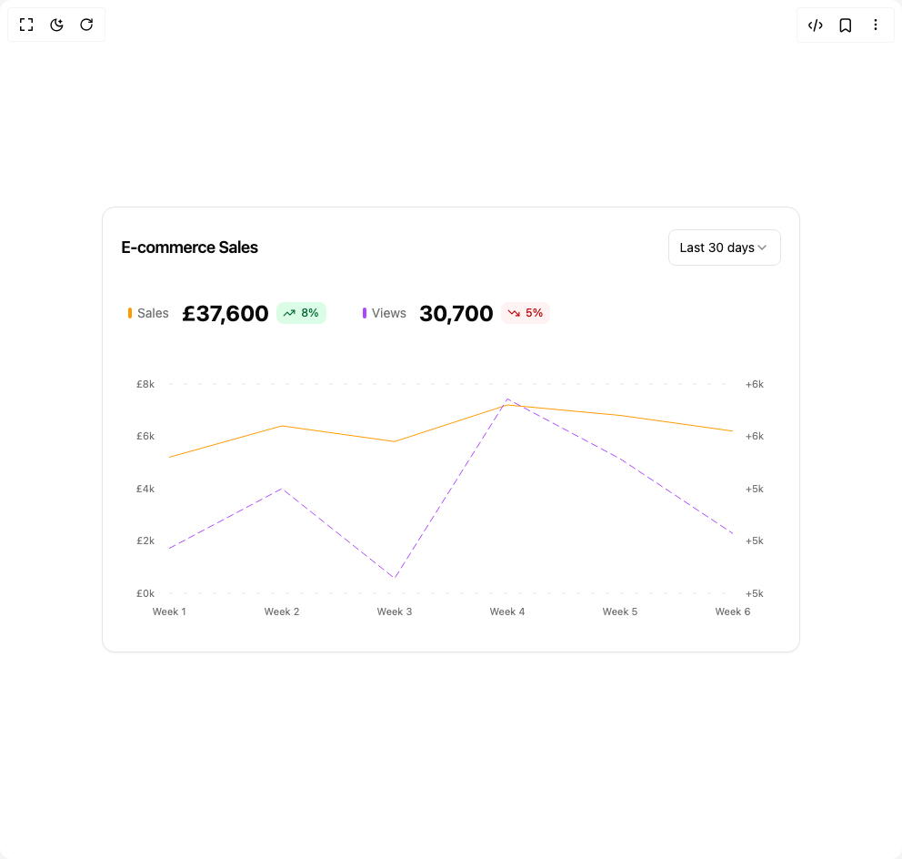

# Build Line Charts 5 in BuilderStudio

> Build this component in our Agentic IDE: [BuilderStudio](https://builderstudio.dev).
>
> Join the BuilderStudio community on [Discord](https://discord.gg/QdWeSGCqfe) and [Reddit](https://reddit.com/r/builderstudio).



## Component

- Author group: `reui`
- Component: `line-charts-5`
- Variant: `default`
- Rendered HTML snapshot: [`rendered.html`](rendered.html)

## BuilderStudio prompt

You are implementing a React component based on a component reference.

## Component identity

- Author: reui
- Component slug: line-charts-5
- Demo slug: default
- Title: line-charts-5
- Description: 

## Goal

Recreate this component in a React + TypeScript + Tailwind CSS project. Preserve the visual layout, spacing, colors, border radius, shadows, interaction behavior, animation behavior, responsive behavior, and dark mode behavior shown in the rendered demo.

## Implementation requirements

- Use React and TypeScript.
- Use Tailwind CSS classes whenever possible.
- Keep the component self-contained unless the source files require helper components.
- If the source uses CSS variables, custom CSS, animations, or keyframes, include them.
- If the source uses external packages, list and use the required packages.
- Preserve accessibility attributes, button semantics, links, keyboard behavior, and ARIA attributes when visible in the source.
- Do not replace the component with a simplified placeholder.
- Return complete production-ready code.

## Dependencies

No reference metadata available.

## Rendered DOM snapshot

This is the rendered demo HTML extracted from the live preview. Use it to verify structure, class names, visible content, and layout.

```html
<div id="root"><div class="w-screen min-h-screen flex justify-center items-center"><div class="w-screen min-h-screen flex justify-center items-center"><div class="w-full max-w-5xl min-h-screen flex items-center justify-center p-6 lg:p-8"><div data-slot="card" class="flex flex-col items-stretch text-card-foreground rounded-xl bg-card border border-border shadow-xs black/5 w-full max-w-3xl"><div data-slot="card-header" class="flex items-center justify-between flex-wrap px-5 gap-2.5 border-border border-0 min-h-auto pt-6 pb-4"><h3 data-slot="card-title" class="tracking-tight text-lg font-semibold">E-commerce Sales</h3><div data-slot="card-toolbar" class="flex items-center gap-2.5"><button type="button" role="combobox" aria-controls="radix-«r0»" aria-expanded="false" aria-autocomplete="none" dir="ltr" data-state="closed" class="flex h-10 w-full items-center justify-between rounded-md border border-input bg-background px-3 py-2 text-sm ring-offset-background placeholder:text-muted-foreground focus:outline-none focus:ring-2 focus:ring-ring focus:ring-offset-2 disabled:cursor-not-allowed disabled:opacity-50 [&amp;&gt;span]:line-clamp-1"><span style="pointer-events: none;">Last 30 days</span><svg xmlns="http://www.w3.org/2000/svg" width="24" height="24" viewBox="0 0 24 24" fill="none" stroke="currentColor" stroke-width="2" stroke-linecap="round" stroke-linejoin="round" class="lucide lucide-chevron-down h-4 w-4 opacity-50" aria-hidden="true"><path d="m6 9 6 6 6-6"></path></svg></button></div></div><div data-slot="card-content" class="grow p-5 px-2 pb-6"><div class="flex items-center flex-wrap gap-3.5 md:gap-10 px-5 mb-8 text-sm"><div class="flex items-center gap-3.5"><div class="flex items-center gap-1.5"><div class="w-1 h-3 rounded-full" style="background-color: var(--color-amber-500);"></div><span class="text-muted-foreground">Sales</span></div><div class="flex items-center gap-2"><span class="text-2xl font-bold">£37,600</span><span data-slot="badge" class="inline-flex items-center justify-center border border-transparent font-medium focus:outline-hidden focus:ring-2 focus:ring-ring focus:ring-offset-2 [&amp;_svg]:-ms-px [&amp;_svg]:shrink-0 rounded-md px-[0.45rem] h-6 min-w-6 gap-1.5 text-xs [&amp;_svg]:size-3.5 text-[var(--color-success-accent,var(--color-green-800))] bg-[var(--color-success-soft,var(--color-green-100))] dark:bg-[var(--color-success-soft,var(--color-green-950))] dark:text-[var(--color-success-soft,var(--color-green-600))]"><svg xmlns="http://www.w3.org/2000/svg" width="24" height="24" viewBox="0 0 24 24" fill="none" stroke="currentColor" stroke-width="2" stroke-linecap="round" stroke-linejoin="round" class="lucide lucide-trending-up size-3" aria-hidden="true"><polyline points="22 7 13.5 15.5 8.5 10.5 2 17"></polyline><polyline points="16 7 22 7 22 13"></polyline></svg>8%</span></div></div><div class="flex items-center gap-3.5"><div class="flex items-center gap-1.5"><div class="w-1 h-3 rounded-full" style="background-color: var(--color-purple-500);"></div><span class="text-muted-foreground">Views</span></div><div class="flex items-center gap-2"><span class="text-2xl font-bold">30,700</span><span data-slot="badge" class="inline-flex items-center justify-center border border-transparent font-medium focus:outline-hidden focus:ring-2 focus:ring-ring focus:ring-offset-2 [&amp;_svg]:-ms-px [&amp;_svg]:shrink-0 rounded-md px-[0.45rem] h-6 min-w-6 gap-1.5 text-xs [&amp;_svg]:size-3.5 text-[var(--color-destructive-accent,var(--color-red-700))] bg-[var(--color-destructive-soft,var(--color-red-50))] dark:bg-[var(--color-destructive-soft,var(--color-red-950))] dark:text-[var(--color-destructive-soft,var(--color-red-600))]"><svg xmlns="http://www.w3.org/2000/svg" width="24" height="24" viewBox="0 0 24 24" fill="none" stroke="currentColor" stroke-width="2" stroke-linecap="round" stroke-linejoin="round" class="lucide lucide-trending-down size-3" aria-hidden="true"><polyline points="22 17 13.5 8.5 8.5 13.5 2 7"></polyline><polyline points="16 17 22 17 22 11"></polyline></svg>5%</span></div></div></div><div data-slot="chart" data-chart="chart-«r1»" class="[&amp;_.recharts-cartesian-axis-tick_text]:fill-muted-foreground [&amp;_.recharts-cartesian-grid_line[stroke='#ccc']]:stroke-border/50 [&amp;_.recharts-polar-grid_[stroke='#ccc']]:stroke-border [&amp;_.recharts-radial-bar-background-sector]:fill-muted [&amp;_.recharts-rectangle.recharts-tooltip-cursor]:fill-muted [&amp;_.recharts-reference-line_[stroke='#ccc']]:stroke-border flex aspect-video justify-center text-xs [&amp;_.recharts-dot[stroke='#fff']]:stroke-transparent [&amp;_.recharts-layer]:outline-hidden [&amp;_.recharts-sector]:outline-hidden [&amp;_.recharts-sector[stroke='#fff']]:stroke-transparent [&amp;_.recharts-surface]:outline-hidden h-[300px] w-full [&amp;_.recharts-curve.recharts-tooltip-cursor]:stroke-initial"><style>
 [data-chart=chart-«r1»] {
  --color-sales: var(--color-amber-500);
  --color-views: var(--color-purple-500);
}


.dark [data-chart=chart-«r1»] {
  --color-sales: var(--color-amber-500);
  --color-views: var(--color-purple-500);
}
</style><div class="recharts-responsive-container" style="width: 100%; height: 100%; min-width: 0px;"><div style="width: 0px; height: 0px; overflow: visible;"><div class="recharts-wrapper" style="position: relative; cursor: default; width: 750px; height: 300px;"><div xmlns="http://www.w3.org/1999/xhtml" tabindex="-1" class="recharts-tooltip-wrapper" style="visibility: hidden; pointer-events: none; position: absolute; top: 0px; left: 0px;"></div><svg role="application" tabindex="0" class="recharts-surface" width="750" height="300" viewBox="0 0 750 300" style="width: 100%; height: 100%;"><title></title><desc></desc><defs><clipPath id="recharts1-clip"><rect x="65" y="30" height="230" width="620"></rect></clipPath></defs><defs><linearGradient id="salesGradient" x1="0" y1="0" x2="0" y2="1"><stop offset="0%" stop-color="var(--color-amber-500)" stop-opacity="0.3"></stop><stop offset="100%" stop-color="var(--color-amber-500)" stop-opacity="0.05"></stop></linearGradient><linearGradient id="viewsGradient" x1="0" y1="0" x2="0" y2="1"><stop offset="0%" stop-color="var(--color-purple-500)" stop-opacity="0.3"></stop><stop offset="100%" stop-color="var(--color-purple-500)" stop-opacity="0.05"></stop></linearGradient><filter id="glow"><feGaussianBlur stdDeviation="3" result="coloredBlur"></feGaussianBlur><feMerge><feMergeNode in="coloredBlur"></feMergeNode><feMergeNode in="SourceGraphic"></feMergeNode></feMerge></filter></defs><g class="recharts-cartesian-grid"><g class="recharts-cartesian-grid-horizontal"><line stroke-dasharray="4 12" stroke="var(--input)" stroke-opacity="1" fill="none" x="65" y="30" width="620" height="230" x1="65" y1="30" x2="685" y2="30"></line><line stroke-dasharray="4 12" stroke="var(--input)" stroke-opacity="1" fill="none" x="65" y="30" width="620" height="230" x1="65" y1="260" x2="685" y2="260"></line></g></g><g class="recharts-layer recharts-cartesian-axis recharts-xAxis xAxis"><g class="recharts-cartesian-axis-ticks"><g class="recharts-layer recharts-cartesian-axis-tick"><text height="30" orientation="bottom" width="620" stroke="none" font-size="11" x="65" y="276" class="recharts-text recharts-cartesian-axis-tick-value" text-anchor="middle" fill="var(--muted-foreground)"><tspan x="65" dy="0.71em">Week 1</tspan></text></g><g class="recharts-layer recharts-cartesian-axis-tick"><text height="30" orientation="bottom" width="620" stroke="none" font-size="11" x="189" y="276" class="recharts-text recharts-cartesian-axis-tick-value" text-anchor="middle" fill="var(--muted-foreground)"><tspan x="189" dy="0.71em">Week 2</tspan></text></g><g class="recharts-layer recharts-cartesian-axis-tick"><text height="30" orientation="bottom" width="620" stroke="none" font-size="11" x="313" y="276" class="recharts-text recharts-cartesian-axis-tick-value" text-anchor="middle" fill="var(--muted-foreground)"><tspan x="313" dy="0.71em">Week 3</tspan></text></g><g class="recharts-layer recharts-cartesian-axis-tick"><text height="30" orientation="bottom" width="620" stroke="none" font-size="11" x="437" y="276" class="recharts-text recharts-cartesian-axis-tick-value" text-anchor="middle" fill="var(--muted-foreground)"><tspan x="437" dy="0.71em">Week 4</tspan></text></g><g class="recharts-layer recharts-cartesian-axis-tick"><text height="30" orientation="bottom" width="620" stroke="none" font-size="11" x="561" y="276" class="recharts-text recharts-cartesian-axis-tick-value" text-anchor="middle" fill="var(--muted-foreground)"><tspan x="561" dy="0.71em">Week 5</tspan></text></g><g class="recharts-layer recharts-cartesian-axis-tick"><text height="30" orientation="bottom" width="620" stroke="none" font-size="11" x="685" y="276" class="recharts-text recharts-cartesian-axis-tick-value" text-anchor="middle" fill="var(--muted-foreground)"><tspan x="685" dy="0.71em">Week 6</tspan></text></g></g></g><g class="recharts-layer recharts-cartesian-axis recharts-yAxis yAxis"><g class="recharts-cartesian-axis-ticks"><g class="recharts-layer recharts-cartesian-axis-tick"><text orientation="left" width="60" height="230" stroke="none" font-size="11" x="49" y="260" class="recharts-text recharts-cartesian-axis-tick-value" text-anchor="end" fill="var(--muted-foreground)"><tspan x="49" dy="0.355em">£0k</tspan></text></g><g class="recharts-layer recharts-cartesian-axis-tick"><text orientation="left" width="60" height="230" stroke="none" font-size="11" x="49" y="202.5" class="recharts-text recharts-cartesian-axis-tick-value" text-anchor="end" fill="var(--muted-foreground)"><tspan x="49" dy="0.355em">£2k</tspan></text></g><g class="recharts-layer recharts-cartesian-axis-tick"><text orientation="left" width="60" height="230" stroke="none" font-size="11" x="49" y="145" class="recharts-text recharts-cartesian-axis-tick-value" text-anchor="end" fill="var(--muted-foreground)"><tspan x="49" dy="0.355em">£4k</tspan></text></g><g class="recharts-layer recharts-cartesian-axis-tick"><text orientation="left" width="60" height="230" stroke="none" font-size="11" x="49" y="87.5" class="recharts-text recharts-cartesian-axis-tick-value" text-anchor="end" fill="var(--muted-foreground)"><tspan x="49" dy="0.355em">£6k</tspan></text></g><g class="recharts-layer recharts-cartesian-axis-tick"><text orientation="left" width="60" height="230" stroke="none" font-size="11" x="49" y="30" class="recharts-text recharts-cartesian-axis-tick-value" text-anchor="end" fill="var(--muted-foreground)"><tspan x="49" dy="0.355em">£8k</tspan></text></g></g></g><g class="recharts-layer recharts-cartesian-axis recharts-yAxis yAxis"><g class="recharts-cartesian-axis-ticks"><g class="recharts-layer recharts-cartesian-axis-tick"><text orientation="right" width="60" height="230" stroke="none" font-size="11" x="699" y="260" class="recharts-text recharts-cartesian-axis-tick-value" text-anchor="start" fill="var(--muted-foreground)"><tspan x="699" dy="0.355em">+5k</tspan></text></g><g class="recharts-layer recharts-cartesian-axis-tick"><text orientation="right" width="60" height="230" stroke="none" font-size="11" x="699" y="202.5" class="recharts-text recharts-cartesian-axis-tick-value" text-anchor="start" fill="var(--muted-foreground)"><tspan x="699" dy="0.355em">+5k</tspan></text></g><g class="recharts-layer recharts-cartesian-axis-tick"><text orientation="right" width="60" height="230" stroke="none" font-size="11" x="699" y="145" class="recharts-text recharts-cartesian-axis-tick-value" text-anchor="start" fill="var(--muted-foreground)"><tspan x="699" dy="0.355em">+5k</tspan></text></g><g class="recharts-layer recharts-cartesian-axis-tick"><text orientation="right" width="60" height="230" stroke="none" font-size="11" x="699" y="87.5" class="recharts-text recharts-cartesian-axis-tick-value" text-anchor="start" fill="var(--muted-foreground)"><tspan x="699" dy="0.355em">+6k</tspan></text></g><g class="recharts-layer recharts-cartesian-axis-tick"><text orientation="right" width="60" height="230" stroke="none" font-size="11" x="699" y="30" class="recharts-text recharts-cartesian-axis-tick-value" text-anchor="start" fill="var(--muted-foreground)"><tspan x="699" dy="0.355em">+6k</tspan></text></g></g></g><g class="recharts-layer recharts-line"><path stroke="var(--color-amber-500)" stroke-width="1" fill="none" height="230" width="620" class="recharts-curve recharts-line-curve" stroke-dasharray="633.999267578125px 0px" d="M65,110.5L189,76L313,93.25L437,53L561,64.5L685,81.75"></path></g><g class="recharts-layer recharts-line"><path stroke="var(--color-purple-500)" stroke-width="1" stroke-dasharray="8px, 4px, 8px, 4px, 8px, 4px, 8px, 4px, 8px, 4px, 8px, 4px, 8px, 4px, 8px, 4px, 8px, 4px, 8px, 4px, 8px, 4px, 8px, 4px, 8px, 4px, 8px, 4px, 8px, 4px, 8px, 4px, 8px, 4px, 8px, 4px, 8px, 4px, 8px, 4px, 8px, 4px, 8px, 4px, 8px, 4px, 8px, 4px, 8px, 4px, 8px, 4px, 8px, 4px, 8px, 4px, 8px, 4px, 8px, 4px, 8px, 4px, 8px, 4px, 8px, 4px, 8px, 4px, 8px, 4px, 8px, 4px, 8px, 4px, 8px, 4px, 8px, 4px, 8px, 4px, 8px, 4px, 8px, 4px, 8px, 4px, 8px, 4px, 8px, 4px, 8px, 4px, 8px, 4px, 8px, 4px, 8px, 4px, 8px, 4px, 8px, 4px, 8px, 4px, 8px, 4px, 8px, 4px, 8px, 4px, 8px, 4px, 8px, 4px, 8px, 4px, 8px, 4px, 8px, 4px, 8px, 4px, 8px, 4px, 8px, 4px, 8px, 4px, 8px, 4px, 8px, 4px, 8px, 4px, 8px, 4px, 4.71478271484375px, 0px" fill="none" height="230" width="620" class="recharts-curve recharts-line-curve" d="M65,210.714L189,145L313,243.571L437,46.429L561,112.143L685,194.286"></path></g></svg></div></div></div></div></div></div></div></div></div></div>
```

## Reference source files

No reference source files were available.
