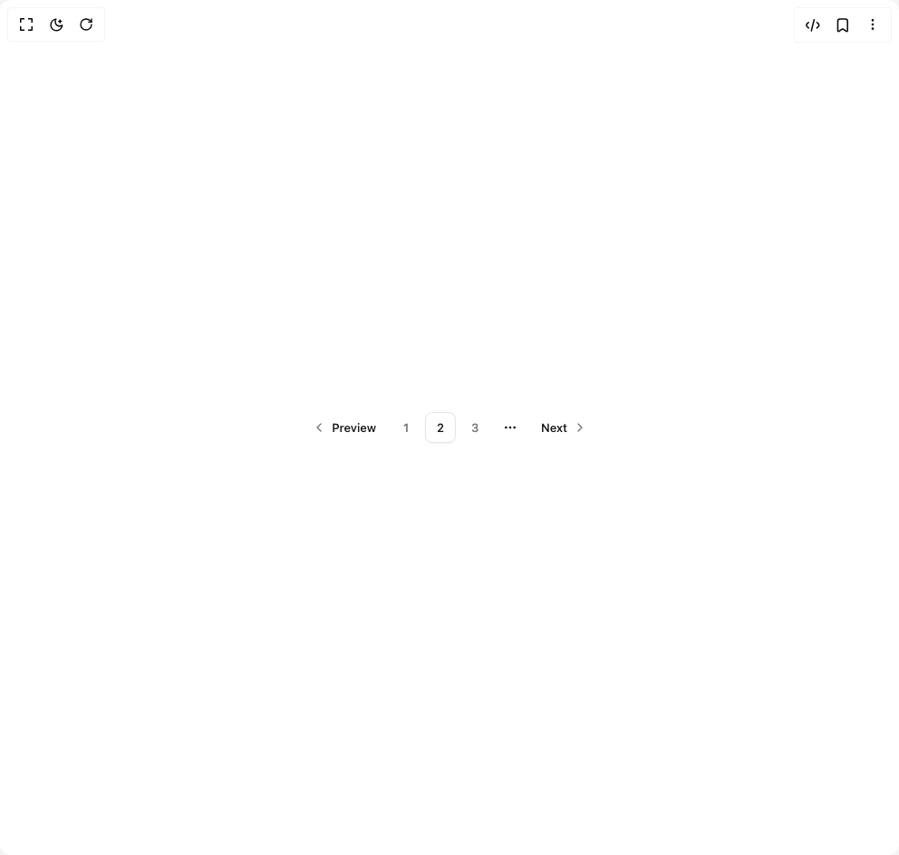

# Build Pagination in BuilderStudio

> Build this component in our Agentic IDE: [BuilderStudio](https://builderstudio.dev).
>
> Join the BuilderStudio community on [Discord](https://discord.gg/QdWeSGCqfe) and [Reddit](https://reddit.com/r/builderstudio).



## Component

- Author group: `reui`
- Component: `pagination`
- Variant: `default`
- Rendered HTML snapshot: [`rendered.html`](rendered.html)

## BuilderStudio prompt

You are implementing a React component based on a component reference.

## Component identity

- Author: reui
- Component slug: pagination
- Demo slug: default
- Title: pagination
- Description: 

## Goal

Recreate this component in a React + TypeScript + Tailwind CSS project. Preserve the visual layout, spacing, colors, border radius, shadows, interaction behavior, animation behavior, responsive behavior, and dark mode behavior shown in the rendered demo.

## Implementation requirements

- Use React and TypeScript.
- Use Tailwind CSS classes whenever possible.
- Keep the component self-contained unless the source files require helper components.
- If the source uses CSS variables, custom CSS, animations, or keyframes, include them.
- If the source uses external packages, list and use the required packages.
- Preserve accessibility attributes, button semantics, links, keyboard behavior, and ARIA attributes when visible in the source.
- Do not replace the component with a simplified placeholder.
- Return complete production-ready code.

## Dependencies

No reference metadata available.

## Rendered DOM snapshot

This is the rendered demo HTML extracted from the live preview. Use it to verify structure, class names, visible content, and layout.

```html
<div id="root"><div class="w-screen min-h-screen flex justify-center items-center"><div class="w-screen min-h-screen flex justify-center items-center"><nav data-slot="pagination" role="navigation" aria-label="pagination" class="mx-auto flex w-full justify-center"><ul data-slot="pagination-content" class="flex flex-row items-center gap-1"><li data-slot="pagination-item" class=""><a href="#" data-slot="button" class="cursor-pointer group focus-visible:outline-hidden inline-flex items-center justify-center has-data-[arrow=true]:justify-between whitespace-nowrap font-medium ring-offset-background transition-[color,box-shadow] disabled:pointer-events-none disabled:opacity-60 [&amp;_svg]:shrink-0 text-accent-foreground hover:bg-accent hover:text-accent-foreground data-[state=open]:bg-accent data-[state=open]:text-accent-foreground h-8.5 rounded-md px-3 gap-1.5 text-[0.8125rem] leading-(--text-sm--line-height) [&amp;_svg:not([class*=size-])]:size-4 focus-visible:ring-2 focus-visible:ring-ring focus-visible:ring-offset-2 [&amp;_svg:not([role=img]):not([class*=text-]):not([class*=opacity-])]:opacity-60"><svg xmlns="http://www.w3.org/2000/svg" width="24" height="24" viewBox="0 0 24 24" fill="none" stroke="currentColor" stroke-width="2" stroke-linecap="round" stroke-linejoin="round" class="lucide lucide-chevron-left rtl:rotate-180" aria-hidden="true"><path d="m15 18-6-6 6-6"></path></svg> Preview</a></li><li data-slot="pagination-item" class=""><a href="#" data-slot="button" class="cursor-pointer group focus-visible:outline-hidden inline-flex items-center justify-center has-data-[arrow=true]:justify-between whitespace-nowrap font-medium ring-offset-background transition-[color,box-shadow] disabled:pointer-events-none disabled:opacity-60 [&amp;_svg]:shrink-0 hover:bg-accent hover:text-accent-foreground data-[state=open]:bg-accent data-[state=open]:text-accent-foreground rounded-md gap-1.5 text-[0.8125rem] leading-(--text-sm--line-height) focus-visible:ring-2 focus-visible:ring-ring focus-visible:ring-offset-2 text-muted-foreground w-8.5 h-8.5 p-0 [&amp;_svg:not([class*=size-])]:size-4">1</a></li><li data-slot="pagination-item" class=""><a href="#" data-slot="button" class="cursor-pointer group focus-visible:outline-hidden inline-flex items-center justify-center has-data-[arrow=true]:justify-between whitespace-nowrap font-medium ring-offset-background transition-[color,box-shadow] disabled:pointer-events-none disabled:opacity-60 [&amp;_svg]:shrink-0 bg-background text-accent-foreground border border-input hover:bg-accent data-[state=open]:bg-accent rounded-md gap-1.5 text-[0.8125rem] leading-(--text-sm--line-height) focus-visible:ring-2 focus-visible:ring-ring focus-visible:ring-offset-2 [&amp;_svg:not([role=img]):not([class*=text-]):not([class*=opacity-])]:opacity-60 shadow-xs shadow-black/5 w-8.5 h-8.5 p-0 [&amp;_svg:not([class*=size-])]:size-4">2</a></li><li data-slot="pagination-item" class=""><a href="#" data-slot="button" class="cursor-pointer group focus-visible:outline-hidden inline-flex items-center justify-center has-data-[arrow=true]:justify-between whitespace-nowrap font-medium ring-offset-background transition-[color,box-shadow] disabled:pointer-events-none disabled:opacity-60 [&amp;_svg]:shrink-0 hover:bg-accent hover:text-accent-foreground data-[state=open]:bg-accent data-[state=open]:text-accent-foreground rounded-md gap-1.5 text-[0.8125rem] leading-(--text-sm--line-height) focus-visible:ring-2 focus-visible:ring-ring focus-visible:ring-offset-2 text-muted-foreground w-8.5 h-8.5 p-0 [&amp;_svg:not([class*=size-])]:size-4">3</a></li><li data-slot="pagination-item" class=""><span data-slot="pagination-ellipsis" aria-hidden="true" class="flex h-9 w-9 items-center justify-center"><svg xmlns="http://www.w3.org/2000/svg" width="24" height="24" viewBox="0 0 24 24" fill="none" stroke="currentColor" stroke-width="2" stroke-linecap="round" stroke-linejoin="round" class="lucide lucide-ellipsis h-4 w-4" aria-hidden="true"><circle cx="12" cy="12" r="1"></circle><circle cx="19" cy="12" r="1"></circle><circle cx="5" cy="12" r="1"></circle></svg><span class="sr-only">More pages</span></span></li><li data-slot="pagination-item" class=""><a href="#" data-slot="button" class="cursor-pointer group focus-visible:outline-hidden inline-flex items-center justify-center has-data-[arrow=true]:justify-between whitespace-nowrap font-medium ring-offset-background transition-[color,box-shadow] disabled:pointer-events-none disabled:opacity-60 [&amp;_svg]:shrink-0 text-accent-foreground hover:bg-accent hover:text-accent-foreground data-[state=open]:bg-accent data-[state=open]:text-accent-foreground h-8.5 rounded-md px-3 gap-1.5 text-[0.8125rem] leading-(--text-sm--line-height) [&amp;_svg:not([class*=size-])]:size-4 focus-visible:ring-2 focus-visible:ring-ring focus-visible:ring-offset-2 [&amp;_svg:not([role=img]):not([class*=text-]):not([class*=opacity-])]:opacity-60">Next <svg xmlns="http://www.w3.org/2000/svg" width="24" height="24" viewBox="0 0 24 24" fill="none" stroke="currentColor" stroke-width="2" stroke-linecap="round" stroke-linejoin="round" class="lucide lucide-chevron-right rtl:rotate-180" aria-hidden="true"><path d="m9 18 6-6-6-6"></path></svg></a></li></ul></nav></div></div></div>
```

## Reference source files

No reference source files were available.
