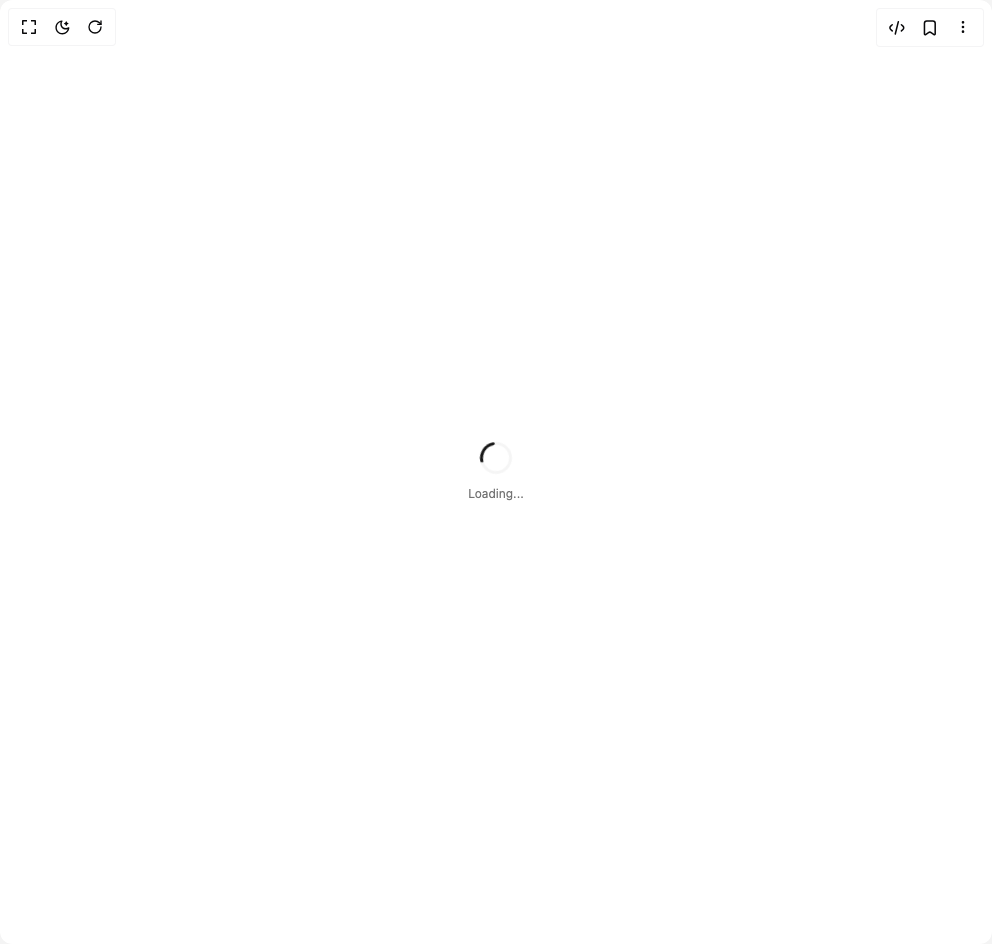

# Build Progress 1 in BuilderStudio

> Build this component in our Agentic IDE: [BuilderStudio](https://builderstudio.dev).
>
> Join the BuilderStudio community on [Discord](https://discord.gg/QdWeSGCqfe) and [Reddit](https://reddit.com/r/builderstudio).



## Component

- Author group: `reui`
- Component: `progress-1`
- Variant: `spinner`
- Rendered HTML snapshot: [`rendered.html`](rendered.html)

## BuilderStudio prompt

You are implementing a React component based on a component reference.

## Component identity

- Author: reui
- Component slug: progress-1
- Demo slug: spinner
- Title: progress-1
- Description: 

## Goal

Recreate this component in a React + TypeScript + Tailwind CSS project. Preserve the visual layout, spacing, colors, border radius, shadows, interaction behavior, animation behavior, responsive behavior, and dark mode behavior shown in the rendered demo.

## Implementation requirements

- Use React and TypeScript.
- Use Tailwind CSS classes whenever possible.
- Keep the component self-contained unless the source files require helper components.
- If the source uses CSS variables, custom CSS, animations, or keyframes, include them.
- If the source uses external packages, list and use the required packages.
- Preserve accessibility attributes, button semantics, links, keyboard behavior, and ARIA attributes when visible in the source.
- Do not replace the component with a simplified placeholder.
- Return complete production-ready code.

## Dependencies

No reference metadata available.

## Rendered DOM snapshot

This is the rendered demo HTML extracted from the live preview. Use it to verify structure, class names, visible content, and layout.

```html
<div id="root"><div class="w-screen min-h-screen flex justify-center items-center"><div class="w-screen min-h-screen flex justify-center items-center"><div class="flex items-center justify-center"><div class="flex flex-col items-center gap-3"><div data-slot="progress-circle" class="relative inline-flex items-center justify-center text-blue-500 animate-spin" style="width: 32px; height: 32px;"><svg class="absolute inset-0 -rotate-90" width="32" height="32" viewBox="0 0 32 32"><circle data-slot="progress-circle-track" cx="16" cy="16" r="14.5" stroke="currentColor" stroke-width="3" fill="none" class="text-secondary"></circle><circle data-slot="progress-circle-indicator" cx="16" cy="16" r="14.5" stroke="currentColor" stroke-width="3" fill="none" stroke-dasharray="91.106186954104" stroke-dashoffset="68.329640215578" stroke-linecap="round" class="text-primary transition-all duration-300 ease-in-out"></circle></svg></div><span class="text-xs text-muted-foreground">Loading...</span></div></div></div></div></div>
```

## Reference source files

No reference source files were available.
