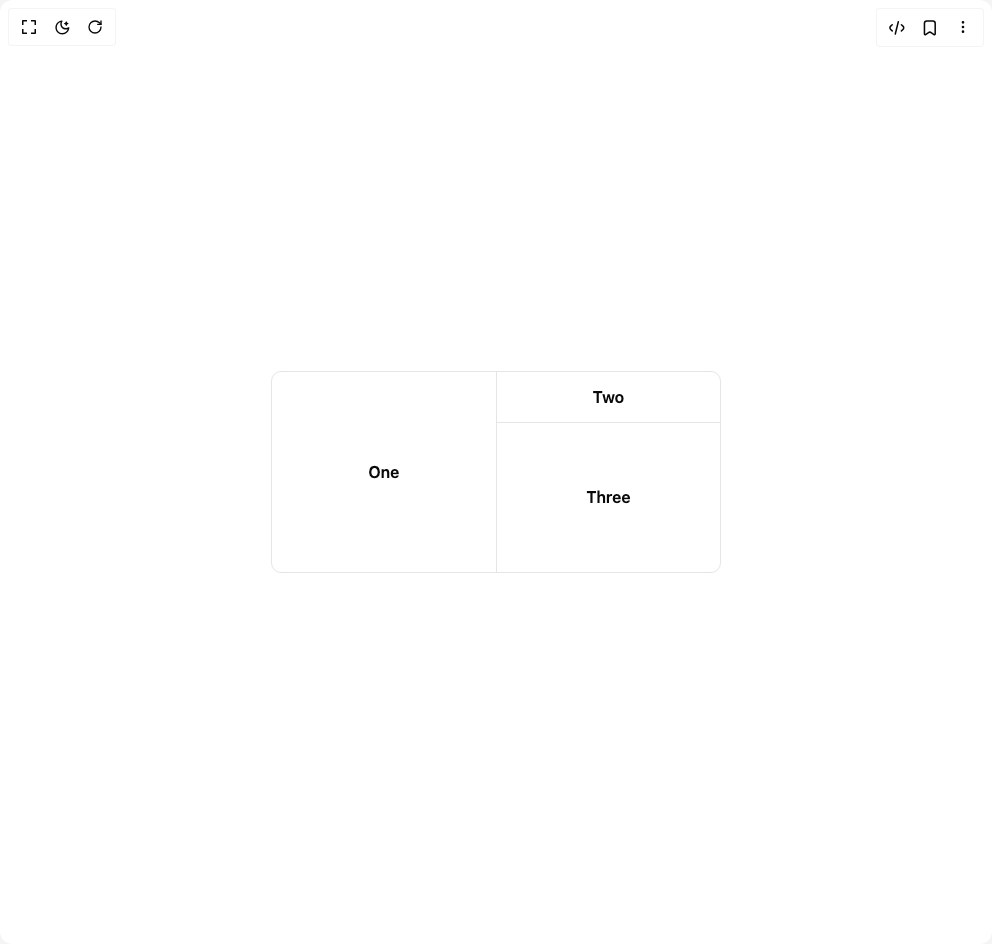

# Build Resizable in BuilderStudio

> Build this component in our Agentic IDE: [BuilderStudio](https://builderstudio.dev).
>
> Join the BuilderStudio community on [Discord](https://discord.gg/QdWeSGCqfe) and [Reddit](https://reddit.com/r/builderstudio).



## Component

- Author group: `reui`
- Component: `resizable`
- Variant: `default`
- Rendered HTML snapshot: [`rendered.html`](rendered.html)

## BuilderStudio prompt

You are implementing a React component based on a component reference.

## Component identity

- Author: reui
- Component slug: resizable
- Demo slug: default
- Title: resizable
- Description: 

## Goal

Recreate this component in a React + TypeScript + Tailwind CSS project. Preserve the visual layout, spacing, colors, border radius, shadows, interaction behavior, animation behavior, responsive behavior, and dark mode behavior shown in the rendered demo.

## Implementation requirements

- Use React and TypeScript.
- Use Tailwind CSS classes whenever possible.
- Keep the component self-contained unless the source files require helper components.
- If the source uses CSS variables, custom CSS, animations, or keyframes, include them.
- If the source uses external packages, list and use the required packages.
- Preserve accessibility attributes, button semantics, links, keyboard behavior, and ARIA attributes when visible in the source.
- Do not replace the component with a simplified placeholder.
- Return complete production-ready code.

## Dependencies

No reference metadata available.

## Rendered DOM snapshot

This is the rendered demo HTML extracted from the live preview. Use it to verify structure, class names, visible content, and layout.

```html
<div id="root"><div class="w-screen min-h-screen flex justify-center items-center"><div class="w-screen min-h-screen flex justify-center items-center"><div data-slot="resizable-panel-group" class="flex h-full w-full data-[panel-group-direction=vertical]:flex-col max-w-md rounded-lg border md:min-w-[450px]" data-panel-group="" data-panel-group-direction="horizontal" data-panel-group-id="«r0»" style="display: flex; flex-direction: row; height: 100%; overflow: hidden; width: 100%;"><div class="" id="«r1»" data-panel-group-id="«r0»" data-panel="" data-panel-id="«r1»" data-panel-size="50.0" style="flex: 50 1 0px; overflow: hidden;"><div class="flex h-[200px] items-center justify-center p-6"><span class="font-semibold">One</span></div></div><div data-slot="resizable-handle" class="relative flex w-px items-center justify-center bg-border after:absolute after:inset-y-0 after:left-1/2 after:w-1 after:-translate-x-1/2 focus-visible:outline-hidden focus-visible:ring-1 focus-visible:ring-ring focus-visible:ring-offset-1 data-[panel-group-direction=vertical]:h-px data-[panel-group-direction=vertical]:w-full data-[panel-group-direction=vertical]:after:left-0 data-[panel-group-direction=vertical]:after:h-1 data-[panel-group-direction=vertical]:after:w-full data-[panel-group-direction=vertical]:after:-translate-y-1/2 data-[panel-group-direction=vertical]:after:translate-x-0 [&amp;[data-panel-group-direction=vertical]&gt;div]:rotate-90" role="separator" tabindex="0" data-panel-group-direction="horizontal" data-panel-group-id="«r0»" data-resize-handle="" data-panel-resize-handle-enabled="true" data-panel-resize-handle-id="«r2»" data-resize-handle-state="inactive" aria-controls="«r1»" aria-valuemax="100" aria-valuemin="0" aria-valuenow="50" style="touch-action: none; user-select: none;"></div><div class="" id="«r3»" data-panel-group-id="«r0»" data-panel="" data-panel-id="«r3»" data-panel-size="50.0" style="flex: 50 1 0px; overflow: hidden;"><div data-slot="resizable-panel-group" class="flex h-full w-full data-[panel-group-direction=vertical]:flex-col" data-panel-group="" data-panel-group-direction="vertical" data-panel-group-id="«r4»" style="display: flex; flex-direction: column; height: 100%; overflow: hidden; width: 100%;"><div class="" id="«r5»" data-panel-group-id="«r4»" data-panel="" data-panel-id="«r5»" data-panel-size="25.0" style="flex: 25 1 0px; overflow: hidden;"><div class="flex h-full items-center justify-center p-6"><span class="font-semibold">Two</span></div></div><div data-slot="resizable-handle" class="relative flex w-px items-center justify-center bg-border after:absolute after:inset-y-0 after:left-1/2 after:w-1 after:-translate-x-1/2 focus-visible:outline-hidden focus-visible:ring-1 focus-visible:ring-ring focus-visible:ring-offset-1 data-[panel-group-direction=vertical]:h-px data-[panel-group-direction=vertical]:w-full data-[panel-group-direction=vertical]:after:left-0 data-[panel-group-direction=vertical]:after:h-1 data-[panel-group-direction=vertical]:after:w-full data-[panel-group-direction=vertical]:after:-translate-y-1/2 data-[panel-group-direction=vertical]:after:translate-x-0 [&amp;[data-panel-group-direction=vertical]&gt;div]:rotate-90" role="separator" tabindex="0" data-panel-group-direction="vertical" data-panel-group-id="«r4»" data-resize-handle="" data-panel-resize-handle-enabled="true" data-panel-resize-handle-id="«r6»" data-resize-handle-state="inactive" aria-controls="«r5»" aria-valuemax="100" aria-valuemin="0" aria-valuenow="25" style="touch-action: none; user-select: none;"></div><div class="" id="«r7»" data-panel-group-id="«r4»" data-panel="" data-panel-id="«r7»" data-panel-size="75.0" style="flex: 75 1 0px; overflow: hidden;"><div class="flex h-full items-center justify-center p-6"><span class="font-semibold">Three</span></div></div></div></div></div></div></div></div>
```

## Reference source files

No reference source files were available.
