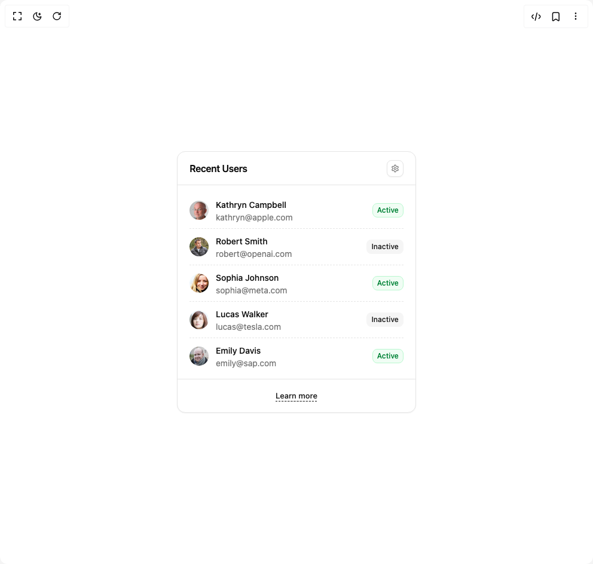

# Build Scroll Area in BuilderStudio

> Build this component in our Agentic IDE: [BuilderStudio](https://builderstudio.dev).
>
> Join the BuilderStudio community on [Discord](https://discord.gg/QdWeSGCqfe) and [Reddit](https://reddit.com/r/builderstudio).



## Component

- Author group: `reui`
- Component: `scroll-area`
- Variant: `default`
- Rendered HTML snapshot: [`rendered.html`](rendered.html)

## BuilderStudio prompt

You are implementing a React component based on a component reference.

## Component identity

- Author: reui
- Component slug: scroll-area
- Demo slug: default
- Title: scroll-area
- Description: 

## Goal

Recreate this component in a React + TypeScript + Tailwind CSS project. Preserve the visual layout, spacing, colors, border radius, shadows, interaction behavior, animation behavior, responsive behavior, and dark mode behavior shown in the rendered demo.

## Implementation requirements

- Use React and TypeScript.
- Use Tailwind CSS classes whenever possible.
- Keep the component self-contained unless the source files require helper components.
- If the source uses CSS variables, custom CSS, animations, or keyframes, include them.
- If the source uses external packages, list and use the required packages.
- Preserve accessibility attributes, button semantics, links, keyboard behavior, and ARIA attributes when visible in the source.
- Do not replace the component with a simplified placeholder.
- Return complete production-ready code.

## Dependencies

No reference metadata available.

## Rendered DOM snapshot

This is the rendered demo HTML extracted from the live preview. Use it to verify structure, class names, visible content, and layout.

```html
<div id="root"><div class="w-screen min-h-screen flex justify-center items-center"><div class="w-screen min-h-screen flex justify-center items-center"><div data-slot="card" class="flex flex-col items-stretch text-card-foreground rounded-xl bg-card border border-border shadow-xs black/5 w-[400px]"><div data-slot="card-header" class="flex items-center justify-between flex-wrap px-5 min-h-14 gap-2.5 border-b border-border"><div data-slot="card-heading" class="space-y-1"><h3 data-slot="card-title" class="text-base font-semibold leading-none tracking-tight">Recent Users</h3></div><div data-slot="card-toolbar" class="flex items-center gap-2.5"><button data-slot="button" class="cursor-pointer group focus-visible:outline-hidden inline-flex items-center justify-center has-data-[arrow=true]:justify-between whitespace-nowrap font-medium ring-offset-background transition-[color,box-shadow] disabled:pointer-events-none disabled:opacity-60 [&amp;_svg]:shrink-0 bg-background text-accent-foreground border border-input hover:bg-accent data-[state=open]:bg-accent rounded-md gap-1.25 text-xs [&amp;_svg:not([class*=size-])]:size-3.5 focus-visible:ring-2 focus-visible:ring-ring focus-visible:ring-offset-2 [&amp;_svg:not([role=img]):not([class*=text-]):not([class*=opacity-])]:opacity-60 shadow-xs shadow-black/5 w-7 h-7 p-0 [[&amp;_svg:not([class*=size-])]:size-3.5"><svg xmlns="http://www.w3.org/2000/svg" width="24" height="24" viewBox="0 0 24 24" fill="none" stroke="currentColor" stroke-width="2" stroke-linecap="round" stroke-linejoin="round" class="lucide lucide-settings" aria-hidden="true"><path d="M12.22 2h-.44a2 2 0 0 0-2 2v.18a2 2 0 0 1-1 1.73l-.43.25a2 2 0 0 1-2 0l-.15-.08a2 2 0 0 0-2.73.73l-.22.38a2 2 0 0 0 .73 2.73l.15.1a2 2 0 0 1 1 1.72v.51a2 2 0 0 1-1 1.74l-.15.09a2 2 0 0 0-.73 2.73l.22.38a2 2 0 0 0 2.73.73l.15-.08a2 2 0 0 1 2 0l.43.25a2 2 0 0 1 1 1.73V20a2 2 0 0 0 2 2h.44a2 2 0 0 0 2-2v-.18a2 2 0 0 1 1-1.73l.43-.25a2 2 0 0 1 2 0l.15.08a2 2 0 0 0 2.73-.73l.22-.39a2 2 0 0 0-.73-2.73l-.15-.08a2 2 0 0 1-1-1.74v-.5a2 2 0 0 1 1-1.74l.15-.09a2 2 0 0 0 .73-2.73l-.22-.38a2 2 0 0 0-2.73-.73l-.15.08a2 2 0 0 1-2 0l-.43-.25a2 2 0 0 1-1-1.73V4a2 2 0 0 0-2-2z"></path><circle cx="12" cy="12" r="3"></circle></svg></button></div></div><div data-slot="card-content" class="grow p-5 py-3 pe-1.5"><div dir="ltr" data-slot="scroll-area" class="relative overflow-hidden h-[300px] pe-3.5" style="position: relative; --radix-scroll-area-corner-width: 0px; --radix-scroll-area-corner-height: 0px;"><style>[data-radix-scroll-area-viewport]{scrollbar-width:none;-ms-overflow-style:none;-webkit-overflow-scrolling:touch;}[data-radix-scroll-area-viewport]::-webkit-scrollbar{display:none}</style><div data-radix-scroll-area-viewport="" class="h-full w-full rounded-[inherit]" style="overflow: hidden scroll;"><div style="min-width: 100%; display: table;"><div class="flex items-center justify-between gap-2 py-2 border-b border-dashed last:border-none"><div class="flex items-center gap-3"><span data-slot="avatar" class="relative flex shrink-0 size-8"><div class="relative overflow-hidden rounded-full"></div></span><div><a href="#" class="text-sm font-medium text-foreground hover:text-primary">Kathryn Campbell</a><div class="text-sm font-normal text-muted-foreground">kathryn@apple.com</div></div></div><span data-slot="badge" class="inline-flex items-center justify-center border font-medium focus:outline-hidden focus:ring-2 focus:ring-ring focus:ring-offset-2 [&amp;_svg]:-ms-px [&amp;_svg]:shrink-0 rounded-md px-[0.45rem] h-6 min-w-6 gap-1.5 text-xs [&amp;_svg]:size-3.5 text-[var(--color-success-accent,var(--color-green-700))] border-[var(--color-success-soft,var(--color-green-200))] bg-[var(--color-success-soft,var(--color-green-50))] dark:bg-[var(--color-success-soft,var(--color-green-950))] dark:border-[var(--color-success-soft,var(--color-green-900))] dark:text-[var(--color-success-soft,var(--color-green-600))]">Active</span></div><div class="flex items-center justify-between gap-2 py-2 border-b border-dashed last:border-none"><div class="flex items-center gap-3"><span data-slot="avatar" class="relative flex shrink-0 size-8"><div class="relative overflow-hidden rounded-full"></div></span><div><a href="#" class="text-sm font-medium text-foreground hover:text-primary">Robert Smith</a><div class="text-sm font-normal text-muted-foreground">robert@openai.com</div></div></div><span data-slot="badge" class="inline-flex items-center justify-center border border-transparent font-medium focus:outline-hidden focus:ring-2 focus:ring-ring focus:ring-offset-2 [&amp;_svg]:-ms-px [&amp;_svg]:shrink-0 bg-secondary text-secondary-foreground rounded-md px-[0.45rem] h-6 min-w-6 gap-1.5 text-xs [&amp;_svg]:size-3.5">Inactive</span></div><div class="flex items-center justify-between gap-2 py-2 border-b border-dashed last:border-none"><div class="flex items-center gap-3"><span data-slot="avatar" class="relative flex shrink-0 size-8"><div class="relative overflow-hidden rounded-full"></div></span><div><a href="#" class="text-sm font-medium text-foreground hover:text-primary">Sophia Johnson</a><div class="text-sm font-normal text-muted-foreground">sophia@meta.com</div></div></div><span data-slot="badge" class="inline-flex items-center justify-center border font-medium focus:outline-hidden focus:ring-2 focus:ring-ring focus:ring-offset-2 [&amp;_svg]:-ms-px [&amp;_svg]:shrink-0 rounded-md px-[0.45rem] h-6 min-w-6 gap-1.5 text-xs [&amp;_svg]:size-3.5 text-[var(--color-success-accent,var(--color-green-700))] border-[var(--color-success-soft,var(--color-green-200))] bg-[var(--color-success-soft,var(--color-green-50))] dark:bg-[var(--color-success-soft,var(--color-green-950))] dark:border-[var(--color-success-soft,var(--color-green-900))] dark:text-[var(--color-success-soft,var(--color-green-600))]">Active</span></div><div class="flex items-center justify-between gap-2 py-2 border-b border-dashed last:border-none"><div class="flex items-center gap-3"><span data-slot="avatar" class="relative flex shrink-0 size-8"><div class="relative overflow-hidden rounded-full"></div></span><div><a href="#" class="text-sm font-medium text-foreground hover:text-primary">Lucas Walker</a><div class="text-sm font-normal text-muted-foreground">lucas@tesla.com</div></div></div><span data-slot="badge" class="inline-flex items-center justify-center border border-transparent font-medium focus:outline-hidden focus:ring-2 focus:ring-ring focus:ring-offset-2 [&amp;_svg]:-ms-px [&amp;_svg]:shrink-0 bg-secondary text-secondary-foreground rounded-md px-[0.45rem] h-6 min-w-6 gap-1.5 text-xs [&amp;_svg]:size-3.5">Inactive</span></div><div class="flex items-center justify-between gap-2 py-2 border-b border-dashed last:border-none"><div class="flex items-center gap-3"><span data-slot="avatar" class="relative flex shrink-0 size-8"><div class="relative overflow-hidden rounded-full"></div></span><div><a href="#" class="text-sm font-medium text-foreground hover:text-primary">Emily Davis</a><div class="text-sm font-normal text-muted-foreground">emily@sap.com</div></div></div><span data-slot="badge" class="inline-flex items-center justify-center border font-medium focus:outline-hidden focus:ring-2 focus:ring-ring focus:ring-offset-2 [&amp;_svg]:-ms-px [&amp;_svg]:shrink-0 rounded-md px-[0.45rem] h-6 min-w-6 gap-1.5 text-xs [&amp;_svg]:size-3.5 text-[var(--color-success-accent,var(--color-green-700))] border-[var(--color-success-soft,var(--color-green-200))] bg-[var(--color-success-soft,var(--color-green-50))] dark:bg-[var(--color-success-soft,var(--color-green-950))] dark:border-[var(--color-success-soft,var(--color-green-900))] dark:text-[var(--color-success-soft,var(--color-green-600))]">Active</span></div><div class="flex items-center justify-between gap-2 py-2 border-b border-dashed last:border-none"><div class="flex items-center gap-3"><span data-slot="avatar" class="relative flex shrink-0 size-8"><div class="relative overflow-hidden rounded-full"></div></span><div><a href="#" class="text-sm font-medium text-foreground hover:text-primary">Michael Brown</a><div class="text-sm font-normal text-muted-foreground">michael@amazon.com</div></div></div><span data-slot="badge" class="inline-flex items-center justify-center border font-medium focus:outline-hidden focus:ring-2 focus:ring-ring focus:ring-offset-2 [&amp;_svg]:-ms-px [&amp;_svg]:shrink-0 rounded-md px-[0.45rem] h-6 min-w-6 gap-1.5 text-xs [&amp;_svg]:size-3.5 text-[var(--color-success-accent,var(--color-green-700))] border-[var(--color-success-soft,var(--color-green-200))] bg-[var(--color-success-soft,var(--color-green-50))] dark:bg-[var(--color-success-soft,var(--color-green-950))] dark:border-[var(--color-success-soft,var(--color-green-900))] dark:text-[var(--color-success-soft,var(--color-green-600))]">Active</span></div><div class="flex items-center justify-between gap-2 py-2 border-b border-dashed last:border-none"><div class="flex items-center gap-3"><span data-slot="avatar" class="relative flex shrink-0 size-8"><div class="relative overflow-hidden rounded-full"></div></span><div><a href="#" class="text-sm font-medium text-foreground hover:text-primary">Jessica Lee</a><div class="text-sm font-normal text-muted-foreground">jessica@google.com</div></div></div><span data-slot="badge" class="inline-flex items-center justify-center border border-transparent font-medium focus:outline-hidden focus:ring-2 focus:ring-ring focus:ring-offset-2 [&amp;_svg]:-ms-px [&amp;_svg]:shrink-0 bg-secondary text-secondary-foreground rounded-md px-[0.45rem] h-6 min-w-6 gap-1.5 text-xs [&amp;_svg]:size-3.5">Inactive</span></div><div class="flex items-center justify-between gap-2 py-2 border-b border-dashed last:border-none"><div class="flex items-center gap-3"><span data-slot="avatar" class="relative flex shrink-0 size-8"><div class="relative overflow-hidden rounded-full"></div></span><div><a href="#" class="text-sm font-medium text-foreground hover:text-primary">David Wilson</a><div class="text-sm font-normal text-muted-foreground">david@microsoft.com</div></div></div><span data-slot="badge" class="inline-flex items-center justify-center border font-medium focus:outline-hidden focus:ring-2 focus:ring-ring focus:ring-offset-2 [&amp;_svg]:-ms-px [&amp;_svg]:shrink-0 rounded-md px-[0.45rem] h-6 min-w-6 gap-1.5 text-xs [&amp;_svg]:size-3.5 text-[var(--color-success-accent,var(--color-green-700))] border-[var(--color-success-soft,var(--color-green-200))] bg-[var(--color-success-soft,var(--color-green-50))] dark:bg-[var(--color-success-soft,var(--color-green-950))] dark:border-[var(--color-success-soft,var(--color-green-900))] dark:text-[var(--color-success-soft,var(--color-green-600))]">Active</span></div><div class="flex items-center justify-between gap-2 py-2 border-b border-dashed last:border-none"><div class="flex items-center gap-3"><span data-slot="avatar" class="relative flex shrink-0 size-8"><div class="relative overflow-hidden rounded-full"></div></span><div><a href="#" class="text-sm font-medium text-foreground hover:text-primary">Sarah Taylor</a><div class="text-sm font-normal text-muted-foreground">sarah@ibm.com</div></div></div><span data-slot="badge" class="inline-flex items-center justify-center border border-transparent font-medium focus:outline-hidden focus:ring-2 focus:ring-ring focus:ring-offset-2 [&amp;_svg]:-ms-px [&amp;_svg]:shrink-0 bg-secondary text-secondary-foreground rounded-md px-[0.45rem] h-6 min-w-6 gap-1.5 text-xs [&amp;_svg]:size-3.5">Inactive</span></div><div class="flex items-center justify-between gap-2 py-2 border-b border-dashed last:border-none"><div class="flex items-center gap-3"><span data-slot="avatar" class="relative flex shrink-0 size-8"><div class="relative overflow-hidden rounded-full"></div></span><div><a href="#" class="text-sm font-medium text-foreground hover:text-primary">James Anderson</a><div class="text-sm font-normal text-muted-foreground">james@oracle.com</div></div></div><span data-slot="badge" class="inline-flex items-center justify-center border font-medium focus:outline-hidden focus:ring-2 focus:ring-ring focus:ring-offset-2 [&amp;_svg]:-ms-px [&amp;_svg]:shrink-0 rounded-md px-[0.45rem] h-6 min-w-6 gap-1.5 text-xs [&amp;_svg]:size-3.5 text-[var(--color-success-accent,var(--color-green-700))] border-[var(--color-success-soft,var(--color-green-200))] bg-[var(--color-success-soft,var(--color-green-50))] dark:bg-[var(--color-success-soft,var(--color-green-950))] dark:border-[var(--color-success-soft,var(--color-green-900))] dark:text-[var(--color-success-soft,var(--color-green-600))]">Active</span></div></div></div></div></div><div data-slot="card-footer" class="flex items-center px-5 min-h-14 border-t border-border justify-center"><button data-slot="button" class="cursor-pointer group focus-visible:outline-hidden inline-flex items-center justify-center has-data-[arrow=true]:justify-between whitespace-nowrap ring-offset-background transition-[color,box-shadow] disabled:pointer-events-none disabled:opacity-60 [&amp;_svg]:shrink-0 gap-1.5 text-[0.8125rem] leading-(--text-sm--line-height) [&amp;_svg:not([class*=size-])]:size-4 h-auto p-0 bg-transparent rounded-none hover:bg-transparent data-[state=open]:bg-transparent font-medium text-primary hover:text-primary/90 [&amp;_svg]:opacity-60 underline underline-offset-4 decoration-dashed decoration-1"><a href="#">Learn more</a></button></div></div></div></div></div>
```

## Reference source files

No reference source files were available.
