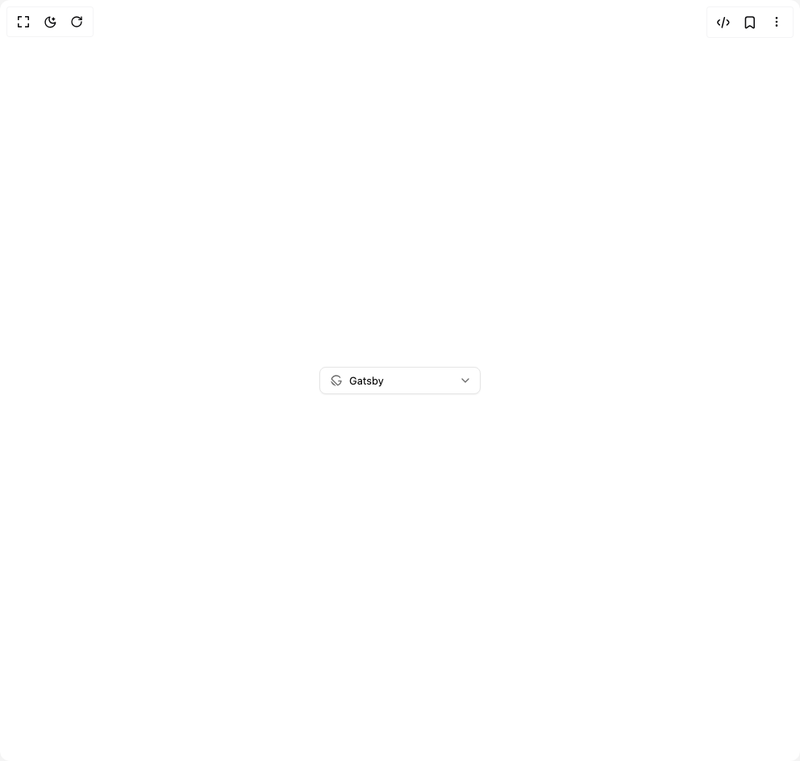

# Build Select in BuilderStudio

> Build this component in our Agentic IDE: [BuilderStudio](https://builderstudio.dev).
>
> Join the BuilderStudio community on [Discord](https://discord.gg/QdWeSGCqfe) and [Reddit](https://reddit.com/r/builderstudio).



## Component

- Author group: `reui`
- Component: `select`
- Variant: `icon`
- Rendered HTML snapshot: [`rendered.html`](rendered.html)

## BuilderStudio prompt

You are implementing a React component based on a component reference.

## Component identity

- Author: reui
- Component slug: select
- Demo slug: icon
- Title: select
- Description: 

## Goal

Recreate this component in a React + TypeScript + Tailwind CSS project. Preserve the visual layout, spacing, colors, border radius, shadows, interaction behavior, animation behavior, responsive behavior, and dark mode behavior shown in the rendered demo.

## Implementation requirements

- Use React and TypeScript.
- Use Tailwind CSS classes whenever possible.
- Keep the component self-contained unless the source files require helper components.
- If the source uses CSS variables, custom CSS, animations, or keyframes, include them.
- If the source uses external packages, list and use the required packages.
- Preserve accessibility attributes, button semantics, links, keyboard behavior, and ARIA attributes when visible in the source.
- Do not replace the component with a simplified placeholder.
- Return complete production-ready code.

## Dependencies

No reference metadata available.

## Rendered DOM snapshot

This is the rendered demo HTML extracted from the live preview. Use it to verify structure, class names, visible content, and layout.

```html
<div id="root"><div class="w-screen min-h-screen flex justify-center items-center"><div class="w-screen min-h-screen flex justify-center items-center"><button type="button" role="combobox" aria-controls="radix-«r0»" aria-expanded="false" aria-autocomplete="none" dir="ltr" data-state="closed" data-slot="select-trigger" class="flex bg-background items-center justify-between outline-none border border-input shadow-xs shadow-black/5 transition-shadow text-foreground data-placeholder:text-muted-foreground focus-visible:border-ring focus-visible:outline-none focus-visible:ring-[3px] focus-visible:ring-ring/30 disabled:cursor-not-allowed disabled:opacity-50 [&amp;&gt;span]:line-clamp-1 aria-invalid:border-destructive/60 aria-invalid:ring-destructive/10 dark:aria-invalid:border-destructive dark:aria-invalid:ring-destructive/20 [[data-invalid=true]_&amp;]:border-destructive/60 [[data-invalid=true]_&amp;]:ring-destructive/10 dark:[[data-invalid=true]_&amp;]:border-destructive dark:[[data-invalid=true]_&amp;]:ring-destructive/20 h-8.5 px-3 text-[0.8125rem] leading-(--text-sm--line-height) gap-1 rounded-md w-[200px]"><span data-slot="select-value" style="pointer-events: none;"><span class="flex items-center gap-2"><svg viewBox="0 0 24 24" xmlns="http://www.w3.org/2000/svg" width="24" height="24" fill="currentColor" class="remixicon size-4 opacity-60"><path d="M11.7519 21.997C6.53059 21.8694 2.3017 17.7397 2.01626 12.559L2.00391 12.246L11.7519 21.997ZM12.0009 2C15.39 2 18.3854 3.68597 20.194 6.26495L18.556 7.41293C17.1092 5.3492 14.7126 4 12.0009 4C8.59784 4 5.69105 6.12484 4.53491 9.12017L14.8807 19.466C17.2681 18.5445 19.1025 16.5109 19.7488 14.0004L15.5009 14V12H22.0009C22.0009 16.7261 18.7223 20.6865 14.3155 21.7308L2.27013 9.68538C3.31443 5.27856 7.27479 2 12.0009 2Z"></path></svg><span>Gatsby</span></span></span><svg xmlns="http://www.w3.org/2000/svg" width="24" height="24" viewBox="0 0 24 24" fill="none" stroke="currentColor" stroke-width="2" stroke-linecap="round" stroke-linejoin="round" class="lucide lucide-chevron-down h-4 w-4 opacity-60 -me-0.5" aria-hidden="true"><path d="m6 9 6 6 6-6"></path></svg></button></div></div></div>
```

## Reference source files

No reference source files were available.
