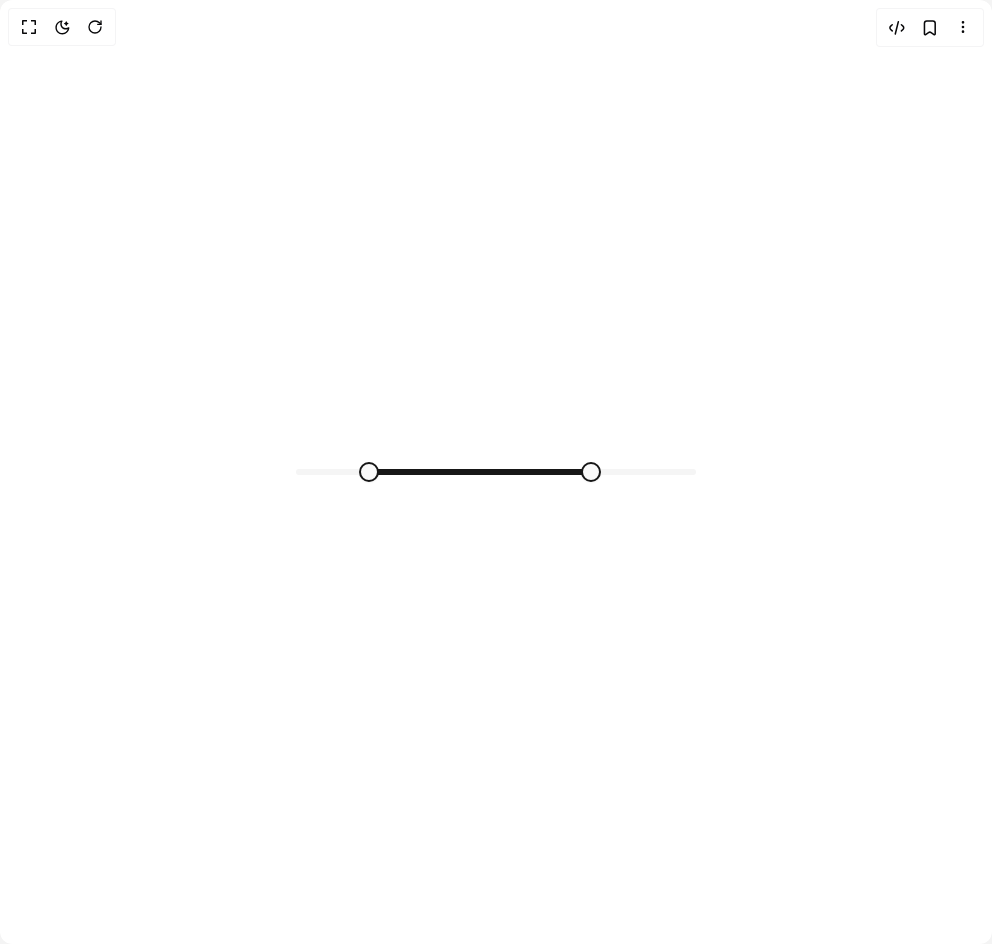

# Build Slider in BuilderStudio

> Build this component in our Agentic IDE: [BuilderStudio](https://builderstudio.dev).
>
> Join the BuilderStudio community on [Discord](https://discord.gg/QdWeSGCqfe) and [Reddit](https://reddit.com/r/builderstudio).



## Component

- Author group: `reui`
- Component: `slider`
- Variant: `range`
- Rendered HTML snapshot: [`rendered.html`](rendered.html)

## BuilderStudio prompt

You are implementing a React component based on a component reference.

## Component identity

- Author: reui
- Component slug: slider
- Demo slug: range
- Title: slider
- Description: 

## Goal

Recreate this component in a React + TypeScript + Tailwind CSS project. Preserve the visual layout, spacing, colors, border radius, shadows, interaction behavior, animation behavior, responsive behavior, and dark mode behavior shown in the rendered demo.

## Implementation requirements

- Use React and TypeScript.
- Use Tailwind CSS classes whenever possible.
- Keep the component self-contained unless the source files require helper components.
- If the source uses CSS variables, custom CSS, animations, or keyframes, include them.
- If the source uses external packages, list and use the required packages.
- Preserve accessibility attributes, button semantics, links, keyboard behavior, and ARIA attributes when visible in the source.
- Do not replace the component with a simplified placeholder.
- Return complete production-ready code.

## Dependencies

No reference metadata available.

## Rendered DOM snapshot

This is the rendered demo HTML extracted from the live preview. Use it to verify structure, class names, visible content, and layout.

```html
<div id="root"><div class="w-screen min-h-screen flex justify-center items-center"><div class="w-screen min-h-screen flex justify-center items-center"><div class="flex flex-col gap-5 p-10 w-full mx-auto max-w-[600px] h-screen justify-center items-center"><div class="w-full md:w-[400px]"><span dir="ltr" data-orientation="horizontal" aria-disabled="false" data-slot="slider" class="relative flex h-4 w-full touch-none select-none items-center" style="--radix-slider-thumb-transform: translateX(-50%);"><span data-orientation="horizontal" class="relative h-1.5 w-full overflow-hidden rounded-full bg-accent"><span data-orientation="horizontal" class="absolute h-full bg-primary" style="left: 16.6667%; right: 25%;"></span></span><span style="transform: var(--radix-slider-thumb-transform); position: absolute; left: calc(16.6667% + 6.66667px);"><span role="slider" aria-valuemin="0" aria-valuemax="600" aria-orientation="horizontal" data-orientation="horizontal" tabindex="0" data-slot="slider-thumb" class="box-content block size-4 shrink-0 cursor-pointer rounded-full border-[2px] border-primary bg-primary-foreground shadow-xs shadow-black/5 outline-hidden focus:outline-hidden" data-radix-collection-item="" aria-label="Minimum" aria-valuenow="100" style=""></span></span><span style="transform: var(--radix-slider-thumb-transform); position: absolute; left: calc(75% - 5px);"><span role="slider" aria-valuemin="0" aria-valuemax="600" aria-orientation="horizontal" data-orientation="horizontal" tabindex="0" data-slot="slider-thumb" class="box-content block size-4 shrink-0 cursor-pointer rounded-full border-[2px] border-primary bg-primary-foreground shadow-xs shadow-black/5 outline-hidden focus:outline-hidden" data-radix-collection-item="" aria-label="Maximum" aria-valuenow="450" style=""></span></span></span></div></div></div></div></div>
```

## Reference source files

No reference source files were available.
