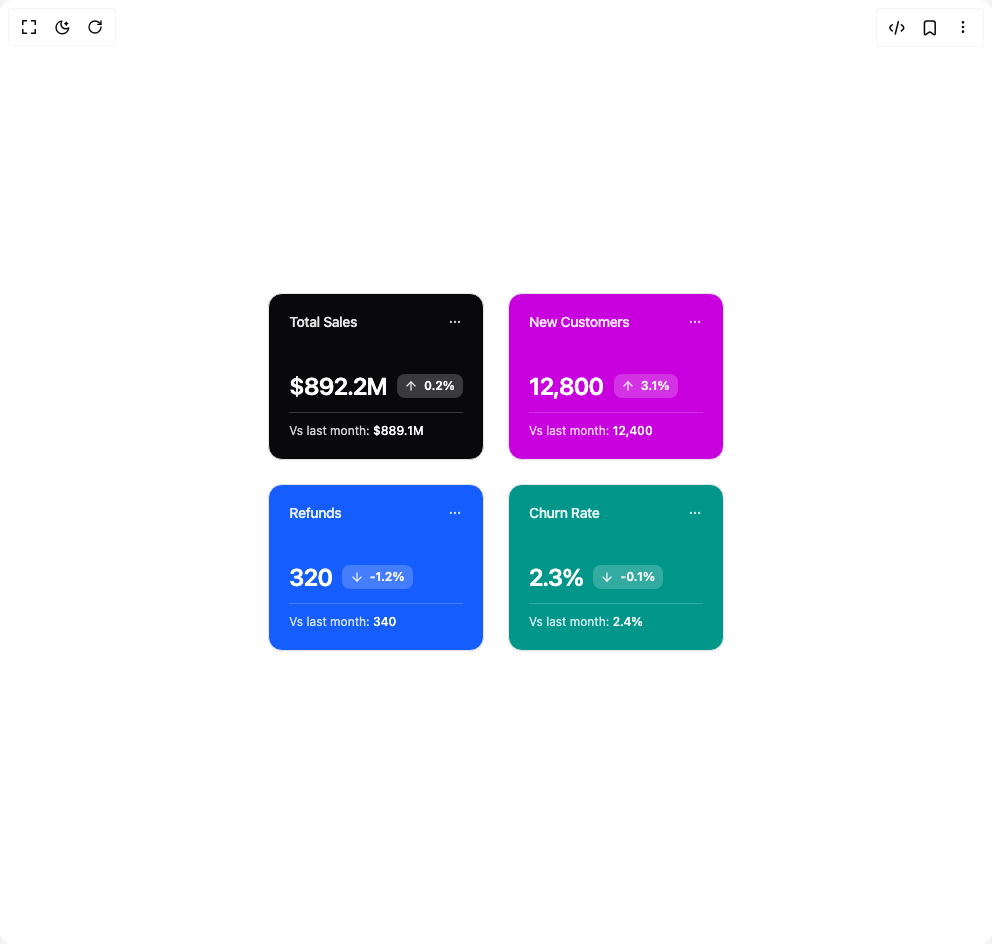

# Build Statistics Card 2 in BuilderStudio

> Build this component in our Agentic IDE: [BuilderStudio](https://builderstudio.dev).
>
> Join the BuilderStudio community on [Discord](https://discord.gg/QdWeSGCqfe) and [Reddit](https://reddit.com/r/builderstudio).



## Component

- Author group: `reui`
- Component: `statistics-card-2`
- Variant: `default`
- Rendered HTML snapshot: [`rendered.html`](rendered.html)

## BuilderStudio prompt

You are implementing a React component based on a component reference.

## Component identity

- Author: reui
- Component slug: statistics-card-2
- Demo slug: default
- Title: statistics-card-2
- Description: 

## Goal

Recreate this component in a React + TypeScript + Tailwind CSS project. Preserve the visual layout, spacing, colors, border radius, shadows, interaction behavior, animation behavior, responsive behavior, and dark mode behavior shown in the rendered demo.

## Implementation requirements

- Use React and TypeScript.
- Use Tailwind CSS classes whenever possible.
- Keep the component self-contained unless the source files require helper components.
- If the source uses CSS variables, custom CSS, animations, or keyframes, include them.
- If the source uses external packages, list and use the required packages.
- Preserve accessibility attributes, button semantics, links, keyboard behavior, and ARIA attributes when visible in the source.
- Do not replace the component with a simplified placeholder.
- Return complete production-ready code.

## Dependencies

No reference metadata available.

## Rendered DOM snapshot

This is the rendered demo HTML extracted from the live preview. Use it to verify structure, class names, visible content, and layout.

```html
<div id="root"><div class="w-screen min-h-screen flex justify-center items-center"><div class="w-screen min-h-screen flex justify-center items-center"><div class="min-h-screen flex items-center justify-center p-6 lg:p-8"><div class="grow grid grid-cols-1 sm:grid-cols-2 lg:grid-cols-4 gap-6"><div data-slot="card" class="flex flex-col items-stretch rounded-xl border border-border shadow-xs black/5 relative overflow-hidden bg-zinc-950 text-white"><div data-slot="card-header" class="flex items-center justify-between flex-wrap px-5 min-h-14 gap-2.5 border-border border-0 z-10 relative"><h3 data-slot="card-title" class="tracking-tight text-white/90 text-sm font-medium">Total Sales</h3><div data-slot="card-toolbar" class="flex items-center gap-2.5"><button data-slot="dropdown-menu-trigger" class="cursor-pointer group focus-visible:outline-hidden inline-flex items-center justify-center has-data-[arrow=true]:justify-between whitespace-nowrap font-medium ring-offset-background transition-[color,box-shadow] disabled:pointer-events-none disabled:opacity-60 [&amp;_svg]:shrink-0 data-[state=open]:text-foreground rounded-md gap-1.25 text-xs [&amp;_svg:not([class*=size-])]:size-3.5 focus-visible:ring-2 focus-visible:ring-ring focus-visible:ring-offset-2 w-7 h-7 p-0 [[&amp;_svg:not([class*=size-])]:size-3.5 select-none -me-1.5 text-white/80 hover:text-white" type="button" id="radix-«r0»" aria-haspopup="menu" aria-expanded="false" data-state="closed"><svg xmlns="http://www.w3.org/2000/svg" width="24" height="24" viewBox="0 0 24 24" fill="none" stroke="currentColor" stroke-width="2" stroke-linecap="round" stroke-linejoin="round" class="lucide lucide-ellipsis" aria-hidden="true"><circle cx="12" cy="12" r="1"></circle><circle cx="19" cy="12" r="1"></circle><circle cx="5" cy="12" r="1"></circle></svg></button></div></div><div data-slot="card-content" class="grow p-5 space-y-2.5 z-10 relative"><div class="flex items-center gap-2.5"><span class="text-2xl font-semibold tracking-tight">$892.2M</span><span data-slot="badge" class="inline-flex items-center justify-center border border-transparent focus:outline-hidden focus:ring-2 focus:ring-ring focus:ring-offset-2 [&amp;_svg]:-ms-px [&amp;_svg]:shrink-0 text-primary-foreground rounded-md px-[0.45rem] h-6 min-w-6 gap-1.5 text-xs [&amp;_svg]:size-3.5 bg-white/20 font-semibold"><svg xmlns="http://www.w3.org/2000/svg" width="24" height="24" viewBox="0 0 24 24" fill="none" stroke="currentColor" stroke-width="2" stroke-linecap="round" stroke-linejoin="round" class="lucide lucide-arrow-up" aria-hidden="true"><path d="m5 12 7-7 7 7"></path><path d="M12 19V5"></path></svg>0.2%</span></div><div class="text-xs text-white/80 mt-2 border-t border-white/20 pt-2.5">Vs last month: <span class="font-medium text-white">$889.1M</span></div></div></div><div data-slot="card" class="flex flex-col items-stretch rounded-xl border border-border shadow-xs black/5 relative overflow-hidden bg-fuchsia-600 text-white"><div data-slot="card-header" class="flex items-center justify-between flex-wrap px-5 min-h-14 gap-2.5 border-border border-0 z-10 relative"><h3 data-slot="card-title" class="tracking-tight text-white/90 text-sm font-medium">New Customers</h3><div data-slot="card-toolbar" class="flex items-center gap-2.5"><button data-slot="dropdown-menu-trigger" class="cursor-pointer group focus-visible:outline-hidden inline-flex items-center justify-center has-data-[arrow=true]:justify-between whitespace-nowrap font-medium ring-offset-background transition-[color,box-shadow] disabled:pointer-events-none disabled:opacity-60 [&amp;_svg]:shrink-0 data-[state=open]:text-foreground rounded-md gap-1.25 text-xs [&amp;_svg:not([class*=size-])]:size-3.5 focus-visible:ring-2 focus-visible:ring-ring focus-visible:ring-offset-2 w-7 h-7 p-0 [[&amp;_svg:not([class*=size-])]:size-3.5 select-none -me-1.5 text-white/80 hover:text-white" type="button" id="radix-«r2»" aria-haspopup="menu" aria-expanded="false" data-state="closed"><svg xmlns="http://www.w3.org/2000/svg" width="24" height="24" viewBox="0 0 24 24" fill="none" stroke="currentColor" stroke-width="2" stroke-linecap="round" stroke-linejoin="round" class="lucide lucide-ellipsis" aria-hidden="true"><circle cx="12" cy="12" r="1"></circle><circle cx="19" cy="12" r="1"></circle><circle cx="5" cy="12" r="1"></circle></svg></button></div></div><div data-slot="card-content" class="grow p-5 space-y-2.5 z-10 relative"><div class="flex items-center gap-2.5"><span class="text-2xl font-semibold tracking-tight">12,800</span><span data-slot="badge" class="inline-flex items-center justify-center border border-transparent focus:outline-hidden focus:ring-2 focus:ring-ring focus:ring-offset-2 [&amp;_svg]:-ms-px [&amp;_svg]:shrink-0 text-primary-foreground rounded-md px-[0.45rem] h-6 min-w-6 gap-1.5 text-xs [&amp;_svg]:size-3.5 bg-white/20 font-semibold"><svg xmlns="http://www.w3.org/2000/svg" width="24" height="24" viewBox="0 0 24 24" fill="none" stroke="currentColor" stroke-width="2" stroke-linecap="round" stroke-linejoin="round" class="lucide lucide-arrow-up" aria-hidden="true"><path d="m5 12 7-7 7 7"></path><path d="M12 19V5"></path></svg>3.1%</span></div><div class="text-xs text-white/80 mt-2 border-t border-white/20 pt-2.5">Vs last month: <span class="font-medium text-white">12,400</span></div></div></div><div data-slot="card" class="flex flex-col items-stretch rounded-xl border border-border shadow-xs black/5 relative overflow-hidden bg-blue-600 text-white"><div data-slot="card-header" class="flex items-center justify-between flex-wrap px-5 min-h-14 gap-2.5 border-border border-0 z-10 relative"><h3 data-slot="card-title" class="tracking-tight text-white/90 text-sm font-medium">Refunds</h3><div data-slot="card-toolbar" class="flex items-center gap-2.5"><button data-slot="dropdown-menu-trigger" class="cursor-pointer group focus-visible:outline-hidden inline-flex items-center justify-center has-data-[arrow=true]:justify-between whitespace-nowrap font-medium ring-offset-background transition-[color,box-shadow] disabled:pointer-events-none disabled:opacity-60 [&amp;_svg]:shrink-0 data-[state=open]:text-foreground rounded-md gap-1.25 text-xs [&amp;_svg:not([class*=size-])]:size-3.5 focus-visible:ring-2 focus-visible:ring-ring focus-visible:ring-offset-2 w-7 h-7 p-0 [[&amp;_svg:not([class*=size-])]:size-3.5 select-none -me-1.5 text-white/80 hover:text-white" type="button" id="radix-«r4»" aria-haspopup="menu" aria-expanded="false" data-state="closed"><svg xmlns="http://www.w3.org/2000/svg" width="24" height="24" viewBox="0 0 24 24" fill="none" stroke="currentColor" stroke-width="2" stroke-linecap="round" stroke-linejoin="round" class="lucide lucide-ellipsis" aria-hidden="true"><circle cx="12" cy="12" r="1"></circle><circle cx="19" cy="12" r="1"></circle><circle cx="5" cy="12" r="1"></circle></svg></button></div></div><div data-slot="card-content" class="grow p-5 space-y-2.5 z-10 relative"><div class="flex items-center gap-2.5"><span class="text-2xl font-semibold tracking-tight">320</span><span data-slot="badge" class="inline-flex items-center justify-center border border-transparent focus:outline-hidden focus:ring-2 focus:ring-ring focus:ring-offset-2 [&amp;_svg]:-ms-px [&amp;_svg]:shrink-0 text-primary-foreground rounded-md px-[0.45rem] h-6 min-w-6 gap-1.5 text-xs [&amp;_svg]:size-3.5 bg-white/20 font-semibold"><svg xmlns="http://www.w3.org/2000/svg" width="24" height="24" viewBox="0 0 24 24" fill="none" stroke="currentColor" stroke-width="2" stroke-linecap="round" stroke-linejoin="round" class="lucide lucide-arrow-down" aria-hidden="true"><path d="M12 5v14"></path><path d="m19 12-7 7-7-7"></path></svg>-1.2%</span></div><div class="text-xs text-white/80 mt-2 border-t border-white/20 pt-2.5">Vs last month: <span class="font-medium text-white">340</span></div></div></div><div data-slot="card" class="flex flex-col items-stretch rounded-xl border border-border shadow-xs black/5 relative overflow-hidden bg-teal-600 text-white"><div data-slot="card-header" class="flex items-center justify-between flex-wrap px-5 min-h-14 gap-2.5 border-border border-0 z-10 relative"><h3 data-slot="card-title" class="tracking-tight text-white/90 text-sm font-medium">Churn Rate</h3><div data-slot="card-toolbar" class="flex items-center gap-2.5"><button data-slot="dropdown-menu-trigger" class="cursor-pointer group focus-visible:outline-hidden inline-flex items-center justify-center has-data-[arrow=true]:justify-between whitespace-nowrap font-medium ring-offset-background transition-[color,box-shadow] disabled:pointer-events-none disabled:opacity-60 [&amp;_svg]:shrink-0 data-[state=open]:text-foreground rounded-md gap-1.25 text-xs [&amp;_svg:not([class*=size-])]:size-3.5 focus-visible:ring-2 focus-visible:ring-ring focus-visible:ring-offset-2 w-7 h-7 p-0 [[&amp;_svg:not([class*=size-])]:size-3.5 select-none -me-1.5 text-white/80 hover:text-white" type="button" id="radix-«r6»" aria-haspopup="menu" aria-expanded="false" data-state="closed"><svg xmlns="http://www.w3.org/2000/svg" width="24" height="24" viewBox="0 0 24 24" fill="none" stroke="currentColor" stroke-width="2" stroke-linecap="round" stroke-linejoin="round" class="lucide lucide-ellipsis" aria-hidden="true"><circle cx="12" cy="12" r="1"></circle><circle cx="19" cy="12" r="1"></circle><circle cx="5" cy="12" r="1"></circle></svg></button></div></div><div data-slot="card-content" class="grow p-5 space-y-2.5 z-10 relative"><div class="flex items-center gap-2.5"><span class="text-2xl font-semibold tracking-tight">2.3%</span><span data-slot="badge" class="inline-flex items-center justify-center border border-transparent focus:outline-hidden focus:ring-2 focus:ring-ring focus:ring-offset-2 [&amp;_svg]:-ms-px [&amp;_svg]:shrink-0 text-primary-foreground rounded-md px-[0.45rem] h-6 min-w-6 gap-1.5 text-xs [&amp;_svg]:size-3.5 bg-white/20 font-semibold"><svg xmlns="http://www.w3.org/2000/svg" width="24" height="24" viewBox="0 0 24 24" fill="none" stroke="currentColor" stroke-width="2" stroke-linecap="round" stroke-linejoin="round" class="lucide lucide-arrow-down" aria-hidden="true"><path d="M12 5v14"></path><path d="m19 12-7 7-7-7"></path></svg>-0.1%</span></div><div class="text-xs text-white/80 mt-2 border-t border-white/20 pt-2.5">Vs last month: <span class="font-medium text-white">2.4%</span></div></div></div></div></div></div></div></div>
```

## Reference source files

No reference source files were available.
