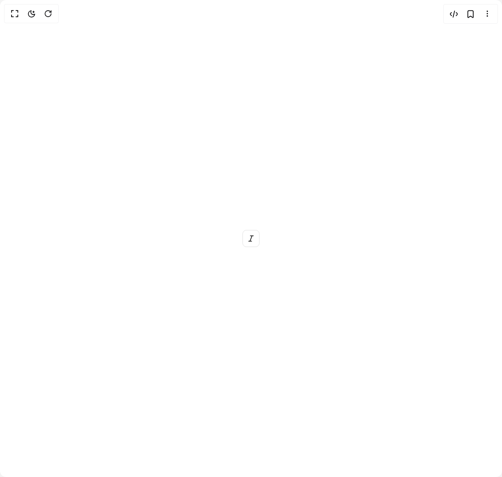

# Build Toggle 1 in BuilderStudio

> Build this component in our Agentic IDE: [BuilderStudio](https://builderstudio.dev).
>
> Join the BuilderStudio community on [Discord](https://discord.gg/QdWeSGCqfe) and [Reddit](https://reddit.com/r/builderstudio).



## Component

- Author group: `reui`
- Component: `toggle-1`
- Variant: `outline`
- Rendered HTML snapshot: [`rendered.html`](rendered.html)

## BuilderStudio prompt

You are implementing a React component based on a component reference.

## Component identity

- Author: reui
- Component slug: toggle-1
- Demo slug: outline
- Title: toggle-1
- Description: 

## Goal

Recreate this component in a React + TypeScript + Tailwind CSS project. Preserve the visual layout, spacing, colors, border radius, shadows, interaction behavior, animation behavior, responsive behavior, and dark mode behavior shown in the rendered demo.

## Implementation requirements

- Use React and TypeScript.
- Use Tailwind CSS classes whenever possible.
- Keep the component self-contained unless the source files require helper components.
- If the source uses CSS variables, custom CSS, animations, or keyframes, include them.
- If the source uses external packages, list and use the required packages.
- Preserve accessibility attributes, button semantics, links, keyboard behavior, and ARIA attributes when visible in the source.
- Do not replace the component with a simplified placeholder.
- Return complete production-ready code.

## Dependencies

No reference metadata available.

## Rendered DOM snapshot

This is the rendered demo HTML extracted from the live preview. Use it to verify structure, class names, visible content, and layout.

```html
<div id="root"><div class="w-screen min-h-screen flex justify-center items-center"><div class="w-screen min-h-screen flex justify-center items-center"><button type="button" aria-pressed="false" data-state="off" data-slot="toggle" class="cursor-pointer inline-flex items-center justify-center shrink-0 font-medium ring-offset-background transition-colors focus-visible:outline-hidden focus-visible:ring-2 focus-visible:ring-ring focus-visible:ring-offset-2 disabled:pointer-events-none disabled:opacity-50 data-[state=on]:bg-accent data-[state=on]:text-accent-foreground [&amp;_svg]:pointer-events-none [&amp;_svg]:shrink-0 border border-input bg-transparent hover:bg-accent hover:text-accent-foreground h-8.5 min-w-8.5 rounded-md px-2 text-[0.8125rem] leading-(--text-sm--line-height) gap-1 [&amp;_svg]:size-4" aria-label="Toggle italic"><svg xmlns="http://www.w3.org/2000/svg" width="24" height="24" viewBox="0 0 24 24" fill="none" stroke="currentColor" stroke-width="2" stroke-linecap="round" stroke-linejoin="round" class="lucide lucide-italic" aria-hidden="true"><line x1="19" x2="10" y1="4" y2="4"></line><line x1="14" x2="5" y1="20" y2="20"></line><line x1="15" x2="9" y1="4" y2="20"></line></svg></button></div></div></div>
```

## Reference source files

No reference source files were available.
