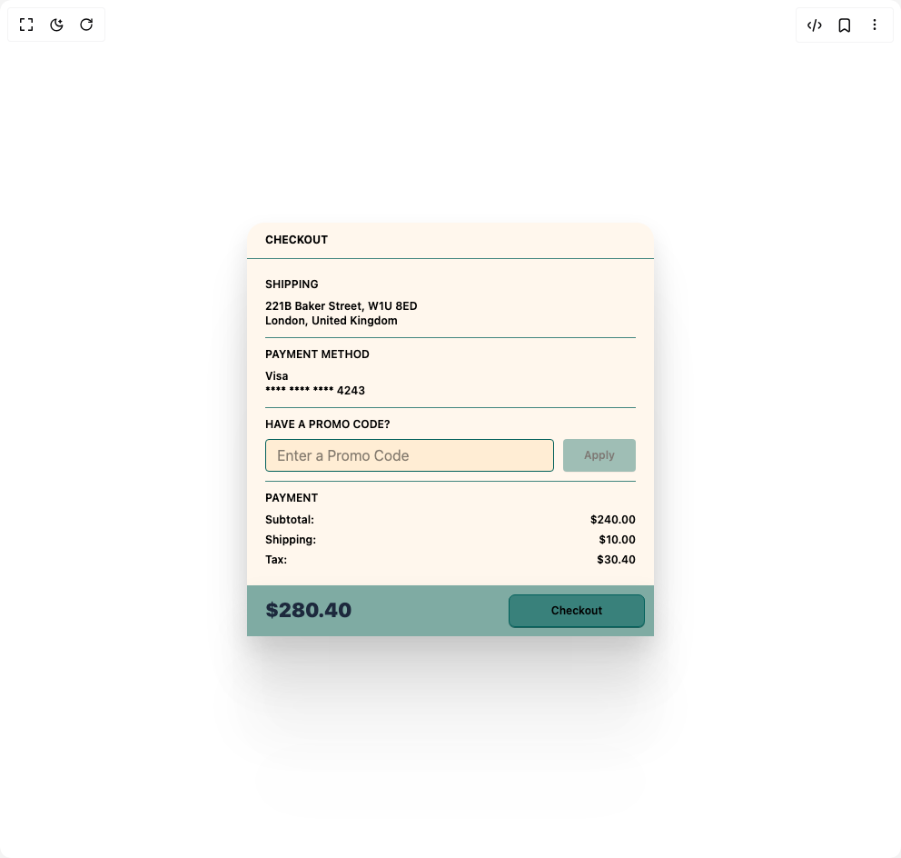

# Build Checkout in BuilderStudio

> Build this component in our Agentic IDE: [BuilderStudio](https://builderstudio.dev).
>
> Join the BuilderStudio community on [Discord](https://discord.gg/QdWeSGCqfe) and [Reddit](https://reddit.com/r/builderstudio).



## Component

- Author group: `reuno-ui`
- Component: `checkout`
- Variant: `default`
- Rendered HTML snapshot: [`rendered.html`](rendered.html)

## BuilderStudio prompt

You are implementing a React component based on a component reference.

## Component identity

- Author: reuno-ui
- Component slug: checkout
- Demo slug: default
- Title: checkout
- Description: 

## Goal

Recreate this component in a React + TypeScript + Tailwind CSS project. Preserve the visual layout, spacing, colors, border radius, shadows, interaction behavior, animation behavior, responsive behavior, and dark mode behavior shown in the rendered demo.

## Implementation requirements

- Use React and TypeScript.
- Use Tailwind CSS classes whenever possible.
- Keep the component self-contained unless the source files require helper components.
- If the source uses CSS variables, custom CSS, animations, or keyframes, include them.
- If the source uses external packages, list and use the required packages.
- Preserve accessibility attributes, button semantics, links, keyboard behavior, and ARIA attributes when visible in the source.
- Do not replace the component with a simplified placeholder.
- Return complete production-ready code.

## Dependencies

No reference metadata available.

## Rendered DOM snapshot

This is the rendered demo HTML extracted from the live preview. Use it to verify structure, class names, visible content, and layout.

```html
<div id="root"><div class="w-screen min-h-screen flex justify-center items-center"><div class="w-screen min-h-screen flex justify-center items-center"><div class="grid grid-cols-1 gap-0 max-w-md mx-auto"><div class="w-full bg-orange-50 rounded-t-[19px] shadow-[0px_187px_75px_rgba(0,0,0,0.01),0px_105px_63px_rgba(0,0,0,0.05),0px_47px_47px_rgba(0,0,0,0.09),0px_12px_26px_rgba(0,0,0,0.1)]"><div class="w-full h-10 flex items-center pl-5 border-b border-teal-800/75 font-bold text-xs text-black">CHECKOUT</div><div class="flex flex-col p-5"><div class="grid gap-2.5"><div><span class="text-xs font-semibold text-black mb-2 block">SHIPPING</span><p class="text-xs font-semibold text-black">221B Baker Street, W1U 8ED</p><p class="text-xs font-semibold text-black">London, United Kingdom</p></div><hr class="h-px bg-teal-800/75 border-none"><div><span class="text-xs font-semibold text-black mb-2 block">PAYMENT METHOD</span><p class="text-xs font-semibold text-black">Visa</p><p class="text-xs font-semibold text-black">**** **** **** 4243</p></div><hr class="h-px bg-teal-800/75 border-none"><div><span class="text-xs font-semibold text-black mb-2 block">HAVE A PROMO CODE?</span><form class="grid grid-cols-[1fr_80px] gap-2.5 p-0"><input placeholder="Enter a Promo Code" class="w-auto h-9 pl-3 rounded border border-teal-800 bg-orange-100 outline-none transition-all duration-300 ease-[cubic-bezier(0.15,0.83,0.66,1)] focus:border-transparent focus:shadow-[0px_0px_0px_2px_rgb(251,243,228)] focus:bg-stone-400" type="text" value=""><button type="submit" disabled="" class="flex justify-center items-center px-[18px] py-2.5 gap-2.5 w-full h-9 bg-teal-800/75 shadow-[0px_0.5px_0.5px_#F3D2C9,0px_1px_0.5px_rgba(239,239,239,0.5)] rounded border-0 font-semibold text-xs leading-[15px] text-black transition-all duration-300 hover:bg-teal-800/90 disabled:opacity-50 disabled:cursor-not-allowed">Apply</button></form></div><hr class="h-px bg-teal-800/75 border-none"><div><span class="text-xs font-semibold text-black mb-2 block">PAYMENT</span><div class="grid grid-cols-[10fr_1fr] p-0 gap-1.5"><span class="text-xs font-semibold text-black">Subtotal:</span><span class="text-xs font-semibold text-black ml-auto">$240.00</span><span class="text-xs font-semibold text-black">Shipping:</span><span class="text-xs font-semibold text-black ml-auto">$10.00</span><span class="text-xs font-semibold text-black">Tax:</span><span class="text-xs font-semibold text-black ml-auto">$30.40</span></div></div></div></div></div><div class="w-full bg-orange-50 shadow-[0px_187px_75px_rgba(0,0,0,0.01),0px_105px_63px_rgba(0,0,0,0.05),0px_47px_47px_rgba(0,0,0,0.09),0px_12px_26px_rgba(0,0,0,0.1)]"><div class="flex items-center justify-between py-2.5 px-2.5 pl-5 bg-teal-800/50"><div class="text-[22px] text-slate-800 font-black">$280.40</div><button class="flex justify-center items-center w-[150px] h-9 bg-teal-800/55 shadow-[0px_0.5px_0.5px_rgba(16,86,82,0.75),0px_1px_0.5px_rgba(16,86,82,0.75)] rounded-[7px] border border-teal-800 text-black text-xs font-semibold transition-all duration-300 ease-[cubic-bezier(0.15,0.83,0.66,1)] hover:bg-teal-800/70 active:scale-95">Checkout</button></div></div></div></div></div></div>
```

## Reference source files

No reference source files were available.
