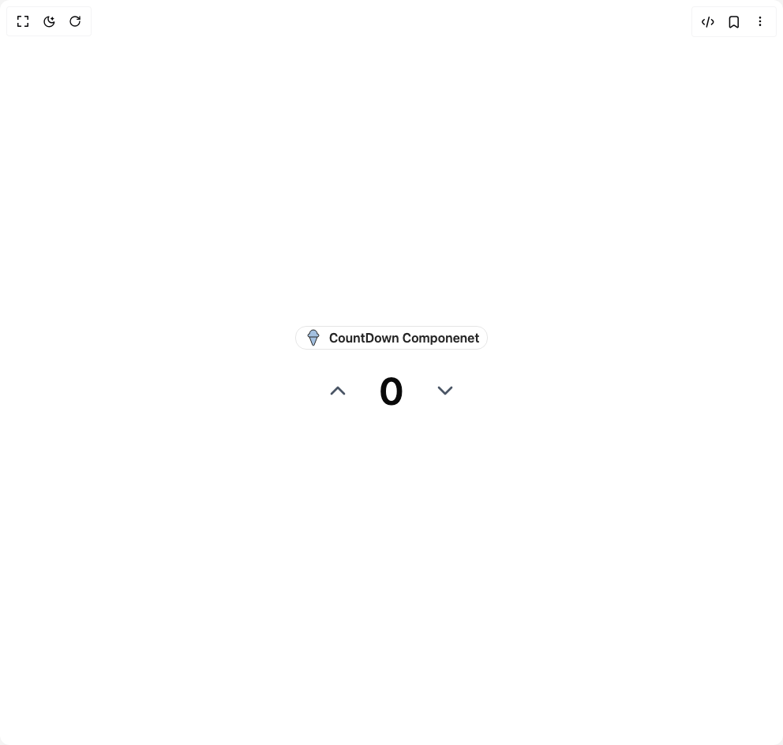

# Build Count Down Numbers in BuilderStudio

> Build this component in our Agentic IDE: [BuilderStudio](https://builderstudio.dev).
>
> Join the BuilderStudio community on [Discord](https://discord.gg/QdWeSGCqfe) and [Reddit](https://reddit.com/r/builderstudio).



## Component

- Author group: `reuno-ui`
- Component: `count-down-numbers`
- Variant: `default`
- Rendered HTML snapshot: [`rendered.html`](rendered.html)

## BuilderStudio prompt

You are implementing a React component based on a component reference.

## Component identity

- Author: reuno-ui
- Component slug: count-down-numbers
- Demo slug: default
- Title: count-down-numbers
- Description: 

## Goal

Recreate this component in a React + TypeScript + Tailwind CSS project. Preserve the visual layout, spacing, colors, border radius, shadows, interaction behavior, animation behavior, responsive behavior, and dark mode behavior shown in the rendered demo.

## Implementation requirements

- Use React and TypeScript.
- Use Tailwind CSS classes whenever possible.
- Keep the component self-contained unless the source files require helper components.
- If the source uses CSS variables, custom CSS, animations, or keyframes, include them.
- If the source uses external packages, list and use the required packages.
- Preserve accessibility attributes, button semantics, links, keyboard behavior, and ARIA attributes when visible in the source.
- Do not replace the component with a simplified placeholder.
- Return complete production-ready code.

## Dependencies

No reference metadata available.

## Rendered DOM snapshot

This is the rendered demo HTML extracted from the live preview. Use it to verify structure, class names, visible content, and layout.

```html
<div id="root"><div class="w-screen min-h-screen flex justify-center items-center"><div class="w-screen min-h-screen flex justify-center items-center"><div class="flex flex-col items-center justify-center gap-4"><div class="inline-flex items-center px-2.5 py-0.5 font-semibold transition-colors focus:outline-none focus:ring-2 focus:ring-ring focus:ring-offset-2 rounded-[14px] border border-black/10 dark:border-white/20 text-base text-neutral-800 dark:text-white/80 md:left-6"><svg xmlns="http://www.w3.org/2000/svg" width="24" height="24" viewBox="0 0 24 24" fill="none" stroke="currentColor" stroke-width="2" stroke-linecap="round" stroke-linejoin="round" class="lucide lucide-ice-cream-cone   fill-[#A3C0E0] stroke-1 text-neutral-800" aria-hidden="true"><path d="m7 11 4.08 10.35a1 1 0 0 0 1.84 0L17 11"></path><path d="M17 7A5 5 0 0 0 7 7"></path><path d="M17 7a2 2 0 0 1 0 4H7a2 2 0 0 1 0-4"></path></svg> &nbsp; CountDown Componenet</div><div class="flex items-center gap-4 rounded-2xl  transition-colors duration-300 "><button class="flex size-12 items-center justify-center rounded-md "><svg xmlns="http://www.w3.org/2000/svg" width="24" height="24" viewBox="0 0 24 24" fill="none" stroke="currentColor" stroke-width="2" stroke-linecap="round" stroke-linejoin="round" class="lucide lucide-chevron-up size-8 transition-colors duration-300 text-gray-600" aria-hidden="true"><path d="m18 15-6-6-6 6"></path></svg></button><number-flow-react class="text-5xl w-14 text-center font-semibold"></number-flow-react><button class="flex size-12 items-center justify-center rounded-md"><svg xmlns="http://www.w3.org/2000/svg" width="24" height="24" viewBox="0 0 24 24" fill="none" stroke="currentColor" stroke-width="2" stroke-linecap="round" stroke-linejoin="round" class="lucide lucide-chevron-down size-8 transition-colors duration-300 text-gray-600" aria-hidden="true"><path d="m6 9 6 6 6-6"></path></svg></button></div></div></div></div></div>
```

## Reference source files

No reference source files were available.
