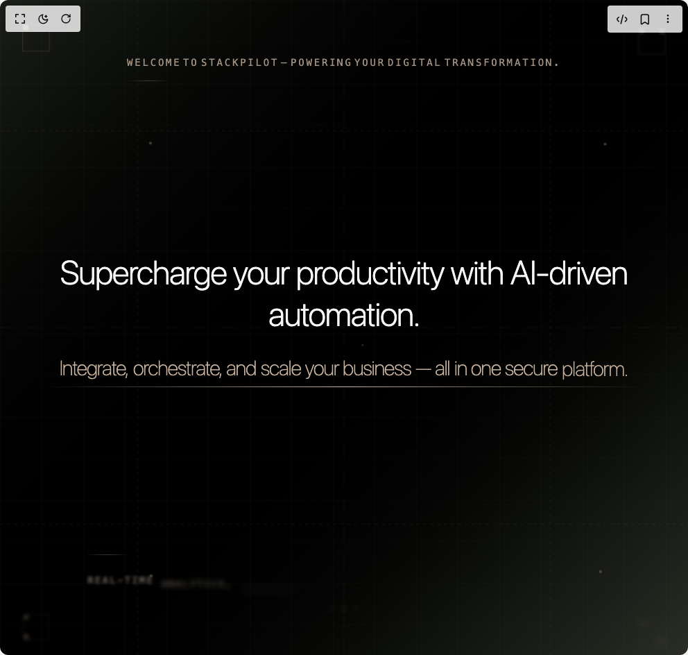

# Build Hero Section in BuilderStudio

> Build this component in our Agentic IDE: [BuilderStudio](https://builderstudio.dev).
>
> Join the BuilderStudio community on [Discord](https://discord.gg/QdWeSGCqfe) and [Reddit](https://reddit.com/r/builderstudio).



## Component

- Author group: `reuno-ui`
- Component: `hero-section`
- Variant: `default`
- Rendered HTML snapshot: [`rendered.html`](rendered.html)

## BuilderStudio prompt

You are implementing a React component based on a component reference.

## Component identity

- Author: reuno-ui
- Component slug: hero-section
- Demo slug: default
- Title: hero-section
- Description: 

## Goal

Recreate this component in a React + TypeScript + Tailwind CSS project. Preserve the visual layout, spacing, colors, border radius, shadows, interaction behavior, animation behavior, responsive behavior, and dark mode behavior shown in the rendered demo.

## Implementation requirements

- Use React and TypeScript.
- Use Tailwind CSS classes whenever possible.
- Keep the component self-contained unless the source files require helper components.
- If the source uses CSS variables, custom CSS, animations, or keyframes, include them.
- If the source uses external packages, list and use the required packages.
- Preserve accessibility attributes, button semantics, links, keyboard behavior, and ARIA attributes when visible in the source.
- Do not replace the component with a simplified placeholder.
- Return complete production-ready code.

## Dependencies

No reference metadata available.

## Rendered DOM snapshot

This is the rendered demo HTML extracted from the live preview. Use it to verify structure, class names, visible content, and layout.

```html
<div id="root"><div class="w-screen min-h-screen flex justify-center items-center"><div class="w-screen min-h-screen flex justify-center items-center"><div class="min-h-screen bg-gradient-to-br from-[#1a1d18] via-black to-[#2a2e26] text-[#e6e1d7] font-primary overflow-hidden relative w-full"><svg class="absolute inset-0 w-full h-full" xmlns="http://www.w3.org/2000/svg"><defs><pattern id="grid" width="60" height="60" patternUnits="userSpaceOnUse"><path d="M 60 0 L 0 0 0 60" fill="none" stroke="rgba(200,180,160,0.08)" stroke-width="0.5"></path></pattern></defs><rect width="100%" height="100%" fill="url(#grid)"></rect><line x1="0" y1="20%" x2="100%" y2="20%" class="grid-line" style="animation-delay: 0.5s;"></line><line x1="0" y1="80%" x2="100%" y2="80%" class="grid-line" style="animation-delay: 1s;"></line><line x1="20%" y1="0" x2="20%" y2="100%" class="grid-line" style="animation-delay: 1.5s;"></line><line x1="80%" y1="0" x2="80%" y2="100%" class="grid-line" style="animation-delay: 2s;"></line><line x1="50%" y1="0" x2="50%" y2="100%" class="grid-line" style="animation-delay: 2.5s; opacity: 0.05;"></line><line x1="0" y1="50%" x2="100%" y2="50%" class="grid-line" style="animation-delay: 3s; opacity: 0.05;"></line><circle cx="20%" cy="20%" r="2" class="detail-dot" style="animation-delay: 3s;"></circle><circle cx="80%" cy="20%" r="2" class="detail-dot" style="animation-delay: 3.2s;"></circle><circle cx="20%" cy="80%" r="2" class="detail-dot" style="animation-delay: 3.4s;"></circle><circle cx="80%" cy="80%" r="2" class="detail-dot" style="animation-delay: 3.6s;"></circle><circle cx="50%" cy="50%" r="1.5" class="detail-dot" style="animation-delay: 4s;"></circle></svg><div class="corner-element top-8 left-8" style="animation-delay: 4s;"><div class="absolute top-0 left-0 w-2 h-2 opacity-30" style="background: rgb(200, 180, 160);"></div></div><div class="corner-element top-8 right-8" style="animation-delay: 4.2s;"><div class="absolute top-0 right-0 w-2 h-2 opacity-30" style="background: rgb(200, 180, 160);"></div></div><div class="corner-element bottom-8 left-8" style="animation-delay: 4.4s;"><div class="absolute bottom-0 left-0 w-2 h-2 opacity-30" style="background: rgb(200, 180, 160);"></div></div><div class="corner-element bottom-8 right-8" style="animation-delay: 4.6s;"><div class="absolute bottom-0 right-0 w-2 h-2 opacity-30" style="background: rgb(200, 180, 160);"></div></div><div class="floating-element" style="top: 25%; left: 15%; animation-delay: 5s;"></div><div class="floating-element" style="top: 60%; left: 85%; animation-delay: 5.5s;"></div><div class="floating-element" style="top: 40%; left: 10%; animation-delay: 6s;"></div><div class="floating-element" style="top: 75%; left: 90%; animation-delay: 6.5s;"></div><div class="relative z-10 min-h-screen flex flex-col justify-between items-center px-8 py-12 md:px-16 md:py-20"><div class="text-center"><h2 class="text-xs md:text-sm font-mono font-light uppercase tracking-[0.2em] opacity-80" style="color: rgb(200, 180, 160);"><span class="word" data-delay="0" style="animation: 0.8s ease-out 0s 1 normal forwards running word-appear;">Welcome</span><span class="word" data-delay="200" style="animation: 0.8s ease-out 0s 1 normal forwards running word-appear;">to</span><span class="word" data-delay="400" style="animation: 0.8s ease-out 0s 1 normal forwards running word-appear;"><b>StackPilot</b></span><span class="word" data-delay="600" style="animation: 0.8s ease-out 0s 1 normal forwards running word-appear;">—</span><span class="word" data-delay="800" style="animation: 0.8s ease-out 0s 1 normal forwards running word-appear;">Powering</span><span class="word" data-delay="1000" style="animation: 0.8s ease-out 0s 1 normal forwards running word-appear;">your</span><span class="word" data-delay="1200" style="animation: 0.8s ease-out 0s 1 normal forwards running word-appear;">digital</span><span class="word" data-delay="1400" style="animation: 0.8s ease-out 0s 1 normal forwards running word-appear;">transformation.</span></h2><div class="mt-4 w-16 h-px opacity-30" style="background: linear-gradient(to right, transparent, rgb(200, 180, 160), transparent);"></div></div><div class="text-center max-w-5xl mx-auto"><h1 class="text-3xl md:text-5xl lg:text-6xl font-extralight leading-tight tracking-tight text-decoration" style="color: rgb(248, 247, 245);"><div class="mb-4 md:mb-6"><span class="word" data-delay="1600" style="animation: 0.8s ease-out 0s 1 normal forwards running word-appear;">Supercharge</span><span class="word" data-delay="1750" style="animation: 0.8s ease-out 0s 1 normal forwards running word-appear;">your</span><span class="word" data-delay="1900" style="animation: 0.8s ease-out 0s 1 normal forwards running word-appear;">productivity</span><span class="word" data-delay="2050" style="animation: 0.8s ease-out 0s 1 normal forwards running word-appear;">with</span><span class="word" data-delay="2200" style="animation: 0.8s ease-out 0s 1 normal forwards running word-appear;">AI-driven</span><span class="word" data-delay="2350" style="animation: 0.8s ease-out 0s 1 normal forwards running word-appear;">automation.</span></div><div class="text-2xl md:text-3xl lg:text-4xl font-thin leading-relaxed" style="color: rgb(200, 180, 160);"><span class="word" data-delay="2600" style="animation: 0.8s ease-out 0s 1 normal forwards running word-appear;">Integrate,</span><span class="word" data-delay="2750" style="animation: 0.8s ease-out 0s 1 normal forwards running word-appear;">orchestrate,</span><span class="word" data-delay="2900" style="animation: 0.8s ease-out 0s 1 normal forwards running word-appear;">and</span><span class="word" data-delay="3050" style="animation: 0.8s ease-out 0s 1 normal forwards running word-appear;">scale</span><span class="word" data-delay="3200" style="animation: 0.8s ease-out 0s 1 normal forwards running word-appear;">your</span><span class="word" data-delay="3350" style="animation: 0.8s ease-out 0s 1 normal forwards running word-appear;">business</span><span class="word" data-delay="3500" style="animation: 0.8s ease-out 0s 1 normal forwards running word-appear;">—&nbsp;all</span><span class="word" data-delay="3650" style="animation: 0.8s ease-out 0s 1 normal forwards running word-appear;">in</span><span class="word" data-delay="3800" style="animation: 0.8s ease-out 0s 1 normal forwards running word-appear;">one</span><span class="word" data-delay="3950" style="animation: 0.8s ease-out 0s 1 normal forwards running word-appear;">secure</span><span class="word" data-delay="4100" style="animation: 0.8s ease-out 0s 1 normal forwards running word-appear;">platform.</span></div></h1><div class="absolute -left-8 top-1/2 w-4 h-px opacity-20" style="background: rgb(200, 180, 160); animation: 1s ease-out 3.5s 1 normal forwards running word-appear;"></div><div class="absolute -right-8 top-1/2 w-4 h-px opacity-20" style="background: rgb(200, 180, 160); animation: 1s ease-out 3.7s 1 normal forwards running word-appear;"></div></div><div class="text-center"><div class="mb-4 w-16 h-px opacity-30" style="background: linear-gradient(to right, transparent, rgb(200, 180, 160), transparent);"></div><h2 class="text-xs md:text-sm font-mono font-light uppercase tracking-[0.2em] opacity-80" style="color: rgb(200, 180, 160);"><span class="word" data-delay="4400" style="animation: 0.8s ease-out 0s 1 normal forwards running word-appear;">Real-time</span><span class="word" data-delay="4550" style="animation: 0.8s ease-out 0s 1 normal forwards running word-appear;">analytics,</span><span class="word" data-delay="4700" style="animation: 0.8s ease-out 0s 1 normal forwards running word-appear;">seamless</span><span class="word" data-delay="4850">integrations,</span><span class="word" data-delay="5000">enterprise-grade</span><span class="word" data-delay="5150">security.</span></h2><div class="mt-6 flex justify-center space-x-4 opacity-0" style="animation: 1s ease-out 4.5s 1 normal forwards running word-appear;"><div class="w-1 h-1 rounded-full opacity-40" style="background: rgb(200, 180, 160);"></div><div class="w-1 h-1 rounded-full opacity-60" style="background: rgb(200, 180, 160);"></div><div class="w-1 h-1 rounded-full opacity-40" style="background: rgb(200, 180, 160);"></div></div></div></div><div id="mouse-gradient" class="fixed pointer-events-none w-96 h-96 rounded-full blur-3xl transition-all duration-500 ease-out opacity-0" style="background: radial-gradient(circle, rgba(107, 85, 69, 0.05) 0%, transparent 100%);"></div></div></div></div></div>
```

## Reference source files

No reference source files were available.
