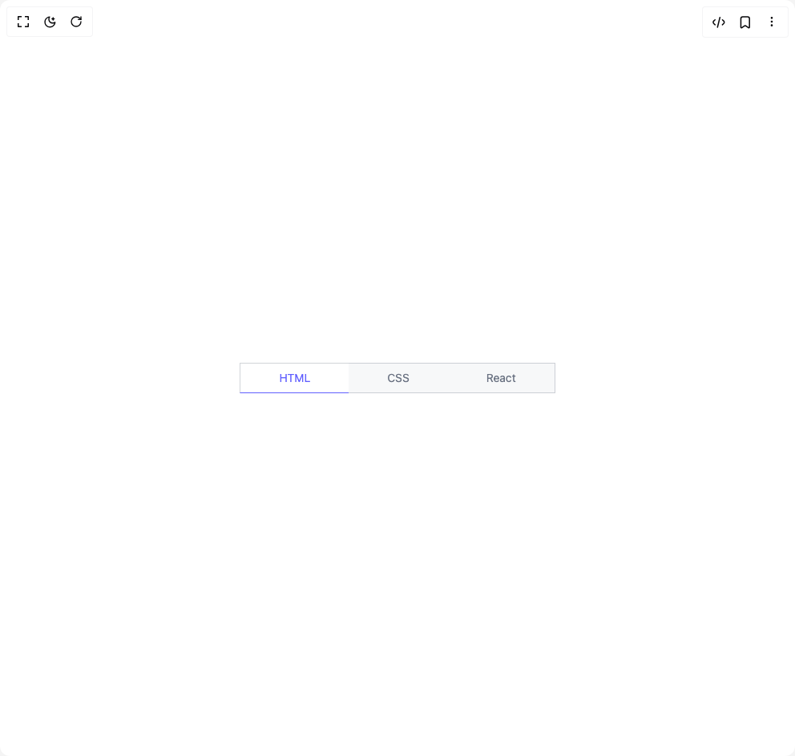

# Build Tabs 2 in BuilderStudio

> Build this component in our Agentic IDE: [BuilderStudio](https://builderstudio.dev).
>
> Join the BuilderStudio community on [Discord](https://discord.gg/QdWeSGCqfe) and [Reddit](https://reddit.com/r/builderstudio).



## Component

- Author group: `reuno-ui`
- Component: `tabs-2`
- Variant: `select-tab-with-border-indicator`
- Rendered HTML snapshot: [`rendered.html`](rendered.html)

## BuilderStudio prompt

You are implementing a React component based on a component reference.

## Component identity

- Author: reuno-ui
- Component slug: tabs-2
- Demo slug: select-tab-with-border-indicator
- Title: tabs-2
- Description: 

## Goal

Recreate this component in a React + TypeScript + Tailwind CSS project. Preserve the visual layout, spacing, colors, border radius, shadows, interaction behavior, animation behavior, responsive behavior, and dark mode behavior shown in the rendered demo.

## Implementation requirements

- Use React and TypeScript.
- Use Tailwind CSS classes whenever possible.
- Keep the component self-contained unless the source files require helper components.
- If the source uses CSS variables, custom CSS, animations, or keyframes, include them.
- If the source uses external packages, list and use the required packages.
- Preserve accessibility attributes, button semantics, links, keyboard behavior, and ARIA attributes when visible in the source.
- Do not replace the component with a simplified placeholder.
- Return complete production-ready code.

## Dependencies

No reference metadata available.

## Rendered DOM snapshot

This is the rendered demo HTML extracted from the live preview. Use it to verify structure, class names, visible content, and layout.

```html
<div id="root"><div class="w-screen min-h-screen flex justify-center items-center"><div class="w-screen min-h-screen flex justify-center items-center"><div class="flex bg-gray-500/5 text-sm"><div class="flex items-center"><input id="html" class="hidden peer" type="radio" checked="" name="options"><label for="html" class="cursor-pointer py-2 border border-r-0 border-gray-500/30 px-12 text-gray-500 transition-colors duration-200 peer-checked:border-b-indigo-500 peer-checked:bg-white peer-checked:text-indigo-500">HTML</label></div><div class="flex items-center"><input id="css" class="hidden peer" type="radio" name="options"><label for="css" class="cursor-pointer py-2 border-y border-gray-500/30 px-12 text-gray-500 transition-colors duration-200 peer-checked:border-b-indigo-500 peer-checked:bg-white peer-checked:text-indigo-500">CSS</label></div><div class="flex items-center"><input id="react" class="hidden peer" type="radio" name="options"><label for="react" class="cursor-pointer py-2 border border-l-0 border-gray-500/30 px-12 text-gray-500 transition-colors duration-200 peer-checked:border-b-indigo-500 peer-checked:bg-white peer-checked:text-indigo-500">React</label></div></div></div></div></div>
```

## Reference source files

No reference source files were available.
