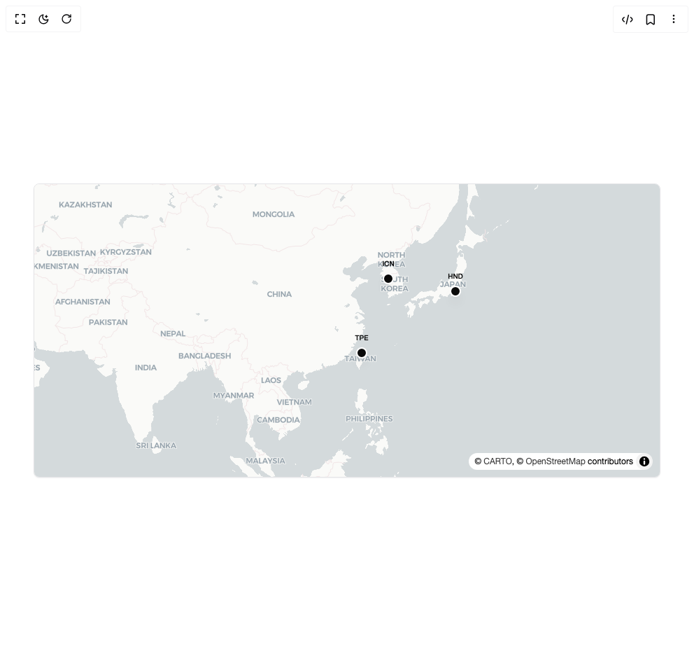
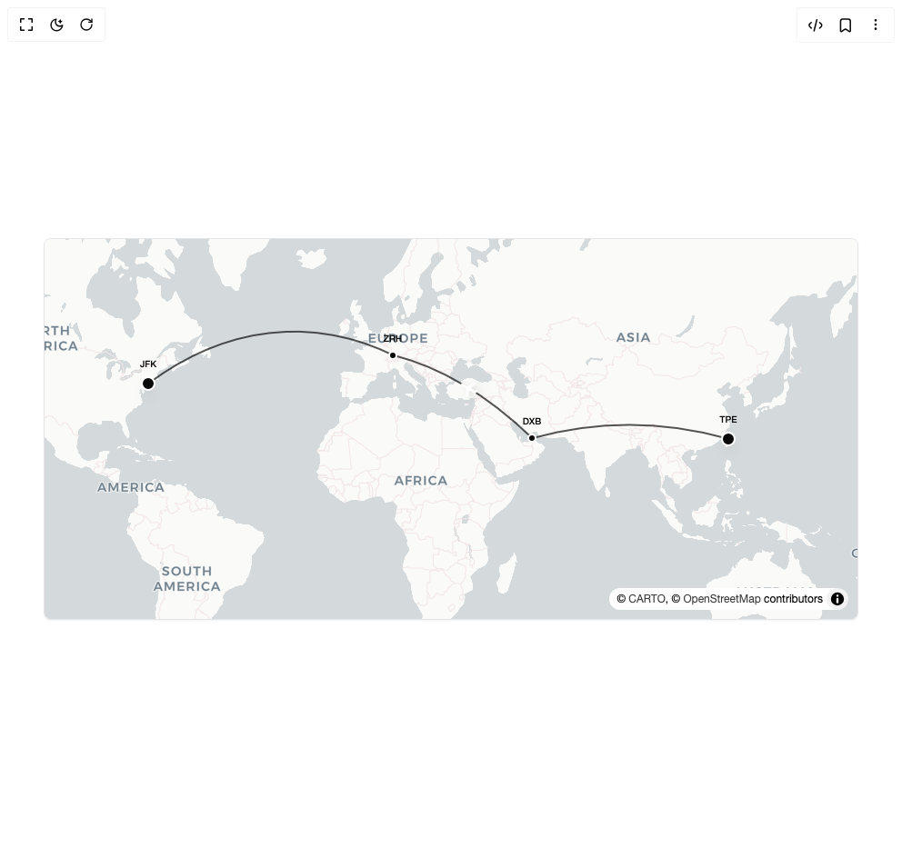
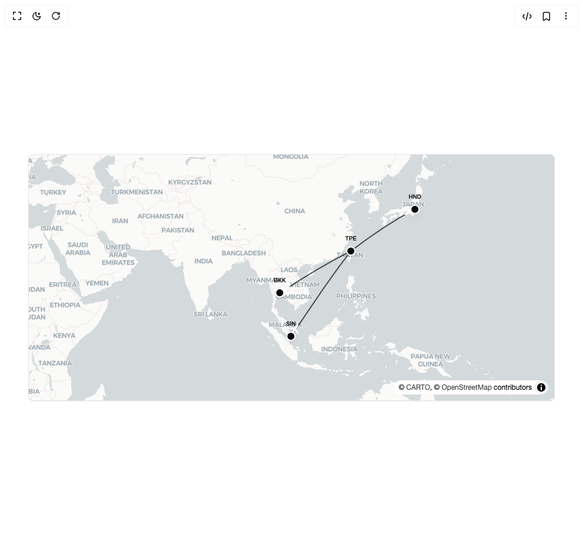
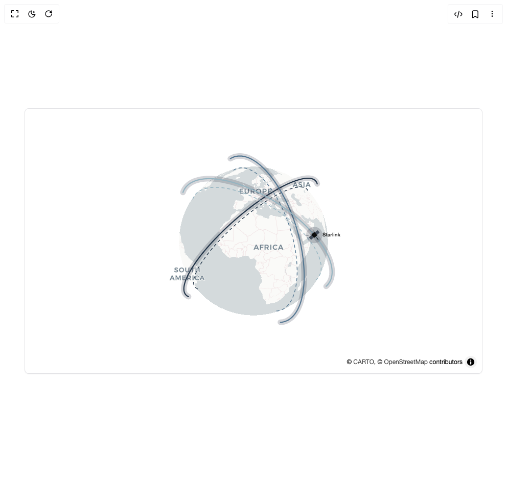

# Ridemountainpig Components

6 components are available in this author group.

> Build any component in [BuilderStudio](https://builderstudio.dev), then share improvements with the community on [Discord](https://discord.gg/QdWeSGCqfe) or [Reddit](https://reddit.com/r/builderstudio).

| Preview | Component | Variant |
| --- | --- | --- |
|  | [Flightcn Flight Airport](flightcn-flight-airport/default/README.md) | `default` |
|  | [Flightcn Flight Multi Route](flightcn-flight-multi-route/default/README.md) | `default` |
|  | [Flightcn Flight Route](flightcn-flight-route/default/README.md) | `default` |
|  | [Flightcn Flight Routes](flightcn-flight-routes/default/README.md) | `default` |
|  | [Flightcn Satellite Orbit](flightcn-satellite-orbit/default/README.md) | `default` |
|  | [Flightcn Satellite Orbits](flightcn-satellite-orbits/default/README.md) | `default` |
