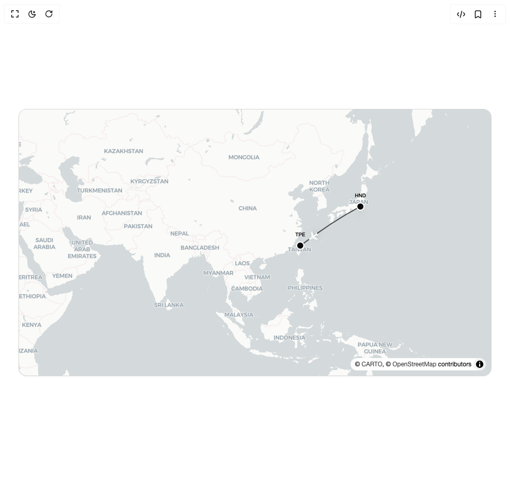

# Build Flightcn Flight Route in BuilderStudio

> Build this component in our Agentic IDE: [BuilderStudio](https://builderstudio.dev).
>
> Join the BuilderStudio community on [Discord](https://discord.gg/QdWeSGCqfe) and [Reddit](https://reddit.com/r/builderstudio).



## Component

- Author group: `ridemountainpig`
- Component: `flightcn-flight-route`
- Variant: `default`
- Rendered HTML snapshot: [`rendered.html`](rendered.html)

## BuilderStudio prompt

You are implementing a React component based on a component reference.

## Component identity

- Author: ridemountainpig
- Component slug: flightcn-flight-route
- Demo slug: default
- Title: flightcn-flight-route
- Description: 

## Goal

Recreate this component in a React + TypeScript + Tailwind CSS project. Preserve the visual layout, spacing, colors, border radius, shadows, interaction behavior, animation behavior, responsive behavior, and dark mode behavior shown in the rendered demo.

## Implementation requirements

- Use React and TypeScript.
- Use Tailwind CSS classes whenever possible.
- Keep the component self-contained unless the source files require helper components.
- If the source uses CSS variables, custom CSS, animations, or keyframes, include them.
- If the source uses external packages, list and use the required packages.
- Preserve accessibility attributes, button semantics, links, keyboard behavior, and ARIA attributes when visible in the source.
- Do not replace the component with a simplified placeholder.
- Return complete production-ready code.

## Dependencies

No reference metadata available.

## Rendered DOM snapshot

This is the rendered demo HTML extracted from the live preview. Use it to verify structure, class names, visible content, and layout.

```html
<div id="root"><div class="flex min-h-screen w-full items-center justify-center overflow-hidden bg-background p-8"><div class="h-[520px] w-full max-w-[920px] overflow-hidden rounded-2xl border border-black/10 bg-[#ececeb] shadow-sm dark:border-white/10 dark:bg-[#1d1d1b]"><div class="relative h-full w-full maplibregl-map"><div class="maplibregl-canvas-container maplibregl-interactive maplibregl-touch-drag-pan maplibregl-touch-zoom-rotate"><canvas class="maplibregl-canvas" tabindex="0" aria-label="Map" role="region" width="918" height="518" style="width: 918px; height: 518px;"></canvas><div class="maplibregl-marker maplibregl-marker-anchor-center" aria-label="Map marker" role="button" style="transform: translate(-50%, -50%) translate(574px, 246px) rotateX(0deg) rotateZ(234.239deg); visibility: visible; opacity: 1;"><div class="flex items-center justify-center text-white drop-shadow-lg" style="width: 24px; height: 24px;"><svg width="24" height="24" viewBox="0 0 24 24" fill="none" xmlns="http://www.w3.org/2000/svg"><path d="M21 16v-2l-8-5V3.5c0-.83-.67-1.5-1.5-1.5S10 2.67 10 3.5V9l-8 5v2l8-2.5V19l-2 1.5V22l3.5-1 3.5 1v-1.5L13 19v-5.5l8 2.5z" fill="currentColor"></path></svg></div></div><div class="maplibregl-marker maplibregl-marker-anchor-center" aria-label="Map marker" role="button" style="transform: translate(-50%, -50%) translate(547px, 265px) rotateX(0deg) rotateZ(0deg); opacity: 1;"><div class="relative cursor-pointer"><div class="relative h-4 w-4 rounded-full border-2 shadow-lg border-white bg-neutral-950"></div><div class="absolute left-1/2 -translate-x-1/2 whitespace-nowrap text-foreground text-[10px] font-medium bottom-full mb-1 text-neutral-950">TPE</div></div></div><div class="maplibregl-marker maplibregl-marker-anchor-center" aria-label="Map marker" role="button" style="transform: translate(-50%, -50%) translate(664px, 189px) rotateX(0deg) rotateZ(0deg); opacity: 1;"><div class="relative cursor-pointer"><div class="relative h-4 w-4 rounded-full border-2 shadow-lg border-white bg-neutral-950"></div><div class="absolute left-1/2 -translate-x-1/2 whitespace-nowrap text-foreground text-[10px] font-medium bottom-full mb-1 text-neutral-950">HND</div></div></div></div><div class="maplibregl-control-container"><div class="maplibregl-ctrl-top-left "></div><div class="maplibregl-ctrl-top-right "></div><div class="maplibregl-ctrl-bottom-left "></div><div class="maplibregl-ctrl-bottom-right "><details class="maplibregl-ctrl maplibregl-ctrl-attrib maplibregl-compact maplibregl-compact-show" open=""><summary class="maplibregl-ctrl-attrib-button" title="Toggle attribution" aria-label="Toggle attribution"></summary><div class="maplibregl-ctrl-attrib-inner">© <a href="https://carto.com/about-carto/" target="_blank" rel="noopener">CARTO</a>, © <a href="http://www.openstreetmap.org/about/" target="_blank">OpenStreetMap</a> contributors</div></details></div></div></div></div></div></div>
```

## Reference source files

No reference source files were available.
