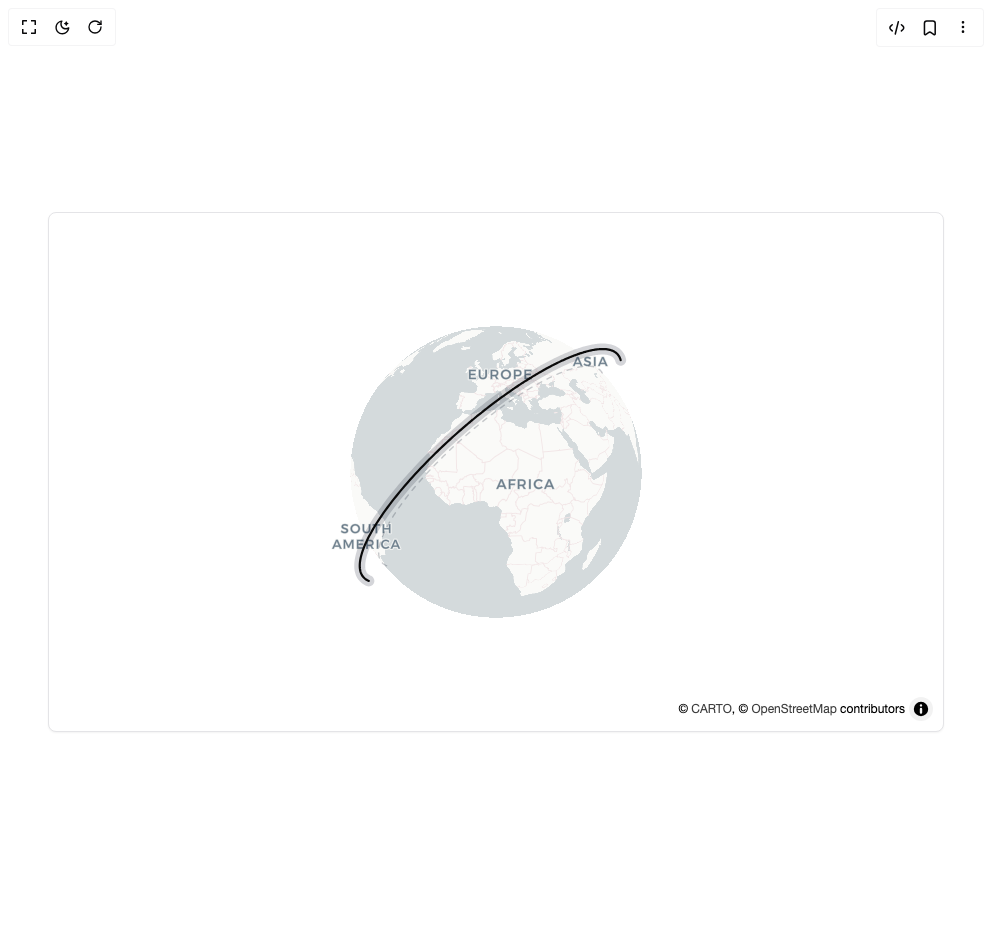

# Build Flightcn Satellite Orbit in BuilderStudio

> Build this component in our Agentic IDE: [BuilderStudio](https://builderstudio.dev).
>
> Join the BuilderStudio community on [Discord](https://discord.gg/QdWeSGCqfe) and [Reddit](https://reddit.com/r/builderstudio).



## Component

- Author group: `ridemountainpig`
- Component: `flightcn-satellite-orbit`
- Variant: `default`
- Rendered HTML snapshot: [`rendered.html`](rendered.html)

## BuilderStudio prompt

You are implementing a React component based on a component reference.

## Component identity

- Author: ridemountainpig
- Component slug: flightcn-satellite-orbit
- Demo slug: default
- Title: flightcn-satellite-orbit
- Description: 

## Goal

Recreate this component in a React + TypeScript + Tailwind CSS project. Preserve the visual layout, spacing, colors, border radius, shadows, interaction behavior, animation behavior, responsive behavior, and dark mode behavior shown in the rendered demo.

## Implementation requirements

- Use React and TypeScript.
- Use Tailwind CSS classes whenever possible.
- Keep the component self-contained unless the source files require helper components.
- If the source uses CSS variables, custom CSS, animations, or keyframes, include them.
- If the source uses external packages, list and use the required packages.
- Preserve accessibility attributes, button semantics, links, keyboard behavior, and ARIA attributes when visible in the source.
- Do not replace the component with a simplified placeholder.
- Return complete production-ready code.

## Dependencies

No reference metadata available.

## Rendered DOM snapshot

This is the rendered demo HTML extracted from the live preview. Use it to verify structure, class names, visible content, and layout.

```html
<div id="root"><div class="flex min-h-screen w-full items-center justify-center overflow-hidden bg-background p-8"><div class="h-[520px] w-full max-w-4xl overflow-hidden rounded-lg border bg-background shadow-sm"><div class="relative h-full w-full maplibregl-map"><div class="maplibregl-canvas-container maplibregl-interactive maplibregl-touch-drag-pan maplibregl-touch-zoom-rotate"><canvas class="maplibregl-canvas" tabindex="0" aria-label="Map" role="region" width="894" height="518" style="width: 894px; height: 518px;"></canvas></div><div class="maplibregl-control-container"><div class="maplibregl-ctrl-top-left "></div><div class="maplibregl-ctrl-top-right "></div><div class="maplibregl-ctrl-bottom-left "></div><div class="maplibregl-ctrl-bottom-right "><details class="maplibregl-ctrl maplibregl-ctrl-attrib maplibregl-compact maplibregl-compact-show" open=""><summary class="maplibregl-ctrl-attrib-button" title="Toggle attribution" aria-label="Toggle attribution"></summary><div class="maplibregl-ctrl-attrib-inner">© <a href="https://carto.com/about-carto/" target="_blank" rel="noopener">CARTO</a>, © <a href="http://www.openstreetmap.org/about/" target="_blank">OpenStreetMap</a> contributors</div></details></div></div><div aria-hidden="true" class="pointer-events-none absolute inset-0 overflow-hidden" data-orbit-frame="0"><svg width="894" height="518" viewBox="0 0 894 518" class="absolute inset-0"><path d="M 337.56 352.74 L 336.72 352.37 L 335.93 351.96 L 335.18 351.50 L 334.47 351.00 L 333.81 350.45 L 333.20 349.86 L 332.63 349.22 L 332.11 348.53 L 331.64 347.80 L 331.22 347.03 L 330.85 346.20 L 330.53 345.33 L 330.26 344.42 L 330.04 343.45 L 329.88 342.44 L 329.77 341.39 L 329.71 340.29 L 329.71 339.14 L 329.77 337.94 L 329.88 336.70 L 330.05 335.41 L 330.27 334.07 L 330.56 332.69 L 330.90 331.27 L 331.30 329.80 L 331.76 328.28 L 332.28 326.72 L 332.86 325.12 L 333.49 323.47 L 334.19 321.78 L 334.95 320.05 L 335.77 318.28 L 336.65 316.47 L 337.59 314.61 L 338.59 312.72 L 339.65 310.79 L 340.78 308.82 L 341.96 306.81 L 343.20 304.77 L 344.50 302.70 L 345.87 300.59 L 347.29 298.44 L 348.76 296.27 L 350.30 294.06 L 351.90 291.83 L 353.55 289.57 L 355.25 287.28 L 357.02 284.97 L 358.83 282.63 L 360.70 280.27 L 362.63 277.90 L 364.60 275.50 L 366.63 273.08 L 368.70 270.65 L 370.83 268.20 L 373.00 265.74 L 375.21 263.27 L 377.47 260.79 L 379.78 258.30 L 382.12 255.81 L 384.51 253.31 L 386.93 250.80 L 389.39 248.30 L 391.89 245.80 L 394.42 243.30 L 396.98 240.81 L 399.57 238.32 L 402.19 235.84 L 404.84 233.37 L 407.51 230.91 L 410.20 228.47 L 412.91 226.04 L 415.65 223.63 L 418.39 221.23 L 421.16 218.86 L 423.93 216.51 L 426.72 214.18 L 429.52 211.88 L 432.32 209.61 L 435.13 207.37 L 437.94 205.15 L 440.75 202.97 L 443.56 200.82 L 446.37 198.71 L 449.17 196.63 L 451.96 194.59 L 454.74 192.59 L 457.52 190.62 L 460.28 188.70 L 463.02 186.83 L 465.75 184.99 L 468.46 183.20 L 471.15 181.46 L 473.81 179.76 L 476.45 178.12 L 479.07 176.52 L 481.66 174.96 L 484.22 173.46 L 486.75 172.01 L 489.25 170.62 L 491.71 169.27 L 494.14 167.98 L 496.54 166.73 L 498.89 165.55 L 501.21 164.41 L 503.49 163.33 L 505.73 162.31 L 507.92 161.34 L 510.07 160.42 L 512.18 159.56 L 514.24 158.76 L 516.26 158.00 L 518.23 157.31 L 520.15 156.67 L 522.02 156.08 L 523.84 155.55 L 525.62 155.07 L 527.34 154.65 L 529.02 154.28 L 530.64 153.96 L 532.21 153.69 L 533.73 153.48 L 535.20 153.33 L 536.61 153.22 L 537.97 153.16 L 539.28 153.16 L 540.53 153.20 L 541.73 153.30 L 542.88 153.44 L 543.98 153.64 L 545.02 153.88 L 546.00 154.17 L 546.94 154.50 L 547.82 154.88 L 548.65 155.31 L 549.42 155.78 L 550.15 156.29 L 550.82 156.85 L 551.44 157.44 L 552.00 158.08 L 552.52 158.76 L 552.98 159.49 L 553.39 160.24 L 553.75 161.04 L 554.07 161.88 L 554.33 162.75" fill="none" stroke="rgba(15, 23, 42, 0.22)" stroke-width="1.4" stroke-dasharray="5 6" stroke-linecap="round"></path><path d="M 319.86 367.90 L 318.89 367.47 L 317.97 366.99 L 317.10 366.46 L 316.28 365.87 L 315.51 365.24 L 314.80 364.55 L 314.14 363.81 L 313.53 363.01 L 312.99 362.16 L 312.50 361.26 L 312.07 360.30 L 311.69 359.29 L 311.38 358.23 L 311.13 357.11 L 310.94 355.94 L 310.81 354.71 L 310.75 353.43 L 310.75 352.09 L 310.81 350.70 L 310.94 349.26 L 311.14 347.76 L 311.40 346.21 L 311.73 344.61 L 312.13 342.95 L 312.59 341.25 L 313.12 339.49 L 313.73 337.67 L 314.40 335.81 L 315.14 333.90 L 315.95 331.94 L 316.83 329.93 L 317.79 327.87 L 318.81 325.76 L 319.90 323.61 L 321.06 321.41 L 322.30 319.16 L 323.60 316.88 L 324.97 314.55 L 326.42 312.17 L 327.93 309.76 L 329.51 307.31 L 331.16 304.82 L 332.88 302.30 L 334.67 299.73 L 336.52 297.14 L 338.44 294.51 L 340.42 291.86 L 342.47 289.17 L 344.58 286.45 L 346.75 283.71 L 348.99 280.95 L 351.28 278.16 L 353.63 275.36 L 356.04 272.53 L 358.51 269.69 L 361.03 266.83 L 363.61 263.96 L 366.23 261.08 L 368.91 258.19 L 371.63 255.29 L 374.40 252.39 L 377.22 249.48 L 380.08 246.57 L 382.98 243.67 L 385.92 240.76 L 388.89 237.87 L 391.90 234.98 L 394.94 232.10 L 398.02 229.23 L 401.12 226.37 L 404.25 223.53 L 407.40 220.71 L 410.58 217.91 L 413.77 215.13 L 416.98 212.37 L 420.21 209.64 L 423.44 206.94 L 426.69 204.27 L 429.95 201.62 L 433.21 199.02 L 436.47 196.44 L 439.74 193.91 L 443.00 191.41 L 446.26 188.96 L 449.52 186.54 L 452.76 184.17 L 456.00 181.85 L 459.22 179.57 L 462.42 177.34 L 465.61 175.16 L 468.78 173.03 L 471.93 170.95 L 475.05 168.92 L 478.15 166.95 L 481.22 165.04 L 484.26 163.18 L 487.27 161.38 L 490.24 159.63 L 493.18 157.95 L 496.08 156.32 L 498.94 154.76 L 501.77 153.26 L 504.55 151.82 L 507.29 150.44 L 509.98 149.12 L 512.62 147.86 L 515.22 146.67 L 517.77 145.55 L 520.27 144.48 L 522.72 143.48 L 525.11 142.55 L 527.46 141.67 L 529.74 140.86 L 531.98 140.12 L 534.15 139.44 L 536.27 138.82 L 538.33 138.26 L 540.34 137.77 L 542.28 137.34 L 544.16 136.97 L 545.99 136.67 L 547.75 136.42 L 549.46 136.24 L 551.10 136.11 L 552.68 136.05 L 554.20 136.04 L 555.66 136.10 L 557.05 136.21 L 558.39 136.38 L 559.66 136.60 L 560.87 136.88 L 562.01 137.21 L 563.10 137.60 L 564.12 138.04 L 565.08 138.54 L 565.99 139.08 L 566.83 139.68 L 567.60 140.33 L 568.32 141.02 L 568.98 141.77 L 569.58 142.56 L 570.12 143.39 L 570.60 144.28 L 571.02 145.20 L 571.38 146.17 L 571.68 147.19" fill="none" stroke="rgba(15, 23, 42, 0.18)" stroke-width="11" stroke-linecap="round"></path><path d="M 319.86 367.90 L 318.89 367.47 L 317.97 366.99 L 317.10 366.46 L 316.28 365.87 L 315.51 365.24 L 314.80 364.55 L 314.14 363.81 L 313.53 363.01 L 312.99 362.16 L 312.50 361.26 L 312.07 360.30 L 311.69 359.29 L 311.38 358.23 L 311.13 357.11 L 310.94 355.94 L 310.81 354.71 L 310.75 353.43 L 310.75 352.09 L 310.81 350.70 L 310.94 349.26 L 311.14 347.76 L 311.40 346.21 L 311.73 344.61 L 312.13 342.95 L 312.59 341.25 L 313.12 339.49 L 313.73 337.67 L 314.40 335.81 L 315.14 333.90 L 315.95 331.94 L 316.83 329.93 L 317.79 327.87 L 318.81 325.76 L 319.90 323.61 L 321.06 321.41 L 322.30 319.16 L 323.60 316.88 L 324.97 314.55 L 326.42 312.17 L 327.93 309.76 L 329.51 307.31 L 331.16 304.82 L 332.88 302.30 L 334.67 299.73 L 336.52 297.14 L 338.44 294.51 L 340.42 291.86 L 342.47 289.17 L 344.58 286.45 L 346.75 283.71 L 348.99 280.95 L 351.28 278.16 L 353.63 275.36 L 356.04 272.53 L 358.51 269.69 L 361.03 266.83 L 363.61 263.96 L 366.23 261.08 L 368.91 258.19 L 371.63 255.29 L 374.40 252.39 L 377.22 249.48 L 380.08 246.57 L 382.98 243.67 L 385.92 240.76 L 388.89 237.87 L 391.90 234.98 L 394.94 232.10 L 398.02 229.23 L 401.12 226.37 L 404.25 223.53 L 407.40 220.71 L 410.58 217.91 L 413.77 215.13 L 416.98 212.37 L 420.21 209.64 L 423.44 206.94 L 426.69 204.27 L 429.95 201.62 L 433.21 199.02 L 436.47 196.44 L 439.74 193.91 L 443.00 191.41 L 446.26 188.96 L 449.52 186.54 L 452.76 184.17 L 456.00 181.85 L 459.22 179.57 L 462.42 177.34 L 465.61 175.16 L 468.78 173.03 L 471.93 170.95 L 475.05 168.92 L 478.15 166.95 L 481.22 165.04 L 484.26 163.18 L 487.27 161.38 L 490.24 159.63 L 493.18 157.95 L 496.08 156.32 L 498.94 154.76 L 501.77 153.26 L 504.55 151.82 L 507.29 150.44 L 509.98 149.12 L 512.62 147.86 L 515.22 146.67 L 517.77 145.55 L 520.27 144.48 L 522.72 143.48 L 525.11 142.55 L 527.46 141.67 L 529.74 140.86 L 531.98 140.12 L 534.15 139.44 L 536.27 138.82 L 538.33 138.26 L 540.34 137.77 L 542.28 137.34 L 544.16 136.97 L 545.99 136.67 L 547.75 136.42 L 549.46 136.24 L 551.10 136.11 L 552.68 136.05 L 554.20 136.04 L 555.66 136.10 L 557.05 136.21 L 558.39 136.38 L 559.66 136.60 L 560.87 136.88 L 562.01 137.21 L 563.10 137.60 L 564.12 138.04 L 565.08 138.54 L 565.99 139.08 L 566.83 139.68 L 567.60 140.33 L 568.32 141.02 L 568.98 141.77 L 569.58 142.56 L 570.12 143.39 L 570.60 144.28 L 571.02 145.20 L 571.38 146.17 L 571.68 147.19" fill="none" stroke="#0a0a0a" stroke-width="2.2" stroke-linecap="round"></path></svg></div></div></div></div></div>
```

## Reference source files

No reference source files were available.
