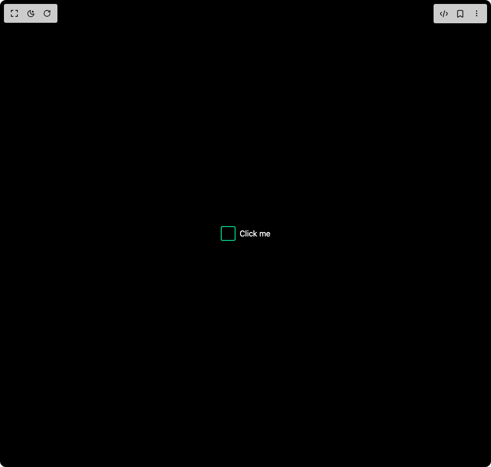

# Build Animated Check Box in BuilderStudio

> Build this component in our Agentic IDE: [BuilderStudio](https://builderstudio.dev).
>
> Join the BuilderStudio community on [Discord](https://discord.gg/QdWeSGCqfe) and [Reddit](https://reddit.com/r/builderstudio).



## Component

- Author group: `ringlabs`
- Component: `animated-check-box`
- Variant: `default`
- Rendered HTML snapshot: [`rendered.html`](rendered.html)

## BuilderStudio prompt

You are implementing a React component based on a component reference.

## Component identity

- Author: ringlabs
- Component slug: animated-check-box
- Demo slug: default
- Title: animated-check-box
- Description: 

## Goal

Recreate this component in a React + TypeScript + Tailwind CSS project. Preserve the visual layout, spacing, colors, border radius, shadows, interaction behavior, animation behavior, responsive behavior, and dark mode behavior shown in the rendered demo.

## Implementation requirements

- Use React and TypeScript.
- Use Tailwind CSS classes whenever possible.
- Keep the component self-contained unless the source files require helper components.
- If the source uses CSS variables, custom CSS, animations, or keyframes, include them.
- If the source uses external packages, list and use the required packages.
- Preserve accessibility attributes, button semantics, links, keyboard behavior, and ARIA attributes when visible in the source.
- Do not replace the component with a simplified placeholder.
- Return complete production-ready code.

## Dependencies

No reference metadata available.

## Rendered DOM snapshot

This is the rendered demo HTML extracted from the live preview. Use it to verify structure, class names, visible content, and layout.

```html
<div id="root"><div class="flex items-center justify-center min-h-screen bg-black"><div class="flex items-center space-x-2"><label class="relative inline-block w-[var(--size)] h-[var(--size)] cursor-pointer " style="--primary: #00ffaa; --primary-dark: #00cc88; --primary-light: #88ffdd; --size: 30px;"><input class="hidden" type="checkbox"><div class="relative w-full h-full neon-checkbox__frame"><div class="absolute inset-0 bg-black/80 rounded border-2 transition-all duration-400 neon-checkbox__box border-[var(--primary-dark)]"><div class="absolute inset-[2px] flex items-center justify-center neon-checkbox__check-container"><svg viewBox="0 0 24 24" class="w-4/5 h-4/5 fill-none stroke-[var(--primary)] stroke-[3] stroke-linecap-round stroke-linejoin-round [stroke-dasharray:40] origin-center transition-all duration-400 ease-[cubic-bezier(0.16,1,0.3,1)] neon-checkbox__check [stroke-dashoffset:40]"><path d="M3,12.5l7,7L21,5"></path></svg></div><div class="absolute -inset-0.5 rounded-md bg-[var(--primary)] blur-md transition-opacity duration-400 neon-checkbox__glow opacity-0"></div><div class="absolute inset-0 rounded overflow-hidden neon-checkbox__borders"><span class="absolute w-10 h-px bg-[var(--primary)] transition-opacity duration-400 opacity-0 top-0 left-[-100%] animate-[borderFlow1_2s_linear_infinite]"></span><span class="absolute w-10 h-px bg-[var(--primary)] transition-opacity duration-400 opacity-0 top-[-100%] right-0 w-px h-10 animate-[borderFlow2_2s_linear_infinite]"></span><span class="absolute w-10 h-px bg-[var(--primary)] transition-opacity duration-400 opacity-0 bottom-0 right-[-100%] animate-[borderFlow3_2s_linear_infinite]"></span><span class="absolute w-10 h-px bg-[var(--primary)] transition-opacity duration-400 opacity-0 bottom-[-100%] left-0 w-px h-10 animate-[borderFlow4_2s_linear_infinite]"></span></div></div><div class="neon-checkbox__effects"><div class="absolute inset-0 neon-checkbox__particles"><span class="absolute w-1 h-1 bg-[var(--primary)] rounded-full pointer-events-none top-1/2 left-1/2 shadow-[0_0_6px_var(--primary)] opacity-0" style="--x: 25px; --y: -25px;"></span><span class="absolute w-1 h-1 bg-[var(--primary)] rounded-full pointer-events-none top-1/2 left-1/2 shadow-[0_0_6px_var(--primary)] opacity-0" style="--x: -25px; --y: -25px;"></span><span class="absolute w-1 h-1 bg-[var(--primary)] rounded-full pointer-events-none top-1/2 left-1/2 shadow-[0_0_6px_var(--primary)] opacity-0" style="--x: 25px; --y: 25px;"></span><span class="absolute w-1 h-1 bg-[var(--primary)] rounded-full pointer-events-none top-1/2 left-1/2 shadow-[0_0_6px_var(--primary)] opacity-0" style="--x: -25px; --y: 25px;"></span><span class="absolute w-1 h-1 bg-[var(--primary)] rounded-full pointer-events-none top-1/2 left-1/2 shadow-[0_0_6px_var(--primary)] opacity-0" style="--x: 35px; --y: 0px;"></span><span class="absolute w-1 h-1 bg-[var(--primary)] rounded-full pointer-events-none top-1/2 left-1/2 shadow-[0_0_6px_var(--primary)] opacity-0" style="--x: -35px; --y: 0px;"></span><span class="absolute w-1 h-1 bg-[var(--primary)] rounded-full pointer-events-none top-1/2 left-1/2 shadow-[0_0_6px_var(--primary)] opacity-0" style="--x: 0px; --y: 35px;"></span><span class="absolute w-1 h-1 bg-[var(--primary)] rounded-full pointer-events-none top-1/2 left-1/2 shadow-[0_0_6px_var(--primary)] opacity-0" style="--x: 0px; --y: -35px;"></span><span class="absolute w-1 h-1 bg-[var(--primary)] rounded-full pointer-events-none top-1/2 left-1/2 shadow-[0_0_6px_var(--primary)] opacity-0" style="--x: 20px; --y: -30px;"></span><span class="absolute w-1 h-1 bg-[var(--primary)] rounded-full pointer-events-none top-1/2 left-1/2 shadow-[0_0_6px_var(--primary)] opacity-0" style="--x: -20px; --y: 30px;"></span><span class="absolute w-1 h-1 bg-[var(--primary)] rounded-full pointer-events-none top-1/2 left-1/2 shadow-[0_0_6px_var(--primary)] opacity-0" style="--x: 30px; --y: 20px;"></span><span class="absolute w-1 h-1 bg-[var(--primary)] rounded-full pointer-events-none top-1/2 left-1/2 shadow-[0_0_6px_var(--primary)] opacity-0" style="--x: -30px; --y: -20px;"></span></div><div class="absolute -inset-5 pointer-events-none neon-checkbox__rings"><div class="absolute inset-0 rounded-full border border-[var(--primary)] scale-0 ring opacity-0" style="animation-delay: 0s;"></div><div class="absolute inset-0 rounded-full border border-[var(--primary)] scale-0 ring opacity-0" style="animation-delay: 0.1s;"></div><div class="absolute inset-0 rounded-full border border-[var(--primary)] scale-0 ring opacity-0" style="animation-delay: 0.2s;"></div></div><div class="absolute inset-0 neon-checkbox__sparks"><span class="absolute w-5 h-px bg-gradient-to-r from-[var(--primary)] to-transparent top-1/2 left-1/2 opacity-0" style="--r: 0deg;"></span><span class="absolute w-5 h-px bg-gradient-to-r from-[var(--primary)] to-transparent top-1/2 left-1/2 opacity-0" style="--r: 90deg;"></span><span class="absolute w-5 h-px bg-gradient-to-r from-[var(--primary)] to-transparent top-1/2 left-1/2 opacity-0" style="--r: 180deg;"></span><span class="absolute w-5 h-px bg-gradient-to-r from-[var(--primary)] to-transparent top-1/2 left-1/2 opacity-0" style="--r: 270deg;"></span></div></div></div><style>
        @keyframes borderFlow1 {
          0% { transform: translateX(0); }
          100% { transform: translateX(200%); }
        }
        @keyframes borderFlow2 {
          0% { transform: translateY(0); }
          100% { transform: translateY(200%); }
        }
        @keyframes borderFlow3 {
          0% { transform: translateX(0); }
          100% { transform: translateX(-200%); }
        }
        @keyframes borderFlow4 {
          0% { transform: translateY(0); }
          100% { transform: translateY(-200%); }
        }
        @keyframes particleExplosion {
          0% { transform: translate(-50%, -50%) scale(1); opacity: 0; }
          20% { opacity: 1; }
          100% { 
            transform: translate(
              calc(-50% + var(--x, 20px)),
              calc(-50% + var(--y, 20px))
            ) scale(0);
            opacity: 0;
          }
        }
        @keyframes ringPulse {
          0% { transform: scale(0); opacity: 1; }
          100% { transform: scale(2); opacity: 0; }
        }
        @keyframes sparkFlash {
          0% { 
            transform: rotate(var(--r, 0deg)) translateX(0) scale(1);
            opacity: 1;
          }
          100% {
            transform: rotate(var(--r, 0deg)) translateX(30px) scale(0);
            opacity: 0;
          }
        }
      </style></label><span class="text-white">Click me</span></div></div></div>
```

## Reference source files

No reference source files were available.
