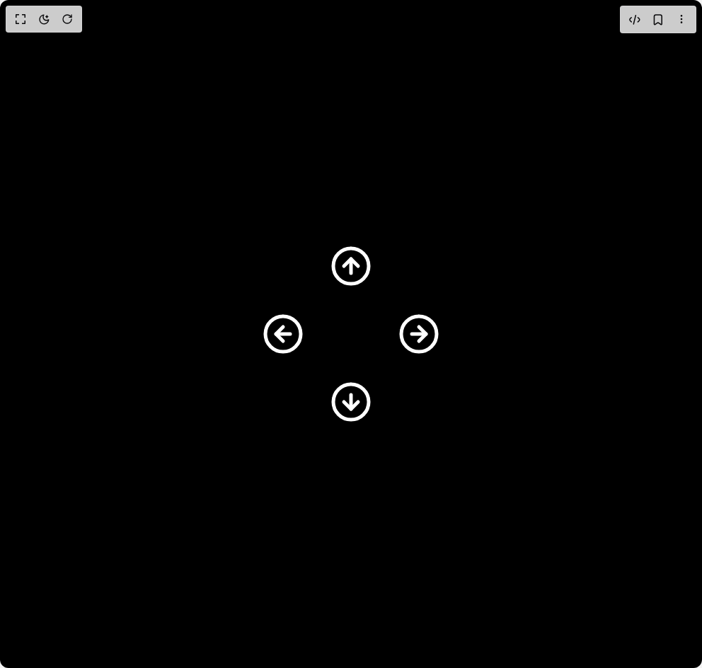

# Build Interactive Animated Arrow Icon in BuilderStudio

> Build this component in our Agentic IDE: [BuilderStudio](https://builderstudio.dev).
>
> Join the BuilderStudio community on [Discord](https://discord.gg/QdWeSGCqfe) and [Reddit](https://reddit.com/r/builderstudio).



## Component

- Author group: `ringlabs`
- Component: `interactive-animated-arrow-icon`
- Variant: `default`
- Rendered HTML snapshot: [`rendered.html`](rendered.html)

## BuilderStudio prompt

You are implementing a React component based on a component reference.

## Component identity

- Author: ringlabs
- Component slug: interactive-animated-arrow-icon
- Demo slug: default
- Title: interactive-animated-arrow-icon
- Description: 

## Goal

Recreate this component in a React + TypeScript + Tailwind CSS project. Preserve the visual layout, spacing, colors, border radius, shadows, interaction behavior, animation behavior, responsive behavior, and dark mode behavior shown in the rendered demo.

## Implementation requirements

- Use React and TypeScript.
- Use Tailwind CSS classes whenever possible.
- Keep the component self-contained unless the source files require helper components.
- If the source uses CSS variables, custom CSS, animations, or keyframes, include them.
- If the source uses external packages, list and use the required packages.
- Preserve accessibility attributes, button semantics, links, keyboard behavior, and ARIA attributes when visible in the source.
- Do not replace the component with a simplified placeholder.
- Return complete production-ready code.

## Dependencies

No reference metadata available.

## Rendered DOM snapshot

This is the rendered demo HTML extracted from the live preview. Use it to verify structure, class names, visible content, and layout.

```html
<div id="root"><div class="flex items-center justify-center h-screen bg-black"><div class="grid grid-cols-3 gap-4"><div class="flex items-center justify-center"></div><div class="flex items-center justify-center"><div style="cursor: pointer; display: inline-block; width: 80px; height: 80px;"><svg xmlns="http://www.w3.org/2000/svg" xmlns:xlink="http://www.w3.org/1999/xlink" viewBox="0 0 32 32" width="32" height="32" preserveAspectRatio="xMidYMid meet" style="width: 100%; height: 100%; transform: translate3d(0px, 0px, 0px); content-visibility: visible;"><defs><clipPath id="__lottie_element_17"><rect width="32" height="32" x="0" y="0"></rect></clipPath></defs><g clip-path="url(#__lottie_element_17)"><g transform="matrix(1,0,0,1,4,4)" opacity="1" style="display: block;"><g opacity="1" transform="matrix(1,0,0,1,12,12)"><path stroke-linecap="round" stroke-linejoin="round" fill-opacity="0" stroke="rgb(0,0,0)" stroke-opacity="1" stroke-width="2" d=" M0,-10 C5.521999835968018,-10 10,-5.5229997634887695 10,0 C10,5.521999835968018 5.521999835968018,10 0,10 C-5.5229997634887695,10 -10,5.521999835968018 -10,0 C-10,-5.510000228881836 -5.543000221252441,-9.979999542236328 -0.03799999877810478,-10" style="stroke: rgb(255, 255, 255);"></path></g><g opacity="1" transform="matrix(1,0,0,1,12,12)"><path stroke-linecap="round" stroke-linejoin="round" fill-opacity="0" stroke="rgb(0,0,0)" stroke-opacity="1" stroke-width="2" d="M0 0" style="stroke: rgb(255, 255, 255);"></path></g><g opacity="1" transform="matrix(0,1,-1,0,24,0)"><g opacity="1" transform="matrix(1,0,0,1,10,12)"><path stroke-linecap="round" stroke-linejoin="round" fill-opacity="0" stroke="rgb(0,0,0)" stroke-opacity="1" stroke-width="2" d=" M2,-4 C2,-4 -2,0 -2,0 C-2,0 2,4 2,4" style="stroke: rgb(255, 255, 255);"></path></g><g opacity="1" transform="matrix(1,0,0,1,0,0)"><path stroke-linecap="round" stroke-linejoin="round" fill-opacity="0" stroke="rgb(0,0,0)" stroke-opacity="1" stroke-width="2" d=" M16,12 C16,12 8,12 8,12" style="stroke: rgb(255, 255, 255);"></path></g></g></g></g></svg></div></div><div class="flex items-center justify-center"></div><div class="flex items-center justify-center"><div style="cursor: pointer; display: inline-block; width: 80px; height: 80px;"><svg xmlns="http://www.w3.org/2000/svg" xmlns:xlink="http://www.w3.org/1999/xlink" viewBox="0 0 32 32" width="32" height="32" preserveAspectRatio="xMidYMid meet" style="width: 100%; height: 100%; transform: translate3d(0px, 0px, 0px); content-visibility: visible;"><defs><clipPath id="__lottie_element_12"><rect width="32" height="32" x="0" y="0"></rect></clipPath></defs><g clip-path="url(#__lottie_element_12)"><g transform="matrix(1,0,0,1,4,4)" opacity="1" style="display: block;"><g opacity="1" transform="matrix(1,0,0,1,12,12)"><path stroke-linecap="round" stroke-linejoin="round" fill-opacity="0" stroke="rgb(0,0,0)" stroke-opacity="1" stroke-width="2" d=" M0,-10 C5.521999835968018,-10 10,-5.5229997634887695 10,0 C10,5.521999835968018 5.521999835968018,10 0,10 C-5.5229997634887695,10 -10,5.521999835968018 -10,0 C-10,-5.510000228881836 -5.543000221252441,-9.979999542236328 -0.03799999877810478,-10" style="stroke: rgb(255, 255, 255);"></path></g><g opacity="1" transform="matrix(1,0,0,1,12,12)"><path stroke-linecap="round" stroke-linejoin="round" fill-opacity="0" stroke="rgb(0,0,0)" stroke-opacity="1" stroke-width="2" d="M0 0" style="stroke: rgb(255, 255, 255);"></path></g><g opacity="1" transform="matrix(1,0,0,1,0,0)"><g opacity="1" transform="matrix(1,0,0,1,10,12)"><path stroke-linecap="round" stroke-linejoin="round" fill-opacity="0" stroke="rgb(0,0,0)" stroke-opacity="1" stroke-width="2" d=" M2,-4 C2,-4 -2,0 -2,0 C-2,0 2,4 2,4" style="stroke: rgb(255, 255, 255);"></path></g><g opacity="1" transform="matrix(1,0,0,1,0,0)"><path stroke-linecap="round" stroke-linejoin="round" fill-opacity="0" stroke="rgb(0,0,0)" stroke-opacity="1" stroke-width="2" d=" M16,12 C16,12 8,12 8,12" style="stroke: rgb(255, 255, 255);"></path></g></g></g></g></svg></div></div><div class="flex items-center justify-center"></div><div class="flex items-center justify-center"><div style="cursor: pointer; display: inline-block; width: 80px; height: 80px;"><svg xmlns="http://www.w3.org/2000/svg" xmlns:xlink="http://www.w3.org/1999/xlink" viewBox="0 0 32 32" width="32" height="32" preserveAspectRatio="xMidYMid meet" style="width: 100%; height: 100%; transform: translate3d(0px, 0px, 0px); content-visibility: visible;"><defs><clipPath id="__lottie_element_2"><rect width="32" height="32" x="0" y="0"></rect></clipPath></defs><g clip-path="url(#__lottie_element_2)"><g transform="matrix(1,0,0,1,4,4)" opacity="1" style="display: block;"><g opacity="1" transform="matrix(1,0,0,1,12,12)"><path stroke-linecap="round" stroke-linejoin="round" fill-opacity="0" stroke="rgb(0,0,0)" stroke-opacity="1" stroke-width="2" d=" M0,-10 C5.521999835968018,-10 10,-5.5229997634887695 10,0 C10,5.521999835968018 5.521999835968018,10 0,10 C-5.5229997634887695,10 -10,5.521999835968018 -10,0 C-10,-5.510000228881836 -5.543000221252441,-9.979999542236328 -0.03799999877810478,-10" style="stroke: rgb(255, 255, 255);"></path></g><g opacity="1" transform="matrix(1,0,0,1,12,12)"><path stroke-linecap="round" stroke-linejoin="round" fill-opacity="0" stroke="rgb(0,0,0)" stroke-opacity="1" stroke-width="2" d="M0 0" style="stroke: rgb(255, 255, 255);"></path></g><g opacity="1" transform="matrix(-1,0,0,-1,24,24)"><g opacity="1" transform="matrix(1,0,0,1,10,12)"><path stroke-linecap="round" stroke-linejoin="round" fill-opacity="0" stroke="rgb(0,0,0)" stroke-opacity="1" stroke-width="2" d=" M2,-4 C2,-4 -2,0 -2,0 C-2,0 2,4 2,4" style="stroke: rgb(255, 255, 255);"></path></g><g opacity="1" transform="matrix(1,0,0,1,0,0)"><path stroke-linecap="round" stroke-linejoin="round" fill-opacity="0" stroke="rgb(0,0,0)" stroke-opacity="1" stroke-width="2" d=" M16,12 C16,12 8,12 8,12" style="stroke: rgb(255, 255, 255);"></path></g></g></g></g></svg></div></div><div class="flex items-center justify-center"></div><div class="flex items-center justify-center"><div style="cursor: pointer; display: inline-block; width: 80px; height: 80px;"><svg xmlns="http://www.w3.org/2000/svg" xmlns:xlink="http://www.w3.org/1999/xlink" viewBox="0 0 32 32" width="32" height="32" preserveAspectRatio="xMidYMid meet" style="width: 100%; height: 100%; transform: translate3d(0px, 0px, 0px); content-visibility: visible;"><defs><clipPath id="__lottie_element_7"><rect width="32" height="32" x="0" y="0"></rect></clipPath></defs><g clip-path="url(#__lottie_element_7)"><g transform="matrix(1,0,0,1,4,4)" opacity="1" style="display: block;"><g opacity="1" transform="matrix(1,0,0,1,12,12)"><path stroke-linecap="round" stroke-linejoin="round" fill-opacity="0" stroke="rgb(0,0,0)" stroke-opacity="1" stroke-width="2" d=" M0,-10 C5.521999835968018,-10 10,-5.5229997634887695 10,0 C10,5.521999835968018 5.521999835968018,10 0,10 C-5.5229997634887695,10 -10,5.521999835968018 -10,0 C-10,-5.510000228881836 -5.543000221252441,-9.979999542236328 -0.03799999877810478,-10" style="stroke: rgb(255, 255, 255);"></path></g><g opacity="1" transform="matrix(1,0,0,1,12,12)"><path stroke-linecap="round" stroke-linejoin="round" fill-opacity="0" stroke="rgb(0,0,0)" stroke-opacity="1" stroke-width="2" d="M0 0" style="stroke: rgb(255, 255, 255);"></path></g><g opacity="1" transform="matrix(0,-1,1,0,0,24)"><g opacity="1" transform="matrix(1,0,0,1,10,12)"><path stroke-linecap="round" stroke-linejoin="round" fill-opacity="0" stroke="rgb(0,0,0)" stroke-opacity="1" stroke-width="2" d=" M2,-4 C2,-4 -2,0 -2,0 C-2,0 2,4 2,4" style="stroke: rgb(255, 255, 255);"></path></g><g opacity="1" transform="matrix(1,0,0,1,0,0)"><path stroke-linecap="round" stroke-linejoin="round" fill-opacity="0" stroke="rgb(0,0,0)" stroke-opacity="1" stroke-width="2" d=" M16,12 C16,12 8,12 8,12" style="stroke: rgb(255, 255, 255);"></path></g></g></g></g></svg></div></div><div class="flex items-center justify-center"></div></div></div></div>
```

## Reference source files

No reference source files were available.
