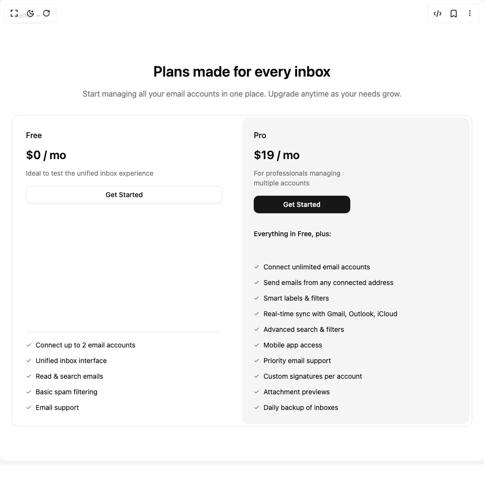

# Build Pricing in BuilderStudio

> Build this component in our Agentic IDE: [BuilderStudio](https://builderstudio.dev).
>
> Join the BuilderStudio community on [Discord](https://discord.gg/QdWeSGCqfe) and [Reddit](https://reddit.com/r/builderstudio).



## Component

- Author group: `rlzee`
- Component: `pricing`
- Variant: `default`
- Rendered HTML snapshot: [`rendered.html`](rendered.html)

## BuilderStudio prompt

You are implementing a React component based on a component reference.

## Component identity

- Author: rlzee
- Component slug: pricing
- Demo slug: default
- Title: pricing
- Description: 

## Goal

Recreate this component in a React + TypeScript + Tailwind CSS project. Preserve the visual layout, spacing, colors, border radius, shadows, interaction behavior, animation behavior, responsive behavior, and dark mode behavior shown in the rendered demo.

## Implementation requirements

- Use React and TypeScript.
- Use Tailwind CSS classes whenever possible.
- Keep the component self-contained unless the source files require helper components.
- If the source uses CSS variables, custom CSS, animations, or keyframes, include them.
- If the source uses external packages, list and use the required packages.
- Preserve accessibility attributes, button semantics, links, keyboard behavior, and ARIA attributes when visible in the source.
- Do not replace the component with a simplified placeholder.
- Return complete production-ready code.

## Dependencies

No reference metadata available.

## Rendered DOM snapshot

This is the rendered demo HTML extracted from the live preview. Use it to verify structure, class names, visible content, and layout.

```html
<div id="root"><div class="fixed top-4 left-4 z-10"><select class="appearance-none h-8 max-w-[200px] text-sm leading-tight rounded-lg pl-3 pr-7 py-0 border bg-background focus:outline-none focus:ring-0"><option value="default_demo">demo</option></select><div class="absolute top-1/2 transform -translate-y-1/2 right-2 pointer-events-none"><svg class="w-4 h-4 fill-current" viewBox="0 0 20 20"><path d="M5.516 7.548c.436-.446 1.043-.48 1.576 0L10 10.405l2.908-2.857c.533-.48 1.14-.446 1.576 0 .436.445.408 1.197 0 1.615l-3.734 3.705c-.533.534-1.39.534-1.923 0l-3.734-3.705c-.408-.418-.436-1.17 0-1.615z"></path></svg></div></div><div class="w-screen min-h-screen flex justify-center items-center"><section class="py-16 md:py-32" id="pricing"><div class="mx-auto max-w-7xl px-6"><div class="mx-auto flex max-w-3xl flex-col text-left md:text-center"><h2 class="mb-3 text-3xl font-semibold md:mb-4 lg:mb-6 lg:text-4xl">Plans made for every inbox</h2><p class="text-muted-foreground lg:text-lg mb-6 md:mb-8 lg:mb-12">Start managing all your email accounts in one place. Upgrade anytime as your needs grow.</p></div><div class="rounded-xl flex flex-col justify-between border p-1"><div class="flex flex-col gap-4 md:flex-row"><div class="flex flex-col justify-between p-6 space-y-4 flex-1"><div class=""><div class="space-y-4"><div><h2 class="font-medium">Free</h2><span class="my-3 block text-2xl font-semibold">$0 / mo</span><p class="text-muted-foreground text-sm">Ideal to test the unified inbox experience</p></div><a href="" class="inline-flex items-center justify-center whitespace-nowrap rounded-lg text-sm font-medium transition-colors outline-offset-2 focus-visible:outline-2 focus-visible:outline-ring/70 disabled:pointer-events-none disabled:opacity-50 [&amp;_svg]:pointer-events-none [&amp;_svg]:shrink-0 border border-input bg-background shadow-sm shadow-black/5 hover:bg-accent hover:text-accent-foreground h-9 px-4 py-2 w-full">Get Started</a></div></div><ul class="border-t pt-4 list-outside space-y-3 text-sm"><li class="flex items-center gap-2"><svg xmlns="http://www.w3.org/2000/svg" width="24" height="24" viewBox="0 0 24 24" fill="none" stroke="currentColor" stroke-width="2" stroke-linecap="round" stroke-linejoin="round" class="lucide lucide-check size-3" aria-hidden="true"><path d="M20 6 9 17l-5-5"></path></svg>Connect up to 2 email accounts</li><li class="flex items-center gap-2"><svg xmlns="http://www.w3.org/2000/svg" width="24" height="24" viewBox="0 0 24 24" fill="none" stroke="currentColor" stroke-width="2" stroke-linecap="round" stroke-linejoin="round" class="lucide lucide-check size-3" aria-hidden="true"><path d="M20 6 9 17l-5-5"></path></svg>Unified inbox interface</li><li class="flex items-center gap-2"><svg xmlns="http://www.w3.org/2000/svg" width="24" height="24" viewBox="0 0 24 24" fill="none" stroke="currentColor" stroke-width="2" stroke-linecap="round" stroke-linejoin="round" class="lucide lucide-check size-3" aria-hidden="true"><path d="M20 6 9 17l-5-5"></path></svg>Read &amp; search emails</li><li class="flex items-center gap-2"><svg xmlns="http://www.w3.org/2000/svg" width="24" height="24" viewBox="0 0 24 24" fill="none" stroke="currentColor" stroke-width="2" stroke-linecap="round" stroke-linejoin="round" class="lucide lucide-check size-3" aria-hidden="true"><path d="M20 6 9 17l-5-5"></path></svg>Basic spam filtering</li><li class="flex items-center gap-2"><svg xmlns="http://www.w3.org/2000/svg" width="24" height="24" viewBox="0 0 24 24" fill="none" stroke="currentColor" stroke-width="2" stroke-linecap="round" stroke-linejoin="round" class="lucide lucide-check size-3" aria-hidden="true"><path d="M20 6 9 17l-5-5"></path></svg>Email support</li></ul></div><div class="flex flex-col justify-between p-6 space-y-4 bg-secondary rounded-xl w-full md:w-1/2 space-y-8"><div class="grid gap-6 sm:grid-cols-2"><div class="space-y-4"><div><h2 class="font-medium">Pro</h2><span class="my-3 block text-2xl font-semibold">$19 / mo</span><p class="text-muted-foreground text-sm">For professionals managing multiple accounts</p></div><a href="" class="inline-flex items-center justify-center whitespace-nowrap rounded-lg text-sm font-medium transition-colors outline-offset-2 focus-visible:outline-2 focus-visible:outline-ring/70 disabled:pointer-events-none disabled:opacity-50 [&amp;_svg]:pointer-events-none [&amp;_svg]:shrink-0 bg-primary text-primary-foreground shadow-sm shadow-black/5 hover:bg-primary/90 h-9 px-4 py-2 w-full">Get Started</a></div></div><div><div class="text-sm font-medium">Everything in Free, plus:</div></div><ul class="mt-4 list-outside space-y-3 text-sm"><li class="flex items-center gap-2"><svg xmlns="http://www.w3.org/2000/svg" width="24" height="24" viewBox="0 0 24 24" fill="none" stroke="currentColor" stroke-width="2" stroke-linecap="round" stroke-linejoin="round" class="lucide lucide-check size-3" aria-hidden="true"><path d="M20 6 9 17l-5-5"></path></svg>Connect unlimited email accounts</li><li class="flex items-center gap-2"><svg xmlns="http://www.w3.org/2000/svg" width="24" height="24" viewBox="0 0 24 24" fill="none" stroke="currentColor" stroke-width="2" stroke-linecap="round" stroke-linejoin="round" class="lucide lucide-check size-3" aria-hidden="true"><path d="M20 6 9 17l-5-5"></path></svg>Send emails from any connected address</li><li class="flex items-center gap-2"><svg xmlns="http://www.w3.org/2000/svg" width="24" height="24" viewBox="0 0 24 24" fill="none" stroke="currentColor" stroke-width="2" stroke-linecap="round" stroke-linejoin="round" class="lucide lucide-check size-3" aria-hidden="true"><path d="M20 6 9 17l-5-5"></path></svg>Smart labels &amp; filters</li><li class="flex items-center gap-2"><svg xmlns="http://www.w3.org/2000/svg" width="24" height="24" viewBox="0 0 24 24" fill="none" stroke="currentColor" stroke-width="2" stroke-linecap="round" stroke-linejoin="round" class="lucide lucide-check size-3" aria-hidden="true"><path d="M20 6 9 17l-5-5"></path></svg>Real-time sync with Gmail, Outlook, iCloud</li><li class="flex items-center gap-2"><svg xmlns="http://www.w3.org/2000/svg" width="24" height="24" viewBox="0 0 24 24" fill="none" stroke="currentColor" stroke-width="2" stroke-linecap="round" stroke-linejoin="round" class="lucide lucide-check size-3" aria-hidden="true"><path d="M20 6 9 17l-5-5"></path></svg>Advanced search &amp; filters</li><li class="flex items-center gap-2"><svg xmlns="http://www.w3.org/2000/svg" width="24" height="24" viewBox="0 0 24 24" fill="none" stroke="currentColor" stroke-width="2" stroke-linecap="round" stroke-linejoin="round" class="lucide lucide-check size-3" aria-hidden="true"><path d="M20 6 9 17l-5-5"></path></svg>Mobile app access</li><li class="flex items-center gap-2"><svg xmlns="http://www.w3.org/2000/svg" width="24" height="24" viewBox="0 0 24 24" fill="none" stroke="currentColor" stroke-width="2" stroke-linecap="round" stroke-linejoin="round" class="lucide lucide-check size-3" aria-hidden="true"><path d="M20 6 9 17l-5-5"></path></svg>Priority email support</li><li class="flex items-center gap-2"><svg xmlns="http://www.w3.org/2000/svg" width="24" height="24" viewBox="0 0 24 24" fill="none" stroke="currentColor" stroke-width="2" stroke-linecap="round" stroke-linejoin="round" class="lucide lucide-check size-3" aria-hidden="true"><path d="M20 6 9 17l-5-5"></path></svg>Custom signatures per account</li><li class="flex items-center gap-2"><svg xmlns="http://www.w3.org/2000/svg" width="24" height="24" viewBox="0 0 24 24" fill="none" stroke="currentColor" stroke-width="2" stroke-linecap="round" stroke-linejoin="round" class="lucide lucide-check size-3" aria-hidden="true"><path d="M20 6 9 17l-5-5"></path></svg>Attachment previews</li><li class="flex items-center gap-2"><svg xmlns="http://www.w3.org/2000/svg" width="24" height="24" viewBox="0 0 24 24" fill="none" stroke="currentColor" stroke-width="2" stroke-linecap="round" stroke-linejoin="round" class="lucide lucide-check size-3" aria-hidden="true"><path d="M20 6 9 17l-5-5"></path></svg>Daily backup of inboxes</li></ul></div></div></div></div></section></div></div>
```

## Reference source files

No reference source files were available.
