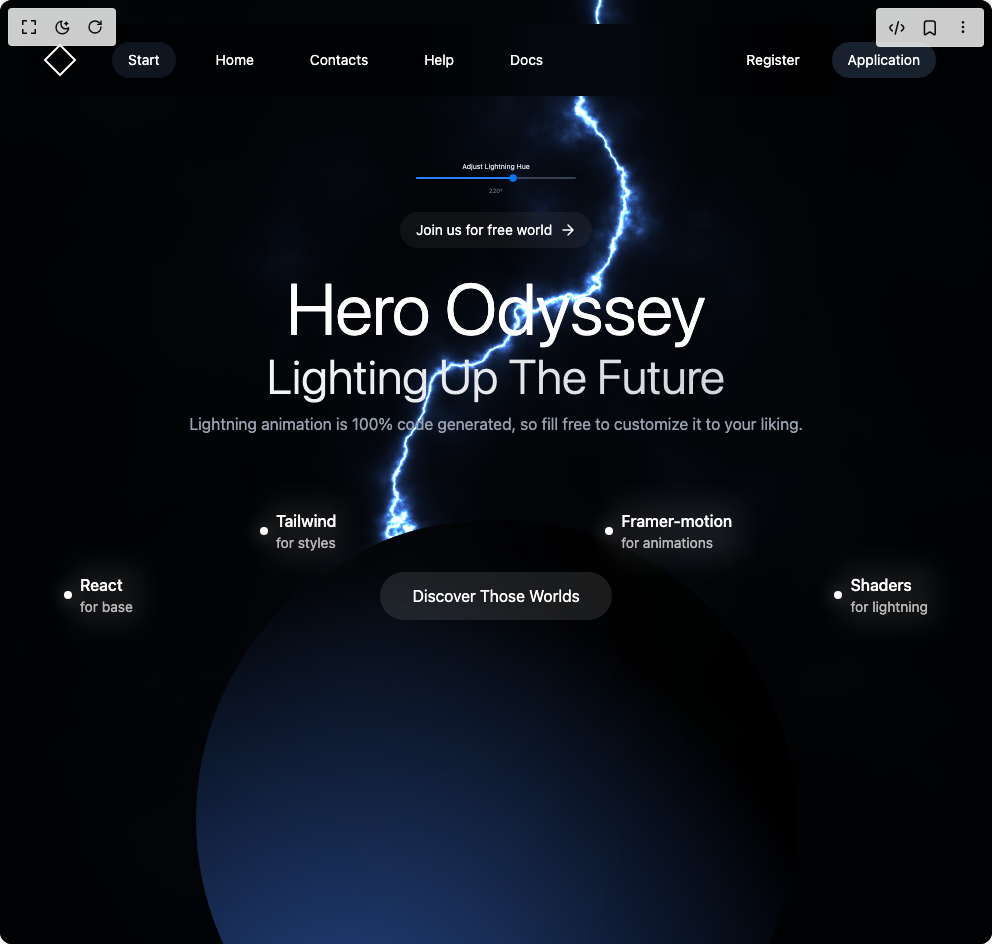

# Build Hero Odyssey in BuilderStudio

> Build this component in our Agentic IDE: [BuilderStudio](https://builderstudio.dev).
>
> Join the BuilderStudio community on [Discord](https://discord.gg/QdWeSGCqfe) and [Reddit](https://reddit.com/r/builderstudio).



## Component

- Author group: `rubenerik`
- Component: `hero-odyssey`
- Variant: `default`
- Rendered HTML snapshot: [`rendered.html`](rendered.html)

## BuilderStudio prompt

You are implementing a React component based on a component reference.

## Component identity

- Author: rubenerik
- Component slug: hero-odyssey
- Demo slug: default
- Title: hero-odyssey
- Description: 

## Goal

Recreate this component in a React + TypeScript + Tailwind CSS project. Preserve the visual layout, spacing, colors, border radius, shadows, interaction behavior, animation behavior, responsive behavior, and dark mode behavior shown in the rendered demo.

## Implementation requirements

- Use React and TypeScript.
- Use Tailwind CSS classes whenever possible.
- Keep the component self-contained unless the source files require helper components.
- If the source uses CSS variables, custom CSS, animations, or keyframes, include them.
- If the source uses external packages, list and use the required packages.
- Preserve accessibility attributes, button semantics, links, keyboard behavior, and ARIA attributes when visible in the source.
- Do not replace the component with a simplified placeholder.
- Return complete production-ready code.

## Dependencies

No reference metadata available.

## Rendered DOM snapshot

This is the rendered demo HTML extracted from the live preview. Use it to verify structure, class names, visible content, and layout.

```html
<div id="root"><div class="flex w-full h-screen justify-center items-center"><div class="relative w-full bg-black text-white overflow-hidden"><div class="relative z-20 max-w-7xl mx-auto px-4 sm:px-6 lg:px-8 py-6 h-screen"><div class="px-4 backdrop-blur-3xl bg-black/50 rounded-50 py-4 flex justify-between items-center mb-12" style="opacity: 1; transform: none;"><div class="flex items-center"><div class="text-2xl font-bold"><svg width="40" height="40" viewBox="0 0 40 40" fill="none"><path d="M20 5L5 20L20 35L35 20L20 5Z" stroke="white" stroke-width="2"></path></svg></div><div class="hidden md:flex items-center space-x-6 ml-8"><button class="px-4 py-2 bg-gray-800/50 hover:bg-gray-700/50 rounded-full text-sm transition-colors">Start</button><button class="px-4 py-2 text-sm hover:text-gray-300 transition-colors">Home</button><button class="px-4 py-2 text-sm hover:text-gray-300 transition-colors">Contacts</button><button class="px-4 py-2 text-sm hover:text-gray-300 transition-colors">Help</button><button class="px-4 py-2 text-sm hover:text-gray-300 transition-colors">Docs</button></div></div><div class="flex items-center space-x-4"><button class="hidden md:block px-4 py-2 text-sm hover:text-gray-300 transition-colors">Register</button><button class="px-4 py-2 bg-gray-800/80 backdrop-blur-sm rounded-full text-sm hover:bg-gray-700/80 transition-colors">Application</button><button class="md:hidden p-2 rounded-md focus:outline-none"><svg class="h-6 w-6" fill="none" viewBox="0 0 24 24" stroke="currentColor"><path stroke-linecap="round" stroke-linejoin="round" stroke-width="2" d="M4 6h16M4 12h16M4 18h16"></path></svg></button></div></div><div class="w-full z-200 top-[30%] relative" style="opacity: 1;"><div style="opacity: 1; transform: none;"><div class="absolute left-0 sm:left-10 top-40 z-10 group transition-all duration-300 hover:scale-110"><div class="flex items-center gap-2 relative"><div class="relative"><div class="w-2 h-2 bg-white rounded-full group-hover:animate-pulse"></div><div class="absolute -inset-1 bg-white/20 rounded-full blur-sm opacity-70 group-hover:opacity-100 transition-opacity duration-300"></div></div><div class=" text-white relative"><div class="font-medium group-hover:text-white transition-colors duration-300">React</div><div class="text-white/70 text-sm group-hover:text-white/70 transition-colors duration-300">for base</div><div class="absolute -inset-2 bg-white/10 rounded-lg blur-md opacity-70 group-hover:opacity-100 transition-opacity duration-300 -z-10"></div></div></div></div></div><div style="opacity: 1; transform: none;"><div class="absolute left-1/4 top-24 z-10 group transition-all duration-300 hover:scale-110"><div class="flex items-center gap-2 relative"><div class="relative"><div class="w-2 h-2 bg-white rounded-full group-hover:animate-pulse"></div><div class="absolute -inset-1 bg-white/20 rounded-full blur-sm opacity-70 group-hover:opacity-100 transition-opacity duration-300"></div></div><div class=" text-white relative"><div class="font-medium group-hover:text-white transition-colors duration-300">Tailwind</div><div class="text-white/70 text-sm group-hover:text-white/70 transition-colors duration-300">for styles</div><div class="absolute -inset-2 bg-white/10 rounded-lg blur-md opacity-70 group-hover:opacity-100 transition-opacity duration-300 -z-10"></div></div></div></div></div><div style="opacity: 1; transform: none;"><div class="absolute right-1/4 top-24 z-10 group transition-all duration-300 hover:scale-110"><div class="flex items-center gap-2 relative"><div class="relative"><div class="w-2 h-2 bg-white rounded-full group-hover:animate-pulse"></div><div class="absolute -inset-1 bg-white/20 rounded-full blur-sm opacity-70 group-hover:opacity-100 transition-opacity duration-300"></div></div><div class=" text-white relative"><div class="font-medium group-hover:text-white transition-colors duration-300">Framer-motion</div><div class="text-white/70 text-sm group-hover:text-white/70 transition-colors duration-300">for animations</div><div class="absolute -inset-2 bg-white/10 rounded-lg blur-md opacity-70 group-hover:opacity-100 transition-opacity duration-300 -z-10"></div></div></div></div></div><div style="opacity: 1; transform: none;"><div class="absolute right-0 sm:right-10 top-40 z-10 group transition-all duration-300 hover:scale-110"><div class="flex items-center gap-2 relative"><div class="relative"><div class="w-2 h-2 bg-white rounded-full group-hover:animate-pulse"></div><div class="absolute -inset-1 bg-white/20 rounded-full blur-sm opacity-70 group-hover:opacity-100 transition-opacity duration-300"></div></div><div class=" text-white relative"><div class="font-medium group-hover:text-white transition-colors duration-300">Shaders</div><div class="text-white/70 text-sm group-hover:text-white/70 transition-colors duration-300">for lightning</div><div class="absolute -inset-2 bg-white/10 rounded-lg blur-md opacity-70 group-hover:opacity-100 transition-opacity duration-300 -z-10"></div></div></div></div></div></div><div class="relative z-30 flex flex-col items-center text-center max-w-4xl mx-auto " style="opacity: 1;">            <div class="scale-50 relative w-full max-w-xs flex flex-col items-center"><label for="hue-slider-native" class="text-gray-300 text-sm mb-1">Adjust Lightning Hue</label><div class="relative w-full h-5 flex items-center"> <input id="hue-slider-native" min="0" max="360" step="1" class="absolute inset-0 w-full h-full appearance-none bg-transparent cursor-pointer z-20" type="range" value="220" style="appearance: none;"><div class="absolute left-0 w-full h-1 bg-gray-700 rounded-full z-0"></div><div class="absolute left-0 h-1 bg-blue-500 rounded-full z-10" style="width: 61.1111%;"></div><div class="absolute top-1/2 transform -translate-y-1/2 z-30" style="left: 61.1111%; transform: none;"></div></div><div class="text-xs text-gray-500 mt-2" style="opacity: 1; transform: none;">220°</div></div><button class="flex items-center space-x-2 px-4 py-2 bg-white/5 hover:bg-white/10 backdrop-blur-sm rounded-full text-sm mb-6 transition-all duration-300 group" tabindex="0" style="opacity: 1; transform: none;"><span>Join us for free world</span><svg width="16" height="16" viewBox="0 0 16 16" fill="none" class="transform group-hover:translate-x-1 transition-transform duration-300"><path d="M8 3L13 8L8 13M13 8H3" stroke="white" stroke-width="1.5" stroke-linecap="round" stroke-linejoin="round"></path></svg></button><h1 class="text-5xl md:text-7xl font-light mb-2" style="opacity: 1; transform: none;">Hero Odyssey</h1><h2 class="text-3xl md:text-5xl pb-3 font-light bg-gradient-to-r from-gray-100 via-gray-200 to-gray-300 bg-clip-text text-transparent" style="opacity: 1; transform: none;">Lighting Up The Future</h2><p class="text-gray-400 mb-9 max-w-2xl" style="opacity: 1; transform: none;">Lightning animation is 100% code generated, so fill free to customize it to your liking.</p><button class="mt-[100px] sm:mt-[100px] px-8 py-3 bg-white/10 backdrop-blur-sm rounded-full hover:bg-white/20 transition-colors" tabindex="0" style="opacity: 1; transform: none;">Discover Those Worlds</button></div></div><div class="absolute inset-0 z-0" style="opacity: 1;"><div class="absolute inset-0 bg-black/80"></div><div class="absolute top-[55%] left-1/2 transform -translate-x-1/2 -translate-y-1/2 w-[800px] h-[800px] rounded-full bg-gradient-to-b from-blue-500/20 to-purple-600/10 blur-3xl"></div><div class="absolute top-0 w-[100%] left-1/2 transform -translate-x-1/2 h-full"><canvas class="w-full h-full relative" width="992" height="944"></canvas></div><div class="z-10 absolute top-[55%] left-1/2 transform -translate-x-1/2 w-[600px] h-[600px] backdrop-blur-3xl rounded-full bg-[radial-gradient(circle_at_25%_90%,_#1e386b_15%,_#000000de_70%,_#000000ed_100%)]"></div></div></div></div></div>
```

## Reference source files

No reference source files were available.
